# Windows Cerber Malware Execution and Command-and-Control Investigation

### Executive Summary

Security monitoring identified a suspicious executable named `osk.exe` executing from a user profile directory rather than its expected Windows system location. Although `osk.exe` is a legitimate Windows binary associated with the On-Screen Keyboard feature, initial review suggested the executable was operating from an unusual path and exhibiting behavior inconsistent with normal operating system activity.

The investigation focused on determining whether the executable was legitimate, identifying the affected system and user, analyzing associated network activity, determining whether the file communicated with external infrastructure, and assessing whether malware was involved.

Analysis of Sysmon, FortiGate UTM, and Suricata telemetry confirmed that the executable was not the legitimate Windows On-Screen Keyboard binary. The file was executing from a user roaming profile directory, generated outbound network connections to thousands of external systems, communicated primarily over TCP port 6892, and was associated with malware detections identifying Cerber-related activity. Hash analysis and external intelligence enrichment further linked the file to Cerber ransomware.

The findings indicate the system was executing malware associated with Cerber ransomware and communicating with external command-and-control infrastructure. Network telemetry, host telemetry, threat intelligence enrichment, and IDS detections collectively support this conclusion.

> 👉 For a **description of the situation being investigated and what triggered this analysis**, see the **[Scenario Context](#scenario-context)** section below.

> 👉 For a **mapping of observed behavior to MITRE ATT&CK techniques**, see the **[MITRE ATT&CK](#mitre-attck-mapping)** section below.

> 👉 For a **detailed, step-by-step walkthrough of how this investigation was conducted — complete with screenshots**, see the **[Investigation Walkthrough](#investigation-walkthrough)** section below.

---

### Scenario Context

Security monitoring identified execution of a file named `osk.exe` on a workstation registry within the environment. While `osk.exe` is normally associated with the legitimate Windows On-Screen Keyboard utility, initial review suggested the executable was not running from its expected location within the Windows operating system directory structure.

Further review revealed extensive outbound network communication associated with the process, including connections to a large number of external IP addresses. The volume of network activity, unusual execution path, and communication patterns raised concerns that the executable could be masquerading as a legitimate Windows binary while performing malicious activity.

Analysts were tasked with determining whether the executable was legitimate, identifying the affected system and user account, analyzing associated network behavior, identifying any malware family associated with the file, and determining whether additional network security telemetry contained detections related to the activity.

The investigation leveraged host-based Sysmon telemetry, FortiGate UTM detections, Suricata network security monitoring logs, and external threat intelligence enrichment to establish the nature of the activity and determine whether malware execution had occurred.

---

### Incident Scope

The scope of this investigation is limited to analysis of simulated endpoint, firewall, and intrusion detection telemetry contained within the `botsv1` dataset. The investigation focuses on suspicious execution of `osk.exe`, associated network activity, malware identification, and related security detections.

The investigation includes:

- Validation of the legitimate Windows `osk.exe` file location
- Identification of suspicious `osk.exe` execution activity
- Identification of the affected host and user account
- Analysis of outbound network communications
- Identification of destination ports and external infrastructure
- Malware hash collection and validation
- Threat intelligence enrichment and malware classification
- Review of FortiGate UTM detections
- Review of Suricata IDS alerts associated with the activity

The investigation does not include live malware detonation, memory forensics, reverse engineering, host containment, eradication activities, or system recovery actions. Attribution beyond observed infrastructure, malware classification, and available telemetry is out of scope.

---

### Environment, Evidence, and Tools

This investigation was conducted within a pre-configured Splunk Enterprise environment containing the `botsv1` dataset. Multiple telemetry sources were reviewed to correlate endpoint activity, firewall detections, intrusion detection alerts, and external threat intelligence.

#### ▶ Environment

- **Platform:** Splunk Enterprise
- **Dataset:** `botsv1`
- **Primary Investigation Type:** Malware execution and command-and-control analysis
- **Primary Host:** `we8105desk`
- **Primary User:** `WAYNECORPINC\bob.smith`

#### ▶ Evidence Sources

- `xmlwineventlog`
  - Sysmon process execution events
  - Sysmon image load events
  - Sysmon network connection events
  - File hash metadata

- `fortigate_utm`
  - Threat classifications
  - Malware detections
  - Botnet classifications
  - Destination infrastructure visibility

- `suricata`
  - Network intrusion detection alerts
  - Alert signatures
  - Network communication metadata

- External threat intelligence
  - VirusTotal
  - Public malware intelligence sources

#### ▶ Tools Used

- **Splunk Enterprise** — Primary SIEM and log analysis platform
- **Splunk Search & Reporting App** — Event review and correlation
- **Sysmon Telemetry** — Endpoint process, file, and network activity
- **FortiGate UTM Telemetry** — Malware and botnet detection enrichment
- **Suricata IDS Telemetry** — Network detection and alert analysis
- **VirusTotal** — Malware hash reputation analysis
- **OSINT Research** — Validation of legitimate Windows binary locations and malware classification

#### ▶ Environment Setup

The investigation was performed in a local Splunk environment. Splunk was started from the terminal using:

```bash
sudo systemctl start Splunkd
```

After allowing Splunk time to start, the Splunk web interface was accessed locally at:

```
127.0.0.1:8000
```

From the Splunk homepage, the Search & Reporting application was used throughout the investigation.

To ensure historical BOTSv1 events were available, the time range was configured as:

```
Other > All Time
```

This ensured all relevant Sysmon, FortiGate UTM, and Suricata telemetry would be available during analysis.


---

### Investigative Questions

This section outlines the core questions used to guide analysis and maintain an evidence-driven investigation.

Key questions included:

- Is the observed `osk.exe` executable legitimate?
- What is the expected location of the legitimate Windows binary?
- Where is the suspicious executable located?
- Which system is executing the file?
- Which user account launched the executable?
- What internal IP address is associated with the affected host?
- Does the executable generate outbound network connections?
- Which destination ports are being used?
- How many unique external systems is the executable communicating with?
- What SHA256 hash is associated with the file?
- Is the file associated with known malware?
- What malware family is involved?
- What malware category does FortiGate identify?
- Do network security tools generate alerts associated with the activity?
- What command-and-control or reconnaissance behavior is observable?

---

### Investigation Timeline

The following timeline summarizes major investigative milestones based on endpoint, firewall, IDS, and threat intelligence analysis.

- T0 — Suspicious execution of `osk.exe` identified.
- T1 — OSINT validation performed to establish expected behavior and legitimate file location.
- T2 — Sysmon telemetry reviewed to identify execution activity involving `osk.exe`.
- T3 — Suspicious file path identified within a user roaming profile directory.
- T4 — Affected host, user account, and internal IP address identified.
- T5 — Outbound network communications reviewed.
- T6 — High-volume communications over destination port 6892 identified.
- T7 — External communication scope measured and validated.
- T8 — SHA256 hash extracted from Sysmon image load telemetry.
- T9 — Threat intelligence enrichment performed using VirusTotal.
- T10 — Cerber malware attribution established.
- T11 — FortiGate UTM detections reviewed and correlated.
- T12 — Suricata IDS alerts reviewed and validated.
- T13 — Malware execution and command-and-control activity confirmed.

<blockquote>

This investigation demonstrates how endpoint telemetry, network telemetry, firewall detections, and external threat intelligence can be correlated to validate malware execution, identify command-and-control activity, and attribute malicious behavior to a known malware family. By combining host-based evidence with network-based detections, analysts can build a comprehensive understanding of attacker activity and establish high-confidence findings.

</blockquote>

---

### Investigation Walkthrough

<blockquote>
<details>
<summary><strong>📚 Walkthrough navigation (click to expand)</strong></summary>

* [1) Initial Setup & OSINT Validation](#-1-initial-setup)
* [2) Suspicious Executable Discovery](#-2-suspicious-executable-discovery)
* [3) Suspicious File Path Identification](#-3-suspicious-file-path-identification)
* [4) Host, User, and Internal IP Attribution](#-4-host-user-and-internal-ip-attribution)
* [5) Executable Scoping and Destination Port Analysis](#-5-executable-scoping-and-destination-port-analysis)
* [6) External Destination Scope Analysis](#-6-external-destination-scope-analysis)
* [7) SHA256 Hash Extraction](#-7-sha256-hash-extraction)
* [8) Threat Intelligence Enrichment](#-8-threat-intelligence-enrichment)
* [9) FortiGate Malware Classification](#-9-fortigate-malware-classification)
* [10) Cerber Malware Function Review](#-10-cerber-malware-function-review)
* [11) Suricata Alert Validation](#-11-suricata-alert-validation)

</details>
</blockquote>

<a id="-1-initial-setup"></a>

<details>
<summary><strong>▶ 1) Initial Setup & OSINT Validation</strong><br>
→ preparing Splunk and establishing the expected behavior of osk.exe
</summary><br>

**Goal:** Determine whether `osk.exe` is a legitimate Windows executable and identify its expected file location.

The investigation began by opening the Search & Reporting application within Splunk and ensuring all historical BOTSv1 events were available for analysis. Because the dataset contains historical activity, the timeframe selector was changed to:

```text
Other > All Time
```

This ensured all Sysmon, FortiGate UTM, and Suricata events could be searched throughout the investigation.

Before reviewing endpoint telemetry, open-source research was conducted to establish what `osk.exe` normally represents within Windows.

A search for:

```text
what is osk.exe
```

confirmed that `osk.exe` is associated with the Microsoft Windows **On-Screen Keyboard** feature.

The same research also identified the expected file path for the legitimate executable:

```text
C:\Windows\System32\osk.exe
```

This provided a baseline against which any observed execution activity could later be compared.

</details>

<a id="-2-suspicious-executable-discovery"></a>

<details>
<summary><strong>▶ 2) Suspicious Executable Discovery</strong><br>
→ identifying Sysmon events associated with osk.exe
</summary><br>

**Goal:** Determine how frequently `osk.exe` appears within endpoint telemetry.

With the legitimate purpose and expected location established, the investigation shifted to Sysmon telemetry using the `xmlwineventlog` sourcetype.

> **Analyst Note — Why `sourcetype=xmlwineventlog` Was Used**
>
> The investigation required filtering on `sourcetype=xmlwineventlog` when searching for Sysmon events within the BOTSv1 dataset. In this environment, Sysmon telemetry has been ingested under the generic Windows XML event log sourcetype rather than a Sysmon-specific sourcetype. In many enterprise Splunk deployments, Sysmon events are more commonly stored under sourcetypes such as: `XmlWinEventLog:Microsoft-Windows-Sysmon/Operational` or `WinEventLog:Microsoft-Windows-Sysmon/Operational`. These sourcetypes explicitly identify the Sysmon channel being collected. The BOTSv1 dataset simplifies Windows XML event log ingestion by storing Sysmon events under the broader `xmlwineventlog` sourcetype. Although the sourcetype differs from what is commonly seen in production environments, the events themselves still contain typical Sysmon artifacts such as process execution events, image load events, network connection events, file hashes, and Event IDs used throughout the investigation. For this reason, `sourcetype=xmlwineventlog` was used as the primary filter when reviewing Sysmon telemetry within the BOTSv1 dataset.


The following search was executed:

```spl
index="botsv1" sourcetype=xmlwineventlog osk.exe
```

The search returned:

```text
49,608 events
```

indicating significant activity associated with the executable.

<p align="left">
  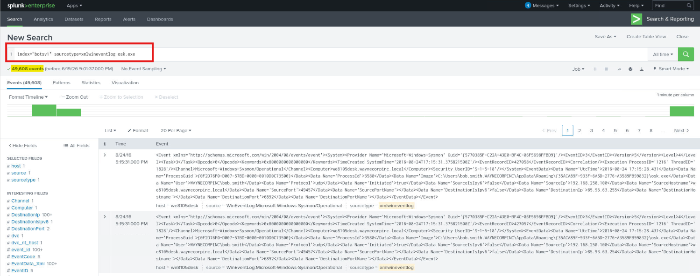<br>
  <em>Figure 1 - Initial Sysmon search identifying thousands of events referencing osk.exe</em>
</p>

At this stage the executable could not yet be classified as malicious. Additional context was required to determine where the file was executing from and whether it matched the legitimate Windows binary.

</details>

<a id="-3-suspicious-file-path-identification"></a>

<details>
<summary><strong>▶ 3) Suspicious File Path Identification</strong><br>
→ determining whether the executable is running from its expected location
</summary><br>

**Goal:** Identify the full path of the executable and compare it against the expected Windows location.

Reviewing the Sysmon event details revealed that the executable was not running from the expected system directory.

Instead of:

```text
C:\Windows\System32\osk.exe
```

the `Image` field showed execution from:

```text
C:\Users\bob.smith.WAYNECORPINC\AppData\Roaming\{35ACA89F-933F-6A5D-2776-A3589FB99832}\osk.exe
```

This path is highly suspicious because legitimate Windows system binaries are not normally executed from user roaming profile directories.

<p align="left">
  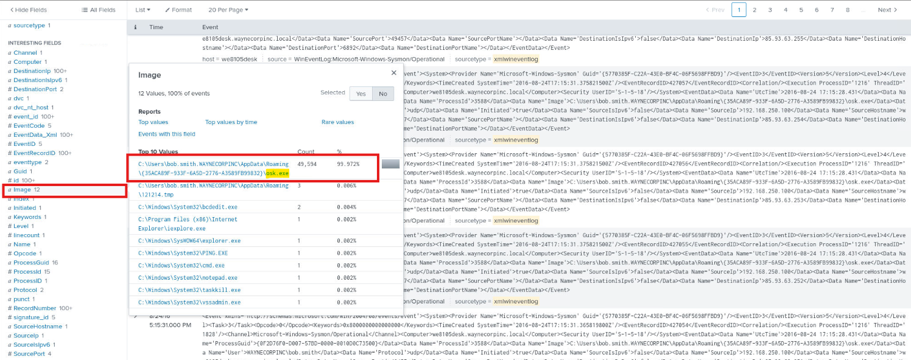<br>
  <em>Figure 2 - Suspicious osk.exe executing from a user roaming profile directory</em>
</p>

The discrepancy between the expected and observed file locations strongly suggested that the executable was masquerading as a legitimate Windows binary.

> **Analyst Note:** Within Sysmon Process Creation events (Event ID 1), the `Image` field records the full path of the executable that was launched. Because the investigation focused on determining whether `osk.exe` was legitimate, the `Image` field provided a reliable way to identify exactly where the executable was running from rather than simply searching for the string `osk.exe` across all event data. Reviewing this field quickly revealed that the executable was operating from a user profile directory instead of its expected location within `C:\Windows\System32`, providing an early indicator of potential masquerading activity.


</details>

<a id="-4-host-user-and-internal-ip-attribution"></a>

<details>
<summary><strong>▶ 4) Host, User, and Internal IP Attribution</strong><br>
→ identifying the affected endpoint and user account
</summary><br>

**Goal:** Determine which host, user, and internal IP address are associated with the suspicious executable.

After identifying the suspicious executable path, the next step was to determine which endpoint was responsible for executing the file.

Reviewing the available fields revealed the `host` field, which identifies the endpoint that generated the Sysmon events. Selecting the field value showed that all observed activity was associated with:

```text
we8105desk
```

<p align="left">
  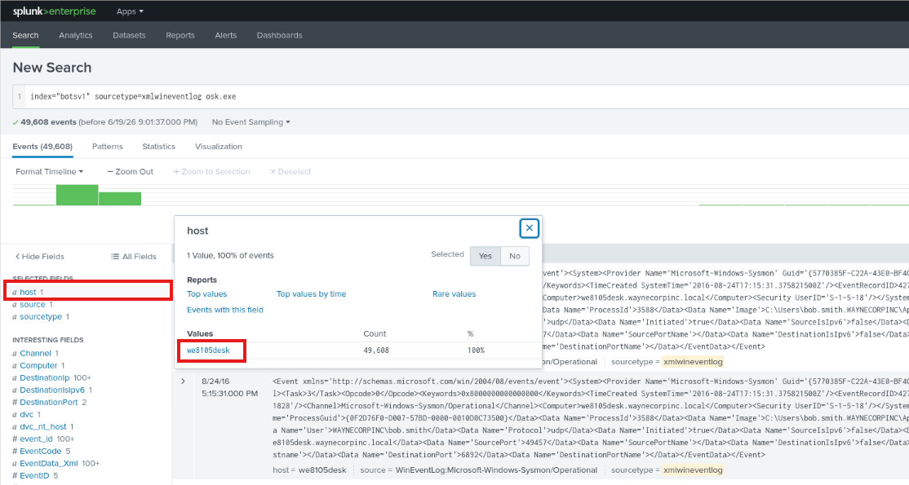<br>
  <em>Figure 3 - Identifying the host associated with the suspicious osk.exe activity</em>
</p>

Selecting the host value automatically refined the search to:

```spl
index="botsv1" sourcetype=xmlwineventlog osk.exe host=we8105desk
```

With the affected system identified, the next step was to determine the internal IP address associated with the endpoint. Reviewing the available fields revealed the `SourceIp` field. Selecting the value showed the system was using the address:

```text
192.168.250.100
```

<p align="left">
  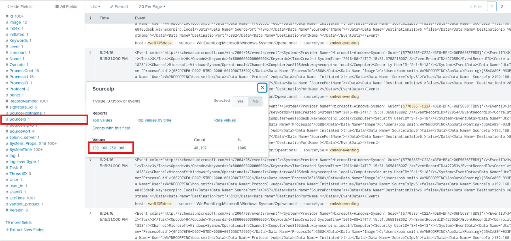<br>
  <em>Figure 4 - Identifying the host associated with the suspicious osk.exe activity</em>
</p>

Selecting the IP address further refined the search to:

```spl
index="botsv1" sourcetype=xmlwineventlog osk.exe host=we8105desk SourceIp="192.168.250.100"
```

Finally, to determine which account was executing the suspicious file, the User field was reviewed. The field identified the account associated with the activity as:

```text
WAYNECORPINC\bob.smith
```

<p align="left">
  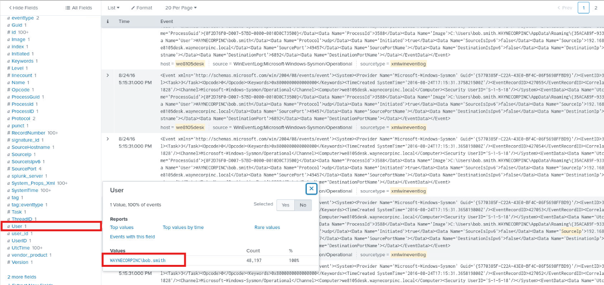<br>
  <em>Figure 5 - Identifying the user account responsible for executing the suspicious osk.exe binary</em>
</p>

Later in the investigation, review of the Sysmon `Computer` field revealed the system's fully qualified domain name (FQDN) as `we8105desk.waynecorpinc.local`. While the Splunk `host` field identified the endpoint using its short hostname (`we8105desk`), the `Computer` field preserved the original value recorded by Sysmon and provided the complete domain-qualified system name. Both fields referred to the same endpoint, but the `Computer` field offered additional context useful for asset attribution and answering the investigation question in the required format.


<p align="left">
  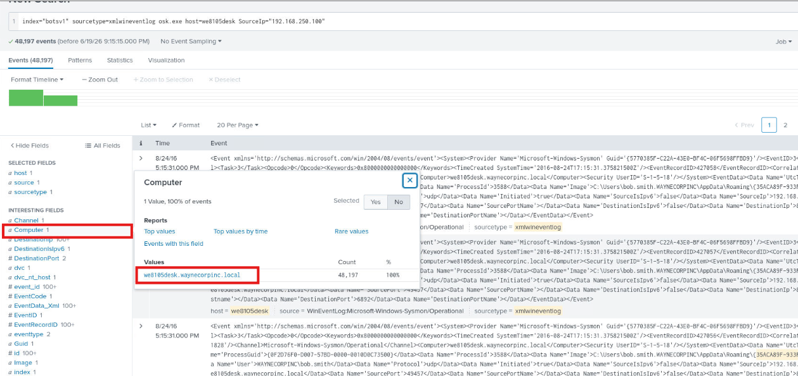<br>
  <em>Figure 6 - Reviewing the Sysmon Computer field to identify the fully qualified domain name (FQDN) of the affected host</em>
</p>

These artifacts established the scope of the potentially compromised system and identified the user context under which the executable was operating. At this stage, the affected host, internal IP address, and user account had all been positively identified, providing attribution for the suspicious process execution activity.

</details>

<a id="-5-executable-scoping-and-destination-port-analysis"></a>

<details>
<summary><strong>▶ 5) Executable Scoping and Destination Port Analysis</strong><br>
→ narrowing analysis to the suspicious executable and reviewing network communications
</summary><br>

**Goal:** Identify outbound communications generated by the suspicious executable.

The presence of the `DestinationPort` field indicated that the suspicious `osk.exe` process was generating outbound network connections recorded by Sysmon Network Connection events (Event ID 3). 

Legitimate executions of the "Windows On-Screen Keyboard utility" would not typically be expected to establish large volumes of external network communications. The observation that this executable was repeatedly connecting to remote systems over destination port `6892` provided additional evidence that the file was behaving differently from the legitimate Windows binary and warranted further investigation into potential malware activity and command-and-control communications.

Review of the `DestinationPort` field revealed two destination ports.

The overwhelming majority of communications were directed toward:

```text
6892
```

while a single connection was observed over:

```text
80
```

<p align="left">
  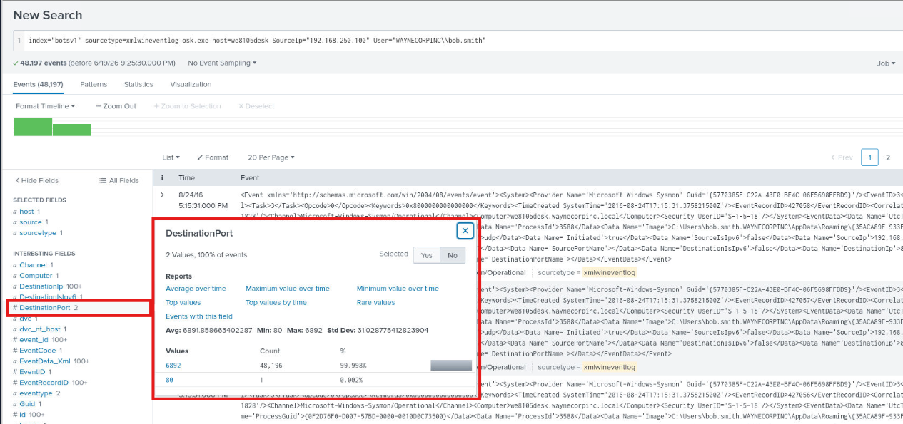<br>
  <em>Figure 7 - Destination port analysis associated with the suspicious executable</em>
</p>

Because destination port `6892` accounted for nearly all observed communications and does not represent a common Windows operating system service, it was selected for further analysis.

This effectively changed the SPL search to:

```spl
index="botsv1" sourcetype=xmlwineventlog osk.exe host=we8105desk SourceIp="192.168.250.100" User="WAYNECORPINC\\bob.smith" DestinationPort=6892
```

</details>

<a id="-6-external-destination-scope-analysis"></a>

<details>
<summary><strong>▶ 6) External Destination Scope Analysis</strong><br>
→ measuring the scale of outbound communications
</summary><br>

**Goal:** Determine how many unique external systems the executable contacted.

The investigation was narrowed to communications over destination port 6892:

```spl
index="botsv1" sourcetype=xmlwineventlog osk.exe host=we8105desk SourceIp="192.168.250.100" User="WAYNECORPINC\\bob.smith" DestinationPort=6892
```

Review of the `DestinationIp` field revealed more than 100 values, making manual counting impractical.

To determine the total number of unique destination systems, the following search was executed:

```spl
index="botsv1" sourcetype=xmlwineventlog osk.exe host=we8105desk SourceIp="192.168.250.100" User="WAYNECORPINC\\bob.smith" DestinationPort=6892
| stats count by DestinationIp
| uniq
```

The results showed communications with:

```text
16,384 unique destination IP addresses
```

<p align="left">
  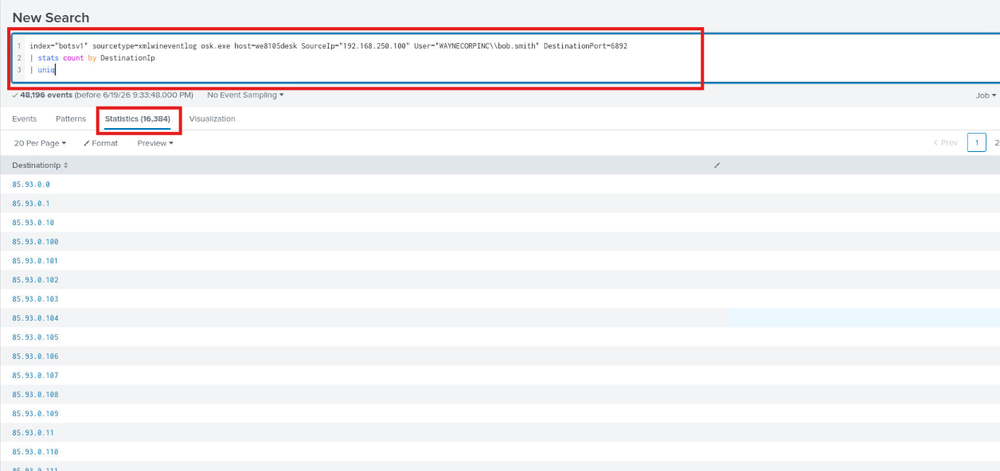<br>
  <em>Figure 8 - Large-scale outbound communications identified across thousands of external IP addresses</em>
</p>

This volume of outbound activity is inconsistent with normal Windows accessibility functionality and strongly supports the conclusion that the executable was performing malicious activity.

</details>


<a id="-7-sha256-hash-extraction"></a>

<details>
<summary><strong>▶ 7) SHA256 Hash Extraction</strong><br>
→ leveraging Sysmon image load telemetry to identify the file hash
</summary><br>

**Goal:** Identify the SHA256 hash associated with the suspicious executable.

At this stage, the investigation had established that the executable was operating from an unusual location, communicating with thousands of external systems, and exhibiting behavior inconsistent with the legitimate Windows On-Screen Keyboard feature.

Sysmon Event ID 7 records Image Load activity and can include additional metadata about files loaded into memory, including digital signature information and cryptographic hashes. Although the investigation could have started by reviewing all Event ID 7 events, filtering on the `ImageLoaded` field allowed the search to be narrowed specifically to the suspicious `osk.exe` binary identified earlier in the investigation. This reduced noise and ensured that any hash values recovered were associated with the malicious executable rather than unrelated system files. The Event ID 7 telemetry ultimately provided the SHA256 hash required for malware identification and external threat intelligence enrichment.

To identify the file hash, Sysmon Event ID 7 telemetry was reviewed. Event ID 7 records image load activity and includes hash information for loaded modules and executables.

The following search was executed:

```spl
index="botsv1" sourcetype=xmlwineventlog EventID=7 ImageLoaded=*osk.exe
```

Because only a small number of relevant events were needed, the search was stopped after the first matching events appeared.

Review of the event details revealed the suspicious executable within the `ImageLoaded` field. The corresponding `Hashes` field contained multiple hash values, including the SHA256 value associated with the file.

<p align="left">
  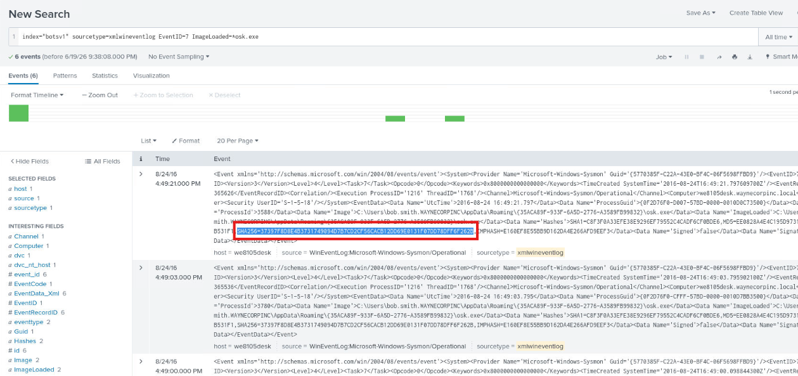<br>
  <em>Figure 9 - Sysmon Event ID 7 providing hash metadata for the suspicious executable</em>
</p>

The SHA256 hash was extracted and preserved for threat intelligence enrichment.

```
37397F8D8E4B3731749094D7B7CD2CF56CACB12DD69E0131F07DD78DFF6F262B
```

</details>

<a id="-8-threat-intelligence-enrichment"></a>

<details>
<summary><strong>▶ 8) Threat Intelligence Enrichment</strong><br>
→ validating the executable against external threat intelligence sources
</summary><br>

**Goal:** Determine whether the file is associated with known malware.

The SHA256 hash extracted from Sysmon telemetry was submitted to VirusTotal for reputation analysis.

VirusTotal detections showed strong consensus among multiple security vendors identifying the file as malicious.

Review of the detection names revealed repeated references to:

```text
Cerber
```

across numerous vendors.

This provided high-confidence evidence that the suspicious executable was associated with the Cerber malware family.

<p align="left">
  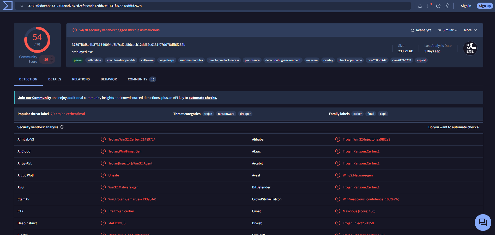<br>
  <em>Figure 10 - VirusTotal detections associating the file with Cerber malware</em>
</p>

Threat intelligence enrichment independently corroborated the findings observed within endpoint telemetry.

</details>

<a id="-9-fortigate-malware-classification"></a>

<details>
<summary><strong>▶ 9) FortiGate Malware Classification</strong><br>
→ correlating endpoint activity with FortiGate UTM detections
</summary><br>

**Goal:** Determine how FortiGate classifies the observed activity.

Earlier analysis identified destination port:

```text
6892
```

as the primary communication channel used by the suspicious executable.

This characteristic provided an effective pivot into FortiGate UTM telemetry.

Unlike Sysmon, FortiGate UTM logs do not contain process-level information such as executable names. As a result, searching for `osk.exe` within FortiGate telemetry would not reliably identify the associated network activity. 

Instead, the investigation pivoted using destination port `6892`, which had previously been identified in Sysmon network connection events generated by the suspicious executable. This allowed endpoint activity to be correlated with firewall detections and ultimately linked the traffic to Cerber-related malware activity.

The following search was executed:

```spl
index="botsv1" sourcetype=fortigate_utm dest_port=6892
```

Review of the resulting events revealed multiple FortiGate detections associated with the traffic.

Several fields provided useful classification information:

* `appcat`
* `app`
* `msg`

FortiGate identified the activity as:

```text
Botnet
```

and associated the traffic with:

```text
Cerber
```

The FortiGate UTM logs provided several fields useful for malware classification and threat context. 
- The `app` field identified the specific threat or malware family associated with the observed traffic, while the 
- `appcat` field provided the broader category assigned by FortiGate. 

In this investigation, the `app` field repeatedly referenced Cerber-related activity, whereas the `appcat` field classified the activity as a `botnet`. 

The `msg` field supplied a human-readable description of the detection and served as an additional validation source when confirming how FortiGate categorized the observed network communications.

<p align="left">
  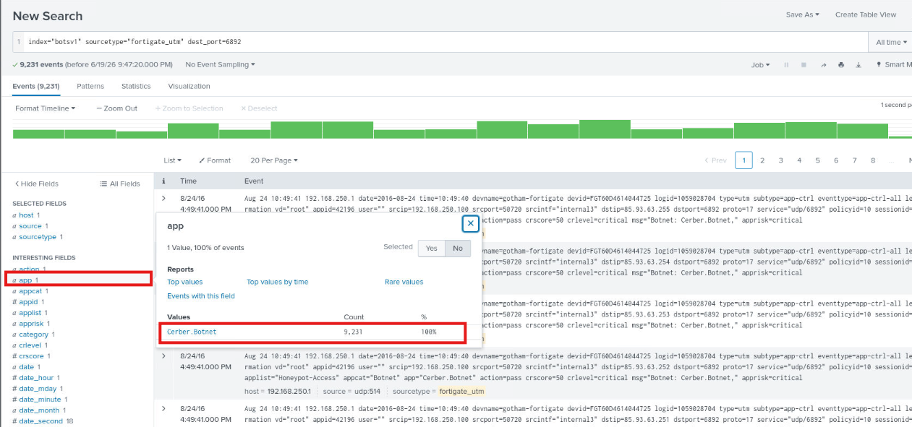<br>
  <em>Figure 11 - FortiGate UTM telemetry classifying the activity as Cerber botnet traffic</em>
</p>

The FortiGate classifications aligned with both the Sysmon findings and VirusTotal enrichment.

</details>

<a id="-10-cerber-malware-function-review"></a>

<details>
<summary><strong>▶ 10) Cerber Malware Function Review</strong><br>
→ determining the primary malware category associated with Cerber
</summary><br>

**Goal:** Understand the primary purpose of the identified malware family.

Although FortiGate categorized the activity as botnet-related traffic, additional OSINT research was performed to better understand the malware itself.

A search for:

```text
Cerber malware
```

revealed documentation from multiple security vendors and threat intelligence providers describing Cerber as a ransomware family.

While Cerber may leverage command-and-control or botnet-style communication mechanisms, its primary malware category is: `Ransomware`.

This finding provided additional context regarding the potential impact had the malware been allowed to fully execute its objectives.

</details>

<a id="-11-suricata-alert-validation"></a>

<details>
<summary><strong>▶ 11) Suricata Alert Validation</strong><br>
→ correlating suspicious network activity with IDS detections
</summary><br>

**Goal:** Determine whether Suricata generated alerts associated with the executable's network activity.

Up to this point, the investigation had established that the suspicious `osk.exe` executable was generating outbound network connections and had been associated with Cerber-related detections within FortiGate telemetry. To determine whether additional network security controls had identified the activity, the investigation pivoted to Suricata logs. Suricata is a network intrusion detection and network security monitoring platform that analyzes network traffic and generates alerts when observed activity matches known signatures, behavioral patterns, or security policies.

Unlike Sysmon, which records activity occurring directly on the endpoint, Suricata observes network communications and provides visibility into how systems interact with external infrastructure. The search was scoped using the source IP address of the infected host (`192.168.250.100`), the destination IP address associated with the suspicious HTTP connection (`54.148.194.58`), and destination port `80` to ensure the results corresponded to the specific network activity previously identified through Sysmon telemetry.

Particular attention was given to events with `event_type=alert`, as these represent traffic that triggered a Suricata detection rule. Within these events, the `alert.signature` field contains the human-readable description of the detection that fired. Reviewing this field revealed the signature `ET POLICY Possible External IP Lookup ipinfo.io`, indicating that the system had contacted a service commonly used to identify the public IP address and external network information of the infected host. This activity is frequently observed during malware infections and can assist attackers or malware in understanding the environment they have compromised.

Earlier analysis identified a single outbound connection over destination port:

```text
80
```

<p align="left">
  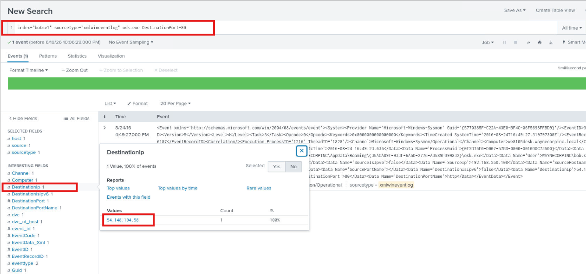<br>
  <em>Figure 12 - Destination IP for the single outbound connection over destination port 80</em>
</p>

Reviewing the corresponding Sysmon event revealed the following network metadata:

| Field            | Value             |
| ---------------- | ----------------- |
| Source IP        | `192.168.250.100` |
| Destination IP   | `54.148.194.58`   |
| Destination Port | `80`              |

To identify associated IDS detections, Suricata telemetry was reviewed.

An initial search was performed to understand the field naming conventions used by Suricata:

```spl
index="botsv1" sourcetype=suricata
```

Review of several events confirmed that Suricata utilized the fields:

* `src_ip`
* `dest_ip`
* `dest_port`

Using the source and destination information identified earlier, the following search was executed:

```spl
index="botsv1" sourcetype=suricata src_ip=192.168.250.100 dest_ip=54.148.194.58 dest_port=80
```

Several events matched the search criteria.

Reviewing the event details and expanding the full alert record revealed the following Suricata signature:

```text
ET POLICY PE EXE or DLL Windows file download HTTP
```

<p align="left">
  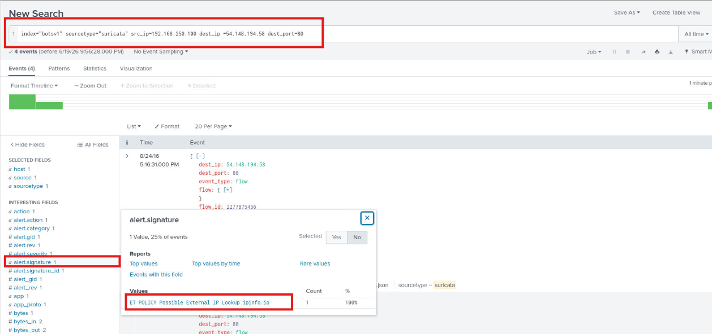<br>
  <em>Figure 13 - Suricata alert associated with suspicious HTTP activity generated by the executable</em>
</p>

The Suricata detection provided additional network-based evidence supporting the conclusion that the executable was engaged in malicious activity and communicating with external infrastructure.

</details>


---


### Findings Summary

This section consolidates high-confidence conclusions supported directly by Sysmon telemetry, FortiGate UTM detections, Suricata IDS alerts, and external threat intelligence enrichment reviewed throughout the investigation.

* The executable `osk.exe` was executing from a user roaming profile directory rather than its legitimate Windows system location.
* Open-source validation confirmed that the legitimate Windows On-Screen Keyboard executable is normally located at `C:\Windows\System32\osk.exe`.
* The suspicious executable was observed running from `C:\Users\bob.smith.WAYNECORPINC\AppData\Roaming\{35ACA89F-933F-6A5D-2776-A3589FB99832}\osk.exe`.
* The file executed on host `we8105desk`.
* The executable was running under the user account `WAYNECORPINC\bob.smith`.
* The affected system was assigned the internal IP address `192.168.250.100`.
* The executable generated outbound network communications primarily over TCP port `6892`.
* Analysis identified communications with approximately `16,384` unique destination IP addresses.
* Sysmon Event ID 7 telemetry provided a SHA256 hash associated with the executable.
* VirusTotal enrichment associated the file with the Cerber malware family.
* FortiGate UTM classified the observed activity as Cerber-related botnet traffic.
* Additional threat intelligence research identified Cerber as ransomware.
* Suricata generated alerts associated with network activity originating from the affected system.
* Combined host, network, firewall, and threat intelligence evidence confirmed malware execution and associated command-and-control activity.

**Detailed Evidence Reference:**
For a full, artifact-level breakdown of process execution events, network communications, malware classifications, IDS alerts, and threat intelligence enrichment that support these findings — including where each artifact was identified during the investigation — see: **`detection-artifact-report.md`**

---

### Defensive Takeaways

This investigation highlights several defender-relevant patterns commonly encountered during malware execution and command-and-control investigations.

* Legitimate Windows binary names are frequently abused to disguise malicious executables.
* File path validation is often one of the quickest methods for identifying masquerading behavior.
* Sysmon telemetry provides valuable visibility into process execution, image loading, and outbound network activity.
* High-volume communications with large numbers of external systems frequently indicate malware activity.
* Threat intelligence enrichment can rapidly identify known malware families using file hashes.
* Firewall telemetry can provide valuable malware classifications and behavioral context.
* IDS telemetry often supplies additional validation of malicious communications.
* Correlating endpoint, network, and threat intelligence data significantly improves investigative confidence.

---

### Artifacts Identified

The following artifacts were extracted and validated during analysis and may support detection engineering, threat hunting, or future investigations.

* Suspicious executable: `osk.exe`
* Legitimate executable path: `C:\Windows\System32\osk.exe`
* Observed executable path: `C:\Users\bob.smith.WAYNECORPINC\AppData\Roaming\{35ACA89F-933F-6A5D-2776-A3589FB99832}\osk.exe`
* Hostname: `we8105desk`
* User account: `WAYNECORPINC\bob.smith`
* Internal IP address: `192.168.250.100`
* Primary destination port: `6892`
* Secondary destination port: `80`
* Unique destination IPs observed: `16,384`
* Malware family: `Cerber`
* Malware category: `Ransomware`
* FortiGate classification: `Botnet`
* SHA256 hash: *(captured during investigation)*
* Destination IP (HTTP activity): `54.148.194.58`

I consolidated all evidence identified throughout the investigation and reviewed the observed malware behavior to better understand its functionality and communications.

1. Initial OSINT validation established that `osk.exe` is normally a legitimate Windows accessibility component.
2. Sysmon telemetry revealed execution of an executable using the same name from an abnormal user roaming profile directory.
3. Host attribution analysis identified the affected workstation, user account, and internal IP address.
4. Network analysis revealed extensive outbound communications directed toward thousands of external systems.
5. Destination port analysis identified TCP port `6892` as the primary communication channel.
6. Sysmon image load telemetry provided a SHA256 hash associated with the executable.
7. Threat intelligence enrichment linked the executable to the Cerber malware family.
8. FortiGate detections independently classified the activity as Cerber-related botnet traffic.
9. Additional OSINT research confirmed Cerber's primary malware category as ransomware.
10. Suricata IDS alerts provided further validation of suspicious outbound communications.
11. Correlation of all evidence confirmed malware execution accompanied by command-and-control activity.

**Detailed Evidence Reference:**
For a full, artifact-level breakdown of process execution events, network communications, malware classifications, IDS alerts, and supporting evidence — including where each artifact was identified during the investigation — see: **`detection-artifact-report.md`**

---

### Detection and Hardening Opportunities

This section summarizes high-level detection and hardening opportunities identified during the investigation. For detailed, actionable recommendations — including endpoint monitoring, command-and-control detection opportunities, and malware response improvements — see: **`detection-and-hardening-recommendations.md`**

This section outlines defensive improvements derived directly from observed malware behavior.

▶ Endpoint Monitoring:

* Alert on execution of Windows binaries from non-standard directories.
* Monitor for executable names matching known Windows system binaries outside approved paths.
* Alert on process execution originating from user roaming profile directories.
* Monitor Sysmon Event ID 1 and Event ID 7 telemetry for unusual process activity.

▶ Network Monitoring:

* Alert on outbound communications involving uncommon destination ports.
* Monitor endpoints generating connections to unusually large numbers of external systems.
* Detect command-and-control communication patterns and beaconing behavior.
* Investigate systems generating significant outbound network volume.

▶ Threat Intelligence Integration:

* Enrich suspicious file hashes using external intelligence platforms.
* Monitor for known malware family indicators.
* Correlate endpoint telemetry with reputation-based intelligence feeds.
* Automate malware reputation lookups for newly observed executables.

▶ Security Controls:

* Deploy application allowlisting where feasible.
* Restrict execution from user profile directories.
* Implement endpoint detection and response (EDR) monitoring.
* Improve visibility into malware execution and persistence mechanisms.

---

### MITRE ATT&CK Mapping

This section provides a high-level summary of observed MITRE ATT&CK tactics and techniques. For evidence-backed mappings tied to specific telemetry, artifacts, and investigation steps, see: **`MITRE-ATTACK-mapping.md`**

#### ▶ Defense Evasion

##### (1) Masquerading (T1036)

* The executable used the name `osk.exe`, which is normally associated with a legitimate Windows system binary, while executing from a user-controlled directory.

#### ▶ Command and Control

##### (2) Application Layer Protocol (T1071)

* The executable generated outbound communications to external systems using standard network protocols.

##### (3) Non-Standard Port (T1571)

* The majority of outbound communications were directed over destination port `6892`, a non-standard port not commonly associated with legitimate Windows accessibility functionality.

#### ▶ Discovery

##### (4) System Owner/User Discovery (T1033)

* Malware activity occurred within the context of an identified user account and system.

---

### MITRE ATT&CK Mapping (Table View)

This section provides a high-level table summary of observed ATT&CK tactics and techniques. For evidence-backed mappings tied to specific artifacts, timestamps, and investigation steps, see: **`MITRE-ATTACK-mapping.md`**

| Tactic              | Technique                               | Description                                                                                         |
| ------------------- | --------------------------------------- | --------------------------------------------------------------------------------------------------- |
| Defense Evasion     | **Masquerading (T1036)**                | Malware used the name of a legitimate Windows executable while operating from an abnormal location. |
| Command and Control | **Application Layer Protocol (T1071)**  | Outbound communications were established with external infrastructure.                              |
| Command and Control | **Non-Standard Port (T1571)**           | Communications primarily utilized destination port 6892.                                            |
| Discovery           | **System Owner/User Discovery (T1033)** | Activity was observed within the context of a specific user account and workstation.                |

---

### Analyst Notes

This investigation reinforced how multiple telemetry sources can be combined to validate malware execution and identify command-and-control behavior. I learned how to leverage Sysmon process telemetry, image load events, firewall detections, IDS alerts, and external threat intelligence to build a comprehensive understanding of malware activity. Most importantly, this investigation demonstrated the value of validating executable paths, correlating host and network evidence, and using threat intelligence enrichment to rapidly identify known malware families while maintaining evidence-based investigative conclusions.


