# Windows Endpoint Malware Triage Investigation (Living-Off-the-Land Binary (LoLBin) Abuse and Payload Validation)

### Executive Summary

This investigation analyzes suspicious activity on a Windows endpoint where multiple executables masquerading as legitimate software were identified and validated as malicious. Using only native PowerShell tooling, the investigation focused on rapid endpoint triage, artifact validation, and identification of persistence mechanisms without relying on third-party security tools or GUI-based analysis.

The investigation confirmed malicious activity, including execution of credential-stealing malware, unauthorized account creation with administrative privileges, and the establishment of multiple persistence mechanisms. Findings demonstrate how attackers can abuse built-in Windows utilities and trusted binaries to evade detection while maintaining access.

> 👉 For a **description of the situation being investigated and what triggered this analysis**, see the **[Scenario Context](#scenario-context)** section below.

> 👉 For a **mapping of observed behavior to MITRE ATT&CK techniques**, see the **[MITRE ATT&CK](#mitre-attck-mapping)** section below

> 👉 For a **detailed, step-by-step walkthrough of how this investigation was conducted — complete with screenshots**, see the **[Investigation Walkthrough](#investigation-walkthrough)** section below.

---

### Scenario Context

Suspicious activity was identified on a Windows endpoint after multiple executables were discovered staging in a user-accessible directory while presenting themselves as legitimate software (e.g., update utilities and installers). The filenames and embedded metadata indicated masquerading, and the artifacts warranted rapid validation to determine whether they were benign downloads or part of an active malware infection.

The investigation was triggered by the presence of these questionable binaries and the need to triage the host using a constrained response approach (PowerShell-only). Analysis focused on validating the suspected malware without execution, determining whether any samples had already run, and confirming impact by checking for high-signal comp


---

### Incident Scope

The scope of this investigation is limited to a single Windows endpoint operating under a constrained response scenario where PowerShell is the only available investigative tool. Analysis is restricted to host-based artifacts, including files, local users and groups, scheduled tasks, registry startup keys, and PowerShell execution behavior.

The investigation does not include network traffic capture, memory analysis, or full malware reverse engineering. Conclusions are based solely on observable endpoint telemetry and artifacts available through native Windows tooling.

This report documents a Windows endpoint malware investigation performed entirely through PowerShell, simulating a constrained incident-response scenario where traditional GUI tools or third-party security software are unavailable.

The primary goal of this investigation is not malware reverse engineering, but endpoint triage and response — identifying suspicious artifacts, validating their legitimacy, detecting persistence, and determining whether the system has been compromised.

---

### Environment, Evidence, and Tools

This investigation is conducted entirely using native Windows tooling to simulate real-world incident response scenarios where external tools may be unavailable.

#### ▶ Environment
- Operating System: Windows
- Endpoint Scope: Single host (constrained incident-response scenario)
- Analysis Type: Live response / post-compromise triage
- Constraints: PowerShell only (native cmdlets; no third-party tools, no GUI-based triage tooling)

#### ▶ Evidence Sources
- File system artifacts (staged executables/installers)
  - Suspect directory: `C:\Users\BTLOTest\Desktop\Investigation`
  - Key artifacts: `omgsoft.exe`, `neuro.msi`, `Win_Update.exe`
- File metadata and embedded version information
  - File properties and `VersionInfo` fields used to identify masquerading
- File hashes (SHA-256) for reputation-based validation
- Digital signature status (Authenticode) for MSI installer trust verification
- Local user and group configuration
  - Local user enumeration and Administrators group membership changes
- Scheduled task configuration
  - Non-default task identification and task action inspection
- Registry startup keys (Run keys)
  - `HKCU:\Software\Microsoft\Windows\CurrentVersion\Run`
  - `HKLM:\Software\Microsoft\Windows\CurrentVersion\Run`
- PowerShell execution context and behavior
  - Commands executed, parameters used (`-NoProfile`, `-WindowStyle Hidden`), and output artifacts (e.g., `C:\processes.txt`)

#### ▶ Tools Used
- PowerShell (native cmdlets only) – Performed full triage workflow: file discovery, hashing, metadata review, signature checks, user/group enumeration, scheduled task inspection, and registry persistence validation
- External reputation lookup (hash-based, e.g., VirusTotal) – Confirmed malware family attribution for `omgsoft.exe` using SHA-256 reputation (without executing the sample)


**Scope:** Rapid endpoint triage and malware validation using only built-in Windows tooling.

---

### Investigative Questions

This section defines the key questions used to guide triage and determine whether the endpoint is compromised based on observable evidence.

- Are the identified executables legitimate or malicious?
- Do any files exhibit masquerading or unsigned installer behavior?
- Did execution of suspicious binaries result in system-level changes?
- Were unauthorized users or privilege escalations introduced?
- Has the attacker established persistence on the endpoint?
- What native tools or LOLBINs were abused to maintain access?

---

### Investigation Timeline
This timeline summarizes the logical progression of the investigation, from initial reconnaissance through confirmation of compromise and persistence.

- **T0 — Environment orientation:** User context, hostname, and working directory validated using PowerShell.
- **T1 — File system reconnaissance:** Suspicious executables identified in a single staging directory under the user profile.
- **T2 — Malware validation:** Hashing, metadata inspection, and reputation analysis confirmed omgsoft.exe as Lumma Stealer.
- **T3 — Installer verification:** Digital signature analysis identified neuro.msi as an unsigned and untrusted installer.
- **T4 — Execution impact analysis:** Win_Update.exe execution resulted in unauthorized local user creation and administrative privilege escalation.
- **T5 — Persistence detection:** Scheduled task creation identified as a persistence mechanism.
- **T6 — Logon execution analysis:** PowerShell command configured to run silently at user logon.
- **T7 — Registry persistence confirmed:** Run key modification observed abusing a legitimate Windows binary for startup execution.

---


### Investigation Walkthrough

<blockquote>
<details>
<summary><strong>📚 Walkthrough Navigation (click to expand)</strong></summary>

- [1) Initial Evidence Collection](#initial-evidence-collection)
- [2) Malicious Executable Identification (omgsoft.exe)](#malicious-executable-identification-omgsoftexe)
- [3) Installer Verification (neuro.msi)](#installer-verification-neuromsi)
- [4) Behavioral Analysis of Win_Update.exe (User and Group Enumeration)](#behavioral-analysis-of-win_updateexe-user-and-group-enumeration)
- [5) Task Persistence Detection](#task-persistence-detection)
- [6) PowerShell Command Executed at Logon](#powershell-command-executed-at-logon)
- [7) Registry-Based Startup Abuse](#registry-based-startup-abuse)

</details>
</blockquote>

This section reconstructs the attacker’s actions step-by-step, correlating network, authentication, endpoint, file, and registry evidence across the intrusion lifecycle.

**Note:** Each section is collapsible. Click the ▶ arrow to expand and view the detailed steps.

<!--
NOTE TO SELF: If you want to change it back, follow these steps:
1. In the main "Walkthrough Naviation" collapsible toc below this, add "-" (hyphen) between hashtag and number for top level sections only
2. Remove <details>, <summary>, and <strong> tags (including closing tags)
3. Add "####" in front of section title
4. Remove hidden anchor. Example: <a id="1-reconnaissance-activity--service-enumeration-analysis"></a>
-->

<a id="initial-evidence-collection"></a>

<details>
<summary><strong>▶ 1) Initial Evidence Collection</strong><br>
 → establishing endpoint context and identify the initial malware staging location through PowerShell-only triage
</summary><br>

**Goal:** Confirm the current user/host context, map the working directory, and locate the suspicious artifact cluster (`omgsoft.exe`, `neuro.msi`, `Win_Update.exe`) without executing any files.

I opened Windows Powershell and enumerated files and running processes to identify anomalous executables using PowerShell commands such as `Get-ChildItem`. 

<p align="left">
  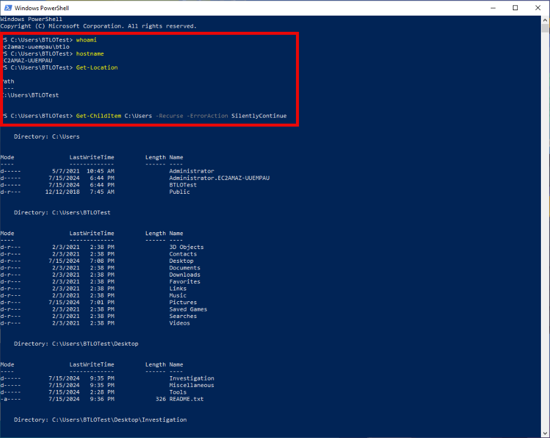<br>
  <em>Figure 1 - Initial PowerShell enumeration establishing user context host identity and filesystem baseline</em>
</p>

At the start of the investigation, my priority was to establish context about the endpoint before interacting with any potentially malicious files. When responding to a suspected compromise, it is critical to understand who I am on the system, which host I am investigating, and where I am operating in the filesystem to avoid misinterpretation of artifacts or accidental execution. To accomplish this, I began with a small set of PowerShell commands to orient myself on the host.

- **(Step 1)** I first ran `whoami` to identify the current user context under which PowerShell was running. Knowing whether the session is operating as a standard user or with elevated privileges helps determine which directories and system areas are accessible and whether any suspicious activity could have occurred under the same account.
- **(Step 2)** Next, I executed `hostname` to confirm the endpoint name. This is an important step in incident response when multiple systems may be involved, ensuring that evidence is correctly attributed to the correct host.
- **(Step 3)** I then used `Get-Location` to confirm my current working directory. Establishing this baseline helps avoid confusion when navigating the filesystem and ensures that any discovered artifacts are tied to the correct path.
- **(Step 4)** Once the environment was confirmed, I began a recursive file system review starting from C:\Users using:


```powershell
Get-ChildItem C:\Users -Recurse -ErrorAction SilentlyContinue
```

This command enumerates files and directories under user profiles while suppressing access-denied errors, allowing a broad view of user-accessible storage locations. This approach is commonly used during endpoint triage to surface files that may not be immediately visible through standard directory browsing.

During this phase, I paid particular attention to locations that are frequently abused by malware, including:

- `Downloads` — often used to stage malicious payloads
- `AppData\Local` and `AppData\Roaming` — common persistence and execution locations due to limited user scrutiny
- Unexpected or unfamiliar executable names (`.exe`, `.msi`) in user directories

There were several known suspicious files that required validation:

- `omgsoft.exe`
- `neuro.msi`
- `Win_Update.exe`

As I reviewed the directory listings, I specifically scanned for these filenames, as well as similar naming patterns that could indicate masquerading or renamed variants. File names that resemble legitimate software or system updates are a common attacker technique to evade user suspicion.

This initial reconnaissance step allowed me to build a mental map of the endpoint’s structure and identify potential malware staging locations before moving into hash validation, signature checks, and persistence analysis later in the investigation.

As I continued enumerating the filesystem, I identified that all suspicious artifacts were located within a single directory under the current user’s desktop: 

```powershell
C:\Users\BTLOTest\Desktop\Investigation
```

<p align="left">
  <br>
  <em>Figure 2 - Discovery of all suspicious artifacts grouped within a single user desktop investigation directory</em>
</p>

<blockquote>
This finding immediately stood out. In real-world investigations, malware rarely clusters itself neatly unless it has been manually staged, deliberately dropped for execution, or placed there as part of a simulated or scripted delivery mechanism. The fact that all suspicious files were grouped together suggested intentional placement rather than incidental download activity.
</blockquote>

Finding all three artifacts in the same directory allowed me to treat this location as a central staging area for the investigation, simplifying evidence handling and reducing the risk of overlooking related files. From an incident response perspective, this suggested that the activity was user-context based, with no immediate indication of system-wide distribution or lateral placement across other user profiles.

At this stage, I intentionally avoided executing the files and focused instead on non-invasive validation techniques, such as hash analysis and digital signature verification, to assess legitimacy without altering the system state. This discovery marked the transition from initial reconnaissance to focused artifact analysis, with this directory serving as the primary evidence source for the remainder of the investigation.

</details>

<a id="malicious-executable-identification-omgsoftexe"></a>

<details>
<summary><strong>▶ 2) Malicious Executable Identification (omgsoft.exe)</strong><br>
 → validating the primary suspicious executable via hash reputation and metadata inconsistencies to confirm malware
</summary><br>

**Goal:** Generate a SHA-256 fingerprint, inspect embedded `VersionInfo` for masquerading indicators, and use external reputation results to attribute `omgsoft.exe` to a known malware family (Lumma Stealer) without running the sample.

I began the investigation by locating the suspicious executable referenced during initial triage. Using PowerShell, I recursively searched the system to identify the presence and location of omgsoft.exe.

```powershell
Get-ChildItem C:\ -Recurse -Filter "omgsoft.exe" -ErrorAction SilentlyContinue
```

<p align="left">
  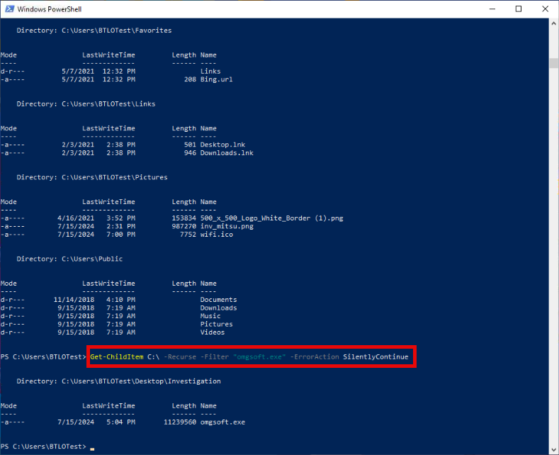<br>
  <em>Figure 3 - Recursive file search confirming presence and location of omgsoft exe on the endpoint</em>
</p>

Once the file was located, I deliberately avoided executing it and treated it as a potentially malicious artifact. Instead, I proceeded with static analysis to safely gather identifying information. To uniquely identify the executable and enable reputation-based analysis, I generated a SHA-256 hash of the file:

```powershell
Get-FileHash "C:\Users\BTLOTest\Desktop\Investigation\omgsoft.exe"
```

Hashing the file provides a reliable fingerprint that can be used to correlate the sample with known malware in external threat intelligence platforms. Next, I examined the file’s filesystem metadata to gather additional context:

```powershell
Get-Item "C:\Users\BTLOTest\Desktop\Investigation\omgsoft.exe" | Format-List *
```

<p align="left">
  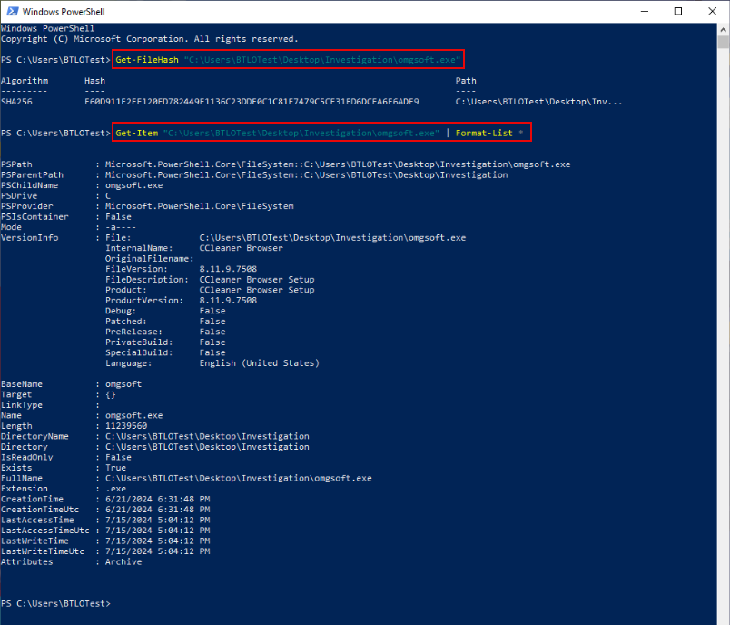<br>
  <em>Figure 4 - File metadata review of omgsoft exe showing inconsistent properties indicative of masquerading</em>
</p>

While this command returned standard file attributes, it did not clearly explain what the executable claimed to be. To gain deeper insight, I inspected the file’s embedded version information, which malware commonly manipulates to masquerade as legitimate software:

```powershell
$path="C:\Users\BTLOTest\Desktop\Investigation\omgsoft.exe"
(Get-Item "C:\Users\BTLOTest\Desktop\Investigation\omgsoft.exe").VersionInfo | Format-List *
```

The version metadata revealed that `omgsoft.exe` identified itself as “CCleaner Browser Setup”, with an internal name of “CCleaner Browser” and a listed publisher of Gen Digital Inc. This information did not align with the executable’s filename, location, or investigation context. Such inconsistencies strongly indicate masquerading behavior, where malware falsely presents itself as trusted software to evade detection and user suspicion.

<p align="left">
  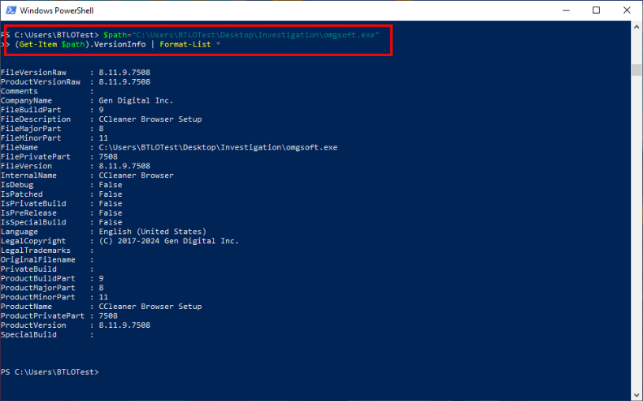<br>
  <em>Figure 5 - Embedded version information claiming CCleaner Browser Setup inconsistent with filename and context</em>
</p>

The hash (`E60d911F2EF120ED782449F1136C23DDF0C1C81F7479C5CE31ED6DCEA6F6ADF9`) and metadata allowed me to determine the file’s true malware infection name, confirming that `omgsoft.exe` was not legitimate software.

Although this metadata suggested a Fake CCleaner variant, file metadata alone is unreliable for determining a malware’s true identity. To accurately identify the infection, I used the previously generated SHA-256 hash to perform an external reputation lookup using VirusTotal.

Reviewing the VirusTotal results, I focused on the Popular threat label and Family labels, rather than individual antivirus detections, which often use vendor-specific naming conventions. Multiple security vendors consistently classified the sample as belonging to the Lumma Stealer malware family.

Based on this multi-vendor consensus, I determined that the true infection name of `omgsoft.exe` is Lumma Stealer, confirming that the executable was malicious and not legitimate CCleaner software.

</details>

<a id="installer-verification-neuromsi"></a>

<details>
<summary><strong>▶ 3) Installer Verification (neuro.msi)</strong><br>
 → assessing installer trust by checking Authenticode signature status and identifying unsigned MSI risk
</summary><br>

**Goal:** Confirm the installer’s location, validate whether it is signed by a trusted publisher, and determine whether `neuro.msi` represents an untrusted delivery component in the infection chain.

Next, I investigated a suspicious installer package named neuro.msi, as MSI files are frequently abused to deliver malware under the appearance of legitimate installers. I assessed its legitimacy by verifying its digital signature. Malware commonly abuses unsigned MSI installers to evade trust-based controls and appear legitimate to users. I first confirmed the file’s location on the system: 

```powershell
Get-ChildItem C:\ -Recurse -Filter "neuro.msi" -ErrorAction SilentlyContinue
```

<p align="left">
  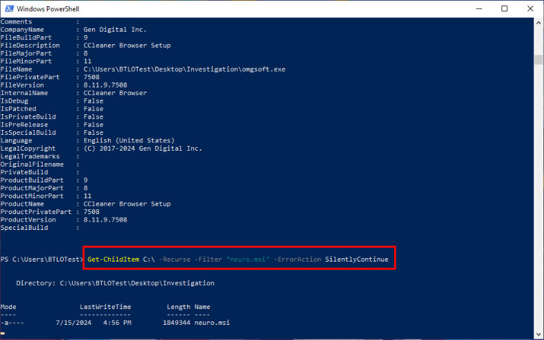<br>
  <em>Figure 6 - Recursive search confirming location of the neuro msi installer on the system</em>
</p>

To verify its authenticity, I checked the file’s digital signature status using PowerShell’s Authenticode functionality.

```powershell
Get-AuthenticodeSignature .\neuro.msi
```

<p align="left">
  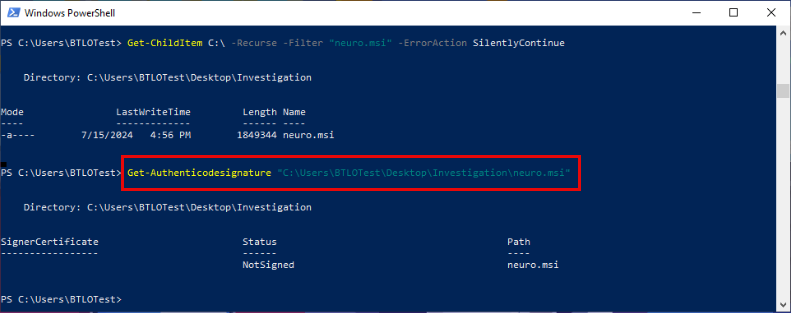<br>
  <em>Figure 7 - Authenticode signature check showing neuro msi is unsigned and untrusted</em>
</p>

The results showed that the installer was `NotSigned`, indicating it was not issued by a trusted publisher. This lack of a valid digital signature strongly suggests that `neuro.msi` is not legitimate software and is likely being used as part of the malware infection chain.

</details>

<a id="behavioral-analysis-of-win_updateexe-user-and-group-enumeration"></a>

<details>
<summary><strong>▶ 4) Behavioral Analysis of Win_Update.exe (User and Group Enumeration)</strong><br>
 → confirming execution impact by detecting unauthorized account creation and administrative privilege changes
</summary><br>
  
**Goal:** Perform before/after local user and Administrators group enumeration to prove whether `Win_Update.exe` caused system-level changes consistent with compromise (new user creation + privilege escalation).

To assess the impact of executing `Win_Update.exe`, I performed differential analysis by enumerating local user accounts and administrative group membership after running the binary.

I first confirmed the file’s location on the system: 

```powershell
Get-ChildItem C:\ -Recurse -Filter "Win_Update.exe" -ErrorAction SilentlyContinue
```

<p align="left">
  <br>
  <em>Figure 8 - Recursive search confirming presence and location of "Win_Update.exe"</em>
</p>

Before execution, I established a baseline of existing local user accounts.

```powershell
Get-LocalUser
```

<p align="left">
  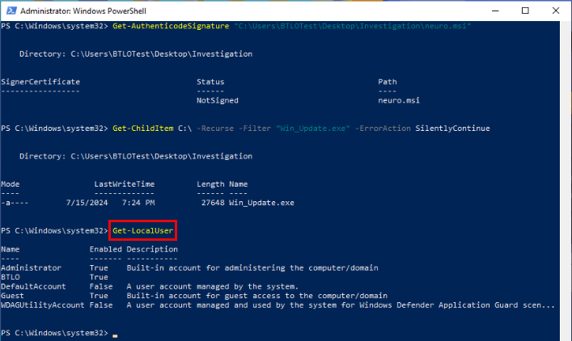<br>
  <em>Figure 9 - Baseline enumeration of local user accounts prior to executing "Win_Update.exe"</em>
</p>

I then executed the binary with administrative privileges to observe system-level changes. 

```powershell
Start-Process "C:\Users\BTLOTest\Desktop\Investigation\Win_Update.exe"
```

<p align="left">
  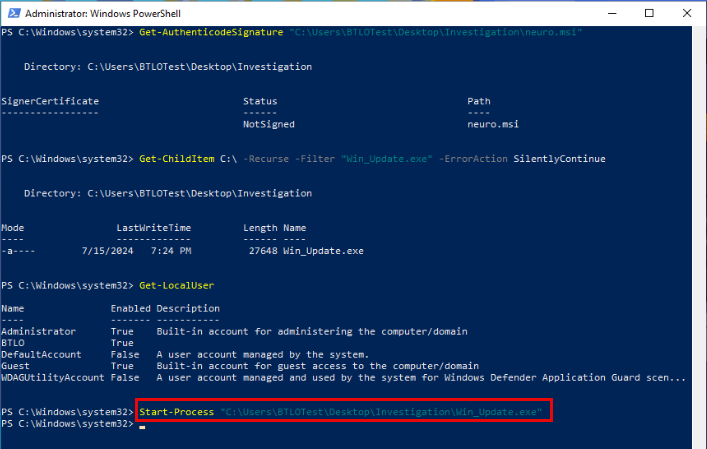<br>
  <em>Figure 10 - Execution of "Win_Update.exe" with administrative privileges to observe system level impact</em>
</p>

After execution, I enumerated local users again to identify changes. This inspection revealed a critical security change as there appeared to be a newly created user, `testuser`.

```powershell
Get-LocalUser
```

<p align="left">
  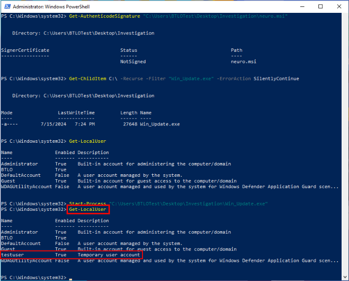<br>
  <em>Figure 11 - Post execution user enumeration revealing unauthorized creation of a new local account</em>
</p>

To assess privilege escalation, I enumerated membership of the local Administrators group. The output showed that the `testuser` account was a member of the `Administrators` group. This indicates that execution of `Win_Update.exe` resulted in unauthorized account creation and privilege escalation by creating a new account and modifying group membership.

Privilege escalation does not require the creation of a new user; elevating an existing account to administrative access provides the same level of control and persistence. Legitimate update mechanisms do not alter local administrator group membership, confirming that `Win_Update.exe` performed malicious actions.

```powershell
Get-LocalGroupMember "Administrators"
```

<p align="left">
  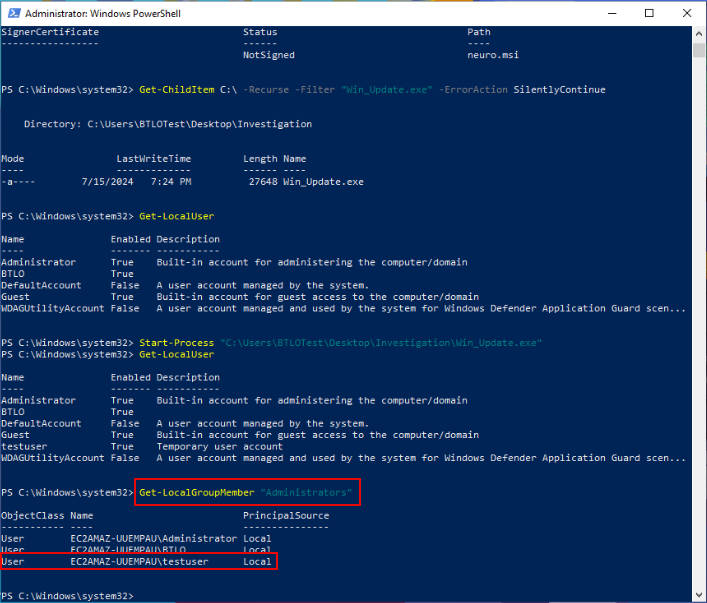<br>
  <em>Figure 12 - Administrators group membership showing privilege escalation for the newly created user</em>
</p>

Execution analysis demonstrated that `Win_Update.exe` created a new account and altered system privileges by granting administrative access, confirming malicious behavior.

</details>

<a id="task-persistence-detection"></a>

<details>
<summary><strong>▶ 5) Task Persistence Detection</strong><br>
 → identifying persistence established through non-default scheduled task creation outside Microsoft baselines
</summary><br>

**Goal:** Enumerate non-Microsoft scheduled tasks, isolate newly introduced entries, and confirm task-based persistence by identifying the malicious task name (`LoginProcessDump`) created by the infection.

To determine whether the malware established persistence through Windows Task Scheduler, I investigated scheduled tasks on the system. Attackers commonly abuse scheduled tasks to maintain access by executing malicious programs automatically at logon or on a recurring schedule.

I began by enumerating scheduled tasks while filtering out default Microsoft-created tasks. This allowed me to reduce background noise and focus only on tasks that were more likely to have been added by a malicious process.

```powershell
Get-ScheduledTask | Where-Object { $_.TaskPath -notlike "\Microsoft\*" } | Select TaskName, TaskPath
```

<p align="left">
  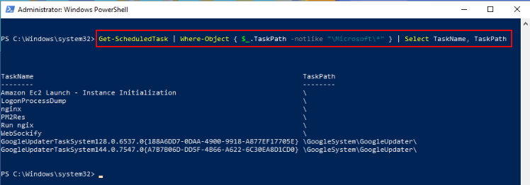<br>
  <em>Figure 13 - Enumeration of non Microsoft scheduled tasks to identify persistence mechanisms</em>
</p>

After isolating non-Microsoft tasks, I reviewed the remaining entries and identified `LoginProcessDump` as a newly added task associated with the infection. This task does not correspond to legitimate Windows functionality and aligns with attacker behavior aimed at post-execution persistence.

Based on this analysis, the newly added scheduled task introduced by the malware was:

`LoginProcessDump`

<p align="left">
  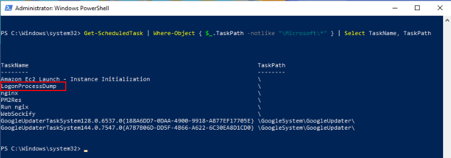<br>
  <em>Figure 14 - Identification of the malicious scheduled task LoginProcessDump created by the malware</em>
</p>

</details>

<a id="powershell-command-executed-at-logon"></a>

<details>
<summary><strong>▶ 6) PowerShell Command Executed at Logon</strong><br>
 → extracting the persistence command line to validate stealthy PowerShell execution behavior and intent
</summary><br>

**Goal:** Inspect the scheduled task action to recover the full PowerShell command, confirm stealth flags (`-NoProfile`, `-WindowStyle Hidden`), and determine the attacker’s post-compromise objective (process reconnaissance written to disk).

After identifying the malicious scheduled task, I examined its configured action to determine what command was executed at user logon. Attackers frequently abuse PowerShell in scheduled tasks to run commands stealthily, often suppressing user visibility.

I retrieved the action associated with the scheduled task using PowerShell:

```powershell
(Get-ScheduledTask -TaskName "LoginProcessDump").Actions
```

The task was configured to execute powershell.exe with parameters that disable user profiles and hide the window, indicating an attempt to run silently in the background. The full command executed by the task was:

```powershell
powershell.exe -NoProfile -WindowStyle Hidden -Command "Get-Process | Out-File C:\processes.txt"
```

<p align="left">
  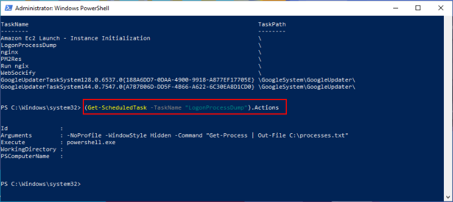<br>
  <em>Figure 15 - Scheduled task action revealing hidden PowerShell execution at user logon</em>
</p>

This command enumerates running processes and writes the output to a file, which could be used by an attacker for system reconnaissance. The use of a hidden PowerShell window further confirms malicious intent and aligns with common persistence and reconnaissance techniques.

</details>

<a id="registry-based-startup-abuse"></a>

<details>
<summary><strong>▶ 7) Registry-Based Startup Abuse</strong><br>
 → confirming registry Run-key persistence and LoLBin abuse using a trusted Windows binary at logon
</summary><br>

**Goal:** Review `HKCU` and `HKLM` Run keys to identify unauthorized startup entries, confirm persistence scope (user vs machine), and validate LoLBin misuse by mapping the suspicious Run value (`MaliciousApp`) to `notepad.exe`.

After identifying scheduled task persistence, I investigated whether the malware also attempted to establish persistence through the Windows registry. Persistence mechanisms allow malicious programs to automatically execute after a system reboot or user logon, enabling attackers to maintain access over time.

To perform this analysis, I examined the Windows Run registry keys, which are specific registry locations that define which programs are automatically executed when Windows starts or when a user logs in. These keys are commonly abused by malware because they allow programs to run without user interaction.

I first queried the current user Run key using PowerShell:

```powershell
Get-ItemProperty "HKCU:\Software\Microsoft\Windows\CurrentVersion\Run"
```

<p align="left">
  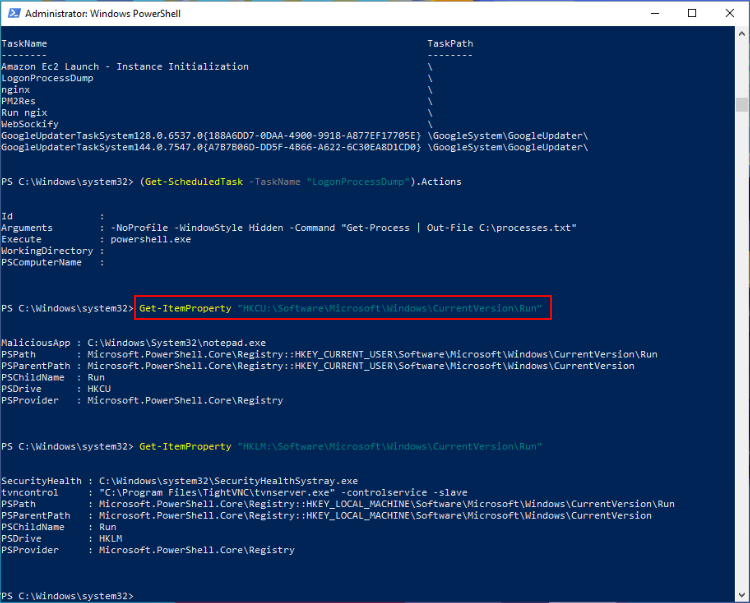<br>
  <em>Figure 16 - Registry Run key modification under the current user hive establishing startup persistence</em>
</p>

The `HKCU` (HKEY_CURRENT_USER) hive contains settings that apply only to the currently logged-in user. Programs listed under this key automatically run whenever that user logs in, and modifying this key does not require administrative privileges, making it a common target for attackers.

The output revealed a suspicious entry named MaliciousApp pointing to the following executable: `C:\Windows\System32\notepad.exe`

Although `notepad.exe` is a legitimate Windows application, it is not designed to run automatically at startup. Its presence in the Run key under an abnormal value name indicates that a trusted Windows binary is being misused for persistence, a technique often referred to as Living-off-the-Land Binary (LOLBIN) abuse.

To determine whether the persistence was limited to the current user or applied system-wide, I also examined the machine-level Run key:

```powershell
Get-ItemProperty "HKLM:\Software\Microsoft\Windows\CurrentVersion\Run"
```

<p align="left">
  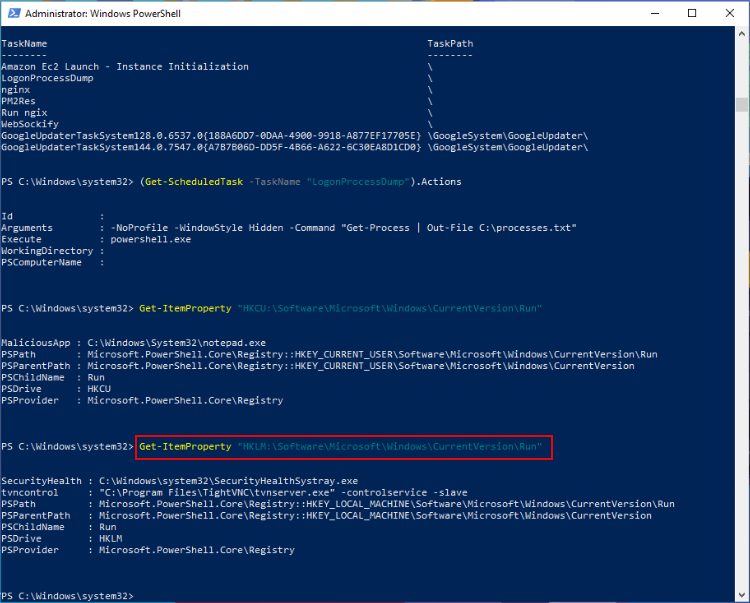<br>
  <em>Figure 17 - Machine level Run key review confirming persistence limited to the current user context</em>
</p>

The `HKLM` (HKEY_LOCAL_MACHINE) hive applies to all users on the system and requires administrative privileges to modify. Reviewing both registry locations allowed me to confirm that the persistence mechanism was implemented at the user level rather than globally.

Based on this analysis, I concluded that the malware established registry-based startup persistence by abusing a legitimate Windows executable (`notepad.exe`) to execute automatically at user logon.

</details>

---

### Findings Summary

This section consolidates high-confidence conclusions derived from direct observation of endpoint artifacts and system state changes.

- Multiple executables masquerading as legitimate software were identified and validated as malicious.
- omgsoft.exe was confirmed as Lumma Stealer based on hash reputation and metadata inconsistencies.
- neuro.msi was determined to be untrusted due to lack of a valid digital signature.
- Execution of Win_Update.exe resulted in creation of a new local user with administrative privileges.
- Persistence was established through scheduled task creation, PowerShell execution at logon, and registry Run key modification.
- Legitimate Windows binaries were abused to evade suspicion and maintain access.

**Detailed Evidence Reference:**  
For a full, artifact-level breakdown of logs, alerts, and forensic indicators that support these findings — including where each artifact was identified during the investigation — see: **`detection-artifact-report.md`**

---

### Defensive Takeaways
This section highlights defender-relevant lessons observed during investigation that are applicable to endpoint detection and response.

- Native PowerShell tooling is sufficient for effective endpoint triage when used methodically.
- Masquerading through file naming and metadata remains an effective evasion technique.
- Unsigned installers should be treated as high-risk artifacts during investigations.
- Unauthorized user and group changes are strong indicators of compromise.
- Attackers frequently establish multiple persistence mechanisms to ensure survivability.
- LOLBIN abuse can conceal malicious intent behind trusted Windows executables.

---

### Artifacts Identified
This section lists concrete artifacts uncovered during the investigation that support findings and may be used for detection, hunting, or validation.

#### ▶ Files
- omgsoft.exe (confirmed Lumma Stealer)
- neuro.msi (unsigned installer)
- Win_Update.exe (malicious update masquerade)

#### ▶ Accounts
- Newly created local user: testuser
- Privilege escalation: testuser added to Administrators group

#### ▶ Scheduled Tasks
- LoginProcessDump

#### ▶ PowerShell Execution
- powershell.exe -NoProfile -WindowStyle Hidden -Command "Get-Process | Out-File C:\processes.txt"

#### ▶ Registry Persistence
- HKCU:\Software\Microsoft\Windows\CurrentVersion\Run → MaliciousApp → notepad.exe

**Detailed Evidence Reference:**  
For a full, artifact-level breakdown of logs, alerts, and forensic indicators that support these findings — including where each artifact was identified during the investigation — see: **`detection-artifact-report.md`**

---

### Detection and Hardening Opportunities

This section summarizes high-level detection and hardening opportunities observed during the investigation. For detailed, actionable recommendations — including specific logging gaps, detection logic ideas, and configuration improvements — see: **`detection-and-hardening-recommendations.md`**

#### ▶ Containment Actions (Recommended)
- Isolate the affected endpoint from the network.
- Disable or remove unauthorized local user accounts.
- Terminate malicious scheduled tasks and registry startup entries.
- Preserve artifacts for further analysis.

#### ▶ Eradication & Hardening Recommendations
- Restrict execution from user-writable directories.
- Enforce application allowlisting for executables and installers.
- Monitor and restrict administrative group membership changes.
- Limit PowerShell execution policies where operationally feasible.

#### ▶ Detection & Monitoring Recommendations
- Alert on unsigned MSI execution.
- Monitor for creation of new local users and privilege escalation events.
- Alert on scheduled tasks created outside of known baselines.
- Detect registry Run key modifications pointing to LOLBINs.
- Alert on PowerShell execution with hidden windows and no profile flags.


---

### MITRE ATT&CK Mapping

This section provides a high-level summary of observed ATT&CK tactics and techniques. For evidence-backed mappings tied to specific artifacts, timestamps, and investigation steps, see: **`mitre-attack-mapping.md`**

This section maps observed behaviors to the MITRE ATT&CK framework to contextualize attacker activity using evidence identified during endpoint analysis.

#### ▶ Execution

(1) Command and Scripting Interpreter: PowerShell (T1059.001)
- PowerShell was used for silent execution and system reconnaissance through scheduled tasks.

#### ▶ Persistence
(1) Scheduled Task (T1053)
- A non-standard scheduled task (LoginProcessDump) was created to maintain execution at logon.

#### ▶ Persistence

(1) Boot or Logon Autostart Execution (T1547):**  
- Registry Run key modification enabled automatic execution of a trusted binary at logon.

#### ▶ Defense Evasion

(1) Masquerading (T1036) 
- Malicious executables were named and branded to resemble legitimate software updates and installers.

---

### MITRE ATT&CK Mapping (Table View)

This section provides a high-level summary table of observed ATT&CK tactics and techniques. For evidence-backed mappings tied to specific artifacts, timestamps, and investigation steps, see: **`mitre-attack-mapping.md`**

| Tactic | Technique | Description |
|------|-----------|-------------|
| Execution | **Command and Scripting Interpreter: PowerShell (T1059.001)** | PowerShell is used for silent execution and reconnaissance-style output via `-NoProfile` and `-WindowStyle Hidden`, including dumping running processes to disk (`Get-Process | Out-File C:\processes.txt`). |
| Persistence | **Scheduled Task/Job: Scheduled Task (T1053.005)** | A non-standard scheduled task (`LoginProcessDump`) is created to trigger execution at logon and re-establish attacker activity without requiring interactive execution each time. |
| Persistence | **Boot or Logon Autostart Execution: Registry Run Keys/Startup Folder (T1547.001)** | The registry Run key is modified under `HKCU:\Software\Microsoft\Windows\CurrentVersion\Run` (value `MaliciousApp`) to execute a trusted binary (`notepad.exe`) automatically at user logon, consistent with logon persistence. |
| Defense Evasion | **Masquerading (T1036)** | Malicious binaries are named to resemble legitimate software (for example, `Win_Update.exe`) to reduce suspicion and increase the likelihood of execution by a user or administrator. |
| Credential Access | **Steal Web Session Cookie (T1539)** | Presence of Lumma Stealer (`omgsoft.exe`) indicates credential theft behavior consistent with harvesting browser session material and credential-related data, aligning with credential access tradecraft observed in commodity infostealers. |


**Note:** This section provides a high-level summary of observed ATT&CK tactics and techniques. For evidence-backed mappings tied to specific artifacts, timestamps, and investigation steps, see: **`mitre-attack-mapping.md`**
