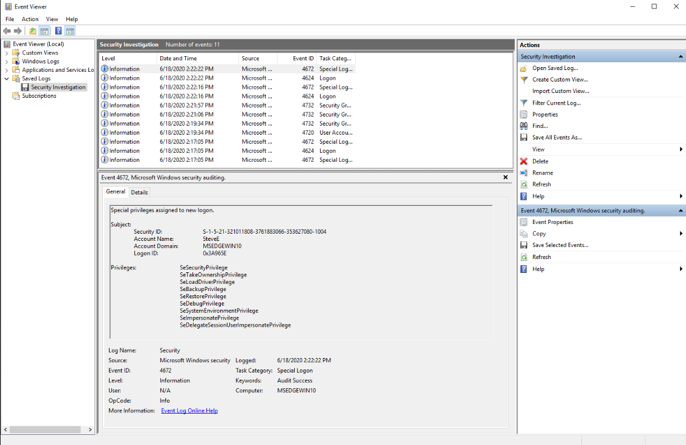
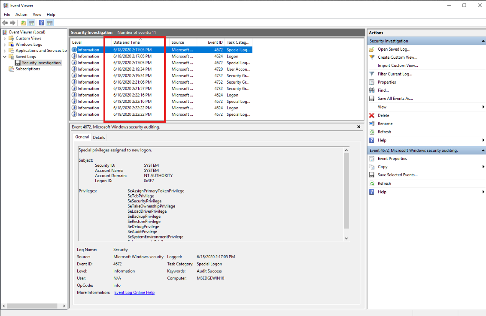
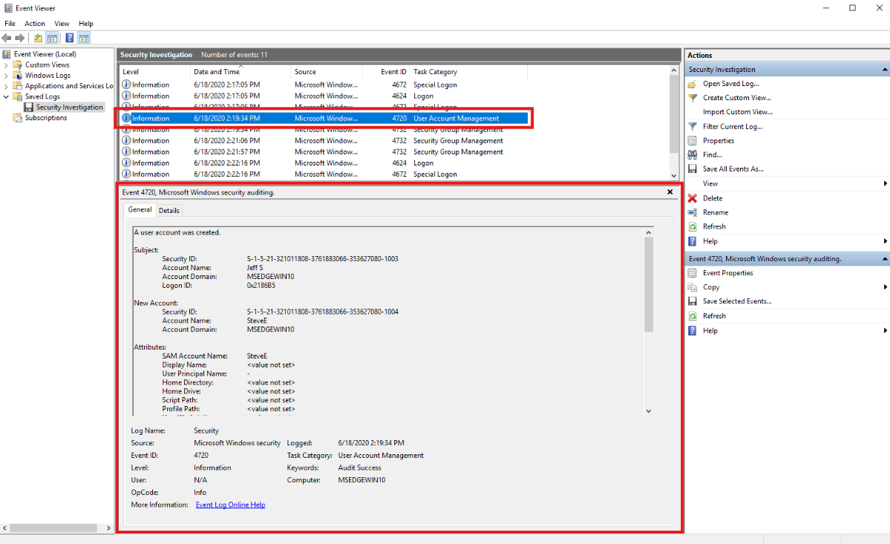
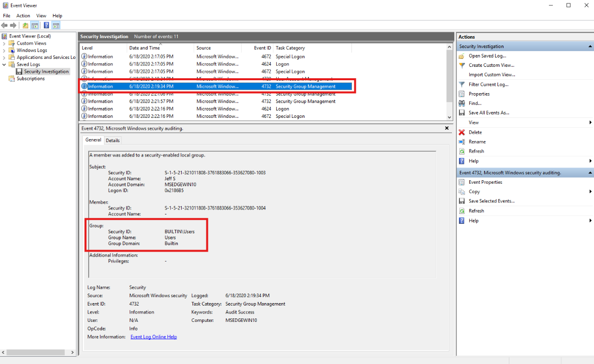
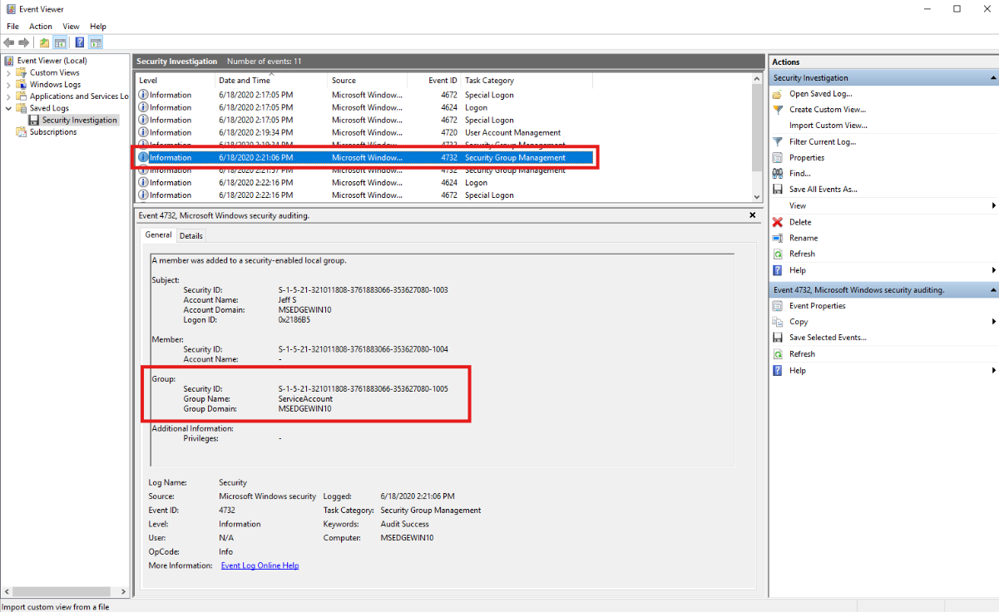
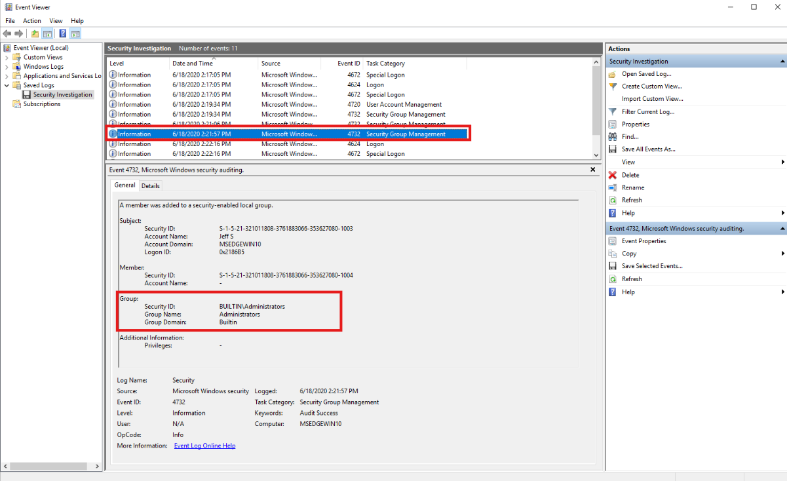
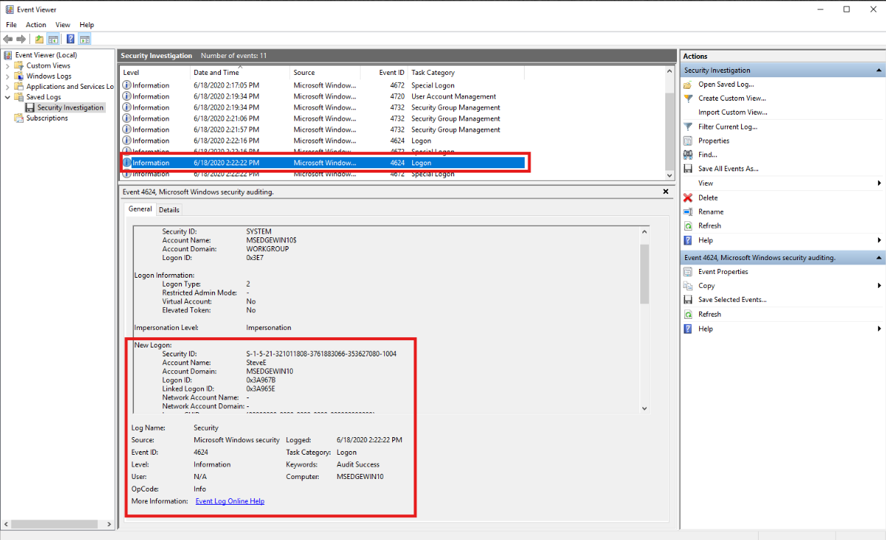

# Newly Provisioned Privileged Account Investigation (Windows Security Event Log Analysis)

### Executive Summary

This investigation analyzes anomalous administrative account activity identified through Windows Security Event Log monitoring. The organization recently implemented monitoring for Windows event logs and observed that the administrator account for employee **Jeff S** was logging in outside expected working hours. Jeff is contracted to work only from **9 AM to 4 PM on weekdays**, yet monitoring identified activity occurring outside that expected window, including activity that may have occurred when the employee was not expected to be working.

Analysis of the provided Windows Security Event Log export (`Security Investigation.evtx`) identified account management and authentication activity associated with Jeff’s account. The event sequence shows that **Jeff created a new user account named `SteveE`**, added the account to multiple security groups, including **Administrators**, and that the newly provisioned account later generated privileged logon activity. The investigation therefore shifted from a simple after-hours administrative logon review into an account provisioning and privilege assignment investigation.

The available log evidence supports the conclusion that a new privileged account was created and used shortly after creation. While the provided event log evidence does not independently prove malicious intent, the activity is suspicious in context because it involves administrative account usage outside expected working hours, creation of a new account, assignment of elevated group membership, and subsequent privileged authentication.

> 👉 For a **description of the situation being investigated and what triggered this analysis**, see the **[Scenario Context](#scenario-context)** section below.

> 👉 For a **mapping of observed behavior to MITRE ATT&CK techniques**, see the **[MITRE ATT&CK Mapping](#mitre-attck-mapping)** section below.

> 👉 For a **detailed, step-by-step walkthrough of how this investigation was conducted — complete with screenshot placeholders**, see the **[Investigation Walkthrough](#investigation-walkthrough)** section below.

---

### Scenario Context

The organization recently implemented security monitoring for Windows event logs and began reviewing employee login behavior. After several days of monitoring, an anomaly was observed involving an administrator account.

The employee account acting strangely was: `Jeff S`. The organization provided the following business context:

- Jeff S is one of only four employees on the team.
- Jeff is only expected to work from: `9 AM - 4 PM, weekdays only`

Monitoring showed that an administrator account associated with Jeff was logging in at unusual times, including times outside his contracted work schedule and possible weekend activity when he was expected to be out of the office. The organization requested analysis of the Windows event logs collected from the system where the activity occurred. The evidence was provided as an exported Windows Security Event Log file that could be opened in Event Viewer on a Windows system.

This investigation was therefore triggered by:

```text
Administrative account logon anomaly
        ↓
Activity observed outside expected working hours
        ↓
Windows Security Event Log export provided for review
        ↓
Account activity, group membership, and logon events analyzed
```

The original concern was after-hours administrative login behavior. However, the log evidence revealed additional account management activity, including creation of a new user account and assignment of privileged group membership.

---

### Incident Scope

This investigation analyzes a simulated identity and access incident involving anomalous Windows administrator activity captured in a Windows Security Event Log export.

The investigation focuses on the following questions:

- Was Jeff’s administrative account active during the reviewed period?
- Did Jeff perform any account management activity?
- Was a new account created?
- Was the new account assigned to security groups?
- Did the new account receive administrative privileges?
- Did the new account later authenticate successfully?
- Does the activity represent normal administration, suspicious account provisioning, or potential unauthorized access?

The scope of this investigation is limited to the evidence available in:

```text
Security Investigation.evtx
```

The investigation does not include endpoint process telemetry, PowerShell logs, Sysmon logs, network telemetry, domain controller logs beyond the provided export, user interviews, HR validation, or ticketing/change-management records.

Because of this, the investigation can confidently identify what activity was recorded in the Windows Security log, but cannot fully determine whether Jeff intentionally performed the actions, whether the account was compromised, or whether the changes were authorized without additional business validation.

The purpose of this investigation is to reconstruct the account activity timeline from Windows Security logs and identify suspicious identity and access behavior that would require follow-up in a real SOC environment.

The goal is to answer questions such as:

- What activity occurred in the Windows Security log?
- Which account performed the account creation action?
- What account was created?
- What groups was the new account added to?
- Did the new account receive administrative access?
- When did the new account log in?
- What defensive actions or follow-up steps would be appropriate?

This investigation mirrors a SOC workflow where an analyst receives an alert about unusual administrative activity and uses Windows Security Event Logs to validate what occurred.

---

### Environment, Evidence, and Tools

#### ▶ Environment
- Platform: Microsoft Windows
- Log source: Windows Security Event Log
- Analysis method: Offline review of exported `.evtx` file
- Investigation type: Identity and access activity investigation
- Primary activity reviewed:
  - administrative logon activity
  - account creation
  - security group membership changes
  - privileged logon events

#### ▶ Evidence Sources
- Exported Windows Security Event Log: `Security Investigation.evtx`

- Event categories reviewed:
  - Logon / Logoff
  - Special Logon
  - User Account Management
  - Security Group Management

#### ▶ Tools Used
- **Event Viewer** — Opened and reviewed the exported EVTX file.
- **Filter Current Log** — Isolated specific Event IDs for focused analysis.
- **Event Properties / General tab** — Reviewed human-readable event details.
- **Date and Time sorting** — Reconstructed event sequence chronologically.

<blockquote>
Analyst Note: Windows Event Viewer is the viewing tool used to inspect logs. It is not the same thing as the Windows Event Log service. The Windows Event Log service records and manages event data, while Event Viewer allows analysts to open, filter, and review those events. In a real SOC environment, these same Windows Security events may be forwarded into a SIEM such as Splunk, Microsoft Sentinel, Elastic, or QRadar.
</blockquote>

---

### Investigative Questions

The following questions guided the investigation and defined the analytical pivots taken during evidence review:

- Did the provided Windows Security Event Log contain evidence of privileged administrative activity?
- What was the first Special Logon event in the timeline?
- Did Jeff perform account management activity after the suspicious administrative logon behavior?
- Was a new user account created?
- What was the name of the newly created account?
- What Windows Event ID records user account creation?
- Was the newly created account added to any security groups?
- Was the newly created account added to the Administrators group?
- Did the newly created account authenticate after being created and assigned privileges?
- What does the sequence of events suggest about the account lifecycle?

These questions were designed to move from initial alert validation into account activity reconstruction.

---

### Investigation Timeline

The following timeline summarizes the key events observed in the Windows Security Event Log. Timestamps are presented in chronological order based on the event list visible in Event Viewer.

- **T0 — Privileged logon activity observed:**  
  A `4672` Special Logon event was identified near the beginning of the available timeline, indicating that an account received special privileges during logon.

- **T1 — User account creation identified:**  
  Event ID `4720` showed that Jeff created a new user account named `SteveE`.

- **T2 — New account added to standard user group:**  
  Event ID `4732` showed that SteveE was added to the `Users` group.

- **T3 — New account added to service-related group:**  
  Event ID `4732` showed that SteveE was added to the `ServiceAccount` group.

- **T4 — New account added to administrative group:**  
  Event ID `4732` showed that SteveE was added to the `Administrators` group.

- **T5 — New account authenticated:**  
  Event IDs `4624` and `4672` showed that SteveE later logged in and received privileged logon rights.

| Phase | Activity |
|------|----------|
| Initial Alert | Monitoring identified unusual administrator logon activity involving Jeff S outside expected work hours. |
| Evidence Review | `Security Investigation.evtx` was opened in Event Viewer and sorted chronologically. |
| Privileged Authentication | Event ID `4672` showed privileged logon activity. |
| Account Creation | Event ID `4720` showed Jeff created the account `SteveE`. |
| Privilege Assignment | Event ID `4732` showed SteveE was added to `Users`, `ServiceAccount`, and `Administrators`. |
| Account Usage | Event IDs `4624` and `4672` showed SteveE authenticated and received special privileges. |
| Investigation Outcome | The activity represents suspicious account provisioning and privileged account usage requiring validation and response. |

---

### Investigation Walkthrough

<blockquote>
<details>
<summary><strong>📚 Walkthrough navigation (click to expand)</strong></summary>

- [1) Initial Alert Review: Administrative Logon Anomaly](#-1-initial-alert-review-administrative-logon-anomaly)
- [2) Evidence Preparation: Loading the Windows Security Event Log](#-2-evidence-preparation-loading-the-windows-security-event-log)
- [3) Timeline Establishment: Chronological Event Review](#-3-timeline-establishment-chronological-event-review)
- [4) Privileged Authentication Review: Special Logon Events](#-4-privileged-authentication-review-special-logon-events)
  - [4.1) Why Special Logon Events Matter](#-41-why-special-logon-events-matter)
  - [4.2) Why 4624 and 4672 Are Often Reviewed Together](#-42-why-4624-and-4672-are-often-reviewed-together)
- [5) Account Creation Analysis: Event ID 4720](#-5-account-creation-analysis-event-id-4720)
  - [5.1) Understanding Subject vs New Account Fields](#-51-understanding-subject-vs-new-account-fields)
  - [5.2) Why Account Creation Matters](#-52-why-account-creation-matters)
- [6) Security Group Membership Analysis: Event ID 4732](#-6-security-group-membership-analysis-event-id-4732)
  - [6.1) Why Security Group Membership Matters](#-61-why-security-group-membership-matters)
  - [6.2) Why Administrators Membership Is Significant](#-62-why-administrators-membership-is-significant)
- [7) Account Usage Validation: Successful and Special Logon Review](#-7-account-usage-validation-successful-and-special-logon-review)
  - [7.1) Why Account Usage Was Reviewed After Group Assignment](#-71-why-account-usage-was-reviewed-after-group-assignment)
- [8) Account Lifecycle Reconstruction and Case Interpretation](#-8-account-lifecycle-reconstruction-and-case-interpretation)
  - [8.1) What the Evidence Proves](#-81-what-the-evidence-proves)
  - [8.2) What the Evidence Does Not Prove Alone](#-82-what-the-evidence-does-not-prove-alone)

</details>
</blockquote>

This section reconstructs the observed activity step-by-step using Windows Security Event Log evidence. The walkthrough follows the investigation from the initial administrative logon anomaly through account creation, group membership assignment, and privileged account usage.

**Note:** Each section is collapsible. Click the ▶ arrow to expand and view the detailed steps.

<a id="-1-initial-alert-review-administrative-logon-anomaly"></a>

<details>
<summary><strong>▶ 1) Initial Alert Review: Administrative Logon Anomaly</strong><br>
 → framing the investigation around unusual administrator account activity outside expected working hours.
</summary><br>

**Goal:** Understand what triggered the investigation and define what the analyst needs to validate using Windows Security logs.

The investigation began with a reported monitoring anomaly. The organization had recently implemented security monitoring for Windows event logs and observed unusual activity involving an administrator account.

The account of concern was associated with:

```text
Jeff S
```

The business context provided by the organization was important because security logs are not interpreted in isolation. A logon may be technically successful, but still suspicious if it occurs outside expected behavior.

The organization stated that Jeff is only expected to work:

```text
9 AM - 4 PM on weekdays
```

However, monitoring identified administrative logon activity at unusual times, including times when Jeff was expected to be out of the office.

This made the activity suspicious because administrator accounts have elevated access and can make changes that affect system security, identity management, and access control.

<blockquote>
Why this matters:

An after-hours logon by a normal user may require review, but an after-hours logon by an administrator account requires higher scrutiny. Administrative accounts can create users, modify groups, change permissions, disable controls, or perform actions that may establish persistence. The investigation therefore needed to determine not only whether Jeff logged in, but also what actions occurred around the suspicious logon activity.
</blockquote>

The initial investigative focus was:

```text
Was Jeff's administrator account used outside expected hours, and if so, what actions were performed?
```

As the Windows Security logs were reviewed, the investigation shifted from a logon-only review to a broader identity and access investigation because account creation and privilege assignment activity were identified.

</details>

<a id="-2-evidence-preparation-loading-the-windows-security-event-log"></a>

<details>
<summary><strong>▶ 2) Evidence Preparation: Loading the Windows Security Event Log</strong><br>
 → opening the exported EVTX file in Event Viewer and preparing the log for review.
</summary><br>

**Goal:** Load the provided Windows Security Event Log export so events can be reviewed, filtered, and correlated.

The evidence was provided as an exported Windows Event Log file:

```text
Security Investigation.evtx
```

The file was located inside a Desktop folder named:

```text
Event Log Analysis
```

The `.evtx` file was opened using Event Viewer by double-clicking the exported log file.

<p align="left">
  <br>
  <em>Figure 1 - Event Log Analysis folder containing Security Investigation.evtx, the exported Windows Security log used as evidence.</em>
</p>

After opening the file, Event Viewer loaded the saved event log under the Saved Logs section.

> **Analyst Note:**
> The provided `Security Investigation.evtx` file automatically opens as a saved Windows Event Log within Event Viewer. Because the log was exported beforehand, there is no need to navigate to **Windows Logs → Security** or create a custom filter to access the relevant events. Event Viewer loads the exported dataset directly, allowing analysis to begin immediately.
>
> In real-world investigations, analysts may either review live logs stored on a system or analyze exported `.evtx` files provided as evidence. In this lab, the exported log already contains the relevant Windows Security events, making it easier to focus on event analysis, filtering, correlation, and timeline reconstruction rather than log collection.


<blockquote>
What is an EVTX file?

EVTX is the native file format used by modern Windows Event Logs. These files store structured event records, including timestamps, Event IDs, providers, task categories, users, computers, and event-specific details. Unlike a plain text log, an EVTX file is best reviewed using tools that understand Windows event structure, such as Event Viewer, PowerShell, or specialized forensic tools.
</blockquote>

<blockquote>
Event Viewer vs Windows Event Log Service:

Event Viewer is the graphical tool used to inspect logs. The Windows Event Log service is the underlying Windows service responsible for managing event logging. This is similar to the difference between a SIEM dashboard and the endpoint that generated the logs. The viewer helps analysts inspect data; the log source records the activity.
</blockquote>

This investigation used Event Viewer because the evidence was provided as an exported `.evtx` file and the task was to inspect Windows Security events directly.

</details>

<a id="-3-timeline-establishment-chronological-event-review"></a>

<details>
<summary><strong>▶ 3) Timeline Establishment: Chronological Event Review</strong><br>
 → sorting the events by time to understand the order of activity.
</summary><br>

**Goal:** Establish the order of events before interpreting individual records.

After loading the event log, the first step was to review the events chronologically. Event Viewer may display the most recent events first by default, which can make the activity sequence harder to understand.

To correct this, the `Date and Time` column was clicked so that the oldest events appeared first.

<p align="left">
  <br>
  <em>Figure 2 - Event Viewer sorted by Date and Time to review the Windows Security events chronologically.</em>
</p>

Chronological review matters because event sequence changes interpretation.

For example:

```text
Account created
  ↓
Account added to Administrators
  ↓
Account logs in
```

is very different from:

```text
Account logs in
  ↓
Account added to Administrators later
```

In this case, the timeline showed account creation, group assignment, and later privileged logon activity in a sequence that supported account lifecycle reconstruction.

<blockquote>
Analyst Thought Process:

Before filtering for specific Event IDs, I wanted to understand the shape of the dataset. Since the log contained a small number of events, sorting chronologically provided an immediate high-level view of the activity. In a larger log export, I would still establish the timeline, but I would rely more heavily on Event ID filters or SIEM queries to reduce noise.
</blockquote>

</details>

<a id="-4-privileged-authentication-review-special-logon-events"></a>

<details>
<summary><strong>▶ 4) Privileged Authentication Review: Special Logon Events</strong><br>
 → identifying administrative logon sessions using Event ID 4672.
</summary><br>

**Goal:** Identify privileged authentication activity and determine when elevated logon sessions occurred.

After sorting the timeline, the earliest notable event was a Special Logon event:

```text
4672 - Special Logon
```

Event ID `4672` is generated when special privileges are assigned to a new logon session. This often occurs when an account with administrative privileges logs in.

To isolate these events, Event Viewer was filtered using:

```text
4672
```

##### 🔷 4.1) Why Special Logon Events Matter

A Special Logon event indicates that a session received elevated rights. It does not automatically prove malicious activity, but it does show that the account involved had sensitive privileges.

Examples of privileges commonly associated with administrative activity include:

- ability to manage users,
- ability to change system settings,
- ability to access protected resources,
- ability to install or remove software,
- ability to modify security-related configuration.

Because the investigation was triggered by unusual administrator logon activity, Event ID `4672` was highly relevant.

> **Analyst Note: Understanding Special Logons, Logon Types, and Logon IDs**
>
> During this investigation, Event ID `4672` (**Special Logon**) was used to identify privileged authentication activity. However, a Special Logon event by itself does not tell us exactly how the authentication occurred. Event ID `4672` simply indicates that a logon session received elevated privileges, which is commonly seen when administrator accounts authenticate. To determine what type of logon actually occurred, analysts typically correlate the Special Logon event with the corresponding `4624` (**Successful Logon**) event. The `4624` event contains a **Logon Type** field that provides additional context about how the session was established.
>
> Understanding the Logon Type is important because not every authentication event represents a user physically sitting at a keyboard. Depending on the Logon Type, the activity may represent an interactive user logon, a network authentication, a scheduled task, a service account starting a service, a workstation unlock, or a remote desktop session. For example, a privileged logon generated by a service account may appear very different from a privileged logon generated by an administrator connecting through Remote Desktop Protocol (RDP). Without reviewing the Logon Type, it can be difficult to accurately interpret the significance of a Special Logon event.
>
> Analysts also review the **Logon ID** field when correlating authentication activity. A Logon ID functions as a unique identifier for a specific Windows logon session and allows multiple events to be linked together. For example, a `4624` Successful Logon event and a subsequent `4672` Special Logon event that share the same Logon ID are typically associated with the same authentication session. In larger investigations, Logon IDs are commonly used to correlate authentication events, privilege assignments, process creation events, network activity, and other Windows artifacts into a single timeline. This helps analysts understand not only that a privileged logon occurred, but also how the session was established and what activity was performed after authentication.


##### 🔷 4.2) Why 4624 and 4672 Are Often Reviewed Together

A common Windows authentication sequence for an administrator account is:

```text
4624 - Successful Logon
4672 - Special Logon
```

The `4624` event records that Windows created a successful logon session.

The `4672` event records that special privileges were assigned to that session.

This distinction is important because a successful logon event alone does not explain whether the account received elevated privileges.

<blockquote>
A Windows logon event does not always mean a human physically typed a password at a keyboard. Windows creates logon sessions for interactive users, network access, services, scheduled tasks, remote desktop sessions, and other authentication contexts. That is why analysts review the Event ID, Logon Type, account name, source, timestamp, and surrounding events together.
</blockquote>


</details>

<a id="-5-account-creation-analysis-event-id-4720"></a>

<details>
<summary><strong>▶ 5) Account Creation Analysis: Event ID 4720</strong><br>
 → identifying the new account created during the suspicious activity window.
</summary><br>

**Goal:** Determine whether account management activity occurred and identify the actor and target account.

Following the privileged logon review, the timeline showed a User Account Management event:

```text
4720 - User Account Created
```

This event indicated that a new user account was created.

<p align="left">
  <br>
  <em>Figure 3 - Event ID 4720 showing user account creation activity in the Windows Security log.</em>
</p>

The event details showed that the account performing the action was:

```text
Jeff
```

The new account created was:

```text
SteveE
```

This was a major pivot point in the investigation. The original alert involved unusual administrative logon activity, but the logs showed that the administrator account was not only logging in — it was also creating a new account.

##### 🔷 5.1) Understanding Subject vs New Account Fields

Windows Security events often separate the actor from the object being acted upon.

For Event ID `4720`:

- The `Subject` section identifies who performed the action.
- The `New Account` section identifies the account that was created.

In this case:

| Field Area | Meaning | Value |
|---|---|---|
| Subject | Account that performed the action | `Jeff` |
| New Account | Account that was created | `SteveE` |

This distinction matters because without understanding the field structure, it is easy to confuse the account performing the action with the account affected by the action.

##### 🔷 5.2) Why Account Creation Matters

Account creation is significant during investigations because a newly created account can be used for persistence or unauthorized access.

In real incidents, attackers may create new accounts to:

- maintain access after stolen credentials are reset,
- avoid using the originally compromised account,
- blend in with normal administrative activity,
- create a backup access path,
- assign themselves elevated privileges.

Event ID `4720` alone does not prove attacker activity. However, when account creation occurs during suspicious administrative activity and is followed by privileged group assignment, it becomes much more important.

</details>

<a id="-6-security-group-membership-analysis-event-id-4732"></a>

<details>
<summary><strong>▶ 6) Security Group Membership Analysis: Event ID 4732</strong><br>
 → determining what access was assigned to the newly created account.
</summary><br>

**Goal:** Identify which security groups the newly created account was added to and determine whether elevated access was granted.

After identifying the new account `SteveE`, the investigation pivoted to Security Group Management events.

Windows records the following event when a member is added to a security-enabled local group:

```text
4732 - A member was added to a security-enabled local group
```

Multiple `4732` events were observed after the account creation event.

The first group membership event showed SteveE being added to:

```text
Users
```

<p align="left">
  <br>
  <em>Figure 4 - Event ID 4732 showing SteveE added to the Users group.</em>
</p>

The second group membership event showed SteveE being added to:

```text
ServiceAccount
```

<p align="left">
  <br>
  <em>Figure 5 - Event ID 4732 showing SteveE added to the ServiceAccount group.</em>
</p>

The third group membership event showed SteveE being added to:

```text
Administrators
```

<p align="left">
  <br>
  <em>Figure 6 - Event ID 4732 showing SteveE added to the Administrators group.</em>
</p>

The groups identified were:

```text
Administrators
ServiceAccount
Users
```

##### 🔷 6.1) Why Security Group Membership Matters

Group membership controls what an account can access and what actions it can perform.

A newly created account with no sensitive group membership may be less urgent. A newly created account added to privileged groups is much more concerning because it may have administrative capability.

Security group membership changes are therefore critical in identity and access investigations.

##### 🔷 6.2) Why Administrators Membership Is Significant

The most important group identified was:

```text
Administrators
```

Membership in the Administrators group can allow an account to perform elevated actions on the system, such as:

- modifying system configuration,
- managing local users and groups,
- installing software,
- disabling security tools,
- accessing protected files,
- creating or modifying additional accounts.

This finding explains why later logon activity involving SteveE generated a Special Logon event.

<blockquote>
Analyst Thought Process:

At this stage, the investigation became more serious. The issue was no longer only that Jeff logged in at unusual times. The logs showed that Jeff created a new account and then assigned that account administrative rights. That sequence is suspicious enough to require validation against approved change records or direct confirmation from the business.
</blockquote>

</details>

<a id="-7-account-usage-validation-successful-and-special-logon-review"></a>

<details>
<summary><strong>▶ 7) Account Usage Validation: Successful and Special Logon Review</strong><br>
 → determining whether the newly created privileged account was actually used.
</summary><br>

**Goal:** Validate whether SteveE authenticated after creation and privilege assignment.

After confirming that `SteveE` had been added to multiple security groups, including `Administrators` (Event ID `4732`), the next step was to determine whether the newly provisioned account had actually been used. To validate account activity, I reviewed successful logon (`4624`) and Special Logon (`4672`) events involving `SteveE`. This allowed me to determine whether the account was only created and assigned privileges, or if it subsequently authenticated and received elevated privileges.

To answer this, authentication events were reviewed using:

```text
4624,4672
```

<p align="left">
  <br>
  <em>Figure 7 - Event IDs 4624 and 4672 to identify successful and privileged logon activity for SteveE.</em>
</p>

Review of the filtered events identified a Special Logon involving:

```text
SteveE
```

The event details showed that SteveE received special privileges during logon.

##### 🔷 7.1) Why Account Usage Was Reviewed After Group Assignment

Account creation and privilege assignment show that access was provisioned.

Authentication activity shows that the access was used.

This distinction matters because:

```text
Created account
```

does not necessarily mean:

```text
Account was used
```

Likewise:

```text
Added to Administrators
```

does not necessarily mean:

```text
Administrative session occurred
```

In this case, the logs showed that SteveE did authenticate after being created and added to privileged groups.

That makes the activity more significant.

</details>

<a id="-8-account-lifecycle-reconstruction-and-case-interpretation"></a>

<details>
<summary><strong>▶ 8) Account Lifecycle Reconstruction and Case Interpretation</strong><br>
 → correlating all evidence into a single investigative conclusion.
</summary><br>

**Goal:** Reconstruct the full sequence of observed identity and access activity.

After reviewing the relevant events, the activity sequence was reconstructed as follows:

```text
1. Administrative / privileged logon activity was present.
2. Jeff created a new account named SteveE.
3. SteveE was added to Users.
4. SteveE was added to ServiceAccount.
5. SteveE was added to Administrators.
6. SteveE later authenticated and received special privileges.
```

This sequence shows a complete account provisioning and usage lifecycle.

##### 🔷 8.1) What the Evidence Proves

The Windows Security Event Log proves that:

- A new account named `SteveE` was created.
- The account creation event was performed by `Jeff`.
- SteveE was added to multiple security groups.
- SteveE was added to the `Administrators` group.
- SteveE later generated privileged logon activity.

These are evidence-backed findings from the provided event log.

##### 🔷 8.2) What the Evidence Does Not Prove Alone

The provided evidence does not prove by itself that:

- Jeff’s account was compromised,
- Jeff intentionally created the account maliciously,
- SteveE was used by an attacker,
- the activity was unauthorized,
- the activity occurred on a domain controller or standalone endpoint unless validated by the environment,
- additional systems were affected.

Those conclusions would require additional evidence, such as:

- user confirmation,
- change ticket review,
- endpoint process logs,
- command execution logs,
- domain controller logs,
- SIEM correlation,
- source IP / workstation validation,
- account disablement history,
- HR schedule validation.

<blockquote>
Final Analyst Interpretation:

The activity is suspicious because it began as an after-hours administrative logon anomaly and led to evidence of new account creation, group membership assignment, administrative privilege assignment, and privileged account usage. In a real SOC environment, this would justify escalation for validation, containment review, and identity access investigation.
</blockquote>

</details>

---

### Findings Summary

This section summarizes the high-confidence conclusions derived from the Windows Security Event Log analysis. Only verified findings within the available evidence scope are included.

- Windows Security Event Log monitoring identified anomalous administrative activity involving Jeff S outside the expected work schedule.
- The provided evidence file `Security Investigation.evtx` was opened and analyzed using Event Viewer.
- Event ID `4672` confirmed privileged logon activity within the available timeline.
- Event ID `4720` showed that Jeff created a new account named `SteveE`.
- Event ID `4732` showed that SteveE was added to multiple security groups.
- The groups identified were `Administrators`, `ServiceAccount`, and `Users`.
- SteveE’s membership in the `Administrators` group indicates elevated local privileges.
- Event IDs `4624` and `4672` confirmed that SteveE later authenticated and received special privileges.
- The event sequence supports suspicious account provisioning and privileged account usage requiring follow-up validation.

**Detailed Evidence Reference:**  
For a full artifact-level breakdown of logs, Event IDs, screenshots, and supporting evidence, see: **`detection-artifact-report.md`**

---

### Defensive Takeaways

This section highlights key patterns and behaviors observed during the investigation that are relevant to defenders and security operations teams.

- After-hours administrative logons should be reviewed carefully, especially when they are followed by account management activity.
- Windows Event ID `4720` is important for detecting new user account creation.
- Windows Event ID `4732` is important for detecting group membership changes.
- Newly created accounts added to privileged groups should generate high-priority alerts.
- Event IDs `4624` and `4672` should be correlated to identify successful privileged logon activity.
- Account creation, privilege assignment, and account usage should be reviewed as a sequence rather than as isolated events.
- Business context, such as expected working hours and employee schedules, improves detection quality.
- Windows Event Viewer analysis translates directly to SIEM-based detection logic.

---

### Artifacts Identified

This section documents notable artifacts uncovered during the investigation that support the final determination.

- Evidence file reviewed: `Security Investigation.evtx`
- Account originally under review: `Jeff S`
- Account that performed account creation: `Jeff`
- Newly created account: `SteveE`
- Account creation Event ID: `4720`
- Group membership Event ID: `4732`
- Groups assigned to SteveE:
  - `Administrators`
  - `ServiceAccount`
  - `Users`
- Successful logon Event ID reviewed: `4624`
- Special Logon Event ID reviewed: `4672`
- Primary tool used: Event Viewer

**Detailed Evidence Reference:**  
For a full artifact-level breakdown of logs, Event IDs, screenshots, and supporting evidence, see: **`detection-artifact-report.md`**

---

### Detection and Hardening Opportunities

This section summarizes high-level detection and hardening opportunities observed during the investigation. For detailed, actionable recommendations — including specific logging gaps, detection logic ideas, and configuration improvements — see: **`detection-and-hardening-recommendations.md`**

#### ▶ Containment Actions (Recommended)

These actions focus on immediately limiting risk if the account activity cannot be validated as authorized.

- Validate whether Jeff performed the account creation and group assignment activity.
- Disable or suspend the newly created account `SteveE` until ownership and business purpose are confirmed.
- Review the `Administrators` group membership and remove unauthorized members.
- Reset Jeff’s password if account compromise is suspected.
- Invalidate active sessions associated with Jeff and SteveE if supported by the environment.
- Review recent logons for both Jeff and SteveE across the environment.
- Escalate to identity/security administration for access validation.

#### ▶ Eradication & Hardening Recommendations

These steps address weaknesses that allow suspicious account provisioning activity to go unnoticed.

- Require documented approval for creation of new administrative or service-related accounts.
- Enforce least privilege for administrator accounts.
- Separate daily-use accounts from privileged administrative accounts.
- Limit who can create accounts and modify administrative group membership.
- Require MFA for administrative accounts where applicable.
- Implement privileged access management controls for administrator activity.
- Review and reduce standing administrative privileges.

#### ▶ Detection & Monitoring Recommendations

These detections focus on early identification of suspicious identity and access activity.

- Alert on Event ID `4720` when new accounts are created outside business hours.
- Alert on Event ID `4732` when accounts are added to `Administrators`.
- Correlate Event ID `4720` followed by Event ID `4732` within a short timeframe.
- Correlate account creation followed by successful logon from the newly created account.
- Alert when administrator accounts log in outside expected working hours.
- Monitor for new accounts added to service-related groups.
- Review Event ID `4672` for unusual privileged logon activity.
- Baseline normal administrative activity by user, system, and time of day.

#### ▶ Response Validation & Follow-Up (Optional)

- Confirm whether a valid change ticket exists for SteveE account creation.
- Interview or validate with Jeff S whether the activity was expected.
- Determine whether SteveE has an assigned business owner.
- Review whether SteveE accessed files, services, or remote systems after logon.
- Review endpoint telemetry for commands or processes executed during the relevant time window.
- Search SIEM logs for additional activity involving SteveE.
- Monitor for repeated account creation or group membership changes from Jeff’s account.

---

### MITRE ATT&CK Mapping

This section provides a high-level summary of observed ATT&CK tactics and techniques. For evidence-backed mappings tied to specific artifacts, timestamps, and investigation steps, see: **`mitre-attack-mapping.md`**

The following mappings connect observed behaviors to MITRE ATT&CK techniques. Mappings are based on directly observed activity within the Windows Security Event Log and are scoped to the evidence available in this investigation.

#### ▶ Persistence

(1) Create Account: Local Account (T1136.001)
- A new account named `SteveE` was created by Jeff, as recorded by Windows Security Event ID `4720`. Creation of a new local or system account can provide continued access if unauthorized.

#### ▶ Privilege Escalation

(1) Account Manipulation (T1098)
- The newly created account was added to multiple security groups, including `Administrators`, as recorded by Event ID `4732`. Modifying group membership can grant elevated privileges to an account.

#### ▶ Defense Evasion

(1) Valid Accounts (T1078)
- The activity involved use of legitimate Windows accounts and standard account management operations. If unauthorized, this would allow activity to appear administrative rather than malware-driven.

#### ▶ Initial Access / Credential Access Context

(1) Valid Accounts (T1078)
- The investigation began because Jeff’s administrator account was observed logging in outside expected working hours. The available evidence does not prove compromise, but the use of an existing administrator account is consistent with activity that would require valid credentials.

#### ▶ Discovery / Operational Follow-on

(1) Account Discovery (T1087)
- While direct account discovery commands were not observed in the provided evidence, the creation and use of accounts suggests identity and access activity that should be correlated with additional telemetry if available.

---

### MITRE ATT&CK Mapping (Table View)

This section provides a high-level summary table of observed ATT&CK tactics and techniques. For evidence-backed mappings tied to specific artifacts, timestamps, and investigation steps, see: **`mitre-attack-mapping.md`**

| Tactic | Technique | Description |
|------|-----------|-------------|
| Persistence | **Create Account: Local Account (T1136.001)** | Event ID `4720` showed that a new account named `SteveE` was created. If unauthorized, newly created accounts can provide continued access. |
| Privilege Escalation | **Account Manipulation (T1098)** | Event ID `4732` showed that SteveE was added to multiple security groups, including `Administrators`, granting elevated privileges. |
| Defense Evasion | **Valid Accounts (T1078)** | The activity used legitimate Windows account mechanisms rather than malware artifacts, potentially allowing suspicious activity to blend in with normal administration. |
| Initial Access / Credential Context | **Valid Accounts (T1078)** | The case began with unusual administrative logon behavior involving Jeff’s account. The log evidence does not prove compromise, but use of an existing administrator account requires credential validation. |
| Discovery / Follow-on Review | **Account Discovery (T1087)** | Direct discovery commands were not observed, but identity-related activity should be correlated with additional endpoint and SIEM telemetry if available. |

**Note:** This section provides a high-level summary of observed ATT&CK tactics and techniques. For evidence-backed mappings tied to specific artifacts, timestamps, and investigation steps, see: **`mitre-attack-mapping.md`**

---
