# Business Email Compromise (BEC) Investigation (Malicious Mailbox Rule Abuse and Account Compromise)

### Executive Summary

This investigation reconstructs a Business Email Compromise incident involving the abuse of a compromised executive mailbox to authorize fraudulent pension withdrawals. Analysis of email artifacts, Azure Active Directory audit logs, and mailbox configuration changes confirms credential-based account compromise rather than malware-driven intrusion. The attacker leveraged inbox rules and folder manipulation to conceal financial correspondence, enabling unauthorized transactions to be approved before detection.

> 👉 For a **description of the situation being investigated and what triggered this analysis**, see the **[Scenario Context](#scenario-context)** section below.

> 👉 For a **mapping of observed behavior to MITRE ATT&CK techniques**, see the **[MITRE ATT&CK](#mitre-attck-mapping)** section below

> 👉 For a **detailed, step-by-step walkthrough of how this investigation was conducted — complete with screenshots**, see the **[Investigation Walkthrough](#investigation-walkthrough)** section below.

---

### Scenario Context

A suspected Business Email Compromise (BEC) incident was identified after multiple pension withdrawals were processed and approved using an executive’s authority, despite the transfers ultimately benefiting external bank accounts. The organization suspected account compromise (not endpoint malware) because the activity appeared “legitimate” from a workflow perspective—approvals were issued from the executive mailbox and aligned with normal finance communication patterns.

The investigation was triggered by the detection of fraudulent pension-related transactions and focused on determining how the executive mailbox was abused to enable and conceal the fraud. Email artifacts, Azure AD sign-in and audit telemetry, and Exchange mailbox configuration changes were analyzed to confirm credential-based access and identify concealment mechanisms—specifically malicious inbox rules and folder manipulation used to suppress or redirect financial correspondence (e.g., withdrawal-related messages) long enough for unauthorized approvals to occur.

---

### Incident Scope

This investigation analyzes a simulated **Business Email Compromise (BEC)** incident involving unauthorized yet seemingly legitimate financial transactions originating from a company pension fund account.

Over a 48-hour period, multiple authorized bank transfers were processed and approved, moving large sums of money from the pension account to several external bank accounts. Because the transactions appeared legitimate and were approved by an executive account, the organization suspects **account compromise rather than malware-driven intrusion**.

The purpose of this investigation is to reconstruct attacker activity using **Azure Active Directory audit logs and email artifacts** in order to understand how the compromise occurred, how it was abused, and what evidence would be available to defenders in a real-world scenario.


The goal is to answer questions such as:

- How did the attacker gain initial access?
- How was the compromised mailbox used to enable fraud?
- What indicators of compromise are visible in logs?
- What detection opportunities exist for future prevention?

This investigation mirrors a **post-incident SOC workflow**, where analysis is performed after suspicious financial activity has already been identified.

---

### Environment, Evidence, and Tools

#### ▶ Environment
- Identity Platform: Azure Active Directory (Microsoft Entra ID)
- Email Platform: Microsoft Exchange Online (Microsoft 365)
- Scope: Single compromised executive mailbox (BEC scenario)

#### ▶ Evidence Sources
- Email artifacts (content + full headers)
- Azure AD Sign-in telemetry (successful logins / source IPs)
- Azure AD Audit Logs (mailbox configuration changes)
- Inbox rule creation/modification events (e.g., New-InboxRule)
- Mailbox folder manipulation events (e.g., FolderCreated)

#### ▶ Tools Used
- Thunderbird – Reviewed preserved email messages and headers offline
- Azure Portal – Reviewed sign-ins and audit activity
- VS Code – Searched and inspected exported audit log CSV/JSON
- PowerShell – Parsed audit exports (e.g., Select-String) to extract rule parameters and timelines


<blockquote>
Analyst Note: Unlike malware-driven intrusions, BEC incidents often leave no endpoint artifacts. Identity, authentication, and email audit logs therefore become the primary sources of evidence when reconstructing attacker activity.
</blockquote>

---

### Investigative Questions

The following questions guided the investigation and defined the analytical pivots taken during evidence review. Each question was designed to determine whether the observed activity represented a legitimate user action or a deliberate attempt to conceal or manipulate financial communications within the mailbox.

- Was the mailbox accessed by an unauthorized actor during the investigated timeframe?
- Were inbox rules created or modified in a way that suppressed, redirected, or deleted financial-related emails?
- What specific conditions or keywords were used within the inbox rules, and what behaviors did those rules enforce?
- Did audit and sign-in telemetry indicate persistence or continued access following rule creation?
- Was there evidence suggesting intent to evade detection by the legitimate mailbox owner?

---

### Investigation Timeline

The following timeline summarizes key events and investigative milestones relevant to the suspected business email compromise. Timestamps are presented in chronological order to provide context for mailbox access, rule creation, and subsequent activity.

- T0 — Initial mailbox access observed:
Authentication activity was identified for the affected mailbox from an unfamiliar source within the investigation timeframe, prompting further review of audit and sign-in logs.

- T1 — Inbox rule creation detected:
Audit telemetry recorded the creation of new inbox rules shortly after the suspicious login activity. The rules contained conditions targeting financial-related keywords and actions designed to move or delete matching emails.

- T2 — Rule behavior and configuration validated:
Inbox rule parameters were examined to confirm their scope, conditions, and actions, including suppression of emails containing withdrawal-related content.

- T3 — Post-rule access reviewed:
Additional sign-in and audit events were analyzed to determine whether continued access or persistence occurred following rule creation.

- T4 — Investigation conclusion reached:
Based on correlated authentication and mailbox activity, the incident was classified as a business email compromise involving malicious inbox rule abuse.


| Phase | Activity |
|------|----------|
| Initial Access | A phishing email was delivered to the organization, initiating contact under the guise of a trusted third party. |
| Account Compromise | Stolen credentials were used to successfully authenticate to an executive mailbox within the Microsoft 365 tenant. |
| Persistence | The attacker created a custom inbox folder and configured inbox rules to control email flow and maintain access. |
| Impact | Fraudulent pension withdrawal transactions were authorized using the compromised executive account. |
| Concealment | Inbox rules automatically moved or deleted financial correspondence to suppress visibility and delay detection. |


---

### Investigation Walkthrough

<blockquote>
<details>
<summary><strong>📚 Walkthrough navigation (click to expand)</strong></summary>

- [1) Initial Access Analysis: Email Artifact Review](#-1-initial-access-analysis-email-artifact-review)
- [2) Determining Investigation Approach](#-2-determining-investigation-approach)
- [3) Identifying the Initial Phishing Email](#-3-identifying-the-initial-phishing-email)
- [4) Extracting Sender Information from Message Headers (Artifact Identified)](#-4-extracting-sender-information-from-message-headers-artifact-identified)
  - [4.1) Why This Is Relevant to Initial Access](#-41-why-this-is-relevant-to-initial-access)
- [5) Compromise Classification: Determining the Type of Attack](#-5-compromise-classification-determining-the-type-of-attack)
  - [5.1) Why Incident Classification Is Important](#-51-why-incident-classification-is-important)
- [6) Post-Compromise Activity: Authentication Source via Azure Sign-In Logs](#-6-post-compromise-activity-authentication-source-via-azure-sign-in-logs)
  - [6.1) Why Authentication Logs Were Reviewed](#-61-why-authentication-logs-were-reviewed)
  - [6.2) Investigation Approach](#-62-investigation-approach)
- [7) Identifying Threat Actor IP Addresses](#-7-identifying-threat-actor-ip-addresses)
  - [7.1) Excluded IP Addresses (Non-Threat Actor)](#-71-excluded-ip-addresses-non-threat-actor)
  - [7.2) Why this step matters](#-72-why-this-step-matters)
- [8) Financial Impact: Identifying the Destination Bank](#-8-financial-impact-identifying-the-destination-bank)
  - [8.1) Why Email Evidence Was Reviewed for Financial Attribution](#-81-why-email-evidence-was-reviewed-for-financial-attribution)
  - [8.2) Investigation Methodology](#-82-investigation-methodology)
  - [8.3) Identifying the Destination Bank](#-83-identifying-the-destination-bank)
- [9) Mailbox Manipulation: Inbox Folder Creation](#-9-mailbox-manipulation-inbox-folder-creation)
  - [9.1) Why this step matters](#-91-why-this-step-matters)
  - [9.2) Investigation Approach](#-92-investigation-approach)
  - [9.3) Identifying The Folder Created](#-93-identifying-the-folder-created)
  - [9.4) Why These Findings Matter](#-94-why-these-findings-matter)
- [10) Identifying the Inbox Rule Keyword](#-10-identifying-the-inbox-rule-keyword)
  - [10.1) How the Rule Configuration Was Interpreted](#-101-how-the-rule-configuration-was-interpreted)
  - [10.2) Why This Confirms Attackers Intent](#-102-why-this-confirms-attackers-intent)
  - [10.3) Why This Matters](#-103-why-this-matters)

</details>
</blockquote>

#### ▶ 1) Initial Access Analysis: Email Artifact Review

To identify the initial access vector in this Business Email Compromise investigation, analysis began with a review of the email artifacts provided as part of the evidence set. In BEC incidents, phishing and social engineering are the primary mechanisms used to establish trust and initiate fraudulent activity, making email content the most reliable source for understanding how the incident began.

Because phishing occurs before authentication, this phase of the investigation focused on examining the emails themselves rather than identity or audit telemetry, which only captures activity after access has already been obtained.

<blockquote>
Why Email Artifacts Were Reviewed First

Although Azure Active Directory audit logs were provided as part of the evidence set, those logs primarily capture post-authentication activity, such as sign-ins, mailbox configuration changes, and administrative operations. They do not reliably record the original sender information, message headers, or SMTP metadata required to identify the source of a phishing email. As a result, the investigation began by reviewing the email artifacts, which represent what the user actually received and interacted with prior to account compromise. Business Email Compromise attacks almost always begin with phishing. Identifying the sender address allows the investigation to establish a clear initial access point and define the earliest point in the attack timeline.
</blockquote>

#### ▶ 2) Determining Investigation Approach

The provided email artifacts were reviewed using Thunderbird, a desktop email client commonly used in forensic investigations to analyze preserved email messages in a controlled, offline manner. Thunderbird functions as a log viewing and analysis platform, allowing inspection of message content, timestamps, and full headers without altering the underlying evidence.

To identify the initial malicious contact, the following approach was taken:

- Reviewed all provided emails in chronological order
- Distinguished between initial contact messages and follow-on replies (Re:)
- Identified the earliest email introducing financial approval context
- Examined full message headers to extract authoritative sender information

This approach ensured that analysis was based on the original email evidence rather than inferred or secondary data sources.

#### ▶ 3) Identifying the Initial Phishing Email

Each email was assessed to determine whether it represented an initial external contact or part of an ongoing conversation. Emails prefixed with “Re:” were treated as follow-on correspondence rather than the initial access vector.

The email titled “PensionApproval” was identified as part of an existing reply chain and therefore not the initial phishing message. However, reviewing this message provided important context for understanding how legitimacy was established and how financial approval processes were communicated to the victim.

<p align="left">
  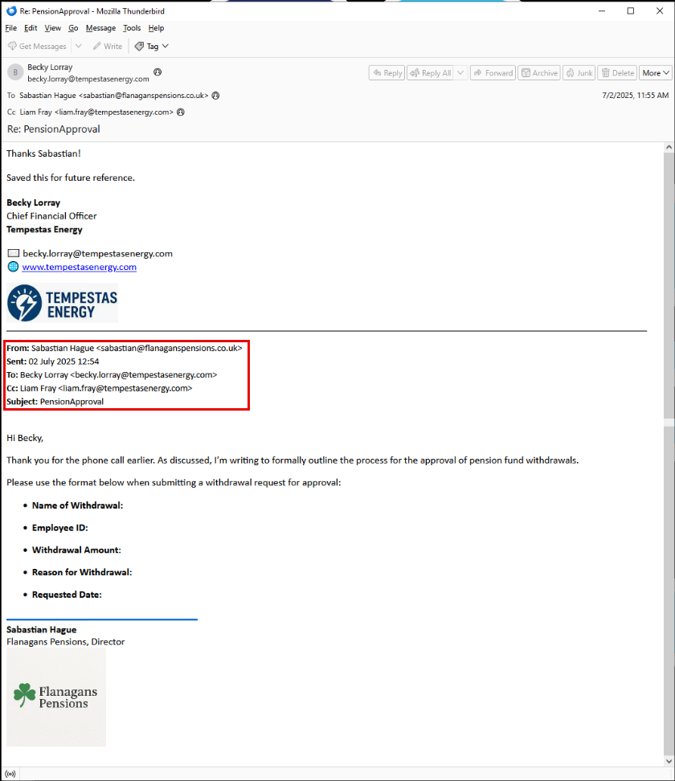<br>
  <em>Figure 1</em>
</p>

#### ▶ 4) Extracting Sender Information from Message Headers (Artifact Identified)
- [🔷 4.1) Why This Is Relevant to Initial Access](https://github.com/ahnpj/incident-response-and-investigations/edit/main/identity-and-email-compromise-investigations/business-email-compromise-mailbox-rule-abuse-investigation/investigation-walkthrough.md#-41-why-this-is-relevant-to-initial-access)

Full message headers were reviewed within Thunderbird to identify the sender associated with the financial approval communication. Header analysis revealed the following details:

- From: `Sabastian Hague <sabastian@flanaganspensions.co.uk>`
- Sent: `02 July 2025`
- To: `becky.lorray@tempestasenergy.com`
- Cc: `liam.fray@tempestasenergy.com`

The sender domain (`flanaganspensions.co.uk`) appears to represent a legitimate pension services provider, which aligns with common BEC tactics. Attackers frequently impersonate trusted third parties involved in financial workflows in order to bypass suspicion and prompt action from executives.

The email content reinforces this assessment by formally outlining a pension fund withdrawal approval process, lending credibility to subsequent financial requests.

##### 🔷 4.1) Why This Is Relevant to Initial Access

Identifying the external sender and understanding the context of the financial communication establishes the earliest observable attacker interaction in the incident timeline. This step clarifies how trust was established, provides a foundation for reconstructing subsequent activity, and supports detection opportunities related to external financial correspondence.

With the initial access context established through email analysis, the investigation can now transition to identity telemetry to examine authenticated activity performed after the compromise.

#### ▶ 5) Compromise Classification: Determining the Type of Attack

- [🔷 5.1) Why Incident Classification Is Important](https://github.com/ahnpj/incident-response-and-investigations/edit/main/identity-and-email-compromise-investigations/business-email-compromise-mailbox-rule-abuse-investigation/investigation-walkthrough.md#why-incident-classification-is-important)

Based on the evidence reviewed to this point, the incident was classified as Business Email Compromise (BEC).

The activity observed involves social engineering, impersonation of a trusted external party, and abuse of legitimate financial approval workflows. There is no indication of malware delivery, exploit-based access, or endpoint compromise. Instead, the incident centers on deception and trust abuse to authorize fraudulent transactions, which is characteristic of BEC activity.

This classification aligns with the broader incident scenario and provides the appropriate context for examining post-compromise behavior using Azure Active Directory audit logs.

##### 🔷 5.1) Why Incident Classification Is Important

Early and accurate incident classification ensures that investigative and response efforts focus on the correct data sources and threat behaviors. In this case, identifying the activity as Business Email Compromise shifts analysis away from endpoint forensics and toward identity telemetry, mailbox configuration changes, and financial process abuse.

Establishing the correct incident type provides a structured foundation for the remainder of the investigation and reduces the risk of misdirected analysis or missed evidence.

#### ▶ 6) Post-Compromise Activity: Authentication Source via Azure Sign-In Logs

- [🔷 6.1) Why Authentication Logs Were Reviewed](https://github.com/ahnpj/incident-response-and-investigations/edit/main/identity-and-email-compromise-investigations/business-email-compromise-mailbox-rule-abuse-investigation/investigation-walkthrough.md#why-authentication-logs-were-reviewed)
- [🔷 6.2) Investigation Approach](https://github.com/ahnpj/incident-response-and-investigations/edit/main/identity-and-email-compromise-investigations/business-email-compromise-mailbox-rule-abuse-investigation/investigation-walkthrough.md#investigation-approach)

With the incident classified as Business Email Compromise, the investigation shifted focus to identifying how the compromised account was accessed after initial contact. In BEC incidents, attackers rely on valid credentials to authenticate to cloud services, making identity telemetry the most reliable source for reconstructing post-compromise activity.

Because mailbox manipulation and financial approvals can only occur after successful authentication, this phase of the investigation focused on Azure Active Directory sign-in activity.

##### 🔷 6.1) Why Authentication Logs Were Reviewed

Authentication logs provide the authoritative record of how and from where an account was accessed. Unlike email artifacts, which describe attacker communication and social engineering tactics, authentication telemetry reveals the infrastructure used to establish and maintain access to the victim’s account.

Although this investigation did not include a dedicated Azure AD Sign-In Logs export, successful authentication events were identifiable within the provided Azure audit log export. In this dataset, interactive login activity is recorded as `UserLoggedIn` operations, with the source IP address embedded within the event’s audit data. These events serve as the closest available equivalent to sign-in logs for reconstructing attacker access.


##### 🔷 6.2) Investigation Approach

The Azure audit log export (`azure-export-audit-dir.csv`) was opened in Visual Studio Code to allow efficient searching and inspection of individual events containing nested JSON data. Because the file contains a mixture of mailbox operations, compliance activity, and identity-related events, the analysis first required scoping results to the compromised account.

To isolate authentication activity tied specifically to the victim, a search was performed for login events associated with Becky’s account. This was done by searching for the following string within the file:

```css
UserLoggedIn,becky.lorray@tempestasenergy.com
```

<p align="left">
  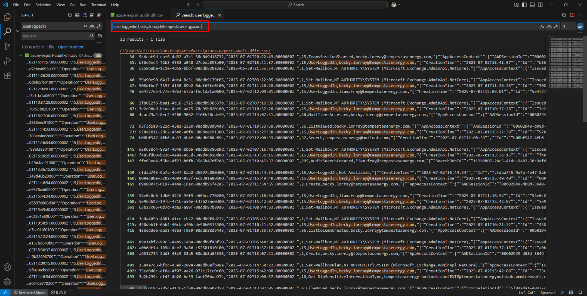<br>
  <em>Figure 2</em>
</p>

Although the fraudulent emails appeared to originate from sabastian@flanaganspensions.co.uk, log analysis focused on Becky Lorray’s account because Business Email Compromise attacks target the victim’s internal account, not the impersonated external sender. The attacker’s goal was to abuse Becky Lorray’s authority as Chief Financial Officer to approve and process financial transactions. Azure Active Directory audit logs only record authentication and mailbox activity for internal tenant accounts, meaning no usable log data exists for the external impersonated address.

<blockquote>
If Becky’s account had not been compromised or abused, there would be no mechanism to authorize the withdrawal. The attacker sent emails to Becky to establish trust and initiate the workflow, but control was ultimately exercised through her internal account, which is why investigative log analysis centered on her activity rather than the external sender.
</blockquote>

This approach ensured that only successful login events for the compromised account were reviewed, excluding activity generated by other users (such as Liam) as well as background system and service operations.

Each matching `UserLoggedIn` event was then reviewed individually. For every event, the embedded audit data was examined to locate the `ClientIP` field, which records the source IP address associated with that authentication session. Because the export does not expose IP addresses as a standalone column, this step required manually inspecting the JSON payload within each event.


#### ▶ 7) Identifying Threat Actor IP Addresses
- [🔷 7.1) Excluded IP Addresses (Non-Threat Actor)](https://github.com/ahnpj/incident-response-and-investigations/edit/main/identity-and-email-compromise-investigations/business-email-compromise-mailbox-rule-abuse-investigation/investigation-walkthrough.md#-71-excluded-ip-addresses-non-threat-actor)
- [🔷 7.2) Why this step matters](https://github.com/ahnpj/incident-response-and-investigations/edit/main/identity-and-email-compromise-investigations/business-email-compromise-mailbox-rule-abuse-investigation/investigation-walkthrough.md#-72-why-this-step-matters)

Review of Becky’s `UserLoggedIn` events revealed multiple IP addresses appearing across different audit records. However, not all IPs present in the audit data represent attacker-controlled infrastructure. In Azure audit logs, IP fields may also appear in events related to Exchange service activity, compliance scanning, or post-authentication mailbox operations.

To determine which IPs were actually utilized by the threat actor, only IP addresses associated with successful `UserLoggedIn` events for the compromised account were considered. IPs that appeared solely in non-authentication contexts. Such as mailbox access, search operations, or compliance-related activity were excluded from consideration.

Applying this criteria resulted in the identification of two external IP addresses that were used to authenticate into the compromised account during the incident window:

- `159.203.17.81`
- `95.181.232.30`

<p align="left">
  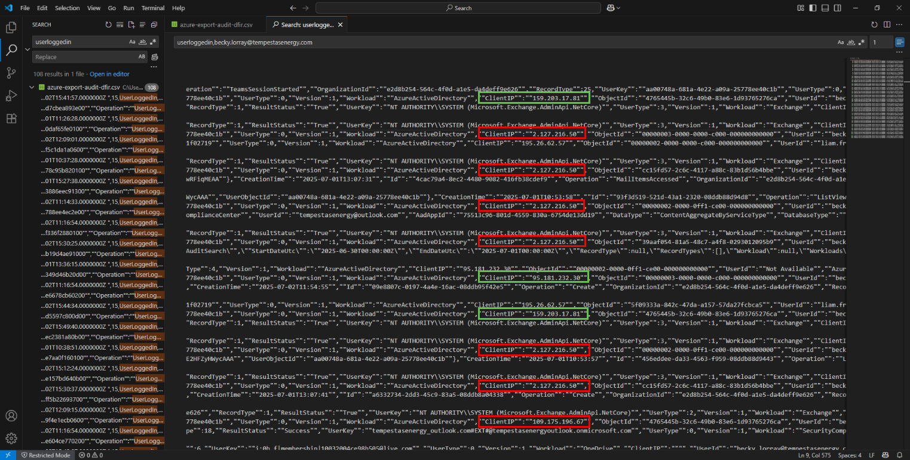<br>
  <em>Figure 3</em>
</p>

##### 🔷 7.1) Excluded IP Addresses (Non-Threat Actor)

Other IP addresses were observed within the Azure audit dataset, including `109.175.196.67` and `2.127.216.50`; however, these IPs were not associated with successful interactive authentication events for the compromised account. When reviewing audit records containing this IP, the corresponding `Operation` values reflected Exchange or service-mediated activity rather than `UserLoggedIn` events tied to `becky.lorray@tempestasenergy.com`. 

In contrast to the identified threat actor IPs, `109.175.196.67` did not appear as the `ClientIP` value within a successful `UserLoggedIn` operation for the compromised user. As a result, this IP was assessed as post-authentication or service-related activity and excluded from the set of threat actor authentication sources.

While several IP addresses appear within `UserLoggedIn` events for the compromised account, attribution requires evidence of sustained and purposeful use in furtherance of the compromise. IP addresses that lack repeated usage, mailbox interaction, or correlation with malicious activity are excluded to avoid false attribution. This approach ensures that only infrastructure demonstrably leveraged by the threat actor is identified.

**109.175.196.67 — Excluded**

- Although this IP address is associated with a successful `UserLoggedIn` event for the compromised account, it appears only once during the investigation window and is not followed by any mailbox interaction, search activity, or configuration changes. No Exchange workload operations such as `MailItemsAccessed`, `Search`, or mailbox modification events are temporally correlated with this login. The absence of follow-on activity indicates that this IP was not materially utilized by the threat actor to conduct or sustain the compromise and is therefore excluded.
- Unlike confirmed threat actor IP addresses, which demonstrate repeated authentication followed by mailbox interaction and operational activity, `109.175.196.67` is limited to a single authentication event with no observable impact on mailbox or financial workflows. This distinction supports its exclusion despite superficial similarity at the log field level.

**2.127.216.50 — Excluded**

- The IP address `2.127.216.50 appears multiple times within authentication telemetry; however, its usage pattern does not align with attacker-controlled activity. While successful logins are present, this IP is not consistently associated with mailbox access, search operations, or persistence-related actions during the compromise window. The lack of sustained, purpose-driven activity suggests that this address represents transient or incidental access rather than infrastructure actively used by the threat actor.


##### 🔷 7.2) Why this step matters

- In Business Email Compromise investigations, authentication activity is often the most concrete technical artifact available for attributing attacker behavior. Identifying the IP addresses used to log into the compromised account allows subsequent mailbox manipulation, persistence mechanisms, and financial actions to be correlated back to attacker-controlled sessions.
- Establishing attacker authentication sources also provides valuable indicators for scoping impact, validating transaction timelines, and supporting future detection and response efforts. With the authentication infrastructure identified, the investigation proceeded to assess the financial impact of the compromise.


#### ▶ 8) Financial Impact: Identifying the Destination Bank

- [🔷 8.1) Why Email Evidence Was Reviewed for Financial Attribution](https://github.com/ahnpj/incident-response-and-investigations/edit/main/identity-and-email-compromise-investigations/business-email-compromise-mailbox-rule-abuse-investigation/investigation-walkthrough.md#-81-why-email-evidence-was-reviewed-for-financial-attribution)
- [🔷 8.2) Investigation Methodology](https://github.com/ahnpj/incident-response-and-investigations/edit/main/identity-and-email-compromise-investigations/business-email-compromise-mailbox-rule-abuse-investigation/investigation-walkthrough.md#-82-investigation-methodology)
- [🔷 8.3) Identifying the Destination Bank](https://github.com/ahnpj/incident-response-and-investigations/edit/main/identity-and-email-compromise-investigations/business-email-compromise-mailbox-rule-abuse-investigation/investigation-walkthrough.md#-83-identifying-the-destination-bank)

With authenticated access to the compromised mailbox confirmed, the investigation next focused on identifying the financial institution to which fraudulent transactions were directed. In Business Email Compromise incidents, attackers often leverage legitimate business processes and trusted third parties to redirect funds, making transaction-related communications a critical source of evidence.

Because the investigation scenario indicates that unauthorized but approved transfers occurred, email artifacts were reviewed to determine where funds were ultimately sent.


##### 🔷 8.1) Why Email Evidence Was Reviewed for Financial Attribution

While Azure audit logs are effective for identifying authentication events and mailbox manipulation, they do not contain details about external financial institutions or payment destinations. Information such as bank names, account references, and approval context is typically communicated directly through email during financial workflows.

As a result, identifying the destination bank required examining the content of the emails involved in the pension withdrawal and approval process rather than relying solely on identity telemetry.

##### 🔷 8.2) Investigation Methodology

To determine the destination bank, I returned to the provided email artifacts and reviewed them using Thunderbird. The analysis focused on emails associated with pension fund withdrawals and approval discussions, as these messages were most likely to reference payment instructions or banking partners.

Specifically, I:

- Opened all emails related to pension fund withdrawals and approvals
- Reviewed message bodies for references to financial institutions
- Identified formal communications outlining withdrawal processes
- Looked for consistent naming of a bank or pension provider involved in fund handling

This approach ensured that the bank attribution was based on explicit evidence communicated during the transaction process rather than assumptions.

##### 🔷 8.3) Identifying the Destination Bank

To determine the destination of the fraudulent international transfer, the withdrawal email titled “20250702-Withdrawal-Bernard” was reviewed. This message contains the banking metadata required to identify the receiving financial institution.

The email specifies the following information:

- SWIFT/BIC: `FBNINGLA`
- Account Number: `3025819476`

SWIFT/BIC codes uniquely identify financial institutions by their registered legal entity names rather than informal or marketing names. The SWIFT/BIC code `FBNINGLA` corresponds to First Bank of Nigeria Plc, where “Plc” denotes the bank’s status as a Public Limited Company.

Accurately identifying the legal entity is critical in financial fraud investigations, as recovery efforts and regulatory reporting rely on the formally registered name of the receiving institution.

<p align="left">
  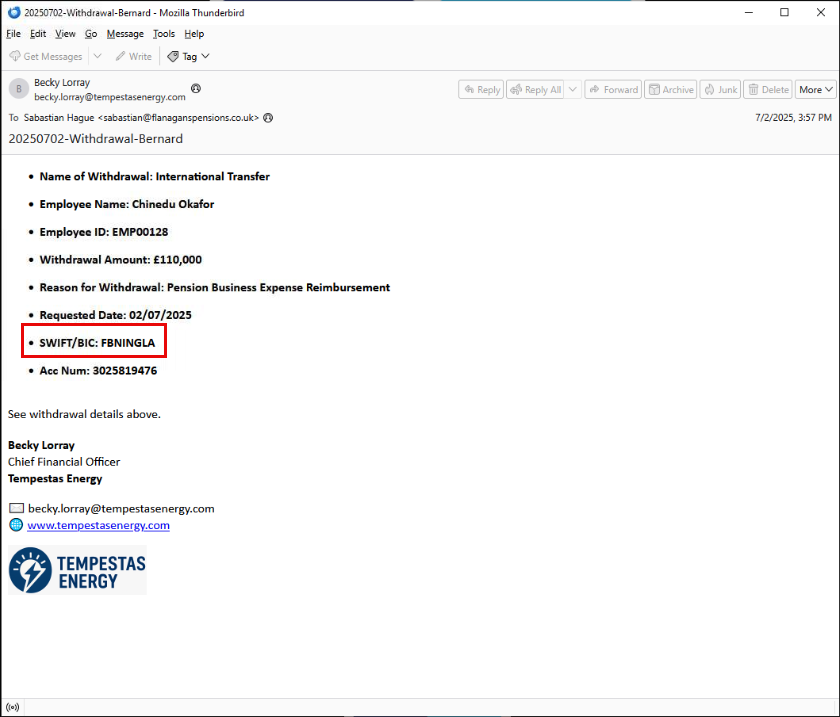<br>
  <em>Figure 4</em>
</p>


#### ▶ 9) Mailbox Manipulation: Inbox Folder Creation
- [🔷 9.1) Why this step matters](https://github.com/ahnpj/incident-response-and-investigations/edit/main/identity-and-email-compromise-investigations/business-email-compromise-mailbox-rule-abuse-investigation/investigation-walkthrough.md#-91-why-this-step-matters)
- [🔷 9.2) Investigation Approach](https://github.com/ahnpj/incident-response-and-investigations/edit/main/identity-and-email-compromise-investigations/business-email-compromise-mailbox-rule-abuse-investigation/investigation-walkthrough.md#-92-investigation-approach)
- [🔷 9.3) Identifying The Folder Created](https://github.com/ahnpj/incident-response-and-investigations/edit/main/identity-and-email-compromise-investigations/business-email-compromise-mailbox-rule-abuse-investigation/investigation-walkthrough.md#-93-identifying-the-folder-created)
- [🔷 9.4) Why These Findings Matter](https://github.com/ahnpj/incident-response-and-investigations/edit/main/identity-and-email-compromise-investigations/business-email-compromise-mailbox-rule-abuse-investigation/investigation-walkthrough.md#-94-why-these-findings-matter)

Following confirmation of unauthorized authentication activity, the investigation examined mailbox configuration changes to identify attempts by the threat actor to conceal fraudulent communications. In Business Email Compromise incidents, attackers frequently manipulate mailbox structure to hide financial emails, approval requests, or replies that could expose the fraud.

##### 🔷 9.1) Why this step matters

Following confirmation of unauthorized authentication activity, the investigation examined mailbox configuration changes to identify attempts by the threat actor to conceal fraudulent communications. In Business Email Compromise incidents, attackers commonly manipulate mailbox structure to hide financial emails, approvals, or replies that could alert the victim or other stakeholders.

##### 🔷 9.2) Investigation Approach

To identify mailbox manipulation activity, the Azure audit log export was reviewed for events associated with mailbox configuration changes following the initial compromise window.

Specifically, I:

- Opened the Azure audit log export in Visual Studio Code
- Searched for mailbox-related operations associated with folder creation
- Scoped results to the compromised account (becky.lorray@tempestasenergy.com)
- Reviewed event timestamps to ensure activity occurred after confirmed attacker authentication
- Examined the audit data payload to extract the name of any newly created inbox folders

This approach ensured that only attacker-initiated mailbox changes were considered, excluding normal background or system-generated activity.

##### 🔷 9.3) Identifying The Folder Created

To identify inbox folder creation activity, the Azure audit log export (`azure-export-audit-dir.csv`) was opened in Visual Studio Code, which allowed efficient searching through individual audit events containing nested JSON data. The following steps were performed:

**(Step 1)** To identify mailbox manipulation activity, the Microsoft Entra ID (Azure AD) export was opened in VS Code and searched for the `FolderCreated` operation. This approach allowed folder creation events tied to Becky Lorray’s mailbox to be quickly identified and correlated with the compromise timeline. 

<p align="left">
  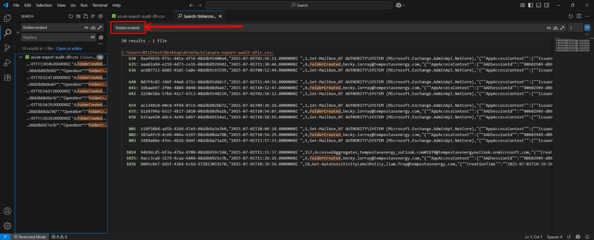<br>
  <em>Figure 5</em>
</p>

**(Step 2)** Scoped results to actions associated with the compromised account (becky.lorray@tempestasenergy.com). Because Business Email Compromise (BEC) relies on unauthorized access to a victim’s mailbox, all mailbox manipulation activity—including folder creation and inbox rule abuse must originate from the compromised user’s account, not the external sender used to initiate contact.

<p align="left">
  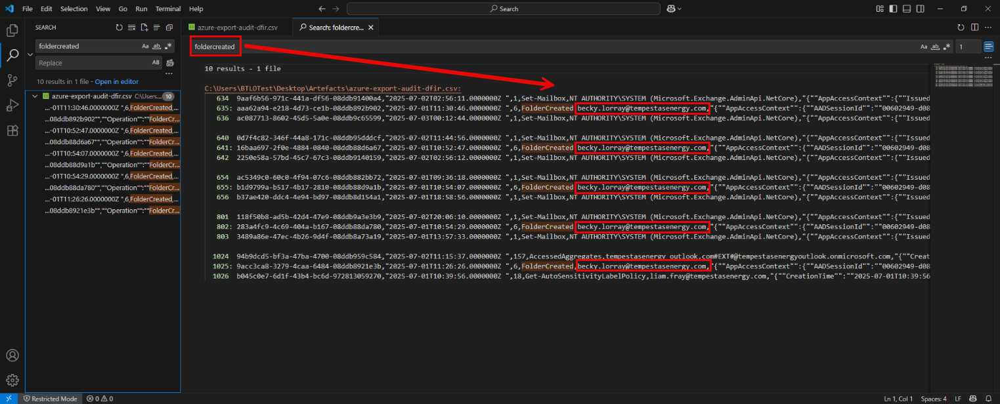<br>
  <em>Figure 6</em>
</p>

**(Step 3)** Reviewed event timestamps to ensure the activity occurred after confirmed attacker authentication.

<p align="left">
  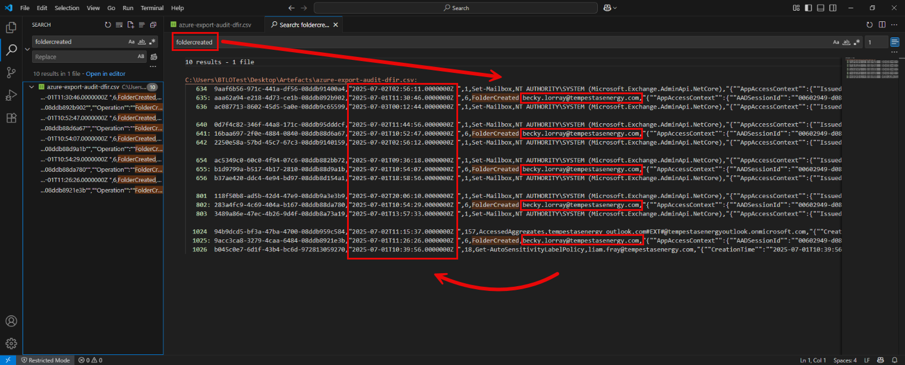<br>
  <em>Figure 7</em>
</p>

Event timestamps were reviewed to confirm that the folder creation activity occurred after successful authentication to the compromised account. The `FolderCreated` events associated with `becky.lorray@tempestasenergy.com` appear on `2025-07-01` and `2025-07-02`, which is subsequent to confirmed `UserLoggedIn` activity for the same account. This timing confirms that the mailbox modifications were performed during an active authenticated session rather than being system-generated or pre-existing configuration changes.

**(Step 4)** Inspected the audit data payload for fields indicating the name of the newly created folder

The audit data payloads for the `FolderCreated` events were inspected for fields indicating the name of the newly created folder. While folder creation activity was clearly observed, the audit records did not reliably expose a human-readable folder name within the FolderCreated event data itself.

At this point, the investigation pivoted to **inbox rule analysis** to identify how the newly created folder was being used.

**(Step 5)** Inspected the audit data for inbox rule abuse

After identifying folder creation activity, the investigation proceeded to examine inbox rules configured on the compromised mailbox. Inbox rules are frequently abused in BEC attacks to automatically filter, redirect, or delete emails containing specific keywords related to financial transactions or security alerts.

<blockquote>
Inbox rules allow attackers to maintain stealth by ensuring that critical emails never reach the victim’s inbox. Rules that inspect the subject or body of messages can be used to selectively suppress responses, confirmations, or warnings related to fraudulent transfers. Identifying the first rule created provides insight into the attacker’s initial concealment strategy.
</blockquote>

To identify mailbox inbox rule manipulation activity, the Azure AD audit log export was opened in VS Code and searched for the `inboxrule` operation. This approach allowed folder creation events tied to Becky Lorray’s mailbox to be quickly identified and correlated with the compromise timeline. 

<p align="left">
  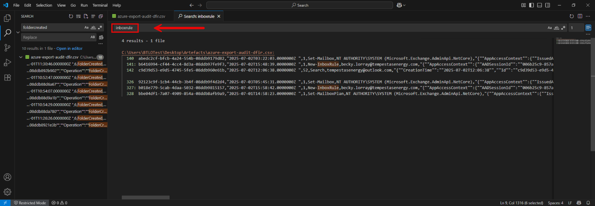<br>
  <em>Figure 8</em>
</p>

**(Step 6)** Identified the Folder Name via Inbox Rule Analysis

Because Microsoft 365 audit logs do not consistently include folder names in `FolderCreated` events, inbox rule activity was examined to determine how messages were being routed post-compromise.

<blockquote>
Inbox rules are commonly abused in BEC attacks to automatically move or delete emails containing financial or security-related keywords. When a rule moves messages into a specific folder, the destination folder name is explicitly recorded within the rule’s configuration.
</blockquote>

To identify this behavior, the audit log was searched for `New-InboxRule` operations associated with the compromised account. This was performed by searching the audit log for `New-InboxRule` and reviewing the associated rule parameters. Within the first `New-InboxRule` event tied to `becky.lorray@tempestasenergy.com`, the rule action `MoveToFolder` was observed with the following value:

```json
"Name":"MoveToFolder","Value":"History"
```

This field explicitly identifies the destination folder used by the attacker’s inbox rule. Because inbox rules reference existing folders by name, this confirms that the attacker created (or leveraged) an inbox folder named `History` to hide or divert targeted emails.

<blockquote>
The MoveToFolder parameter was specifically examined because inbox rules must explicitly reference a destination folder when moving messages. In Business Email Compromise attacks, this action is commonly used to divert or hide financial and approval-related emails, making the folder referenced by MoveToFolder the authoritative source for identifying the attacker-created inbox folder.
</blockquote>

Inbox folder created during the compromise: `History`

<p align="left">
  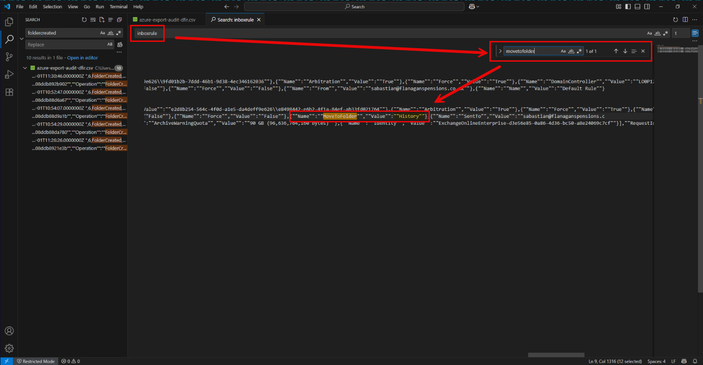<br>
  <em>Figure 9</em>
</p>

<blockquote>
This rule enabled the attacker to suppress transaction confirmations and financial correspondence, reducing the likelihood of detection.
</blockquote>

**(Step 7)** Confirmed via PowerShell

To validate this finding, the audit log was also analyzed using PowerShell to ensure consistency between GUI-based analysis and command-line parsing.

A PowerShell `Select-String` query was used to extract `New-InboxRul`e events from the audit export and review the associated rule parameters in chronological order.

<blockquote>
PowerShell was used to further analyze inbox rule activity by searching the Azure audit log export for rule creation events. The Select-String cmdlet was run against azure-export-audit-dfir.csv with the pattern New-InboxRule to isolate inbox rule creation entries. The results were expanded to display the full raw log lines, allowing the embedded rule configuration parameters to be examined. The output was then sorted and limited to identify the earliest rule created during the compromise window, which was reviewed to determine both the destination folder and the keyword used by the attacker.
</blockquote>

```powershell
Select-String -Path ".\azure-export-audit-dfir.csv" -Pattern "New-InboxRule" |
  Select-Object -ExpandProperty Line |
  Sort-Object |
  Select-Object -First 5
```

- `Select-String -Pattern "New-InboxRule"` – searches the audit log for inbox rule creation events
- `Select-Object -ExpandProperty Line` – outputs the full raw log entry for inspection
- `Sort-Object` – orders the results to assist with identifying the first rule created
- `Select-Object -First` – limits output to the earliest relevant entry

<p align="left">
  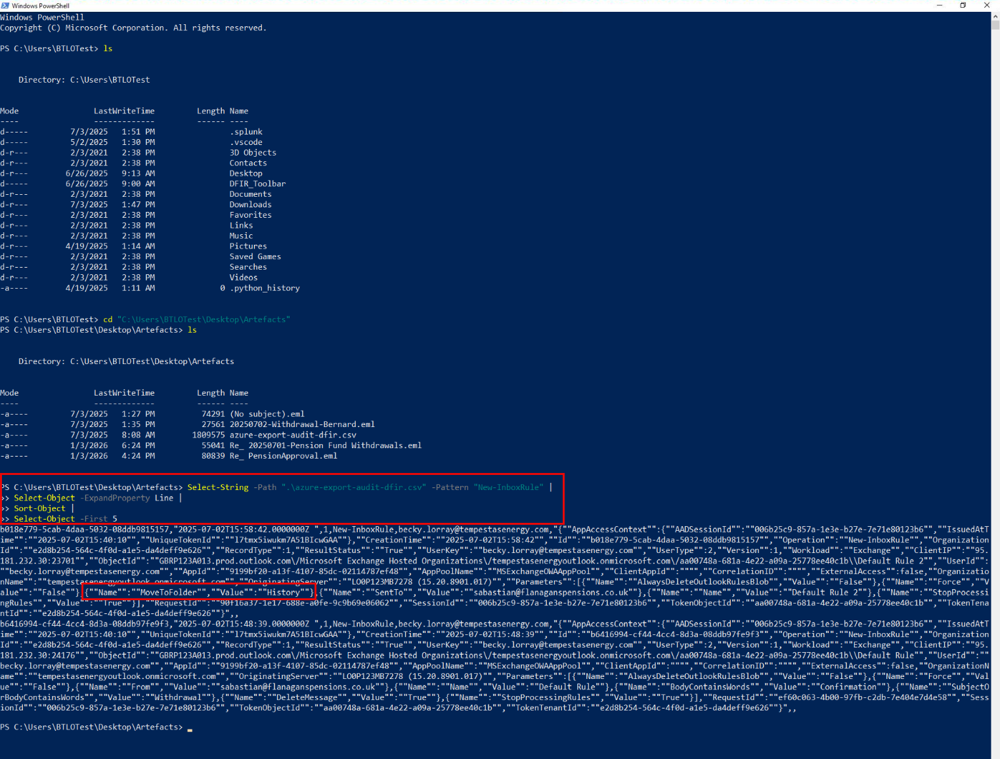<br>
  <em>Figure 10</em>
</p>

The PowerShell output confirmed that the first inbox rule created for the compromised mailbox contained a `MoveToFolder` action targeting the History folder, corroborating the findings from Visual Studio Code and confirming the attacker’s mailbox manipulation technique.

##### 🔷 9.4) Why These Findings Matter

The creation of a custom inbox folder combined with inbox rule abuse demonstrates deliberate mailbox manipulation intended to conceal fraudulent activity. By automatically moving or deleting emails related to financial transactions, the attacker reduced the likelihood that the victim or other stakeholders would notice unauthorized pension withdrawals. This behavior confirms post-compromise persistence and aligns with common concealment techniques observed in Business Email Compromise incidents.

---

#### ▶ 10) Identifying the Inbox Rule Keyword

- [🔷 10.1) How the Rule Configuration Was Interpreted](https://github.com/ahnpj/incident-response-and-investigations/edit/main/identity-and-email-compromise-investigations/business-email-compromise-mailbox-rule-abuse-investigation/investigation-walkthrough.md#-101-how-the-rule-configuration-was-interpreted)
- [🔷 10.2) Why This Confirms Attackers Intent](https://github.com/ahnpj/incident-response-and-investigations/edit/main/identity-and-email-compromise-investigations/business-email-compromise-mailbox-rule-abuse-investigation/investigation-walkthrough.md#-102-why-this-confirms-attackers-intent)
- [🔷 10.3) Why This Matters](https://github.com/ahnpj/incident-response-and-investigations/edit/main/identity-and-email-compromise-investigations/business-email-compromise-mailbox-rule-abuse-investigation/investigation-walkthrough.md#-102-why-this-matters)

After identifying that an inbox rule was created on the compromised mailbox, the next step was to determine what the rule was designed to look for before taking action. In Business Email Compromise incidents, attackers commonly configure inbox rules to scan incoming emails for specific keywords related to financial activity and automatically hide or delete them.

Because Microsoft 365 audit logs store inbox rule configuration details inside the rule creation event itself, the investigation focused on examining the first New-InboxRule audit entry associated with the compromised account.

<blockquote>
Why This Location Was Examined: Inbox rule logic is defined at the moment the rule is created. As a result, the New-InboxRule operation is the only audit event that reliably records the rule’s conditions and actions in a single place. Later mailbox activity does not repeat this configuration data.
</blockquote>

To locate this information, the Azure audit log export was parsed using the PowerShell extract used previously to display the first 5 inbox rule creation events and display their full raw contents for inspection.

Keyword targeted by the first inbox rule: `withdrawal`

<p align="left">
  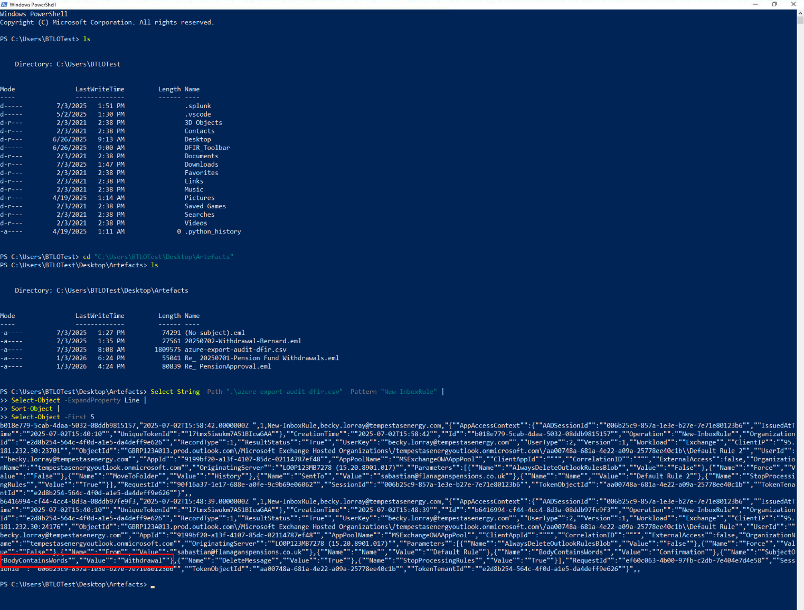<br>
  <em>Figure 11</em>
</p>

This keyword appears in the subject and body of multiple emails related to the pension transaction workflow. By filtering on the term `withdrawal`, the attacker ensured that confirmation messages, approval follow-ups, and bank-related correspondence tied to pension withdrawals would be automatically diverted or removed before reaching the victim’s inbox.

Targeting a high-risk financial keyword is a common Business Email Compromise technique. It allows the attacker to broadly suppress transaction-related communications while minimizing the chance that the victim notices missing or delayed emails during the approval process.

##### 🔷 10.1) How the Rule Configuration Was Interpreted

Within the `New-InboxRule` audit entry, rule logic is stored as a list of parameters, each defining either:

- What the rule checks for (conditions)
- What the rule does when those conditions are met (actions)

These parameters appear as name/value pairs inside the audit data. In this rule, the following fields are present:

(1) Condition field:

```json
"Name":"BodyContainsWords","Value":"withdrawal"
```

This defines the trigger condition. It instructs the rule to inspect the body of incoming emails and match messages containing the word “withdrawal”.

(2) Action field:

```json
"Name":"MoveToFolder","Value":"History"
```

This defines what happens when the condition is met. Emails matching the keyword are moved into a folder named History.

(3) Additional Action fields:

```json
"Name":"DeleteMessage","Value":"True"
"Name":"StopProcessingRules","Value":"True"
```

These settings indicate that matching emails may be deleted and that no additional inbox rules should be applied afterward. This combination is commonly used to ensure emails are fully suppressed and not recovered by subsequent rules.

##### 🔷 10.2) Why This Confirms Attackers Intent

The presence of a keyword-based condition targeting “withdrawal” confirms that the inbox rule was specifically designed to intercept financial correspondence. Rather than filtering all messages, the attacker selectively targeted emails related to pension withdrawals and financial approvals.

The combination of the following demonstrates deliberate mailbox manipulation intended to conceal fraudulent activity and delay detection:

- keyword matching (withdrawal)
- automated message handling (move/delete)
- rule processing suppression

##### 🔷 10.3) Why This Matters

Filtering on the word withdrawal demonstrates deliberate concealment of financial activity rather than opportunistic rule creation. This behavior confirms attacker intent to hide fraud-related communications and aligns with mailbox abuse patterns commonly observed in BEC incidents.

---

### Findings Summary

This section summarizes the high-confidence conclusions derived from correlated authentication, audit, and mailbox rule evidence. Only verified findings within the defined investigation scope are included.

- Unauthorized access to the affected Microsoft 365 mailbox was confirmed within the investigation timeframe based on authentication and audit telemetry.
- Malicious inbox rules were created following the suspicious access, specifically targeting financial-related content to suppress visibility to the legitimate mailbox owner.
- Rule configuration demonstrated deliberate intent to evade detection through message deletion, relocation, and conditional processing.
- The timing and sequencing of authentication events and rule creation indicate coordinated activity consistent with business email compromise behavior.
- No evidence of additional persistence mechanisms beyond mailbox rule abuse was identified within the scope of the investigation.

**Detailed Evidence Reference:**  
For a full, artifact-level breakdown of logs, alerts, and forensic indicators that support these findings — including where each artifact was identified during the investigation — see: **`detection-artifact-report.md`**

---

### Defensive Takeaways

This section highlights key patterns and behaviors observed during the investigation that are relevant to defenders and security operations teams. These takeaways focus on recognition and awareness rather than specific remediation actions.

- How BEC attacks operate without malware
- Why identity and audit logs are critical for email-based fraud
- How mailbox rule abuse enables long-term concealment
- How to reconstruct financial incidents using authentication telemetry

---

### Artifacts Identified

This section documents notable artifacts uncovered during the investigation that support the final determination. Artifacts listed here represent concrete evidence of malicious activity and may be referenced for validation or follow-up analysis.

- Inbox folder created/used during the compromise: `History`
- Inbox rule content condition: `withdrawal`
- Mailbox manipulation technique: Inbox rule configured to move emails into the `History` folder
- Supporting evidence: `FolderCreated` events, `New-InboxRule` audit entries, and PowerShell confirmation of rule parameters

**Detailed Evidence Reference:**  
For a full, artifact-level breakdown of logs, alerts, and forensic indicators that support these findings — including where each artifact was identified during the investigation — see: **`detection-artifact-report.md`**

---

### Detection and Hardening Opportunities

This section summarizes high-level detection and hardening opportunities observed during the investigation. For detailed, actionable recommendations — including specific logging gaps, detection logic ideas, and configuration improvements — see: **`detection-and-hardening-recommendations.md`**

#### ▶ Containment Actions (Recommended)
These actions focus on immediately limiting financial impact and preventing continued mailbox abuse.

- Immediately reset credentials for the compromised executive account and invalidate all active sessions.
- Disable or remove all malicious inbox rules identified during the investigation, including rules filtering on withdrawal- or finance-related keywords.
- Review mailbox audit logs for additional unauthorized actions, including folder creation, message deletion, or forwarding activity.
- Notify finance and legal teams of confirmed BEC activity to halt pending transactions and initiate recovery workflows.
- Temporarily restrict external access to the affected mailbox until remediation is complete.

#### ▶ Eradication & Hardening Recommendations
These steps address weaknesses exploited during the compromise and reduce recurrence risk.

- Enforce multi-factor authentication (MFA) for all executive, finance, and approval-authority accounts.
- Restrict inbox rule creation or apply conditional access policies requiring elevated authentication for mailbox configuration changes.
- Standardize mailbox auditing and retention to ensure rule creation and message movement events are always captured.
- Harden financial approval workflows by requiring out-of-band verification for high-risk or time-sensitive transactions.
- Train users to recognize third-party impersonation tactics commonly used in BEC campaigns.

#### ▶ Detection & Monitoring Recommendations
These detections focus on early identification of mailbox abuse and credential compromise.

- Alert on inbox rule creation events that move, delete, or hide messages containing financial or security-related keywords.
- Monitor for mailbox folder creation shortly after new authentication sessions.
- Alert on successful authentication from unfamiliar IP addresses or geolocations followed by mailbox configuration changes.
- Correlate mailbox rule creation with external email conversations involving financial requests.
- Monitor Azure AD audit logs for repeated `UserLoggedIn` activity tied to mailbox manipulation operations.

#### ▶ Response Validation & Follow-Up (Optional)
- Re-review mailbox audit logs after containment to confirm that no additional malicious inbox rules are created or modified.
- Validate that all previously identified malicious rules remain disabled or removed.
- Monitor authentication logs for the affected account to ensure no further successful logins occur from unfamiliar IP addresses or devices.
- Confirm that newly implemented alerts for mailbox rule creation and message deletion would have triggered on the observed behavior.
- Conduct a short-term heightened monitoring period for executive and finance mailboxes to detect follow-on BEC activity.


---


### MITRE ATT&CK Mapping

This section provides a high-level summary of observed ATT&CK tactics and techniques. For evidence-backed mappings tied to specific artifacts, timestamps, and investigation steps, see: **`mitre-attack-mapping.md`**

The following mappings connect observed behaviors to MITRE ATT&CK techniques and cite the specific evidence identified during mailbox audit, authentication, and message trace analysis. Mappings are based on directly observed activity and artifacts within scope and reflect confirmed behaviors associated with the business email compromise.

#### ▶ Initial Access

(1) Phishing (T1566)
- Email communication impersonating a trusted third party was used to initiate contact with the victim and establish trust, as observed in the email content preceding unauthorized mailbox activity.

#### ▶ Credential Access

(1) Valid Accounts (T1078)
- Compromised credentials were successfully used to authenticate to the victim’s cloud email account, confirmed through successful login events following suspicious authentication activity.

#### ▶ Persistence

(1) Mailbox Manipulation Rules (T1114.003)
- Malicious inbox rules were created to automatically move or delete specific emails, including messages containing finance- and withdrawal-related keywords, allowing continued control over mailbox behavior.

#### ▶ Defense Evasion

(1) Hide Artifacts (T1564) 
- Mailbox rules and message handling logic were used to conceal attacker activity by preventing security- and finance-related emails from appearing in the inbox, reducing the likelihood of user detection.

#### ▶ Impact

(1) Financial Fraud (T1657) 
- Unauthorized financial activity was enabled through manipulation of email communications, resulting in attempted or successful transactions that appeared legitimate to downstream approval workflows.

---

### MITRE ATT&CK Mapping (Table View)

This section provides a high-level summary table of observed ATT&CK tactics and techniques. For evidence-backed mappings tied to specific artifacts, timestamps, and investigation steps, see: **`mitre-attack-mapping.md`**

| Tactic | Technique | Description |
|------|-----------|-------------|
| Initial Access | **Phishing (T1566)** | Email messages impersonating a trusted third party were used to initiate contact and establish trust with the victim, consistent with phishing-based initial access observed in the investigation. |
| Credential Access | **Valid Accounts (T1078)** | Compromised credentials were successfully used to authenticate to the victim’s cloud email account, confirmed through successful login events following suspicious authentication activity. |
| Persistence | **Email Collection: Mailbox Manipulation Rules (T1114.003)** | Malicious inbox rules were created to automatically move or delete specific messages, allowing the attacker to maintain long-term control over mailbox visibility and suppress detection. |
| Defense Evasion | **Hide Artifacts (T1564)** | Inbox rules and mailbox manipulation were used to conceal attacker activity from the user by hiding security- and finance-related emails from the inbox view. |
| Impact | **Financial Fraud (T1657)** | Unauthorized but approved financial transactions were initiated as a direct result of the compromised mailbox and manipulated email flow, resulting in attempted or successful financial impact. |

**Note:** This section provides a high-level summary of observed ATT&CK tactics and techniques. For evidence-backed mappings tied to specific artifacts, timestamps, and investigation steps, see: **`mitre-attack-mapping.md`**

---


