# Windows Malware Intrusion Lifecycle Investigation (Lateral Movement and Multi-Stage Host Compromise on Windows)

### Executive Summary

This investigation reconstructs a full malware intrusion lifecycle on a Windows endpoint, beginning with external reconnaissance and culminating in credential abuse, malware deployment, persistence, and cleanup activity. Analysis of firewall logs, authentication telemetry, Windows Security events, Sysmon logs, registry modifications, and file artifacts revealed a coordinated attack sequence leveraging exposed remote services, brute-force authentication, and post-compromise system manipulation.

The objective of this investigation is to document attacker behavior across reconnaissance, initial access, persistence, collection, and impact phases, and to identify concrete detection and prevention opportunities aligned to MITRE ATT&CK techniques.

---

### Scenario Context

A Windows endpoint has been flagged for suspicious activity following abnormal firewall logs and endpoint behavior. Initial indicators suggest external reconnaissance, unauthorized access, and post-compromise system modifications.

As the responding analyst, my role is to investigate available artifacts, validate attacker actions, and produce a clear, evidence-backed narrative of the intrusion while mapping each confirmed behavior to MITRE ATT&CK tactics and techniques.

---

### Incident Scope

**Scope:** Post-compromise reconstruction of attacker activity across reconnaissance, access, persistence, and impact.

This investigation is limited to a single Windows endpoint identified as compromised following abnormal firewall and endpoint activity. The scope includes post-compromise reconstruction of attacker actions using available network, authentication, endpoint, file system, and registry telemetry.

Activities outside this host, including lateral movement to additional systems or confirmed data exfiltration beyond local staging, are not within scope due to lack of supporting evidence.

<blockquote>
I analyzed logs and endpoint artifacts from a compromised Windows host to reconstruct attacker activity across the full intrusion lifecycle. The primary objective was to identify how the attacker interacted with the system, determine which techniques were used at each stage, and map confirmed behaviors to the MITRE ATT&CK framework. This report documents a full, defender-focused investigation of a compromised Windows host.
</blockquote>

This investigation focuses on incident reconstruction, not alert tuning or malware reverse engineering. By correlating network activity, account usage, file creation, and persistence mechanisms, the investigation aims to answer:

The objective is to reconstruct attacker activity from initial reconnaissance through impact by analyzing endpoint artifacts, logs, registry changes, and file system activity. Rather than focusing on exploit development or malware reverse engineering, this investigation prioritizes **incident reconstruction**, **attacker tradecraft identification**, and **defender-oriented analysis**.

---

### Environment, Evidence, and Tools
The investigation was conducted in a Windows endpoint environment with access to both network-level and host-level telemetry. Analysis focused on correlating multiple evidence sources to reconstruct attacker behavior chronologically.

#### ▶ Environment
- Operating System: Windows
- Scope: Single compromised endpoint

#### ▶ Evidence Sources
- FortiGate firewall logs
- OpenSSH Operational logs
- Windows Security Event Logs
- Sysmon telemetry (process, file, registry)
- File system artifacts
- Registry modifications

#### ▶ Tools Used
- Windows Event Viewer – Reviewed authentication, account, and system events
- Sysmon – Analyzed process execution, file creation, and registry activity
- PowerShell – Performed service enumeration and validation
- OSINT (GitHub) – Conducted malware attribution research


---

### Investigative Questions

This investigation was guided by a set of focused questions designed to reconstruct attacker activity and validate each phase of the intrusion lifecycle.

Key questions included:
- How was the endpoint identified and targeted prior to compromise?
- What service or access vector was used for initial access?
- Which credentials and accounts were abused during the intrusion?
- What persistence mechanisms were established?
- What malware artifacts were introduced and how were they executed?
- What impact actions or cleanup behaviors occurred post-compromise?

---

### Approach & Methodology

To avoid jumping to conclusions, I followed a structured investigation process similar to a real SOC or IR engagement:

1. Validate the initial indicator of compromise
2. Identify reconnaissance behavior preceding access
3. Determine the initial access vector
4. Review authentication and account activity
5. Identify persistence mechanisms
6. Analyze malware and file artifacts
7. Assess attacker impact
8. Map findings to MITRE ATT&CK

Each phase builds on evidence from the previous step.

---

### Investigation Timeline
The following timeline summarizes key attacker actions in chronological order based on correlated evidence across network, authentication, endpoint, and registry telemetry.

- **T0 — External reconnaissance observed:** Firewall logs show TCP SYN-only probes across common service ports.
- **T1 — Service exposure validated:** Local enumeration confirms SSH (port 22) actively listening.
- **T2 — Brute-force authentication detected:** Multiple failed SSH logins followed by a successful administrator login.
- **T3 — Persistent account created:** New local user account created post-authentication.
- **T4 — Privilege escalation performed:** Newly created account added to Administrators group.
- **T5 — Account cleanup activity:** A separate user account deleted to reduce visibility.
- **T6 — Malware archive extracted:** `keylogger.rar` extracted using 7-Zip.
- **T7 — Malware artifacts staged:** Executables and driver file written to user roaming directory.
- **T8 — Registry persistence established:** Autorun registry values created.
- **T9 — OSINT attribution completed:** Malware linked to a public GitHub repository.

---

### Investigation Walkthrough

This section reconstructs the attacker’s actions step-by-step, correlating network, authentication, endpoint, file, and registry evidence across the intrusion lifecycle.

<!--
NOTE TO SELF: If you want to change it back, follow these steps:
1. In the main "Walkthrough Naviation" collapsible toc below this, add "-" (hyphen) between hashtag and number for top level sections only
2. Remove <details>, <summary>, and <strong> tags (including closing tags)
3. Add "####" in front of section title
4. Remove hidden anchor. Example: <a id="1-reconnaissance-activity--service-enumeration-analysis"></a>
-->

<blockquote>
<details>
<summary><strong>📚 Walkthrough navigation (click to expand) </strong></summary>

- [1) Reconnaissance Activity & Service Enumeration Analysis](#1-reconnaissance-activity--service-enumeration-analysis)
  - [1.1) Reviewing FortiGate Firewall Traffic](#-11-reviewing-fortigate-firewall-traffic)
  - [1.2) Validating Attacker's Target Ports](#-12-validating-attackers-target-ports)
  - [1.3) Identifying Listening Services and Initial Access Vector](#-13-identifying-listening-services-and-initial-access-vector)
  - [1.4) MITRE ATT&CK Mapping](#-14-mitre-attck-mapping)
- [2) Initial Access Identification & Confirmation](#2-initial-access-identification--confirmation)
  - [2.1) Finding Evidence for Initial Access via Valid Accounts (T1078)](#-21-finding-evidence-for-initial-access-via-valid-accounts-t1078)
  - [2.2) MITRE ATT&CK Mapping](#-22-mitre-attck-mapping)
- [3) Account Access & Credential Activity](#3-account-access--credential-activity)
  - [3.1) Identifying the Account Accessed by the Attacker](#-31-identifying-the-account-accessed-by-the-attacker)
  - [3.2) Identifying the MITRE ATT&CK Credential Access Technique](#-32-identifying-the-mitre-attck-credential-access-technique)
  - [3.3) Identifying the Account Created by the Attacker](#-33-identifying-the-account-created-by-the-attacker)
  - [3.4) Identifying the MITRE ATT&CK Persistence Technique](#-34-identifying-the-mitre-attck-persistence-technique)
  - [3.5) Identifying When the Account Was Added to the Administrators Group](#-35-identifying-when-the-account-was-added-to-the-administrators-group)
  - [3.6) Identifying If Any Accounts Were Deleted](#-36-identifying-if-any-accounts-were-deleted)
  - [3.7) Identifying the MITRE ATT&CK Impact Technique](#-37-identifying-the-mitre-attck-impact-technique)
  - [3.8) Identifying the MITRE ATT&CK Detection ID](#-38-identifying-the-mitre-attck-detection-id)
  - [3.9) Summary of Account Activity](#-39-summary-of-account-activity)
  - [3.10) MITRE ATT&CK Mapping](#-310-mitre-attck-mapping)
- [4) File Extraction & Malware Artifact Analysis](#4-file-extraction--malware-artifact-analysis)
  - [4.1) Identifying the Extracted Compressed File](#-41-identifying-the-extracted-compressed-file)
  - [4.2) Correlating Activity Before the Extraction (Contextual Evidence)](#-42-correlating-activity-before-the-extraction-contextual-evidence)
  - [4.3) Identifying the MITRE ATT&CK Collection Technique](#-43-identifying-the-mitre-attck-collection-technique)
  - [4.4) Identifying the Collection Sub-Technique](#-44-identifying-the-collection-sub-technique)
  - [4.5) Identifying Files Created from the Extraction](#-45-identifying-files-created-from-the-extraction)
  - [4.6) Identifying the File Path of Created Files](#-46-identifying-the-file-path-of-created-files)
- [5) Malware & File Artifact Analysis](#5-malware--file-artifact-analysis)
  - [5.1) Identifying the Created .sys File](#-51-identifying-the-created-sys-file)
  - [5.2) Confirming the Registry Value Creation Timestamp](#-52-confirming-the-registry-value-creation-timestamp)
  - [5.3) Confirming Registry Values Created by the Malware](#-53-confirming-registry-values-created-by-the-malware)
- [6) Persistence Technique Identification](#6-persistence-technique-identification)
  - [6.1) Identifying the Persistence Technique](#-61-identifying-the-persistence-technique)
  - [6.2) Identifying the Persistence Sub-Technique](#-62-identifying-the-persistence-sub-technique)
- [7) Malware Attribution](#7-malware-attribution)
  - [7.1) Identifying the GitHub Author of the Malware](#-71-identifying-the-github-author-of-the-malware)

</details>
</blockquote>

<details>
<summary><strong>▶ 1) Reconnaissance Activity & Service Enumeration Analysis</strong></summary> </br>

*Goal:* Analyze external firewall telemetry to identify targeted scanning behavior and determine which exposed services were evaluated as potential access vectors prior to compromise.

<a id="1-reconnaissance-activity--service-enumeration-analysis"></a>

<!--  
- [🔷 1.1) Reviewing FortiGate Firewall Traffic](https://github.com/ahnpj/incident-response-and-investigations/blob/main/intrusion-and-lateral-movement-investigations/windows-intrusion-lifecycle-lateral-movement-investigation/investigation-walkthrough.md#-11-reviewing-fortigate-firewall-traffic)
- [🔷 1.2) Validating Attacker's Target Ports](https://github.com/ahnpj/incident-response-and-investigations/blob/main/intrusion-and-lateral-movement-investigations/windows-intrusion-lifecycle-lateral-movement-investigation/investigation-walkthrough.md#-12-validating-attackers-target-ports)
- [🔷 1.3) Identifying Listening Services and Initial Access Vector](https://github.com/ahnpj/incident-response-and-investigations/blob/main/intrusion-and-lateral-movement-investigations/windows-intrusion-lifecycle-lateral-movement-investigation/investigation-walkthrough.md#-13-identifying-listening-services-and-initial-access-vector)
- [🔷 1.4) MITRE ATT&CK Mapping](https://github.com/ahnpj/incident-response-and-investigations/blob/main/intrusion-and-lateral-movement-investigations/windows-intrusion-lifecycle-lateral-movement-investigation/investigation-walkthrough.md#-14-mitre-attck-mapping)
-->

I began the investigation by reviewing FortiGate firewall traffic logs to determine whether the endpoint had been scanned or probed prior to compromise. At this stage, the goal was not to identify exploitation, but to assess whether an external system was attempting to enumerate exposed services on the host.

##### 🔷 1.1) Reviewing FortiGate Firewall Traffic

To better analyze this behavior, I filtered the firewall logs by the source IP address and extracted the relevant connection attempts into a separate table for clarity. This allowed me to isolate and examine all activity associated with the suspicious source and identify patterns that may not be immediately apparent when reviewing raw log entries.

The firewall logs show a single source IP (192.168.1.33) initiating multiple inbound connection attempts to the same destination host (`192.168.1.43`) across several different destination ports. Each connection attempt is marked with a TCP SYN flag and shows zero bytes transferred, indicating that the source system was attempting to initiate connections without completing a full TCP session.

Several characteristics of this activity strongly indicate reconnaissance rather than legitimate traffic:

- Multiple destination ports are targeted in a short time window
- All connections originate from the same source IP
- Each attempt uses TCP SYN only, with no follow-up data exchange
- No application-level communication is observed

The destination ports being probed are particularly telling:

- 21 (FTP) – file transfer service
- 22 (SSH) – remote administration
- 80 (HTTP) – web service
- 443 (HTTPS) – encrypted web service
- 3389 (RDP) – remote desktop access
- 445 (SMB) – Windows file sharing and lateral movement

These ports represent common services attackers routinely check for initial access opportunities. The fact that the attacker is probing multiple unrelated service types (file transfer, web, remote administration, and SMB) strongly suggests service discovery, not targeted exploitation of a single application. This pattern indicates that the source system was not attempting to communicate with a specific service, but was instead enumerating which services were listening on the host. The use of multiple unrelated service ports strongly suggests network service discovery, a common reconnaissance technique used to identify potential access vectors prior to exploitation.

Additionally, port 3389 (RDP) appears more than once in the log, which may indicate heightened interest in identifying whether remote desktop access is available — a high-value target for attackers seeking interactive access to Windows systems.

From a defender perspective, this pattern indicates that the attacker is mapping the attack surface of the host: identifying which services are listening, which ports are open, and which access methods might be viable for follow-on activity. At this point, no exploitation has occurred — only discovery.

<p align="left">
  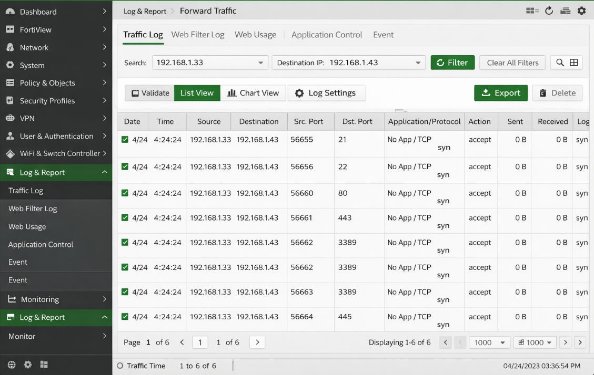<br>
  <em>Figure 1 - Firewall evidence of reconnaissance activity</em>
</p>

This activity aligns with common attacker behavior used to identify exposed services before exploitation. From a defender perspective, this suggests the attacker was identifying exposed services that could allow remote access.

##### 🔷 1.2) Validating Attacker's Target Ports

To validate what the attacker was likely checking for, local enumeration commands such as `netstat -an` would be used to identify listening services on the endpoint. This aligns with the attacker’s external behavior observed in the logs.

In addition to identifying listening services, active connections could also be identified by filtering network connections for the attacker’s IP address. For example, running `netstat -ano | findstr 192.168.1.33` would reveal any established or recently active connections involving the suspected source system, along with the associated process ID. This approach can help confirm which service was actively used during the intrusion, rather than only identifying services that were exposed.

##### 🔷 1.3) Identifying Listening Services and Initial Access Vector

After identifying multiple ports being probed during reconnaissance, the next step was to determine which services were actually listening on the endpoint, as only listening services could realistically be leveraged for initial access.

To do this, I opened Windows PowerShell on the compromised host and executed the following command:

```powershell
netstat -an | findstr LISTENING
```

This command enumerates all active network connections and listening ports on the system. The `-a` flag displays all connections and listening ports, the `-n` flag ensures ports are shown numerically, and piping the output to `findstr LISTENING` filters the results to only services actively accepting inbound connections.

<p align="left">
  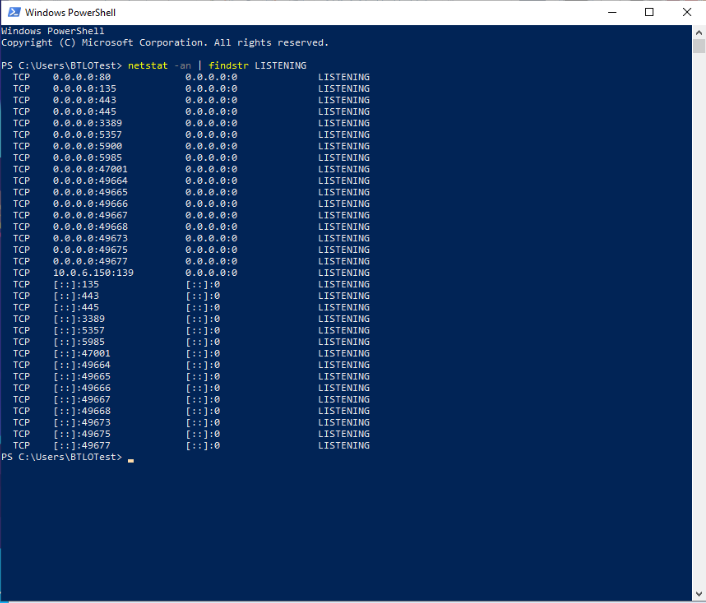<br>
  <em>Figure 2 - PowerShell enumeration of listening services using netstat</em>
</p>

Reviewing the output revealed several listening services, including ports 80 (HTTP), 443 (HTTPS), 445 (SMB), 3389 (RDP), and notably 22 (SSH). While some of these services are commonly present on Windows systems, SSH listening on port 22 is not enabled by default on Windows, making it stand out as a deliberate configuration and a likely access vector.

Given that port 22 was both probed during reconnaissance and confirmed to be actively listening on the endpoint, this strongly indicates that the attacker leveraged SSH over port 22 to gain initial access to the system.

##### 🔷 1.4) MITRE ATT&CK Mapping
- **Reconnaissance:** Active Scanning (T1595)

The firewall logs show repeated TCP SYN-only connection attempts from an external source IP to a single internal host across multiple common service ports (21, 22, 80, 443, 3389, 445), with no sessions established and no data transferred. This pattern indicates the attacker was identifying which services were exposed on the host prior to exploitation.

While this activity resembles Network Service Discovery (T1046) in terms of technical behavior, T1046 applies to post-compromise discovery performed from within the environment. In this case, the scanning is performed externally and prior to initial access, which places it in the Reconnaissance phase.

MITRE ATT&CK classifies this type of pre-access probing as Active Scanning (T1595). Because the activity targets a specific host and multiple service ports rather than a broad IP range, it aligns most closely with network service scanning behavior.

Active Scanning covers scenarios where an adversary probes a target from the outside to identify systems, services, or potential entry points before exploitation. More specifically:

- T1595.001 – Scanning IP Blocks applies when an attacker scans large ranges of IP addresses or entire subnets.
- T1595.002 – Network Service Scanning applies when an attacker targets a specific host and scans multiple ports or services to determine what is exposed.

The firewall log evidence aligns most closely with Network Service Scanning, as the attacker focuses on a single destination host and probes a range of common service ports associated with file transfer, web services, and remote administration. Although T1046 (Network Service Discovery) correctly describes what the attacker is doing at a technical level (identifying available services), T1595 (Active Scanning) correctly describes when and where the activity occurs within the attack lifecycle. Because MITRE ATT&CK distinguishes techniques based on attacker position and phase, Active Scanning (T1595) is the appropriate reconnaissance classification for this activity.

</details>

<details>
<summary><strong>▶ 2) Initial Access Identification & Confirmation</strong></summary></br>

*Goal:* Validate how the attacker achieved the first foothold by correlating exposed services with authentication and access telemetry.


<a id="2-initial-access-identification--confirmation"></a>

<!--
- [🔷 2.1) Finding Evidence for Initial Access via Valid Accounts (T1078)](https://github.com/ahnpj/incident-response-and-investigations/blob/main/intrusion-and-lateral-movement-investigations/windows-intrusion-lifecycle-lateral-movement-investigation/investigation-walkthrough.md#-21-finding-evidence-for-initial-access-via-valid-accounts-t1078)
- [🔷 2.2) MITRE ATT&CK Mapping](https://github.com/ahnpj/incident-response-and-investigations/blob/main/intrusion-and-lateral-movement-investigations/windows-intrusion-lifecycle-lateral-movement-investigation/investigation-walkthrough.md#-22-mitre-attck-mapping)
-->

After identifying exposed services, the attacker leveraged a remote service to gain initial access to the system. Evidence shows no user interaction, phishing, or email-based delivery, indicating a **service-based entry point**. This strongly suggests that an externally accessible service was abused to establish an initial foothold on the host.

No user interaction was required, indicating a service-based entry point rather than phishing or social engineering. 

##### 🔷 2.1) Finding Evidence for Initial Access via Valid Accounts (T1078)

To determine how the attacker achieved initial access, I investigated whether access occurred through user interaction (e.g., phishing or user-executed malware) or through authenticated use of an exposed service. Due to restrictions in the lab environment, direct access to the Windows Security event log (e.g., Event ID 4624) was not available, preventing direct validation of the authentication event itself.

Although direct authentication logs were unavailable in the lab environment, multiple indicators support credential-based initial access. External reconnaissance targeted port 22, local enumeration confirmed that the port was listening, and SSH-related components were present on the system. While this evidence does not conclusively prove SSH was used, it establishes a plausible credential-based access path. Subsequent attacker behavior, including account creation, privilege escalation, and account deletion, further supports the conclusion that access was achieved using valid credentials rather than exploitation or user interaction. Accordingly, the attacker’s initial access is best classified as Valid Accounts (T1078).

<blockquote>
Note on Additional Validation:
If full access to Windows Security logs were available in this environment, I would validate the initial access method by reviewing authentication events in Event Viewer under Windows Logs → Security. Specifically, I would search for Event ID 4624 (Successful Logon) originating from the attacker’s source IP address and examine the "Logon Type" field. Logon Type 3 (Network) or 5 (Service) would confirm service-based, credential-driven access, while the absence of Logon Type 2 (Interactive) or 10 (RemoteInteractive) would further rule out user-driven activity such as phishing or manual execution. This validation would provide definitive confirmation that the attacker authenticated using valid credentials, reinforcing classification of the initial access technique as MITRE ATT&CK Valid Accounts (T1078).
</blockquote>

Despite this limitation, multiple artifacts support initial access via valid credentials. Earlier reconnaissance activity showed the attacker probing port 22, and local enumeration confirmed that SSH was actively listening on the endpoint. Using PowerShell, I verified the presence of SSH-related components on the system:

```powershell
Get-Service | Where-Object {$_.Name -like "*ssh*"}
```

This command retrieves all registered Windows services and filters the results to those with names containing “ssh”. The output confirms whether SSH components are present on the host, which helps validate the availability of SSH-based remote access. When combined with earlier evidence showing that port 22 was externally probed and actively listening, this supports the conclusion that the attacker authenticated to the system using valid credentials rather than exploiting a vulnerability or relying on user interaction.

<p align="left">
  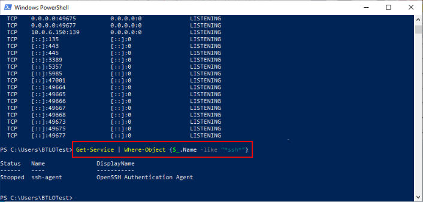<br>
  <em>Figure 3 - PowerShell validation of SSH-related services on the endpoint</em>
</p>


##### 🔷 2.2) MITRE ATT&CK Mapping
- **Initial Access:** Valid Accounts (T1078)

The presence of SSH functionality, combined with confirmation that port 22 was exposed and listening, indicates that the attacker authenticated to the system using an existing account rather than exploiting a vulnerability or relying on user interaction. This conclusion is further supported by subsequent attacker behavior observed later in the investigation, including account creation, administrative group membership changes, and account deletion — all of which are consistent with credential-based access.

Taken together, this evidence supports classification of the attacker’s initial access technique as Valid Accounts (T1078). While access occurred over a remote service (SSH), the defining factor is that the attacker successfully authenticated using credentials, not that the service itself was exploited.

</details>

<details>
<summary><strong>▶ 3) Account Access & Credential Activity</strong></summary></br>

*Goal:* Reconstruct brute-force authentication, account creation, privilege escalation, and account deletion to show how administrative control was established.

<a id="3-account-access--credential-activity"></a>

<!--
- [🔷 3.1) Identifying the Account Accessed by the Attacker](https://github.com/ahnpj/incident-response-and-investigations/blob/main/intrusion-and-lateral-movement-investigations/windows-intrusion-lifecycle-lateral-movement-investigation/investigation-walkthrough.md#-31-identifying-the-account-accessed-by-the-attacker)
- [🔷 3.2) Identifying the MITRE ATT&CK Credential Access Technique](https://github.com/ahnpj/incident-response-and-investigations/blob/main/intrusion-and-lateral-movement-investigations/windows-intrusion-lifecycle-lateral-movement-investigation/investigation-walkthrough.md#-32-identifying-the-mitre-attck-credential-access-technique)
- [🔷 3.3) Identifying the Account Created by the Attacker](https://github.com/ahnpj/incident-response-and-investigations/blob/main/intrusion-and-lateral-movement-investigations/windows-intrusion-lifecycle-lateral-movement-investigation/investigation-walkthrough.md#-33-identifying-the-account-created-by-the-attacker)
- [🔷 3.4) Identifying the MITRE ATT&CK Persistence Technique](https://github.com/ahnpj/incident-response-and-investigations/blob/main/intrusion-and-lateral-movement-investigations/windows-intrusion-lifecycle-lateral-movement-investigation/investigation-walkthrough.md#-34-identifying-the-mitre-attck-persistence-technique)
- [🔷 3.5) Identifying When the Account Was Added to the Administrators Group](https://github.com/ahnpj/incident-response-and-investigations/blob/main/intrusion-and-lateral-movement-investigations/windows-intrusion-lifecycle-lateral-movement-investigation/investigation-walkthrough.md#-35-identifying-when-the-account-was-added-to-the-administrators-group)
- [🔷 3.6) Identifying If Any Accounts Were Deleted](https://github.com/ahnpj/incident-response-and-investigations/blob/main/intrusion-and-lateral-movement-investigations/windows-intrusion-lifecycle-lateral-movement-investigation/investigation-walkthrough.md#-36-identifying-if-any-accounts-were-deleted)
- [🔷 3.7) Identifying the MITRE ATT&CK Impact Technique](https://github.com/ahnpj/incident-response-and-investigations/blob/main/intrusion-and-lateral-movement-investigations/windows-intrusion-lifecycle-lateral-movement-investigation/investigation-walkthrough.md#-37-identifying-the-mitre-attck-impact-technique)
- [🔷 3.8) Identifying the MITRE ATT&CK Detection ID](https://github.com/ahnpj/incident-response-and-investigations/blob/main/intrusion-and-lateral-movement-investigations/windows-intrusion-lifecycle-lateral-movement-investigation/investigation-walkthrough.md#-38-identifying-the-mitre-attck-detection-id)
- [🔷 3.9) Summary of Account Activity](https://github.com/ahnpj/incident-response-and-investigations/blob/main/intrusion-and-lateral-movement-investigations/windows-intrusion-lifecycle-lateral-movement-investigation/investigation-walkthrough.md#-39-summary-of-account-activity)
- [🔷 3.10) MITRE ATT&CK Mapping](https://github.com/ahnpj/incident-response-and-investigations/blob/main/intrusion-and-lateral-movement-investigations/windows-intrusion-lifecycle-lateral-movement-investigation/investigation-walkthrough.md#-310-mitre-attck-mapping)
--> 

After identifying that port 22 (SSH) was both probed externally and listening locally, I pivoted from “what services are exposed?” to “which credentials were actually used to gain access?” At this stage, my objective was to reconstruct how the attacker authenticated, which account they accessed, and when that first successful access occurred.

While the Windows Security log (Event ID 4624) records successful logons, it can be extremely noisy and does not always clearly show service-specific authentication context (especially for SSH on Windows). Because SSH was the suspected access vector, the most authoritative source for confirming SSH authentication attempts is the: Event Viewer → Applications and Services Logs → OpenSSH → Operational.

This log records sshd activity directly and includes:

- the username targeted (`administrator`)
- whether the attempt failed or succeeded (“Failed password” vs “Accepted password”)
- the source IP (`192.168.1.33`)
- the source port and protocol metadata (`ssh2)
- a precise timestamp

##### 🔷 3.1) Identifying the Account Accessed by the Attacker

I began by searching for evidence of successful authentication activity to identify the account first accessed by the attacker. Within Event Viewer, I navigated to: Event Viewer → Applications and Services Logs → OpenSSH → Operational.

I looked for successful authentication evidence rather than relying on assumptions from exposed ports alone. In the OpenSSH/Operational log, I observed a clear pattern:

- Multiple events stating: “sshd: Failed password for administrator from 192.168.1.33 port <XXXXX> ssh2”
- Followed by an event stating: “sshd: Accepted password for administrator from `192.168.1.33` port <XXXXX> ssh2”

This sequence indicates the attacker repeatedly attempted to authenticate as the administrator account and eventually succeeded.

<p align="left">
  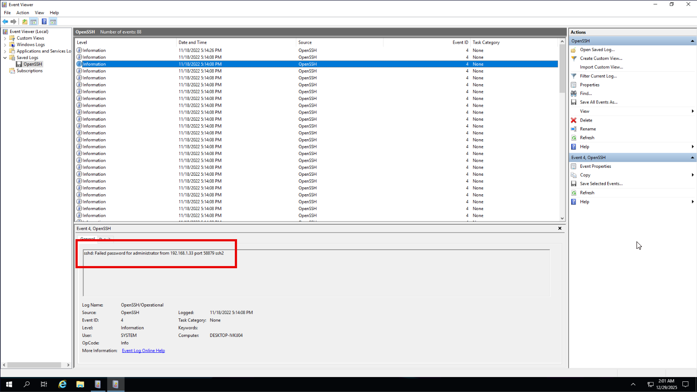<br>
  <em>Figure 4 - Successful SSH login to the Administrator account following failed attempts</em>
</p>

<p align="left">
  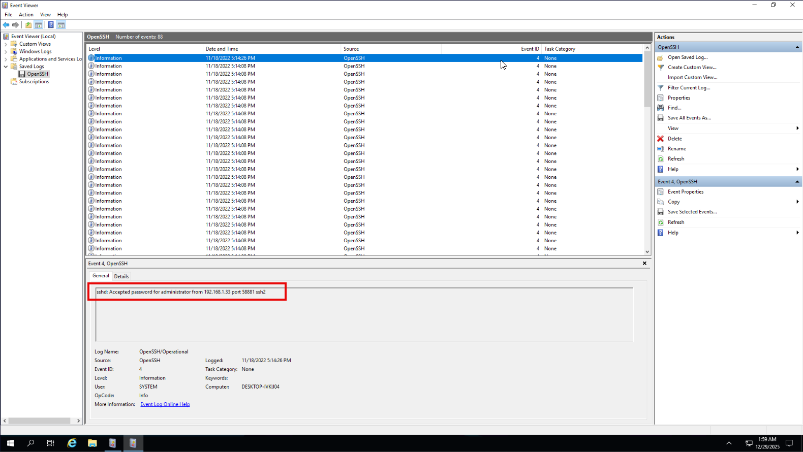<br>
  <em>Figure 5 - Successful SSH login to the Administrator account following failed attempts</em>
</p>

<blockquote>
The varying “port XXXXX” shown in the OpenSSH log does not mean the attacker was trying different SSH destination ports on the victim. SSH is still being accessed on the server’s destination port (22). The changing port values represent the attacker’s client-side ephemeral source ports, which naturally change between connection attempts.
</blockquote>

**Determining the Time of First Unauthorized Access**

In the OpenSSH/Operational log, the first successful login event for the administrator account occurred at: `11/18/2022 5:14:08 PM`

<p align="left">
  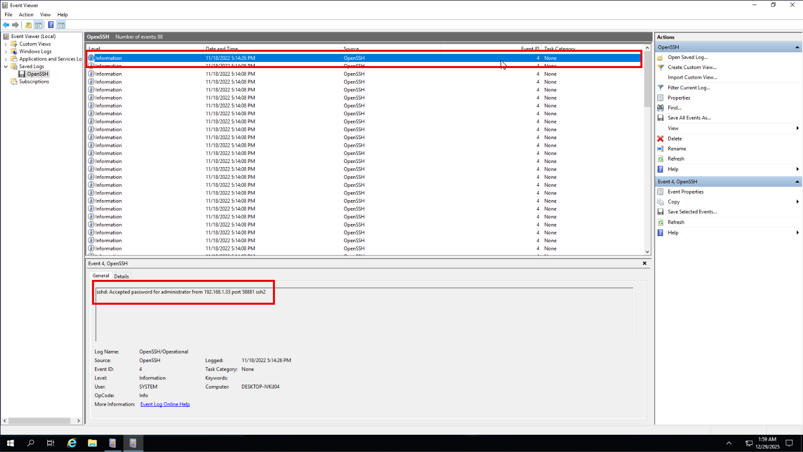<br>
  <em>Figure 6 - First confirmed successful SSH login timestamp</em>
</p>

##### 🔷 3.2) Identifying the MITRE ATT&CK Credential Access Technique

Next, I mapped the observed access method to the MITRE ATT&CK framework. Review of the OpenSSH Operational logs shows multiple consecutive authentication failures for the administrator account originating from the same external IP address, followed by a successful authentication event.

Specifically, the logs contain repeated entries indicating “Failed password for administrator”, immediately followed by an “Accepted password for administrator” event from the same source. This pattern demonstrates that the attacker repeatedly attempted to authenticate until a valid password was successfully guessed.

This behavior aligns with: MITRE ATT&CK: Brute Force, T1110

There is no evidence that the attacker bypassed authentication controls or exploited a software vulnerability to gain access. Instead, access was achieved by repeatedly attempting credentials until successful authentication occurred. This behavior aligns with: MITRE ATT&CK – Brute Force (T1110)

Brute Force describes adversaries attempting multiple password combinations against an account until valid credentials are identified. The sequence of failed login attempts followed by a successful authentication directly supports this technique.


##### 🔷 3.3) Identifying the Account Created by the Attacker

After confirming that the attacker successfully authenticated as the administrator account via SSH, I pivoted to the Windows Security log to identify any account creation activity that occurred after initial access was established. The Security log records all local account lifecycle events, making it the authoritative source for detecting attacker-created users.

Within Event Viewer → Windows Logs → Security, I filtered for Event ID 4720, which is generated whenever a new user account is created on a Windows system. I then reviewed the timestamps associated with these events and compared them to the timestamp of the first confirmed successful SSH login (Accepted password for administrator).

Only one account creation event (Event ID 4720) occurred after the attacker gained access to the administrator account. The event details identify the newly created account as: `sysadmin`.

Because this account was created immediately following authenticated attacker access, and no other account creation events occurred in this timeframe, I determined that `sysadmin` was the account created by the attacker.

<p align="left">
  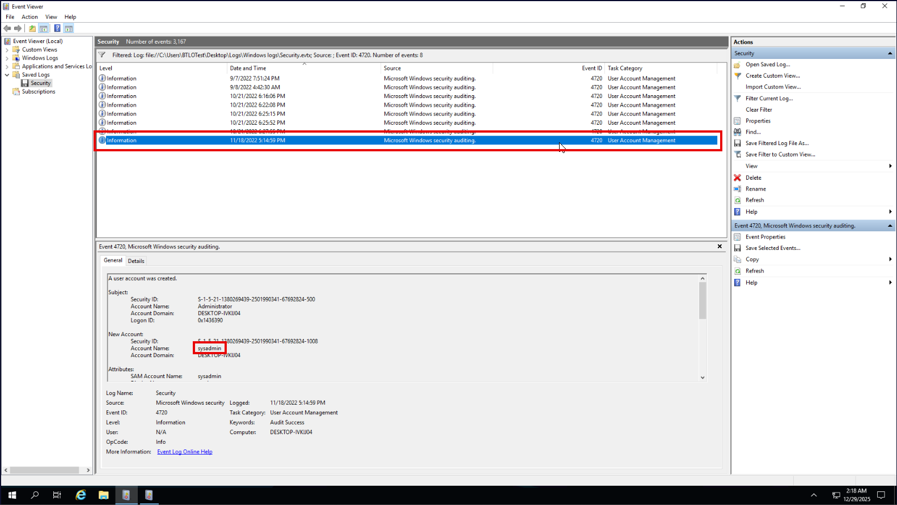<br>
  <em>Figure 7 - New local user account created post-access</em>
</p>


##### 🔷 3.4) Identifying the MITRE ATT&CK Persistence Technique

After identifying that the attacker created a new local user account (sys admin) following successful access, I assessed how this action fits into the MITRE ATT&CK framework from a persistence perspective.

Creating a new local account after initial compromise is a common persistence technique. By introducing a separate account, the attacker ensures continued access to the system even if the original compromised credentials (in this case, the administrator account) are changed, monitored, or disabled.

Because this account creation occurred after authenticated access was established and was not part of normal system provisioning, it represents a deliberate attempt to maintain long-term access rather than an initial access technique.

This behavior maps to: MITRE ATT&CK – Create Account (T1136)

Specifically, the attacker created a local user account to establish persistence and reduce dependence on the initially compromised account.


##### 🔷 3.5) Identifying When the Account Was Added to the Administrators Group

After identifying the attacker-created account and establishing the timestamp of the attacker’s first successful access, I next examined whether the attacker escalated privileges for this account. On Windows systems, changes to local group membership are recorded in the Security log.

To identify this activity, I filtered the Security log for Event ID 4732, which is generated when a member is added to a security-enabled local group.

Because the system contained historical group membership changes unrelated to the compromise, I focused only on events that occurred after the attacker’s initial access timestamp. This ensured that the activity I reviewed was associated with the intrusion and not normal administrative behavior.

Within these filtered events, I identified an Event ID 4732 entry where the Administrators group was modified. 

<blockquote>
The event details show that the action was performed under the same system context and domain observed during the compromise window, confirming that this change was related to the attacker’s activity.
</blockquote>

The timestamp associated with this event represents the moment the attacker added the created account to the local Administrators group, granting full administrative privileges and solidifying persistent, elevated access to the system.

<p align="left">
  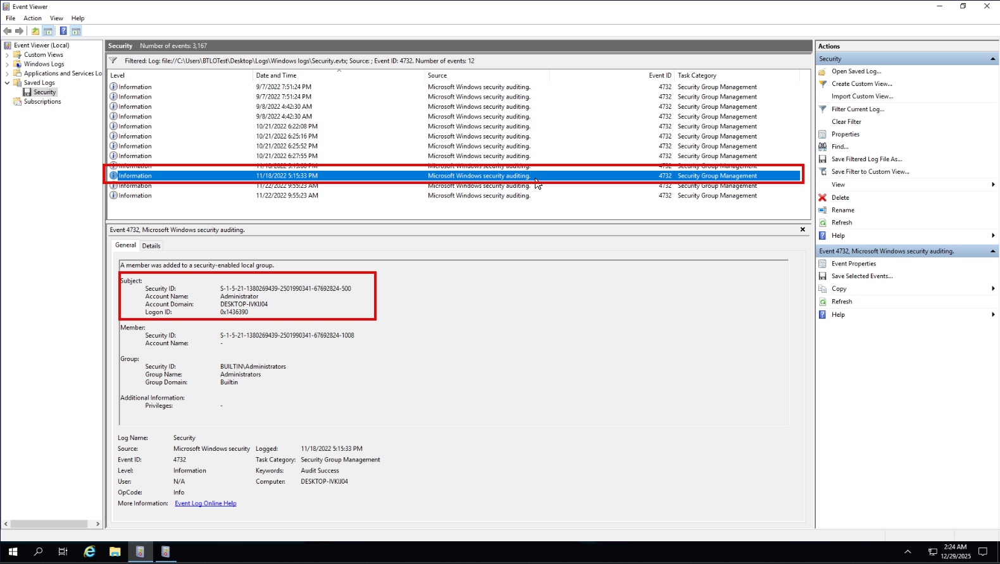<br>
  <em>Figure 8 - Attacker-created account added to the Administrators group</em>
</p>

The attacker added the account to the admin group on 11/18/2022 at 5:15:33 PM.


##### 🔷 3.6) Identifying If Any Accounts Were Deleted

To determine whether the attacker attempted to clean up evidence, I reviewed the Windows Security log for Event ID 4726, which records when a user account is deleted.

The event details distinguish between the Subject (the account performing the action) and the Target Account (the account being deleted). In this case, the event shows that the deletion was performed by the administrator account, while the target account deleted was DRB.

Although both accounts share the same account domain, this simply indicates that they are local accounts on the same system. The distinction between Subject and Target confirms that DRB was the account removed, not the attacker’s persistence account.

Deleting a separate account after establishing persistent administrative access is consistent with post-compromise cleanup activity intended to reduce visibility or remove traces of earlier actions.

<p align="left">
  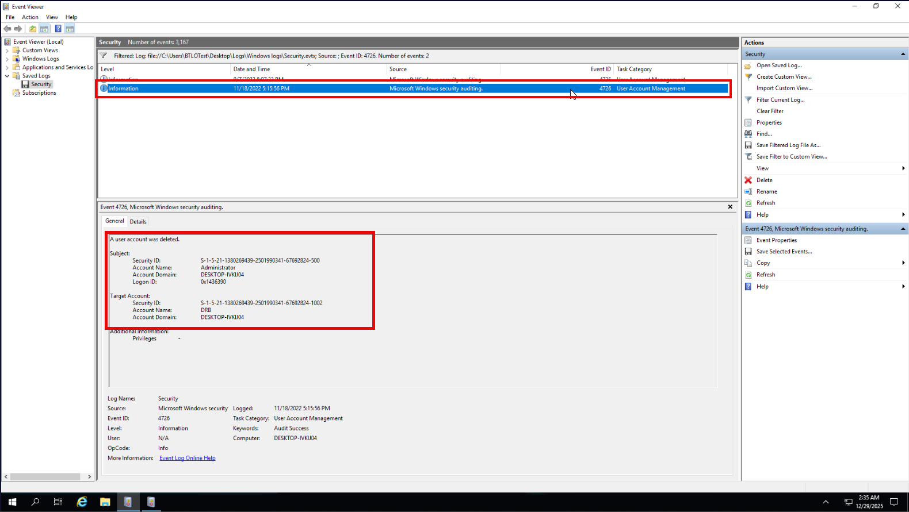<br>
  <em>Figure 9 - Local user account deleted during compromise</em>
</p>


##### 🔷 3.7) Identifying the MITRE ATT&CK Impact Technique

After identifying account manipulation activity (creation + elevation), I reviewed whether the attacker took actions that directly impacted legitimate access to the system. The Security log confirms an account deletion event (Event ID 4726), showing that a user account was removed after the attacker had established control.

Deleting user accounts is an impact action because it prevents legitimate access, disrupts normal operations, and can hinder remediation by removing expected accounts.

MITRE ATT&CK Mapping (Impact): Account Access Removal (T1531)


##### 🔷 3.8) Identifying the MITRE ATT&CK Detection ID
Finally, I identified the applicable MITRE ATT&CK Detection ID associated with the attacker’s actions. Detection IDs describe defensive detection opportunities that security teams can use to identify similar activity in production environments.

Based on the observed behavior—including repeated failed authentication attempts, successful credential-based access, account creation, and privilege escalation—the activity maps to the following detection category: MITRE ATT&CK Detection: DS0002

This detection category applies to activity observable through authentication logs and account management events, reinforcing the importance of monitoring Windows Security logs for suspicious credential and account activity.


##### 🔷 3.9) Summary of Account Activity

Reviewing authentication and account management activity in the Windows Security and OpenSSH logs revealed a clear and chronological sequence of credential-related attacker behavior following initial access.

This analysis confirmed the following actions:

- Successful authentication to the system using the existing administrator account via SSH after multiple failed login attempts
- Creation of a new local user account (sys admin) after access was established
- Elevation of the newly created account to the local Administrators group 
- Deletion of an existing user account (DRB), likely as a cleanup or access-disruption action

Together, these events demonstrate that the attacker relied on credential-based access, manipulated local accounts to establish persistent administrative control, and removed an account to reduce visibility or limit legitimate access.
Establishing the timestamp of the **first unauthorized account access** allowed me to anchor the rest of the investigation timeline and correlate later activity such as file creation and registry modification.

By identifying the timestamp of the first successful SSH authentication, I was able to anchor the compromise timeline and reliably correlate subsequent activity, including account creation, privilege escalation, registry modification, and file artifacts. This timeline correlation confirms that the observed account activity occurred during the compromise window and was not part of routine system administration.

The progression from authenticated access to account manipulation indicates that the attacker had moved beyond reconnaissance and initial access and was actively consolidating control over the system.

##### 🔷 3.10) MITRE ATT&CK Mapping

Credential Access:
- Brute Force (T1110) – Multiple failed SSH authentication attempts followed by a successful login

Persistence:
- Create Account (T1136) – Creation of a new local user account after initial access
- Account Manipulation (T1098) – Modification of account privileges via group membership changes

Impact:
- Account Access Removal (T1531) – Deletion of a user account to disrupt access or reduce visibility

</details>


<details>
<summary><strong>▶ 4) File Extraction & Malware Artifact Analysis</strong></summary></br>

*Goal:* Identify when malicious archives were extracted and how malware payloads were staged on the host using Sysmon process and file creation evidence.

<a id="4-file-extraction--malware-artifact-analysis"></a>

<!--
- [🔷 4.1) Identifying the Extracted Compressed File](https://github.com/ahnpj/incident-response-and-investigations/blob/main/intrusion-and-lateral-movement-investigations/windows-intrusion-lifecycle-lateral-movement-investigation/investigation-walkthrough.md#-41-identifying-the-extracted-compressed-file)
- [🔷 4.2) Correlating Activity Before the Extraction (Contextual Evidence)](https://github.com/ahnpj/incident-response-and-investigations/blob/main/intrusion-and-lateral-movement-investigations/windows-intrusion-lifecycle-lateral-movement-investigation/investigation-walkthrough.md#-42-correlating-activity-before-the-extraction-contextual-evidence)
- [🔷 4.3) Identifying the MITRE ATT&CK Collection Technique](https://github.com/ahnpj/incident-response-and-investigations/blob/main/intrusion-and-lateral-movement-investigations/windows-intrusion-lifecycle-lateral-movement-investigation/investigation-walkthrough.md#-43-identifying-the-mitre-attck-collection-technique)
- [🔷 4.4) Identifying the Collection Sub-Technique](https://github.com/ahnpj/incident-response-and-investigations/blob/main/intrusion-and-lateral-movement-investigations/windows-intrusion-lifecycle-lateral-movement-investigation/investigation-walkthrough.md#-44-identifying-the-collection-sub-technique)
- [🔷 4.5) Identifying Files Created from the Extraction](https://github.com/ahnpj/incident-response-and-investigations/blob/main/intrusion-and-lateral-movement-investigations/windows-intrusion-lifecycle-lateral-movement-investigation/investigation-walkthrough.md#-45-identifying-files-created-from-the-extraction)
- [🔷 4.6) Identifying the File Path of Created Files](https://github.com/ahnpj/incident-response-and-investigations/blob/main/intrusion-and-lateral-movement-investigations/windows-intrusion-lifecycle-lateral-movement-investigation/investigation-walkthrough.md#-46-identifying-the-file-path-of-created-files)
-->

After confirming initial access, privilege escalation, and account manipulation activity, I shifted focus to identifying if there were any malware-related file artifacts created during the compromise window. The goal of this step was to determine whether any compressed archives or executables were introduced to the system following the attacker’s successful authentication and privilege escalation.

Because Windows Security logs do not reliably capture file extraction activity, I pivoted to Sysmon logs, which provide high-fidelity visibility into process creation, command-line execution, and file interaction.

##### 🔷 4.1) Identifying the Extracted Compressed File

To identify the compressed file that was extracted, I reviewed Sysmon Event ID 1 (Process Create). This event records detailed information about executed processes, including the full command line, which is critical for identifying archive extraction commands.

I filtered Sysmon logs to Event ID 1 and narrowed the investigation to the compromise timeframe established earlier (approximately 11/18/2022 around 5:14–5:25 PM). This timeframe correlates with:

- Successful SSH authentication as administrator
- Account creation and privilege escalation
- Account deletion activity

Within this window, I reviewed each process execution and focused specifically on the CommandLine field to identify abnormal or attacker-driven activity.

Most processes observed during this period were legitimate system activity, including:

- MpCmdRun.exe (Windows Defender)
- SecurityHealthHost.exe
- NisSrv.exe
- Windows Update–related binaries

However, one process stood out as anomalous: 

```makefile
Image: C:\Program Files\7-Zip\7z.exe
CommandLine: 7z e keylogger.rar
```

This execution occurred at 11/18/2022 5:22:40 PM, shortly after the attacker completed privilege escalation and account manipulation actions. The use of `7z.exe` with the e (extract) flag confirms that a compressed archive was extracted.


<p align="left">
  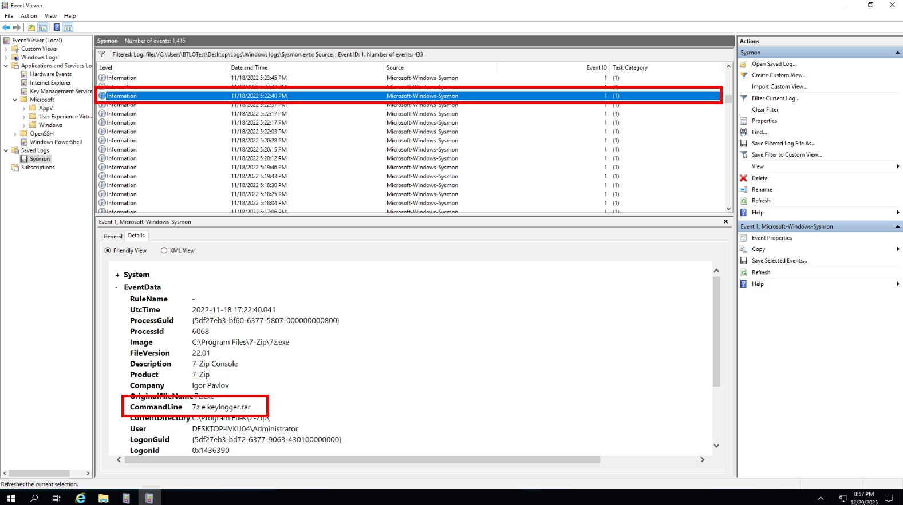<br>
  <em>Figure 10 - Extraction of "keylogger.rar" using 7-Zip</em>
</p>

##### 🔷 4.2) Correlating Activity Before the Extraction (Contextual Evidence)

Events immediately preceding this extraction support earlier findings in the investigation:

- Repeated `sshd.exe` executions: These represent SSH session handling and authentication activity. The `-y` flag indicates the SSH service operating normally under service context.

<p align="left">
  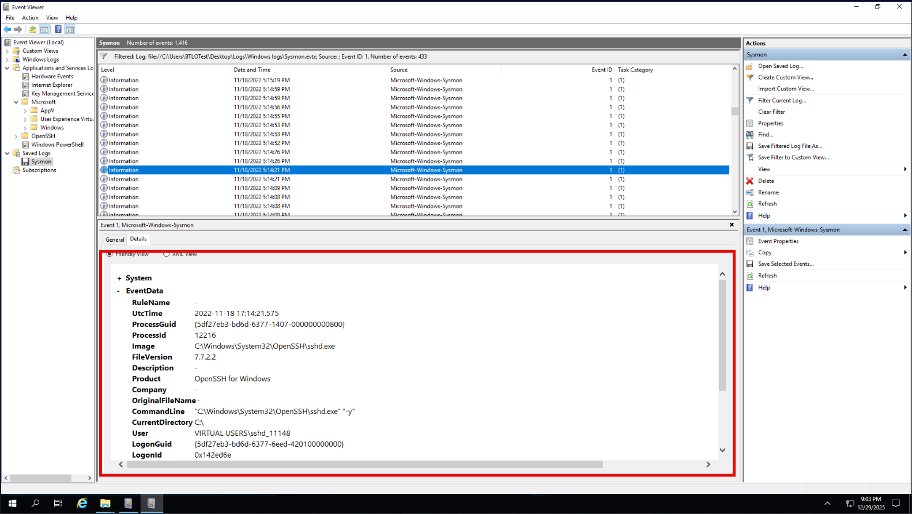<br>
  <em>Figure 11 - SSH session handling activity during intrusion window</em>
</p>

- Account manipulation via net.exe: Example observed command: `net user sysadmin SYSADMIN123 /ADD`. This correlates directly with:
  - Account creation (Event ID 4720)
  - Addition to Administrators group (Event ID 4732)

<p align="left">
  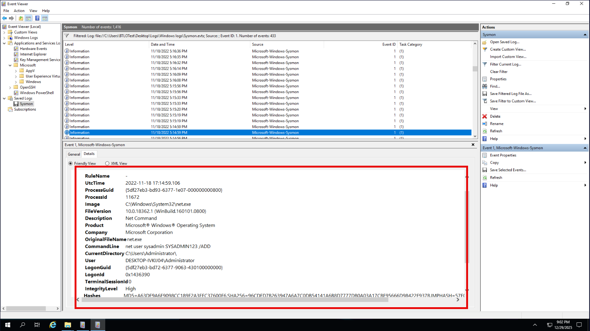<br>
  <em>Figure 12 - Account creation activity via "net.exe"</em>
</p>

- Account cleanup activity: A later Sysmon event confirms account deletion: `net user DRB /DELETE`. This aligns with Event ID 4726 and indicates attacker cleanup behavior.

<p align="left">
  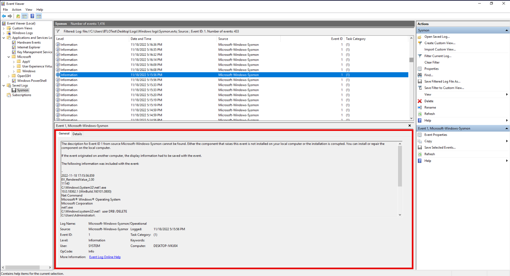<br>
  <em>Figure 13 - Account deletion activity via "net.exe"</em>
</p>

This sequencing reinforces that `keylogger.rar` was extracted only after the attacker had full administrative control, making it part of deliberate post-exploitation activity rather than benign user behavior.


##### 🔷 4.3) Identifying the MITRE ATT&CK Collection Technique

After identifying that the attacker extracted the compressed archive `keylogger.rar`, I assessed the intended functionality of the extracted content to determine the applicable MITRE ATT&CK collection technique.

The filename itself is a strong indicator of purpose. Keyloggers are designed to capture user keystrokes in order to collect sensitive information such as credentials, commands, or other user input. This aligns with a well-documented adversary behavior focused on harvesting information directly from user interaction with the system.

Based on this behavior, the extracted file is best mapped to the following MITRE ATT&CK technique:

MITRE ATT&CK Mapping: Collection: Input Capture (T1056)

This technique describes adversaries capturing user input through keylogging or similar mechanisms in order to collect credentials or sensitive data. The extraction of keylogger.rar following administrative access strongly suggests the attacker intended to deploy a keylogging capability as part of post-compromise collection activity.


##### 🔷 4.4) Identifying the Collection Sub-Technique

After identifying that the attacker used Input Capture (T1056) as the collection technique, I determined the specific sub-technique based on the extracted file’s purpose.

The compressed archive `keylogger.rar` explicitly indicates a keylogging capability. Keyloggers are designed to record keystrokes entered by a user in order to capture credentials, commands, and other sensitive input. This is a direct and unambiguous example of keystroke monitoring.

Based on this evidence, the appropriate MITRE ATT&CK sub-technique is:

MITRE ATT&CK Mapping: Collection: Keylogging (T1056.001)

This sub-technique specifically describes adversaries capturing keystrokes from a victim system to collect sensitive information. The extraction of a keylogger immediately after administrative access strongly supports this mapping.


##### 🔷 4.5) Identifying Files Created from the Extraction

To determine which files were created as a result of the archive extraction, I analyzed Sysmon Event ID 11 (FileCreate) events around the confirmed extraction timeframe.

I previously identified that the compressed file `keylogger.rar` was extracted at 11/18/2022 5:22:40 PM, based on a Sysmon Event ID 1 (Process Create) entry showing `7z.exe` executing with the command line: `7z e keylogger.rar`. This established both the tool used for extraction (7-Zip) and the exact time window to investigate for newly created files.

Next, I filtered Sysmon logs to Event ID 11 and focused on entries immediately after the archive extraction time. Sysmon Event ID 11 records the creation of new files on disk, which is the correct evidence source for answering this question. Reviewing these events chronologically revealed two file creation events occurring back-to-back:

1. `rundll33.exe` - Created at 11/18/2022 5:22:46 PM
2. `svchost.exe` - Created at 11/18/2022 5:22:50 PM

Both files were created by 7z.exe, confirming they originated from the archive extraction rather than normal system activity.

<p align="left">
  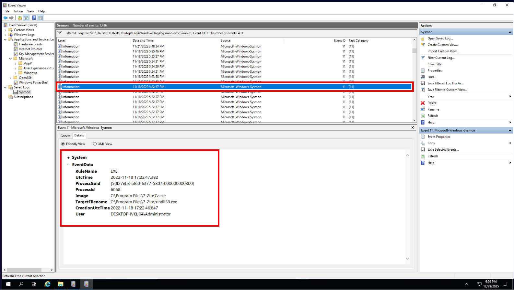<br>
  <em>Figure 14 - Malicious executable created after archive extraction</em>
</p>

<p align="left">
  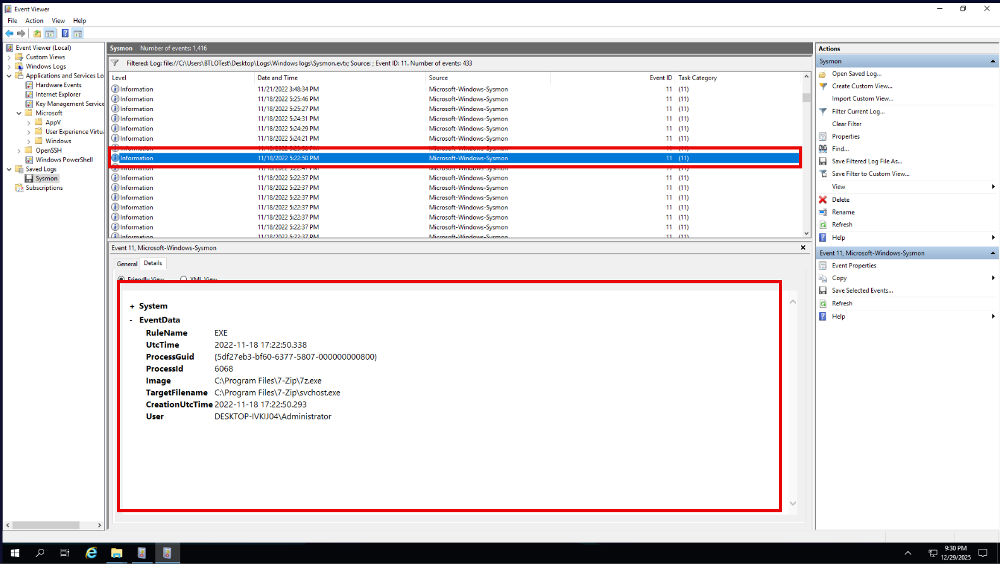<br>
  <em>Figure 15 - Second executable dropped, masquerading as a system process</em>
</p>

<blockquote>
Malware authors often use the names of legitimate system processes to hide malicious activity from users and basic security scans.

svchost.exe (Service Host): A critical process that hosts multiple Windows services. Malware may run as a service under this process to blend in with normal system operations.

rundll32.exe (Run DLL as application): A command-line utility used to run functions within DLLs (Dynamic Link Libraries). Threat actors use this to execute malicious code stored in DLL files. 
</blockquote>

<blockquote>
The use of "rundll32.exe" in this investigation does not inherently indicate DLL injection or DLL hijacking. Instead, it represents living-off-the-land execution, where a legitimate Windows utility is abused to execute malicious code stored in a DLL. DLL injection involves forcing a DLL into the address space of another running process, while DLL hijacking relies on placing a malicious DLL in a location where a legitimate application will load it unintentionally. In this case, "rundll32.exe" is explicitly invoked to execute a DLL function, which aligns more closely with proxy execution using trusted binaries rather than injection or hijacking. I recognized this distinction based on concepts learned during my CompTIA Security+ studies, where rundll32 is highlighted as a common tool abused by threat actors to evade detection by leveraging legitimate system binaries.
</blockquote>

##### 🔷 4.6) Identifying the File Path of Created Files

After identifying `rundll33.exe` and `svchost.exe` as the two files created from the archive extraction in the previous step, I next needed to determine where these files were written on disk. I continued reviewing subsequent Sysmon Event ID 11 (FileCreate) events to determine what actions occurred immediately afterward.

Focusing on events after `11/18/2022 5:22:50 PM` (the last file that was extracted), I observed additional file creation activity occurring in the same directory (`C:\Users\Administrator\AppData\Roaming\WPDNSE`). Reviewing events in sequence allowed me to confirm that the extracted executables were not isolated artifacts but part of a broader chain of attacker-driven activity following successful extraction and execution.

Initially, the `C:\Program Files\7-Zip\` directory appeared relevant because the Sysmon events showed `7z.exe` executing from that location. However, this path only represents the location of the extraction utility, not the destination of the extracted files themselves. Instead, I focused on Sysmon Event ID 11 (FileCreate) and examined the `TargetFilename` field, which records the full path of newly created files.

By correlating the timestamps of these events with earlier findings—such as initial account access, privilege escalation, and account deletion—I was able to place the file activity firmly within the active compromise window rather than normal system behavior. By correlating the timestamps of these events with earlier findings—such as initial account access, privilege escalation, and account deletion—I was able to place the file activity firmly within the active compromise window rather than normal system behavior.

Reviewing the FileCreate events immediately following the archive extraction activity revealed that both executables were written to the same directory under the Administrator profile. Specifically, the `TargetFilename` field showed:
- `C:\Users\Administrator\AppData\Roaming\WPDNSE\svchost.exe` at `11/18/2022 5:24:21 PM`
- `C:\Users\Administrator\AppData\Roaming\WPDNSE\rundll33.exe` at `11/18/2022 5:25:27 PM`

Because both extracted files were created within the same directory, this confirms that the archive contents were dropped into the `WPDNSE` folder under the user’s roaming `AppData` path.

<p align="left">
  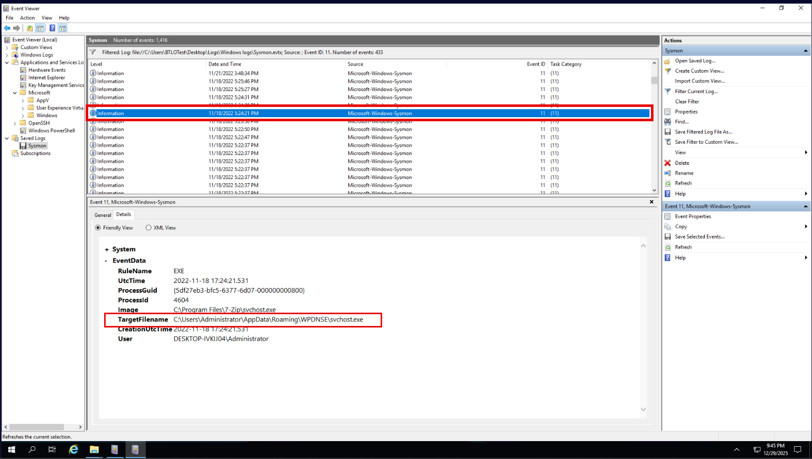<br>
  <em>Figure 16 - Payload written to a user-writable roaming directory</em>
</p>

<p align="left">
  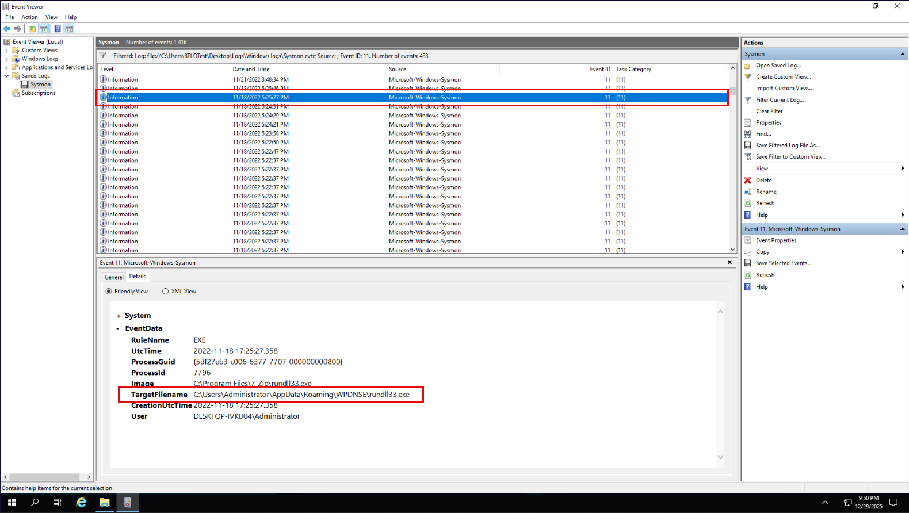<br>
  <em>Figure 17 - Additional payload staged in the same directory</em>
</p>

</details>

<details>
<summary><strong>▶ 5) Malware & File Artifact Analysis</strong></summary></br>

*Goal:* Analyze malware components written to disk, including masquerading executables and driver files, to understand execution flow and supporting artifacts.

<a id="5-malware--file-artifact-analysis"></a>

<!--
- [🔷 5.1) Identifying the Created .sys File](https://github.com/ahnpj/incident-response-and-investigations/blob/main/intrusion-and-lateral-movement-investigations/windows-intrusion-lifecycle-lateral-movement-investigation/investigation-walkthrough.md#-51-identifying-the-created-sys-file)
- [🔷 5.2) Confirming the Registry Value Creation Timestamp](https://github.com/ahnpj/incident-response-and-investigations/blob/main/intrusion-and-lateral-movement-investigations/windows-intrusion-lifecycle-lateral-movement-investigation/investigation-walkthrough.md#-52-confirming-the-registry-value-creation-timestamp)
- [🔷 5.3) Confirming Registry Values Created by the Malware](https://github.com/ahnpj/incident-response-and-investigations/blob/main/intrusion-and-lateral-movement-investigations/windows-intrusion-lifecycle-lateral-movement-investigation/investigation-walkthrough.md#-53-confirming-registry-values-created-by-the-malware)
-->

After identifying the malware files, I investigated whether the malware modified the system to support execution or persistence. 

##### 🔷 5.1) Identifying the Created .sys File

After determining that the archive extraction resulted in the creation of `svchost.exe` (11/18/2022 5:24:21 PM) and `rundll33.exe` (11/18/2022 5:25:27 PM), I continued reviewing Sysmon Event ID 11 (FileCreate) events occurring between those two timestamps to identify any additional artifacts created during this execution window.

Within this narrow timeframe, I identified the creation of a `.sys` file named `atapi.sys` at 11/18/2022 5:24:31 PM. The file was written to the same attacker-controlled directory previously identified (C:\Users\Administrator\AppData\Roaming\WPDNSE), which strongly ties this activity to the earlier extraction and execution process rather than legitimate system behavior.

The timing of this event is significant. The `.sys` file was created after the initial executable (`svchost.exe`) appeared but before the secondary executable (`rundll33.exe`) was written, indicating that the malware was actively staging multiple components in sequence rather than performing a single drop-and-run action.

Although `atapi.sys` shares its name with a legitimate Windows storage driver, its presence in a user-writable roaming profile directory, rather than a standard system driver location, indicates masquerading behavior. This strongly suggests the file was introduced by the malware as part of its execution or persistence workflow, rather than being created by the operating system.

By correlating file creation timestamps and locations across consecutive Sysmon events, I was able to confidently identify `atapi.sys` as the `.sys` file created by the malware during the active compromise window.

<p align="left">
  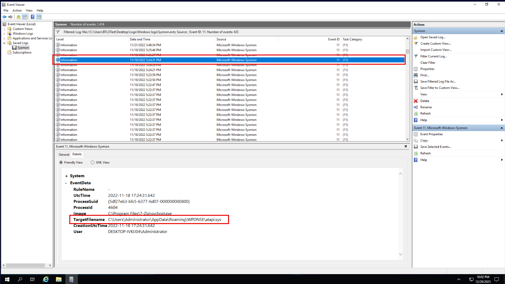<br>
  <em>Figure 18 - Suspicious ".sys" file created outside standard system paths</em>
</p>

MITRE ATT&CK:
- Defense Evasion: Rootkit (T1014) 

##### 🔷 5.2) Confirming the Registry Value Creation Timestamp

After identifying the malware files written to disk, I examined registry activity that occurred immediately afterward to determine when persistence was first established. The Windows Registry is a centralized configuration database used by the operating system to control system and user behavior. Within the registry, a registry key functions like a folder, while a registry value represents an individual configuration setting stored inside that key.

Attackers frequently create or modify registry values to achieve persistence, which means ensuring their malware automatically executes after a reboot or user logon. This allows the attacker to maintain access without needing to re-exploit the system.

Reviewing the timeline shows that the first registry value associated with the malware was set at 11/18/2022 5:24:31 PM, shortly after the malware files were extracted and written to disk. This timestamp closely aligns with the creation of `svchost.exe` and occurs just before `rundll33.exe` was created, indicating a deliberate transition from file deployment to persistence configuration.

Correlating registry modification timestamps with file creation events is critical because it confirms attacker intent and validates the sequence of actions taken. In this case, the timing demonstrates that registry changes were not preexisting system settings, but were instead introduced by the attacker as part of a structured persistence setup following malware execution.


##### 🔷 5.3) Confirming Registry Values Created by the Malware 

To confirm registry values created by the malware, I focused on Sysmon Event ID 13, which records registry value creation or modification. 

<blockquote>
A registry value is a named entry inside the Windows Registry that stores configuration data. Malware commonly creates or modifies registry values to establish persistence, meaning it can automatically run again after a reboot or user logon.
</blockquote>

I filtered the Sysmon logs for Event ID 13 around the same time window when the malicious files were created earlier (between 5:24 PM and 5:26 PM on 11/18/2022). This correlation is important because persistence-related registry changes typically occur immediately after malware drops its files.

At 11/18/2022 5:24:21 PM, Sysmon logged a registry value creation under the Windows Run key. The relevant entry shows:

- **Registry value name:** Windows Atapi x86_64 Driver
- **Timestamp:** 11-18-2022 5:24:21
- **Associated executable:** svchost.exe 
- **Located in:** C:\Users\Administrator\AppData\Roaming\WPDNSE\svchost.exe

<p align="left">
  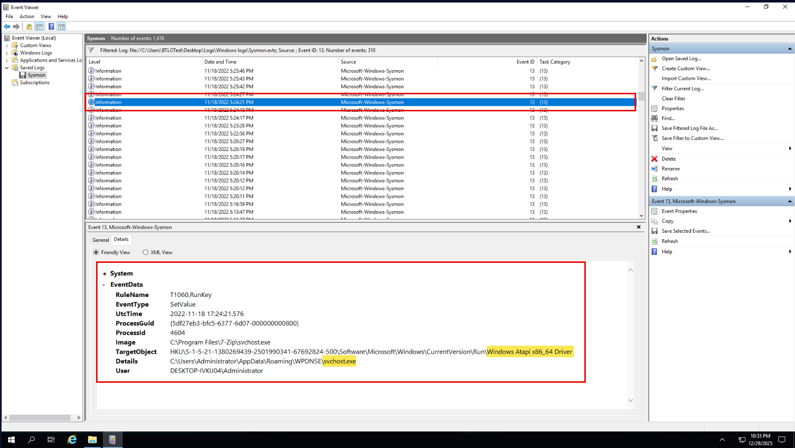<br>
  <em>Figure 19 - Autorun registry value created for persistence</em>
</p>

Shortly after (at 11/18/2022 5:25:43 PM), another Sysmon Event ID 13 entry appears showing a second registry value creation:

- **Registry value name:** Windows SCR Manager
- **Timestamp:** 11/18/2022 5:25:43 PM (shortly after the first value - same activity window)
- **Associated executable:** rundll33.exe 
- **Located in:** C:\Users\Administrator\AppData\Roaming\WPDNSE\rundll33.exe

<p align="left">
  <br>
  <em>Figure 20 - Second autorun registry value created</em>
</p>

These names stand out because they masquerade as legitimate Windows components, which is a common malware technique to avoid suspicion. Both registry values point to executables stored in the WPDNSE directory under the user’s roaming profile, which had already been identified as the malware drop location in previous steps.

Because these two registry values were:
- Created in sequence
- Closely aligned with the malware file creation timestamps
- Configured to launch malicious executables automatically

they represent the two registry values created by the malware.

</details>

<details>
<summary><strong>▶ 6) Persistence Technique Identification</strong></summary></br>

*Goal:* Identify registry-based persistence mechanisms used to ensure malware execution across system restarts and user logons.

<a id="#6-persistence-technique-identification"></a>

<!--
- [🔷 6.1) Identifying the Persistence Technique](https://github.com/ahnpj/incident-response-and-investigations/blob/main/intrusion-and-lateral-movement-investigations/windows-intrusion-lifecycle-lateral-movement-investigation/investigation-walkthrough.md#-61-identifying-the-persistence-technique)
- [🔷 6.2) Identifying the Persistence Sub-Technique](https://github.com/ahnpj/incident-response-and-investigations/blob/main/intrusion-and-lateral-movement-investigations/windows-intrusion-lifecycle-lateral-movement-investigation/investigation-walkthrough.md#-62-identifying-the-persistence-sub-technique)
-->

After confirming registry modification, I assessed how the malware ensured it would execute again after reboot or logon.

##### 🔷 6.1) Identifying the Persistence Technique

The malware modified Windows registry locations that are evaluated during user logon. Specifically, it created registry values that reference malicious executables located in the user’s roaming profile directory. These registry entries cause the referenced binaries to be executed automatically when the system starts or when the user logs in.

This behavior represents a classic Windows persistence mechanism, where malware configures the operating system to automatically launch malicious code without requiring user interaction. Because execution occurs during the boot or logon process, this activity maps directly to the following MITRE ATT&CK persistence technique:

MITRE ATT&CK: Boot or Logon Autostart Execution (T1547)

This technique is commonly used by malware because it is reliable, blends in with legitimate startup behavior, and ensures continued access to the compromised system.

<blockquote>
At first glance, the registry modifications appeared similar to more advanced event-triggered execution techniques because they involved non-obvious registry activity and masquerading behavior. However, upon closer review, the malware-created registry values were located in startup-related registry paths that are evaluated during user logon.

Because these registry values directly cause the referenced executables to automatically execute at logon, rather than being triggered by a specific system event or compatibility mechanism, the behavior aligns with Boot or Logon Autostart Execution (T1547). Event-triggered execution techniques such as T1546 apply when execution depends on specific system events or conditional triggers, which was not observed here.

This clarification reinforces that the malware relied on a straightforward registry autorun mechanism rather than a more complex event-based persistence method.
</blockquote>

##### 🔷 6.2) Identifying the Persistence Sub-Technique

To further refine the persistence mechanism, I examined the exact registry locations and values that were created. The malware added registry values under Windows startup-related registry paths, including locations that reference executables masquerading as legitimate system components (e.g., svchost.exe and rundll33.exe).

These registry entries function as autorun keys, instructing Windows to execute the malicious binaries automatically during user logon. This is a well-documented persistence method that falls under the specific sub-technique for registry-based startup execution.

MITRE ATT&CK (Q23): Registry Run Keys / Startup Folder (T1547.001)

</details>

<details>
<summary><strong>▶ 7) Malware Attribution</strong></summary></br>

*Goal:* Attribute the observed malware to public tooling by correlating filenames, execution behavior, and persistence techniques with OSINT sources.

<a id="7-malware-attribution"></a>

<!--
- [🔷 7.1) Identifying the GitHub Author of the Malware](https://github.com/ahnpj/incident-response-and-investigations/blob/main/intrusion-and-lateral-movement-investigations/windows-intrusion-lifecycle-lateral-movement-investigation/investigation-walkthrough.md#-71-identifying-the-github-author-of-the-malware)
-->

The final step of the investigation focused on attribution.

##### 🔷 7.1) Identifying the GitHub Author of the Malware

After completing the technical analysis of the malware’s behavior and artifacts, I performed open-source intelligence (OSINT) research to identify the origin of the malware. Based on earlier findings, the malware exhibited the following characteristics:

- Windows-based keylogger functionality
- Payload executables masquerading as legitimate system binaries (svchost.exe, rundll33.exe)
- Registry-based persistence mechanisms
- Distribution via a compressed archive (keylogger.rar)

Using these indicators, I searched public code repositories to identify malware projects with matching filenames and behavior. Specifically, I searched GitHub using combinations of the observed artifact names and functionality.

This led to the discovery of a public GitHub repository containing a Windows keylogger project whose filenames, execution behavior, and persistence techniques closely matched those observed during the investigation. Reviewing the repository confirmed that the malware artifacts aligned with the lab evidence.

The repository was authored by the GitHub user: ajayrandhawa

This step demonstrates how OSINT can be used to complement technical forensic analysis by enabling malware attribution and improving understanding of attacker tooling beyond what is observable on the compromised system alone.

</details>

---

### Findings Summary

This section consolidates high-confidence conclusions derived from direct evidence correlation across multiple telemetry sources.

- The attacker performed targeted external reconnaissance to identify exposed services.
- SSH was exposed and leveraged as the initial access vector.
- Initial access was achieved through brute-force authentication of the Administrator account.
- A new local administrative account was created to establish persistence.
- Malware was deployed via a compressed archive and extracted post-compromise.
- Malicious executables masquerading as system binaries were staged in a user-writable directory.
- Registry Run keys were modified to ensure persistence across logons.
- A user account was deleted, indicating cleanup or impact behavior.
- Malware artifacts were attributed to a publicly available GitHub project.

**Detailed Evidence Reference:**  
For a full, artifact-level breakdown of logs, alerts, and forensic indicators that support these findings — including where each artifact was identified during the investigation — see: **`detection-artifact-report.md`**

---

### Defensive Takeaways

This investigation highlights several defender-relevant patterns and operational lessons.

- External reconnaissance activity provides early warning before exploitation.
- Exposed remote services significantly increase attack surface.
- SSH authentication logs are critical for identifying brute-force activity.
- Account creation and privilege changes leave multiple audit traces.
- Sysmon greatly improves visibility into malware staging and persistence.
- Registry autorun locations remain a high-value persistence mechanism.
- File masquerading is a common technique to evade casual detection.

---

### Artifacts Identified
The following artifacts were confirmed during investigation and support the final determination.

- External source IP conducting reconnaissance: `192.168.1.33`
- Target host IP: `192.168.1.43`
- Exposed service: SSH (port 22)
- Compromised account: `Administrator`
- Attacker-created account: `sysadmin`
- Deleted account: `DRB`
- Malware archive: `keylogger.rar`
- Extracted executables:
  - `svchost.exe`
  - `rundll33.exe`
- Driver file: `atapi.sys`
- Malware directory:
  - `C:\Users\Administrator\AppData\Roaming\WPDNSE\`
- Registry autorun values:
  - `Windows Atapi x86_64 Driver`
  - `Windows SCR Manager`

**Detailed Evidence Reference:**  
For a full, artifact-level breakdown of logs, alerts, and forensic indicators that support these findings — including where each artifact was identified during the investigation — see: **`detection-artifact-report.md`**

---

### Detection and Hardening Opportunities

This section summarizes high-level detection and hardening opportunities observed during the investigation. For detailed, actionable recommendations — including specific logging gaps, detection logic ideas, and configuration improvements — see: **`detection-and-hardening-recommendations.md`**

#### ▶ Containment Actions (Recommended)
- Disable or restrict external SSH access where not required
- Reset compromised credentials and remove unauthorized accounts
- Review administrator group membership changes

#### ▶ Eradication & Hardening Recommendations
- Enforce strong password policies and lockout thresholds
- Implement MFA for remote administrative access
- Restrict autorun registry modifications via endpoint controls
- Harden user-writable directories against execution

#### ▶ Detection & Monitoring Recommendations
- Alert on external port scanning behavior
- Monitor repeated SSH authentication failures followed by success
- Alert on local account creation and admin group changes
- Monitor Sysmon events for archive extraction and autorun registry keys

---

### MITRE ATT&CK Mapping

This section provides a high-level  summary of observed ATT&CK tactics and techniques. For evidence-backed mappings tied to specific artifacts, timestamps, and investigation steps, see: **`mitre-attack-mapping.md`

#### ▶ Reconnaissance

(1) Active Scanning (T1595)

- **Referenced in:** Step 1 – Reconnaissance Activity Analysis
- **Why this applies:** Firewall logs showed a single external source IP repeatedly sending TCP SYN packets to multiple common service ports (21, 22, 80, 443, 3389, 445) on the same destination host. No sessions were established and no data was exchanged, indicating external probing rather than legitimate communication. This behavior matches pre-compromise scanning to identify exposed services and potential access vectors.
- **Why this is not T1046:** Network Service Discovery (T1046) applies to post-compromise internal discovery. Because the activity occurred before access and from outside the host, MITRE classifies it as Active Scanning (T1595).

#### ▶ Initial Access

(1) External Remote Services (T1133)

- **Referenced in:** Step 2 – Initial Access Identification
- **Why this applies:** The attacker gained access by authenticating to an externally exposed service (OpenSSH on port 22). SSH is a remote service that provides interactive access when reachable from outside the host.

#### ▶ Credential Access

(1) Brute Force (T1110)

- **Referenced in:** Step 3 – Account Access & Credential Activity
- **Why this applies (primary technique):** The OpenSSH Operational log shows:
  - Multiple Failed password for administrator from 192.168.1.33
  - Followed by Accepted password for administrator
  - The attacker did not bypass authentication, exploit a vulnerability, or reuse a known credential silently. They attempted multiple logins until one succeeded.
- **Why sub-techniques were not used:** There was no evidence of password spraying across multiple accounts or credential stuffing using leaked credentials. The activity was focused on a single account.

(2) Valid Accounts (T1078)

- **Referenced in:** Step 3 – Account Access & Credential Activity
- **Why this also applies:** Once the brute-force attempt succeeded, the attacker authenticated using a legitimate built-in account (Administrator). From that point forward, all actions were performed under valid account context.
- **Why this is secondary (not primary):** T1078 explains what the attacker used after access, not how access was gained. The initial compromise mechanism was brute force, but the attacker subsequently operated as a valid user.

Including both techniques reflects the full sequence accurately:
- T1110 → how access was achieved
- T1078 → how access was maintained and used

#### ▶ Persistence

(1) Create Account (T1136)

- **Referenced in:** Step 3 – Account Creation Analysis
- **Why this applies:** After gaining administrative access, the attacker created a new local user account (sysadmin). Creating additional accounts is a common persistence technique used to retain access even if the original compromised credentials are discovered or reset.

(2) Boot or Logon Autostart Execution (T1547)

- **Referenced in:** Step 4 – Persistence Mechanism Analysis
- **Why this applies:** Registry analysis showed malware-created values designed to execute on system startup or user logon. These autorun locations allow code execution without user interaction. This is a classic persistence mechanism used to survive reboots.

(3) Registry Run Keys / Startup Folder (T1547.001)

- **Referenced in:** Step 6 – Registry Modification Analysis
- **Why this applies:** The specific persistence mechanism involved Run/RunOnce-style registry keys, which are a defined sub-technique under T1547.

This sub-technique is appropriate because:
- The registry values were created by the malware
- They pointed to malicious executables
- They ensured repeated execution

#### ▶ Collection

(1) Input Capture (T1056)

- **Referenced in:** Step 4 – File Extraction & Malware Artifact Analysis
- **Why this applies:** The attacker extracted a compressed archive named keylogger.rar, clearly indicating the intent to capture user input. Keyloggers are designed to record keystrokes and collect sensitive data such as credentials and commands.

(2) Input Capture (T1056)

- **Referenced in:** Step 4 – File Extraction & Malware Artifact Analysis
- **Why this applies:** The attacker extracted a compressed archive named keylogger.rar, clearly indicating the intent to capture user input. Keyloggers are designed to record keystrokes and collect sensitive data such as credentials and commands.

(3) Data from Local System (T1005)

- **Referenced in:** Step 5 – Malware & File Artifact Analysis
- **Why this applies:** The extracted archive created multiple files locally, including executables and supporting components. These actions demonstrate access to and staging of data on the local system. Even though large-scale exfiltration was not observed, the technique covers local data access and staging, which is sufficient per MITRE.

#### ▶ Defense Evasion / Cleanup

(1) Rootkit (T1014)

- **Referenced in:** Step 5 – Malware & File Artifact Analysis
- **Why this applies:** The malware created a .sys file (atapi.sys) in a non-standard, user-writable directory. While the filename matches a legitimate Windows driver, its location and timing strongly indicate masquerading behavior intended to evade detection.

(2) Indicator Removal on Host (T1070)

- **Referenced in:** Step 3 – Account Deletion Analysis
- **Why this applies:** Event ID 4726 shows that a user account was deleted shortly after privilege escalation. Removing accounts is a common cleanup technique to reduce forensic visibility and complicate investigation. Even though the attacker deleted an account they had previously used, this still constitutes host-based artifact removal.

(3) Account Access Removal (T1531)

- **Referenced in:** Step 3 – Account Deletion Analysis
- **Why this applies:** The attacker deleted a user account (DRB) after establishing persistent administrative access. Removing accounts disrupts legitimate access and reduces forensic visibility, which constitutes an impact on system availability and access.
- **Why Certain Techniques Were NOT Used:**
  - Credential Dumping (T1003): No LSASS access, memory dumping, or credential extraction artifacts observed.
  - Exploitation for Privilege Escalation (T1068): Privileges were gained through group membership changes, not exploits.
  - Inhibit System Recovery (T1490): No evidence of shadow copy deletion, recovery disabling, or backup tampering.

---

### MITRE ATT&CK Mapping (Table View)

This section provides a high-level table summary of observed ATT&CK tactics and techniques. For evidence-backed mappings tied to specific artifacts, timestamps, and investigation steps, see: **`mitre-attack-mapping.md`

| Tactic | Technique | Description |
|------|-----------|-------------|
| Reconnaissance | **Active Scanning (T1595)** | External source IP (`192.168.1.33`) sent repeated TCP SYN probes to multiple common service ports (21, 22, 80, 443, 3389, 445) without establishing sessions, consistent with pre-compromise service discovery. |
| Initial Access | **External Remote Services (T1133)** | Attacker authenticated to an externally exposed OpenSSH service on port 22, gaining interactive remote access to the Windows host. |
| Credential Access | **Brute Force (T1110)** | OpenSSH logs recorded multiple failed login attempts against the Administrator account followed by a successful authentication from the same external IP. |
| Credential Access | **Valid Accounts (T1078)** | After successful authentication, all subsequent activity was performed under legitimate account context without exploiting additional vulnerabilities. |
| Persistence | **Create Account: Local Account (T1136.001)** | A new local administrative account (`sysadmin`) was created post-compromise to maintain long-term access independent of the original credentials. |
| Persistence | **Boot or Logon Autostart Execution (T1547)** | Malware established persistence by configuring execution during system startup or user logon. |
| Persistence | **Registry Run Keys / Startup Folder (T1547.001)** | Autorun registry values were created pointing to attacker-controlled executables, ensuring repeated execution across logons. |
| Collection | **Input Capture: Keylogging (T1056.001)** | A compressed archive (`keylogger.rar`) containing keylogging malware was extracted, indicating intent to capture keystrokes and sensitive user input. |
| Collection | **Data from Local System (T1005)** | Malware staged multiple executables and supporting files locally, demonstrating access to and manipulation of data on the compromised host. |
| Defense Evasion | **Rootkit (T1014)** | A driver file (`atapi.sys`) was written to a non-standard, user-writable directory, masquerading as a legitimate Windows component to evade detection. |
| Defense Evasion | **Indicator Removal on Host (T1070)** | A local user account was deleted following privilege escalation, reducing forensic visibility and complicating investigation. |
| Impact | **Account Access Removal (T1531)** | Deletion of a legitimate user account (`DRB`) disrupted normal access and reduced defender visibility after persistence was established. |

---
