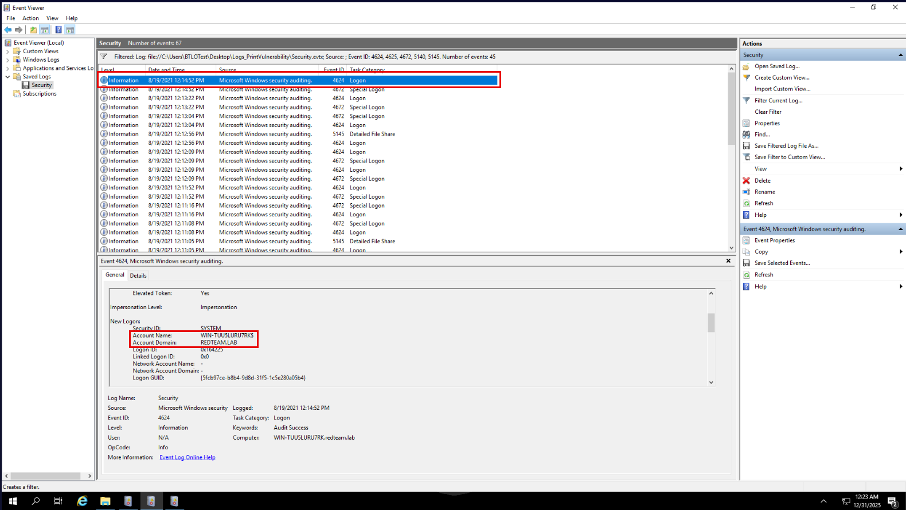
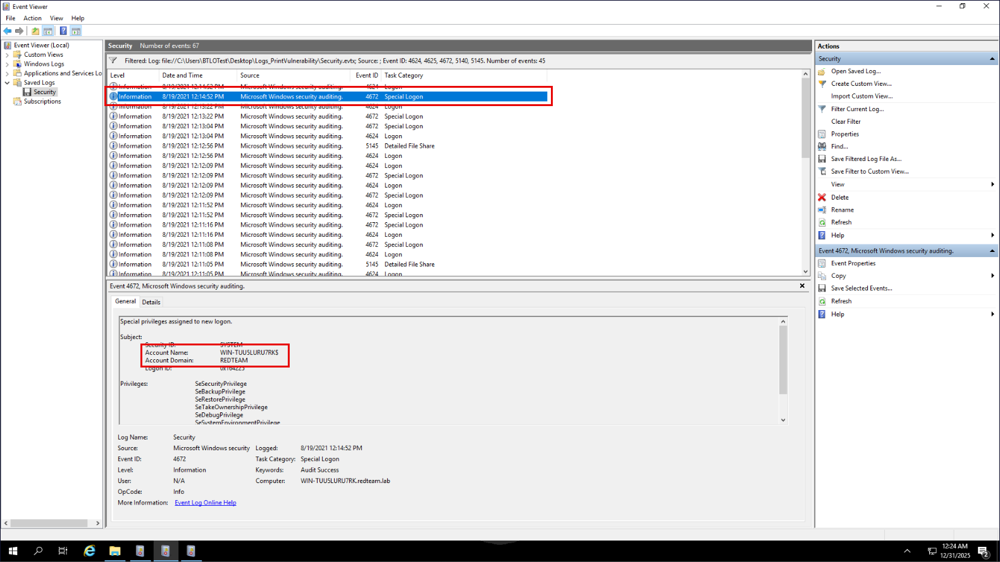
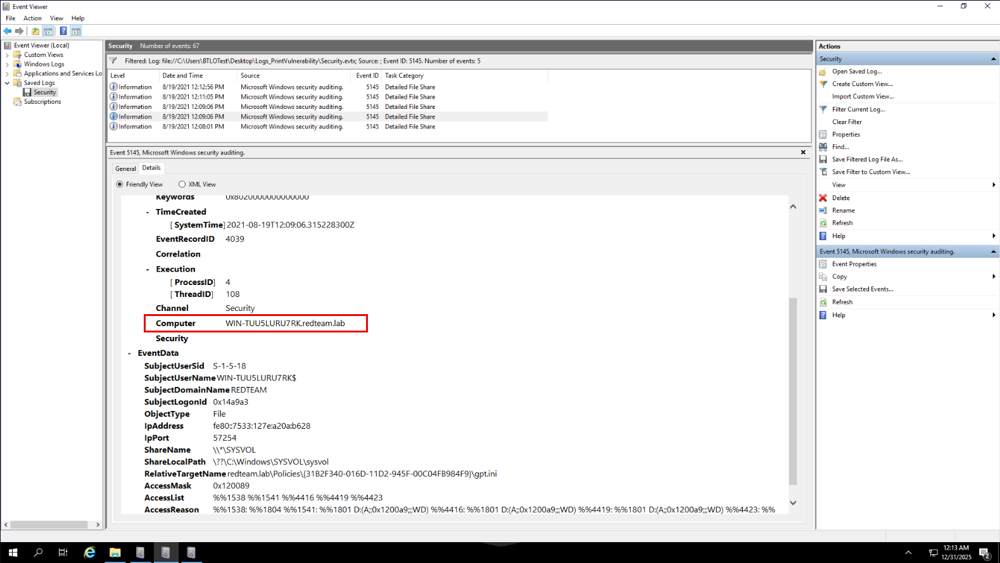
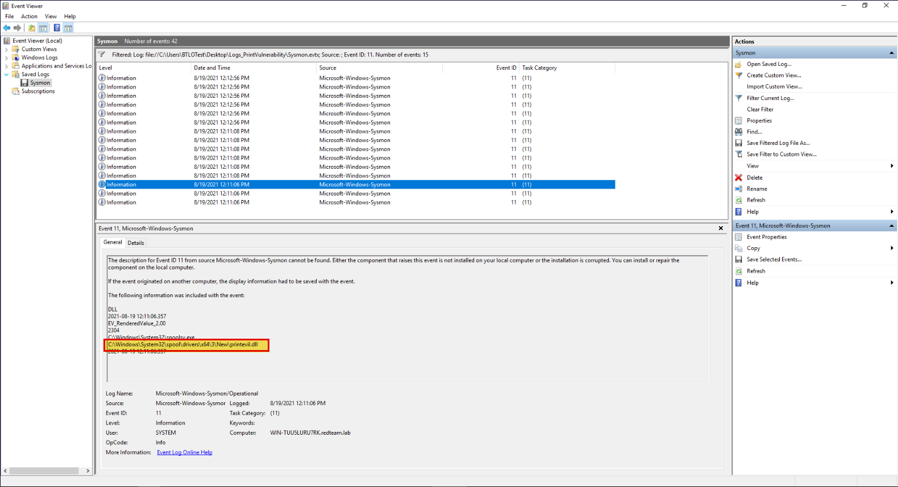
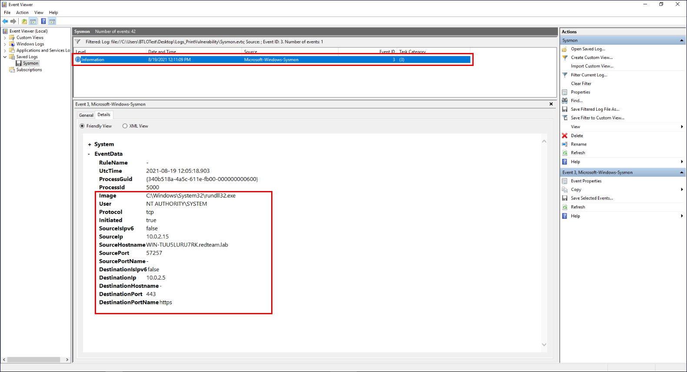
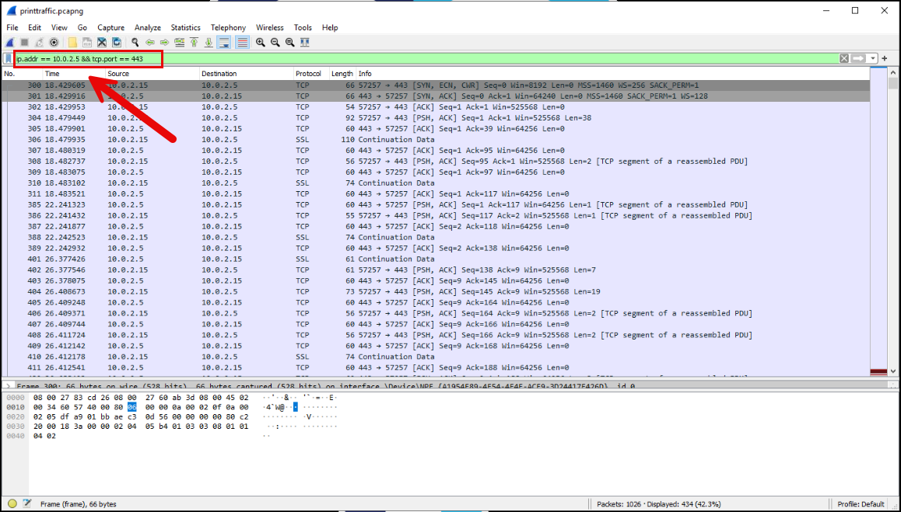
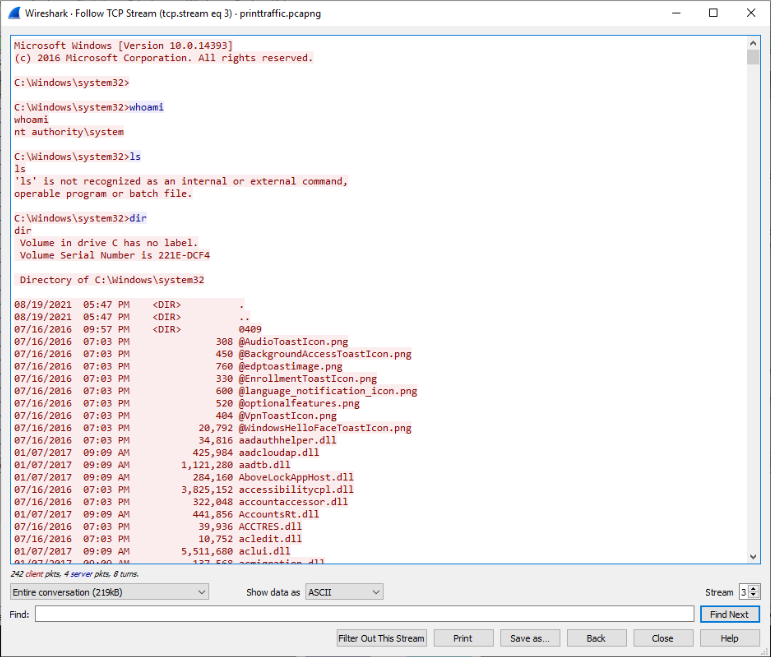
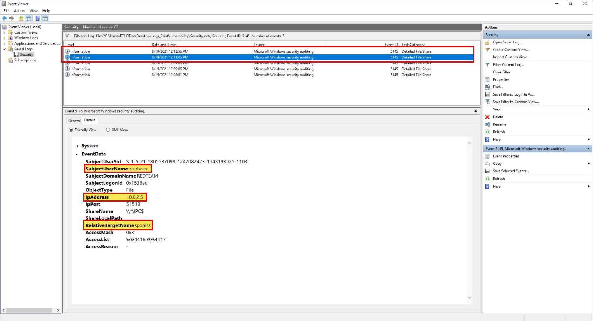
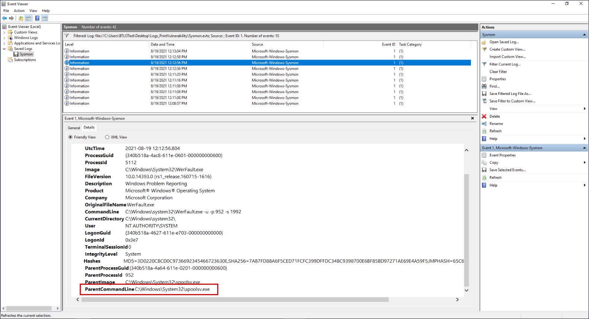

# Windows Service Exploitation Investigation (Print Spooler Remote Code Execution)

### Executive Summary
This investigation analyzes a simulated security incident involving the abuse of a trusted Windows service that resulted in unauthorized file transfer, remote code execution, and the establishment of a reverse shell connection. The attacker leveraged native Windows components to execute malicious code and communicate with external infrastructure without relying on custom tooling.

The purpose of this investigation is to reconstruct the attacker’s activity using host-based and network-based telemetry and to identify observable artifacts that can support reliable detections. Findings from this analysis highlight how legitimate Windows services can be abused and which indicators are most valuable for SOC and detection engineering teams.

---

### Incident Scope

This investigation examines a simulated post-compromise scenario in which a known vulnerability in Windows Print Services was exploited to abuse the Print Spooler service. To recreate realistic conditions, a deliberately vulnerable Windows environment was deployed and a working exploit was executed prior to analysis.

The scope of this investigation is limited to post-incident analysis performed from a defensive perspective. The objective is not to reproduce or weaponize the exploit, but to analyze system and network logs after the attack has already occurred. Analysis focuses on reconstructing attacker behavior, identifying infrastructure interaction, and extracting artifacts that can inform detection and monitoring efforts.

Specifically, this investigation seeks to answer:
- What infrastructure the attacker interacted with
- How the attacker transferred files and executed code
- What evidence of this activity is visible in logs and network data
- Which artifacts can be monitored or alerted on in future detections

The investigation relies on saved Windows event logs and associated network telemetry, reflecting a workflow commonly performed by SOC analysts during post-incident review. Activities outside this scope—such as exploit development, vulnerability analysis, or live system interaction—were intentionally excluded.

The role of the blue team in this scenario is not to reproduce the exploit, but to analyze system and network logs after the attack has already occurred. The goal is to identify observable artifacts left behind by the attacker so those artifacts can be used by the SOC and detection engineering teams to create reliable detection rules.

<blockquote>
Network printer sharing relies on SMB to transfer printer drivers and related files between systems. In this scenario, the Print Spooler service was abused to access a printer-related SMB share hosted on attacker-controlled infrastructure, resulting in the transfer of malicious files. Because SMB is the underlying mechanism used for network-based printing and driver distribution, file share access events (such as Event ID 5145) provide key evidence of Print Spooler abuse and are critical for reconstructing the attack chain and identifying detection opportunities.
</blockquote>

---

### Environment, Evidence, and Tools

- **Operating System:** Windows
- **Data Sources Reviewed:**
  - Windows Event Logs (Security, System)
  - Network Traffic Capture (PCAP)
  - File System Artifacts
- **Tools Used:** Event Viewer, Wireshark, PowerShell / Command Prompt

---

### Investigative Questions

The following questions guided the investigation and helped structure analysis of host-based and network-based evidence. They are designed to reconstruct the attacker’s activity, validate exploitation of the Windows Print Spooler service, and identify artifacts relevant for detection and response.

- What Windows service or component was abused to enable unauthorized file transfer and code execution?
- How did the attacker deliver malicious files to the host, and what protocol or mechanism was used?
- Which files were written to disk as a result of the service abuse, and where were they stored?
- How was the malicious payload executed, and which trusted binaries or services were involved?
- Did the attacker achieve elevated execution context, and how can that be confirmed from logs?
- What outbound network connections were established following execution, and which process initiated them?
- What commands or actions were performed after exploitation to validate access or maintain control?
- Which host-based and network-based artifacts provide the strongest indicators for detection and monitoring?

---

### Investigation Timeline

This timeline summarizes the reconstructed sequence of attacker activity based on correlated host-based and network-based evidence. Events are ordered to reflect the progression of the intrusion from initial service abuse through post-exploitation activity and outbound communication.

- **T0 — Post-incident dataset review initiated:** Saved Windows event logs and network telemetry were reviewed to establish data availability and define the scope of post-compromise analysis.
- **T1 — Suspicious service-related file access identified:** File share access telemetry surfaced activity consistent with the Print Spooler service accessing an external SMB share, indicating potential abuse of printer-related functionality.
- **T2 — Unauthorized file transfer observed:** Security events confirmed transfer of a printer-related file from attacker-controlled infrastructure to the target host, consistent with malicious payload delivery.
- **T3 — Malicious file written to disk:** Host-based telemetry showed a non-standard DLL written into the Print Spooler driver directory, indicating attacker-controlled file placement on the system.
- **T4 — Code execution via trusted service confirmed:** Process execution evidence demonstrated that the attacker-supplied DLL was executed through the Print Spooler service, enabling code execution under a trusted Windows component.
- **T5 — Post-exploitation execution chain observed:** A legitimate Windows binary was used to load the malicious code, allowing attacker activity to blend into normal system behavior.
- **T6 — Outbound command-and-control activity detected:** Network telemetry confirmed an outbound connection initiated from the compromised host to attacker-controlled infrastructure, consistent with reverse shell behavior.
- **T7 — Privilege validation activity identified:** Post-exploitation command execution confirmed that the attacker successfully achieved and validated elevated execution context on the host.

---

### Investigation Walkthrough

<strong>📚 Walkthrough Navigation (click to expand)</strong>

- [1) Initial Triage: Attacker Infrastructure Discovery](#-1-initial-triage-attacker-infrastructure-discovery)
  - [1.1) Identifying Attacker-Controlled Domain Context](#-11-identifying-attacker-controlled-domain-context)
  - [1.2) Confirming Infrastructure via SMB Telemetry](#-12-confirming-infrastructure-via-smb-telemetry)
- [2) Initial Access: Payload Delivery via Print Spooler Abuse](#-2-initial-access-payload-delivery-via-print-spooler-abuse)
  - [2.1) Identifying the Malicious Printer Driver Payload](#-21-identifying-the-malicious-printer-driver-payload)
- [3) Payload Staging: File System Impact and Driver Placement](#-3-payload-staging-file-system-impact-and-driver-placement)
  - [3.1) Malicious Driver Staging within Print Spooler Directories](#-31-malicious-driver-staging-within-print-spooler-directories)
- [4) Payload Execution and Reverse Shell Establishment](#-4-payload-execution-and-reverse-shell-establishment)
  - [4.1) Identifying Reverse Shell Execution via Host Telemetry](#-41-identifying-reverse-shell-execution-via-host-telemetry)
  - [4.2) Validating Reverse Shell Activity via Packet Capture Analysis (Wireshark)](#-42-validating-reverse-shell-activity-via-packet-capture-analysis-wireshark)
- [5) SMB-Based Print Spooler Service Interaction](#-5-smb-based-print-spooler-service-interaction)
  - [5.1) Identifying How PRint Spooler Service Was Accessed](#-51-identifying-how-print-spooler-service-was-accessed)
- [6) Exploit Side Effects: Error Handling and Abnormal Process Behavior](#-6-exploit-side-effects-error-handling-and-abnormal-process-behavior)
  - [6.1) Determing If Print Spooler Service Abuse Caused Any Other Abnormal Behavior](#-61-determing-if-print-spooler-service-abuse-caused-any-other-abnormal-behavior)
- [7) Reconstructing the Exploitation Execution Chain](#-7-reconstructing-the-exploitation-execution-chain)
- [8) Post-Exploitation Privilege Validation](#-8-post-exploitation-privilege-validation)

#### ▶ 1) Initial Triage: Attacker Infrastructure Discovery
- [🔷 1.1) Identifying Attacker-Controlled Domain Context](#-11-identifying-attacker-controlled-domain-context)
- [🔷 1.2) Confirming Infrastructure via SMB Telemetry](#-12-confirming-infrastructure-via-smb-telemetry)

As part of the investigation, saved Windows Security event logs were reviewed to identify infrastructure involved in the simulated attack. Because one of the primary goals of detection engineering is to distinguish attacker-controlled resources from legitimate internal activity, the first step was to determine whether the affected system communicated with external or non-enterprise infrastructure.

##### 🔷 1.1) Identifying Attacker-Controlled Domain Context

The Security log was filtered for authentication and network share–related events (Event IDs `4624`, `4625`, `4672`, `5140`, and `5145`). These events commonly capture activity related to logons, privilege usage, and SMB-based file access, all of which are relevant when investigating service abuse and remote exploitation.

During the investigation, different Windows Security events displayed the domain name in different formats, which can initially appear inconsistent. For example, `Event ID 4672 (Special Logon)` displayed the domain as `REDTEAM`, while `Event ID 4624` (Logon) and network-related events displayed the fully qualified domain `redteam.lab`.

This difference occurs because Windows logs record different types of context depending on the event. Authentication and privilege-related events (such as `4672`) commonly use the NetBIOS domain name, which is a short, internal identifier used by Windows for security principals. These values are valid for authentication purposes but do not represent DNS-based infrastructure.

   
  <em>Figure 1</em>

   
  <em>Figure 2</em>

<blockquote>
Analyst Note: Why Security Logs Were Used Instead of Sysmon

The Security event log was used to identify the domain associated with the red team’s test setup because it records authentication activity and network file access tied to Windows domain context. Events such as logons, privilege assignments, and SMB file share access include system-generated metadata that reflects how the host identifies itself within a domain.

For this specific task—determining the domain used by the red team—Security events provide authoritative fields such as the Computer name and domain-related attributes that directly indicate domain membership and network identity.

While Sysmon is also a valuable data source, it serves a different purpose. Sysmon primarily focuses on process creation, command-line execution, file creation, and network connections at the host level. Although Sysmon can show IP addresses, ports, and process behavior, it does not consistently record domain membership or fully qualified domain names (FQDN) in a way that is reliable for identifying attacker-controlled domains.

For this reason, Security logs were the appropriate source for identifying the red team’s domain, while Sysmon logs were reserved for later stages of the investigation, such as analyzing process execution, file creation, and outbound network activity associated with the exploit.
</blockquote>

**Artifact Identified:** Attacker-controlled DNS domain used in the test environment (redteam.lab)

##### 🔷 1.2) Confirming Infrastructure via SMB Telemetry

To accurately identify the domain used by the red team for their test setup, the investigation focused on network-related activity, specifically Event ID `5145` (Detailed File Share). This event type reflects SMB-based network access and includes system-generated metadata about the host involved in the activity.

By reviewing the Details → System → Computer field within Event ID `5145`, the system’s fully qualified name (`WIN-TU5LURR7RK.redteam.lab`) was observed. This confirms that `redteam.lab` is the DNS domain associated with the red team’s infrastructure. DNS domains are authoritative for detection and scoping purposes, which is why this value was used rather than the NetBIOS domain name.

In this context:
- `WIN-TU5LURR7RK`is the hostname of the Windows system involved in the incident. This is a randomly generated host name commonly assigned to Windows servers or lab systems.
- `redteam.lab` is the DNS domain to which the host belongs.

   
  <em>Figure 3</em>

This confirms that the affected system was joined to the `redteam.lab` domain, which represents the attacker-controlled environment created by the red team as part of the exercise.

Identifying this domain is critical for detection efforts. Fully qualified domain names can be searched across logs, used to scope additional affected systems, and incorporated into detection logic. In contrast, short NetBIOS domain names like REDTEAM provide limited context and are not suitable for enterprise-wide monitoring or alerting.

**Artifact Identified:** SMB-based service interaction associated with Print Spooler abuse (Security Event ID 5145)

#### ▶ 2) Initial Access: Payload Delivery via Print Spooler Abuse

- [🔷 2.1) Identifying the Malicious Printer Driver Payload](#-21-identifying-the-malicious-printer-driver-payload)

With attacker-controlled infrastructure identified, the investigation next focuses on how the exploit was delivered to the host. This phase examines evidence of Print Spooler abuse and identifies the malicious payload introduced through the trusted printer driver mechanism.

##### 🔷 2.1) Identifying the Malicious Printer Driver Payload

During Sysmon Event ID 11 analysis, multiple DLL files were observed being written under the printer driver directory by the `spoolsv.exe` process. Understanding which of these files are expected and which represent malicious activity requires basic knowledge of how Windows printing works.

The process `spoolsv.exe` is the Windows Print Spooler service. It runs with high privileges and is responsible for managing printers, loading printer drivers, and handling print-related operations. Any time a printer driver is installed, updated, or initialized, `spoolsv.exe` is the process that performs those actions. As a result, it is normal for `spoolsv.exe` to interact with printer-related DLL files during legitimate printer activity.

One of the DLLs observed, `unidrv.dll`, is the Universal Printer Driver provided by Windows. This file exists on all Windows systems and is used to support a wide range of printers. During printer operations, Windows may copy, initialize, or re-register this driver, which can result in file creation or modification events even though the file itself is legitimate. Seeing `unidrv.dll` associated with Print Spooler activity is therefore expected behavior.

Similarly, `winhttp.dll` is a core Windows networking library used by many services, including the Print Spooler. Its presence during printer-related activity reflects normal Windows behavior and does not indicate malicious activity on its own.

In contrast, `printevil.dll` does not correspond to any known Windows or standard printer driver component. It appears only during the exploitation timeframe and is written to disk by the Print Spooler service. In the context of this red team test, where the red team intentionally exploited Windows Print Services, strongly indicates that `printevil.dll` represents an attacker-supplied printer driver rather than a legitimate system file.

   
  <em>Figure 4</em>

Multiple Sysmon Event ID 11 entries referencing `printevil.dll` were observed. This does not indicate multiple different payloads. Instead, it reflects the fact that the Print Spooler may access, load, or re-register the same driver multiple times during exploitation. Sysmon records each file creation or modification attempt, so repeated interaction with the same malicious driver results in multiple logged events for the same file.

<blockquote>
Legitimate printer drivers are reused by Windows during printing operations, while malicious drivers are newly introduced by attackers; identifying the difference requires understanding both the attack context and baseline Windows behavior.
</blockquote>

Taken together, this activity suggests that the attacker abused the Print Spooler service to introduce a custom, non-standard printer driver into the system. While legitimate Windows DLLs such as `unidrv.dll` and `winhttp.dll` appear due to normal printer initialization behavior, the introduction of `printevil.dll` represents the actual payload delivered as part of the attack.

**Artifacts Identified:** 
- Attacker-supplied printer driver (`printevil.dll`)
- File creation event showing malicious DLL written by `spoolsv.exe` (Sysmon Event ID 11)

#### ▶ 3) Payload Staging: File System Impact and Driver Placement

- [🔷 3.1) Malicious Driver Staging within Print Spooler Directories](#-31-malicious-driver-staging-within-print-spooler-directories)

Once execution-related network activity was observed, file system artifacts were reviewed to understand where and how the malicious payload was written to disk. This section documents the staging location used by the attacker and explains its significance within the Print Spooler driver workflow.

##### 🔷 3.1) Malicious Driver Staging within Print Spooler Directories

During analysis of Sysmon Event ID 11 (FileCreate) events, it was observed that the malicious file `printevil.dll` was copied to the following directory: `C:\Windows\System32\spool\drivers\x64\3\New\printevil.dll`

This location is significant because it is part of the Windows Print Spooler driver directory structure. When printer drivers are installed or updated on a 64-bit Windows system, the Print Spooler service (`spoolsv.exe`) temporarily stages new or modified driver files in the `x64\3\New` directory before they are registered and moved into active use.

In this scenario, the attacker abused the Print Spooler service to masquerade a malicious payload as a printer driver. Because `spoolsv.exe` runs with elevated privileges and is trusted to manage printer drivers, it was able to write the attacker-supplied DLL directly into the printer driver staging directory. This behavior aligns with known Print Spooler exploitation techniques, where attackers leverage legitimate driver installation mechanisms to place malicious DLLs in trusted system locations.

The presence of the non-standard DLL, `printevil.dll`, in the `spool\drivers\x64\3\New` directory indicates that the file was treated by the operating system as a newly introduced printer driver. From a defensive perspective, this is a strong indicator of malicious activity, as legitimate printer drivers are typically well-known, signed components, whereas a custom DLL introduced into this directory suggests unauthorized driver installation through service abuse.

Artifact Identified: Printer driver staging path used for malicious payload placement (`C:\Windows\System32\spool\drivers\x64\3\New\printevil.dll`)

#### ▶ 4) Payload Execution and Reverse Shell Establishment
- [🔷 4.1) Identifying Reverse Shell Execution via Host Telemetry](#-41-identifying-reverse-shell-execution-via-host-telemetry)
- [🔷 4.2) Validating Reverse Shell Activity via Packet Capture Analysis (Wireshark)](#-42-validating-reverse-shell-activity-via-packet-capture-analysis-wireshark)

After confirming payload delivery, the investigation shifts to determining whether the malicious code was executed and resulted in external communication. This section analyzes host and network telemetry to identify outbound connections consistent with reverse shell behavior.

##### 🔷 4.1) Identifying Reverse Shell Execution via Host Telemetry

To identify the attacker’s reverse shell endpoint, the Sysmon Operational log was opened in Event Viewer and filtered for Event ID 3 (Network Connection). This event records process-initiated network connections and provides authoritative source and destination details.

<blockquote>
A reverse shell is a technique where a compromised system initiates an outbound connection back to the attacker and provides an interactive command shell over that connection. This allows the attacker to remotely execute commands on the victim system while bypassing inbound firewall restrictions, since the connection originates from inside the network.
</blockquote>

Reviewing the event occurring immediately after payload execution showed that the process `C:\Windows\System32\rundll32.exe`, running as `NT AUTHORITY\SYSTEM`, initiated an outbound TCP connection. The destination was `10.0.2.5` on port `443`, confirming attacker-controlled infrastructure and active remote communication.

   
  <em>Figure 5</em>

The filtered event were then reviewed around the same timeframe as the creation of `printevil.dll`. During this review, an outbound TCP connection initiated by the affected host was observed shortly after the malicious DLL was written to disk. The timing of this activity is significant, as it directly follows payload staging and indicates that the malicious printer driver was executed rather than remaining dormant.

The destination of the connection was external to the enterprise environment, which further suggests attacker-controlled infrastructure rather than legitimate system or update traffic. Based on the close temporal correlation and the outbound nature of the connection, this activity was assessed as attacker-initiated communication resulting from successful exploitation.

Key fields in this event provide additional context:

- Image: `rundll32.exe` indicates execution of code via a DLL, which aligns with printer driver abuse.
- Initiated: `true` confirms the connection was outbound from the host.
- SourceIp / SourcePort: Identify the compromised system and ephemeral client port.
- DestinationIp / DestinationPort: Identify the attacker’s listener endpoint.
- User: `SYSTEM` confirms high-privilege execution.

Artifact Identified:
Attacker command-and-control endpoint (`10.0.2.5:443`)

##### 🔷 4.2) Validating Reverse Shell Activity via Packet Capture Analysis (Wireshark)

After identifying the outbound connection in Sysmon, the provided packet capture was opened in Wireshark to confirm the activity at the network level. The traffic was filtered using `ip.addr == 10.0.2.5 && tcp.port == 443` to isolate communication between the compromised host and the suspected attacker endpoint, confirming that the connection observed in host-based logs was reflected in the packet capture. 

   
  <em>Figure 6</em>

Following the TCP stream in Wireshark revealed an interactive command session between the compromised host and attacker-controlled infrastructure. The stream contained multiple command inputs and corresponding outputs, confirming that the outbound connection was not a transient network event but an active reverse shell. Notably, execution of the `whoami` command returned `NT AUTHORITY\SYSTEM`, confirming that the attacker achieved `SYSTEM-level` privileges on the host. This network-level evidence validates successful remote command execution and corroborates host-based findings.

   
  <em>Figure 7</em>

Artifact Identified: Attacker command-and-control endpoint (`10.0.2.5:443`)

#### ▶ 5) SMB-Based Print Spooler Service Interaction
- [🔷 5.1) Identifying How PRint Spooler Service Was Accessed](#-51-identifying-how-print-spooler-service-was-accessed)

After confirming that the exploit resulted in an outbound reverse shell, the investigation shifted to understanding how the Print Spooler service was accessed at the network level. Because Windows printing relies on SMB for remote printer and driver operations, SMB-related Security events are a key source of evidence when investigating Print Spooler abuse.

##### 🔷 5.1) Identifying How PRint Spooler Service Was Accessed

To identify evidence of Print Spooler interaction over SMB, the Windows Security log was filtered for Event ID 5145 (Detailed File Share) because this event records SMB access metadata such as:
- `AccountName`
- `SourceAddress`
- `ShareName`
- `RelativeTargetName`
- `AccessMask` 

Each 5145 event was reviewed under `Details → Friendly View → EventData`, and only the event matching all required conditions was treated as relevant:
- `SubjectUserName` = `printuser`
- `IpAddress` = `10.0.2.5` (attacker ip)
- `RelativeTargetName` = `spoolss`

These fields were used because together they identify the account involved, the remote source of the activity, and the specific Print Spooler service interface accessed, allowing Print Spooler abuse to be distinguished from normal SMB or domain activity. Other 5145 events referencing resources such as SYSVOL or policy files (e.g., gpt.ini) were excluded because they represent normal domain activity rather than Print Spooler named pipe access.

Within these events, SMB access targeting the `spoolss` resource was observed. The `spoolss` named pipe is used by the Print Spooler service to handle remote printer operations. While access to `spoolss` can occur during legitimate printing activity, its presence here coincided with malicious driver delivery and exploitation timing, indicating abuse rather than normal usage.

   
  <em>Figure 8</em>

The associated ShareName was `\\*\IPC$`, which is commonly used for inter-process communication and remote service interaction over SMB. 

<blockquote>
The "ShareName" field indicates which SMB share was accessed during the event. In this case, "\\*\IPC$" represents the Inter-Process Communication (IPC) share, which is used by Windows to expose named pipes and remote service interfaces over SMB. Access to "IPC$" is required for interacting with services such as the Print Spooler, including the spoolss named pipe.

In this investigation, access to "\\*\IPC$" combined with a "RelativeTargetName" of "spoolss" confirms that the Print Spooler service was accessed remotely via SMB rather than a regular file share.
</blockquote>

The `AccessMask` value (`0x3`) indicated that the account had sufficient access to interact with the service. 

<blockquote>
Seeing "0x3" when RelativeTargetName = spoolss means the account had sufficient access to interact with the Print Spooler service, not just view it. That level of access aligns with service interaction/exploitation, not passive access.
</blockquote>

Taken together, these details confirm that the Print Spooler service was accessed remotely over SMB as part of the attack.

<blockquote>
During review of Security Event ID 5145, two log entries were identified that met all required conditions: "SubjectUserName" = "printuser", "IpAddress = 10.0.2.5", and "RelativeTargetName = spoolss". The presence of multiple matching events indicates repeated or sustained interaction with the Print Spooler named pipe rather than a single, isolated access attempt. This behavior is consistent with exploitation activity, where multiple requests are made as part of service interaction, payload delivery, or command execution, and does not represent multiple distinct attacks.
</blockquote>

#### ▶ 6) Exploit Side Effects: Error Handling and Abnormal Process Behavior
- [🔷 6.1) Determing If Print Spooler Service Abuse Caused Any Other Abnormal Behavior](#-61-determing-if-print-spooler-service-abuse-caused-any-other-abnormal-behavior)

After confirming successful exploitation and reverse shell activity, the investigation shifted back to host-based process telemetry to understand whether the abuse of the Print Spooler service caused any secondary or abnormal process behavior. Exploits often destabilize services, which can trigger built-in Windows error-handling mechanisms, providing additional evidence of malicious activity.

##### 🔷 6.1) Determing If Print Spooler Service Abuse Caused Any Other Abnormal Behavior

To identify this behavior, Sysmon process creation events (Event ID 1) were reviewed in Event Viewer. Sysmon was used for this step because it records detailed process execution metadata, including parent–child relationships and command-line context, which are not consistently available in standard Security logs.

During this review, the Windows Error Reporting process (WerFault.exe) was observed executing shortly after the Print Spooler activity. Under normal circumstances, WerFault.exe is launched when an application crashes or encounters an unexpected error, and its presence indicates that Windows detected abnormal behavior in another process.

To determine what triggered this error-handling process, the investigation examined the parent process information associated with WerFault.exe. The Sysmon event revealed that WerFault.exe was launched by:

`C:\Windows\System32\spoolsv.exe`

   
  <em>Figure 9</em>

This finding is significant because `spoolsv.exe` is the Windows Print Spooler service. Its role is to manage printer operations and driver loading, and it does not normally trigger error-reporting processes during routine printer activity. The fact that `WerFault.exe` was spawned directly by `spoolsv.exe` strongly suggests that the Print Spooler service encountered an error as a result of loading or executing attacker-supplied code.

The close timing between Print Spooler abuse, malicious driver staging, and the execution of WerFault.exe indicates that the error-reporting activity was a side effect of exploitation rather than normal system behavior.

<blockquote>
The command-line arguments associated with "WerFault.exe" indicate that it was launched automatically by Windows Error Reporting in response to a faulting process. The inclusion of the "-p" parameter linking the event to "spoolsv.exe" further supports that the Print Spooler service encountered an error as a result of exploitation rather than user-initiated activity.
</blockquote>

**Clarification: Why Processes and File Names Both End in .exe**

Windows processes are always launched from executable files, which use the `.exe` file extension. When a log entry references a process such as spoolsv.exe or WerFault.exe, it is referring to the executable file on disk that was loaded into memory and executed as a running process. In other words, `spoolsv.exe` is the executable file stored on disk. When Windows runs it, it becomes the Print Spooler service process. The same applies to `WerFault.exe`, which is the executable responsible for Windows error reporting This is why process names and file names appear interchangeable in logs, they represent the same underlying executable, viewed from either a file system or process execution perspective.

**Why This Step Matters**

Identifying that `WerFault.exe` was launched by `spoolsv.exe` provides additional confirmation that a trusted Windows service was abused, the abuse caused abnormal execution behavior, and exploitation progressed far enough to destabilize the service. From a detection standpoint, unexpected parent–child relationships involving trusted services and error-handling binaries can serve as valuable indicators of exploitation activity.

#### ▶ 7) Reconstructing the Exploitation Execution Chain

To better understand why WerFault.exe executed, the investigation remained within the Sysmon Operational logs and focused on process creation events (Event ID 1). Sysmon was used for this step because it records detailed execution metadata, including parent process relationships and command-line context, which are necessary for reconstructing execution flow after exploitation.

The Sysmon log was filtered to locate the process creation event for WerFault.exe. Once identified, the event details were reviewed to determine which process launched it. This revealed that WerFault.exe was spawned by:

`C:\Windows\System32\spoolsv.exe`

   
  <em>Figure 10</em>

This finding is significant because `spoolsv.exe` is the Windows Print Spooler service. Under normal operating conditions, routine printer activity and driver installation do not cause the Print Spooler to repeatedly invoke Windows Error Reporting. The appearance of `WerFault.exe` in this context indicates that the Print Spooler service encountered an unexpected error, likely as a result of loading or interacting with attacker-supplied code.

<blockquote>
Following establishment of the reverse shell, Sysmon process creation events revealed execution of "whoami.exe" with the command line whoami. 

Unlike earlier system-generated processes, this command represents interactive attacker activity, as "whoami" is a user-invoked utility rather than an automated system process. The command output confirmed execution under the "NT AUTHORITY\SYSTEM" context, indicating full system-level compromise.
</blockquote>

#### ▶ 8) Post-Exploitation Privilege Validation

After confirming successful exploitation and service abuse, the final step of the investigation focused on determining the level of access gained by the attacker. Establishing the execution context is critical for assessing impact and severity.

Network-level analysis of the reverse shell session showed that the attacker issued interactive commands shortly after the connection was established. One of the first commands observed was whoami, which is commonly used during post-exploitation to identify the current user and privilege level.

The output of this command indicated execution as NT AUTHORITY\SYSTEM, confirming that the attacker achieved SYSTEM-level privileges on the host. This represents the highest level of access on a Windows system and indicates a complete compromise.

From an investigative standpoint, this validation confirms that the attack progressed beyond initial code execution and resulted in full administrative control. This information is critical for both incident response and detection engineering, as it demonstrates the potential impact of Print Spooler abuse if left undetected.

---

### Findings Summary

This section consolidates high-confidence conclusions derived from correlated Windows Security logs, Sysmon telemetry, and network traffic analysis. Findings are limited to activity that can be directly supported by observed host-based and network-based evidence within scope.

- The Windows Print Spooler service was abused to access a printer-related SMB share hosted on attacker-controlled infrastructure.
- Unauthorized file transfer activity resulted in the delivery of an attacker-supplied DLL to the target host, masquerading as a legitimate printer-related component.
- Host-based telemetry confirmed that the malicious DLL was written to a Print Spooler–related directory, indicating successful payload placement.
- The attacker leveraged a trusted Windows service (`spoolsv.exe`) to execute the malicious DLL, enabling code execution without direct user interaction.
- A legitimate Windows binary was subsequently used to load the attacker-controlled code, allowing execution to blend into normal system behavior.
- Network telemetry confirmed an outbound connection initiated from the compromised host to attacker-controlled infrastructure, consistent with reverse shell behavior.
- Post-exploitation command execution confirmed that the attacker achieved and validated elevated (SYSTEM-level) execution context on the host.

Overall, the evidence reflects a service-abuse intrusion pattern involving file transfer via SMB, trusted service execution, and outbound command-and-control communication using native Windows components.

**Detailed Evidence Reference:**  
For a full, artifact-level breakdown of logs, alerts, and forensic indicators that support these findings — including where each artifact was identified during the investigation — see: **`detection-artifact-report.md`**

---

### Defensive Takeaways

This section highlights defender-relevant patterns observed during the investigation, focusing on behaviors and telemetry that can be operationalized for detection and monitoring rather than exploit mechanics.

- Trusted Windows services can be abused for code execution without introducing custom malware binaries.
- SMB-based file access tied to printer services can indicate abuse when involving non-standard shares or attacker-controlled infrastructure.
- File creation within Print Spooler–related directories is a strong indicator of malicious activity and should be treated as high-risk.
- Abnormal parent–child process relationships involving `spoolsv.exe` or service-initiated execution warrant immediate investigation.
- Legitimate Windows utilities (for example, `rundll32.exe`) are frequently leveraged to execute attacker-controlled code while evading naive detections.
- Correlating service execution with outbound network activity is critical for identifying post-exploitation behavior.
- Network telemetry and packet capture data can provide definitive confirmation of interactive attacker access, even when host logs are limited.

This investigation reinforces the importance of combining service telemetry, file system monitoring, and network analysis to reconstruct abuse of native Windows components.

---

### Artifacts Identified

This section lists concrete artifacts uncovered during the investigation that support the final determination and can be used for validation, hunting, detection development, or follow-up analysis.

- Abused Windows service: Print Spooler (`spoolsv.exe`)
- Protocol leveraged for file transfer: SMB (printer-related file sharing)
- Malicious file delivered: attacker-supplied DLL masquerading as a printer driver
- File placement location: Print Spooler driver directory
- Execution mechanism: trusted service execution and subsequent loading via legitimate Windows binary
- Outbound communication process: service-executed payload establishing a reverse shell
- Destination infrastructure: attacker-controlled host observed in network telemetry
- Network evidence: packet capture confirming outbound interactive session
- Privilege context confirmed: `NT AUTHORITY\SYSTEM`

**Detailed Evidence Reference:**  
For a full, artifact-level breakdown of logs, alerts, and forensic indicators that support these findings — including where each artifact was identified during the investigation — see: **`detection-artifact-report.md`**

---

### Detection and Hardening Opportunities

This section summarizes high-level detection and hardening opportunities observed during the investigation. For detailed, actionable recommendations — including specific logging gaps, detection logic ideas, and configuration improvements — see: **`detection-and-hardening-recommendations.md`**

#### ▶ Containment Actions (Recommended)
These actions focus on halting exploitation and cutting off attacker access.

- Immediately isolate the affected host from the network.
- Disable the Print Spooler service on systems where it is not required.
- Block outbound connections to the identified attacker endpoint (`10.0.2.5:443`).
- Preserve malicious artifacts (`printevil.dll`) and associated event logs for response analysis.
- Revoke any credentials or service accounts observed interacting with the exploited service.

#### ▶ Eradication & Hardening Recommendations
These steps address the abuse of trusted Windows services.

- Apply security updates and patches addressing known Print Spooler vulnerabilities.
- Restrict SMB access to Print Spooler interfaces (`spoolss`) from untrusted networks.
- Implement application control to prevent unauthorized DLL execution via `rundll32.exe`.
- Monitor and restrict driver installation paths used by system services.
- Limit service account privileges associated with printing infrastructure.

#### ▶ Detection & Monitoring Recommendations
These detections focus on service abuse and post-exploitation behavior.

- Alert on SMB access to `IPC$` shares targeting `spoolss` from non-administrative sources.
- Detect non-standard DLLs written to Print Spooler driver directories.
- Alert on `spoolsv.exe` writing new DLLs followed by execution via `rundll32.exe`.
- Monitor outbound connections initiated by system-level processes.
- Correlate Print Spooler activity with network connections and elevated execution context.

#### ▶ Response Validation & Follow-Up (Optional)
- Review service execution and file system logs after containment to confirm no further DLL writes occur in Print Spooler directories.
- Validate that Print Spooler is disabled or restricted on systems where it is not required.
- Monitor for any additional outbound network connections initiated by system-level processes.
- Confirm that new alerts for Print Spooler–related SMB access and abnormal DLL execution would have triggered on the observed activity.
- Perform short-term network monitoring to ensure no additional reverse shell or callback activity is observed.

---

### MITRE ATT&CK Mapping

**Note:** This section provides a high-level summary of observed ATT&CK tactics and techniques. For evidence-backed mappings tied to specific artifacts, timestamps, and investigation steps, see: **`mitre-attack-mapping.md`**

The following mappings connect observed behaviors to MITRE ATT&CK techniques and cite the specific evidence identified during host-based and network telemetry analysis. Mappings are based on directly observed activity and artifacts within scope.

- **Initial Access — Ingress Tool Transfer (T1105):**  
  Malicious files were transferred to the host via SMB as part of Print Spooler abuse, confirmed through file share access events.

- **Execution — Service Execution (T1569.002):**  
  Attacker-supplied code was executed through the Print Spooler service (`spoolsv.exe`), enabling execution without direct user interaction.

- **Defense Evasion — Masquerading (T1036):**  
  The malicious DLL was disguised as a legitimate printer-related component and placed in a trusted service directory.

- **Command and Control — Application Layer Protocol: Web (T1071.001):**  
  An outbound connection from a system-level process established a reverse shell to attacker-controlled infrastructure.

- **Discovery — System Owner/User Discovery (T1033):**  
  Post-exploitation commands were executed to confirm SYSTEM-level privileges.

---

### MITRE ATT&CK Mapping (Table View)

**Note:** This section provides a high-level summary table of observed ATT&CK tactics and techniques. For evidence-backed mappings tied to specific artifacts, timestamps, and investigation steps, see: **`mitre-attack-mapping.md`**

| Tactic | Technique | Description |
|------|-----------|-------------|
| Initial Access | **Ingress Tool Transfer (T1105)** | Malicious DLL delivered via SMB during Print Spooler abuse. |
| Execution | **Service Execution (T1569.002)** | Code executed through the Print Spooler service. |
| Defense Evasion | **Masquerading (T1036)** | Malicious DLL disguised as a printer driver component. |
| Command and Control | **Application Layer Protocol: Web (T1071.001)** | Reverse shell communication established over web protocols. |
| Discovery | **System Owner/User Discovery (T1033)** | Commands executed to confirm execution context and privileges. |

---

