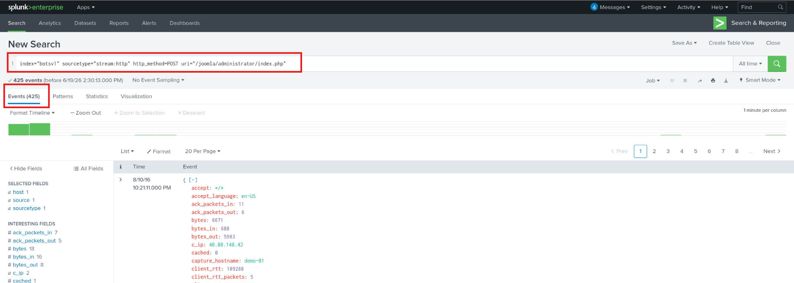
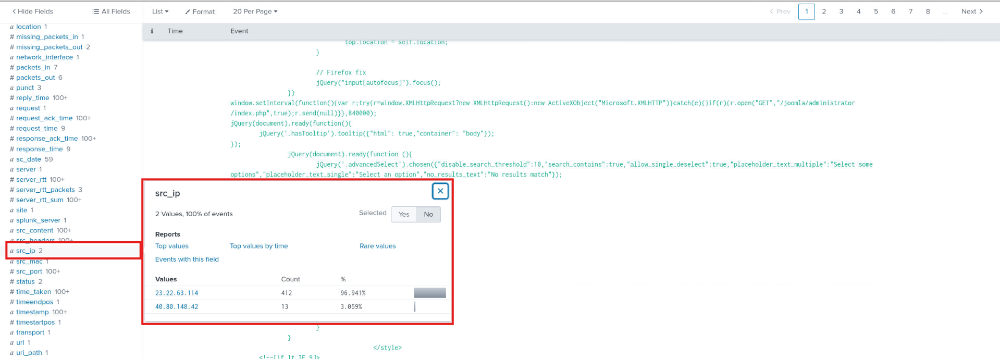
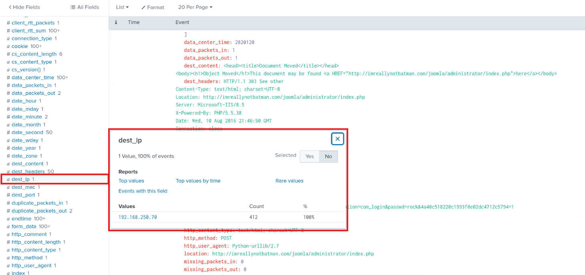
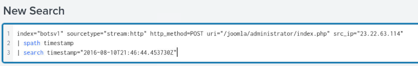
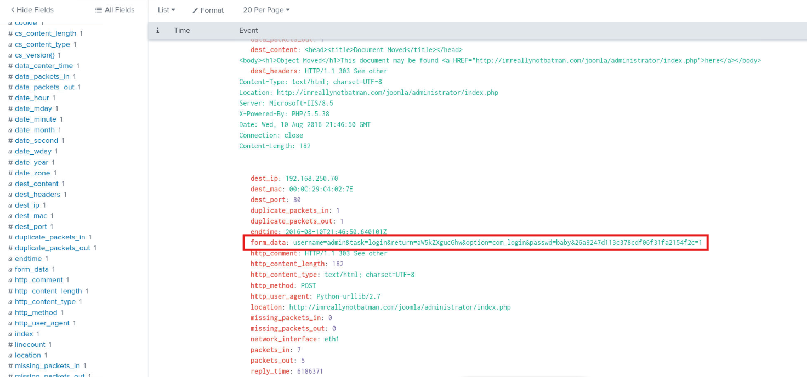
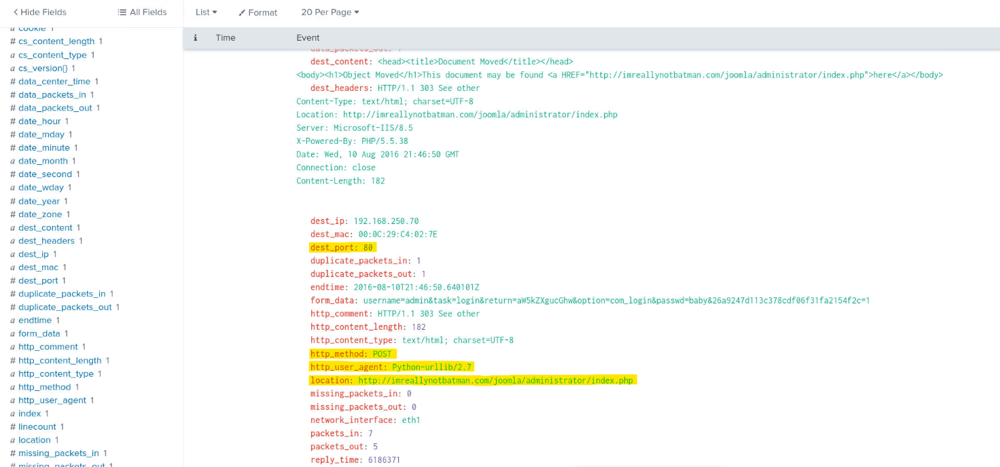
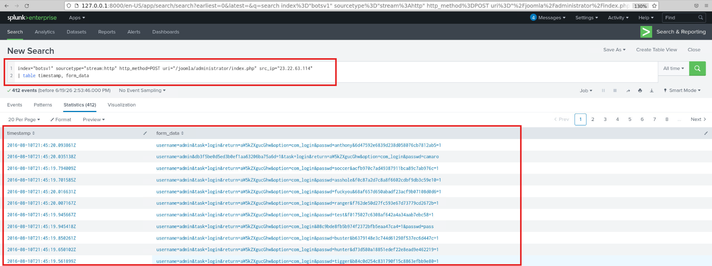

# Joomla Administrator Brute-Force Investigation

### Executive Summary

This investigation was initiated after security monitoring tools generated an alert indicating potential brute-force activity targeting the Joomla administrator portal hosted on imreallynotbatman.com. Initial telemetry suggested that a malicious actor was repeatedly submitting authentication requests against the administrative login interface in an apparent attempt to obtain unauthorized access.

Using Splunk, web application telemetry, and HTTP request metadata, the investigation focused on identifying the source of the attack, determining whether authentication attempts were successful, and assessing the scope and impact of any unauthorized access. Analysis revealed a high volume of HTTP POST requests directed at the Joomla administrator login page, with the overwhelming majority originating from a single external IP address.

Further examination of submitted form data, source activity, and authentication behavior confirmed the activity was consistent with an automated brute-force password guessing campaign targeting administrative credentials. The investigation reconstructed attacker activity and established a timeline of events to determine whether access was successfully obtained and what actions were performed following authentication.

---

### Scenario Context

The Security Operations team received an alert from internal security monitoring tools indicating that a malicious actor may be attempting to brute-force accounts associated with a publicly accessible Joomla web application. Due to the possibility of administrative account compromise and unauthorized access to the underlying server, the incident was classified as time-sensitive and prioritized for immediate investigation.

As the assigned analyst, the objective was to determine where the attack was originating from, identify whether any authentication attempts were successful, and assess what actions the attacker performed if access was obtained. Because active compromise was suspected, every minute of investigation represented potential additional time that an attacker could maintain access to systems or application resources.

Initial information provided to the investigation indicated that the Joomla administrative interface was located at:

`http://imreallynotbatman.com/joomla/administrator/index.php`

It was also known that valid login attempts would be submitted through HTTP POST requests. Based on this information, the investigation began by reviewing web application telemetry in Splunk to identify authentication activity targeting the administrator portal. From there, HTTP request metadata, source and destination information, submitted credentials, and related web traffic were analyzed to reconstruct the attack and determine its impact.
An investigation was initiated to determine:

- Whether the activity represented malicious authentication attempts
- Which source system generated the requests
- Which internal asset was targeted
- Whether submitted credentials could be observed
- Whether the behavior was consistent with brute-force activity

---

### Investigation Walkthrough

<details>
<summary><strong>📚 Walkthrough Navigation (Click To Expand)</strong></summary>

- Initial Detection
- Source IP Analysis
- Destination Asset Identification
- HTTP Request Review
- Credential Analysis
- Brute-Force Validation
- Findings Summary

</details>

---

<a id="-1-initial-detection"></a>

<details>
<summary><strong>▶ 1) Initial Detection</strong><br>
→ identifying suspicious authentication activity against the Joomla administrator portal
</summary><br>

**Goal:** Determine whether suspicious activity exists.

The investigation began by reviewing HTTP telemetry within the BOTSv1 dataset. Based on information indicating that Joomla administrator logins would be submitted using HTTP POST requests, the following search was executed:

```spl
index="botsv1" sourcetype="stream:http" http_method=POST uri="/joomla/administrator/index.php"
```
This search returned **425 HTTP POST requests** targeting the Joomla administrator login page.

The volume of requests directed at a sensitive administrative endpoint warranted additional investigation.

<p align="left">
  <br>
  <em>Figure 1 - Initial search identifying HTTP POST activity targeting the Joomla administrator portal</em>
</p>


</details>

---

<a id="-2-source-ip-analysis"></a>

<details>
<summary><strong>▶ 2) Source IP Analysis</strong><br>
→ identifying the primary source responsible for the login attempts
</summary><br>

**Goal:** Identify the source of the activity.

To determine where the requests originated, the `src_ip` field was reviewed using Splunk's Interesting Fields panel.

Analysis revealed two source IP addresses associated with the activity. One source accounted for nearly all observed events.

- Primary Source IP: `23.22.63.114`
- Observed Requests: `412 of 425 events`
- Percentage of Activity: `96.94%`

The concentration of requests originating from a single external source strongly suggests automated activity rather than legitimate user behavior.

<p align="left">
  <br>
  <em>Figure 2 - Source IP distribution showing 23.22.63.114 responsible for the majority of requests</em>
</p>


</details>

---

<a id="-3-destination-asset-identification"></a>

<details>
<summary><strong>▶ 3) Destination Asset Identification</strong><br>
→ determining which internal asset was targeted
</summary><br>

**Goal:** Identify the destination system receiving the requests.

After isolating the primary attacking source IP, the search was refined to include only activity originating from that address.

```spl
index="botsv1" sourcetype="stream:http" http_method=POST uri="/joomla/administrator/index.php" src_ip="23.22.63.114"
```

Review of the `dest_ip` field identified the internal system receiving the requests.

Target Web Server:

```text
192.168.250.70
```

This system hosted the Joomla application targeted throughout the attack sequence.

<p align="left">
  <br>
  <em>Figure 3 - Destination IP field identifying the targeted internal web server</em>
</p>

</details>

---

<a id="-4-http-request-review"></a>

<details>
<summary><strong>▶ 4) HTTP Request Review</strong><br>
→ examining individual HTTP POST requests submitted to the login portal
</summary><br>

<a id="-4-http-request-analysis"></a>

<details>
<summary><strong>▶ 4) HTTP Request Analysis</strong><br>
 → examining individual authentication requests submitted to the Joomla administrator portal
</summary><br>

**Goal:** Determine what data was being submitted to the application and whether the requests provide evidence of automated authentication abuse.

After identifying the primary source IP responsible for the activity and confirming the destination server hosting the Joomla application, the next step was to inspect individual HTTP POST requests submitted to the administrator login portal. While aggregate event counts established that suspicious activity was occurring, reviewing the contents of the requests themselves would provide insight into the attacker's objectives, targeted accounts, and overall methodology.

To accomplish this, a single authentication request was isolated for detailed analysis using the following search:

```spl
index="botsv1" sourcetype="stream:http" http_method=POST uri="/joomla/administrator/index.php" src_ip="23.22.63.114"
| spath timestamp
| search timestamp="2016-08-10T21:46:44.453730Z"
```

<p align="left">
  <br>
  <em>Figure 4 - SPL search isolating specific event</em>
</p>

This search narrowed the dataset from hundreds of authentication attempts to a single HTTP POST request originating from the attacking host.

The `spath` command was used to extract the timestamp field from the event data, allowing a specific authentication request to be located using an exact timestamp. By isolating a single event, it becomes easier to inspect the submitted parameters and understand precisely what information the attacker was sending to the application.

Review of the event details revealed several useful fields, including:

* Source IP address
* Destination IP address
* Destination port
* HTTP method
* User-Agent string
* Form submission data

Particular attention was given to the `form_data` field, which contains the values submitted to the Joomla authentication form. Analysis of the form submission revealed that the attacker was attempting to authenticate using the username:

```text
admin
```

The request also contained an associated password value along with additional Joomla login parameters submitted as part of the authentication process.

```text
baby
```

<p align="left">
  <br>
  <em>Figure 5 - Examining credentials used in form_data field</em>
</p>

This finding confirmed that the attacker was specifically targeting the Joomla administrative account rather than attempting to authenticate as a normal website user. Administrative accounts are frequently targeted because successful authentication often provides elevated access to application functionality, configuration settings, and potentially the underlying server.

Additional observations from the event included:

* HTTP Method: POST
* Destination Port: 80
* Authentication Endpoint: `/joomla/administrator/index.php`
* User-Agent: `Python-urllib/2.7`

The observed User-Agent is notable because it is associated with Python's urllib library rather than a traditional web browser. Legitimate administrator logins would typically originate from browsers such as Chrome, Firefox, Edge, or Safari. The use of Python-urllib suggests the authentication requests were generated programmatically through a script or automated tool. When correlated with the high volume of requests observed earlier in the investigation, this evidence strongly supports the assessment that the activity was automated rather than human-driven.

<p align="left">
  <br>
  <em>Figure 6 - Event details showing captured HTTP POST form data and Python-based User-Agent</em>
</p>


</details>

---

<a id="-5-credential-analysis"></a>

<details>
<summary><strong>▶ 5) Credential Analysis</strong><br>
→ reviewing usernames and passwords submitted during authentication attempts
</summary><br>

**Goal:** Understand how credentials were being tested.

To simplify analysis of submitted credentials, the following query was executed:

```spl
index="botsv1" sourcetype="stream:http" http_method=POST uri="/joomla/administrator/index.php" src_ip="23.22.63.114"
| table timestamp, form_data
```

Displaying only the timestamp and form data fields made it possible to review authentication attempts chronologically.

Review of the entries showed:

- The username remained consistent across attempts
- Password values changed repeatedly
- Hundreds of password guesses were submitted within a short period of time from the same source ip

This pattern is consistent with an automated brute-force password attack targeting a known account.

<p align="left">
  <br>
  <em>Figure 7 - Chronological review of submitted credentials using table output</em>
</p>


</details>

---

<a id="-6-bruteforce-validation"></a>

<details>
<summary><strong>▶ 6) Brute-Force Validation</strong><br>
→ determining whether the activity represents brute-force authentication abuse
</summary><br>

**Goal:** Classify the observed behavior.

Several characteristics support classification of the activity as a brute-force attack:

- High volume of HTTP POST requests
- Concentration of activity from a single external IP
- Repeated authentication attempts against the same login page from the same source ip
- Consistent username targeting
- Continuously changing password values
- Automated User-Agent (`Python-urllib/2.7`)
- Administrative login endpoint targeted

The activity aligns with a password guessing campaign designed to obtain unauthorized access to the Joomla administrative interface.

##### MITRE ATT&CK Mapping

- Tactic: Credential Access
- Technique: T1110.001 - Password Guessing

</details>

---

### Findings Summary

The investigation identified a brute-force authentication campaign targeting the Joomla administrator portal hosted on `imreallynotbatman.com`.

Key findings:

- 425 HTTP POST requests targeted the Joomla administrator login page.
- Source IP `23.22.63.114` generated 412 requests (96.94% of activity).
- Target web server IP was `192.168.250.70`.
- Requests originated from a Python-based client (`Python-urllib/2.7`).
- Captured form submissions contained usernames and passwords.
- Password values changed repeatedly across attempts.
- Activity was consistent with automated password guessing.

### Defensive Takeaways

- Administrative login portals should implement rate limiting.
- Failed authentication thresholds should trigger alerts.
- Administrative interfaces should require MFA.
- Web application logs should be monitored for excessive POST activity.
- Automated User-Agent strings can provide valuable detection opportunities.
