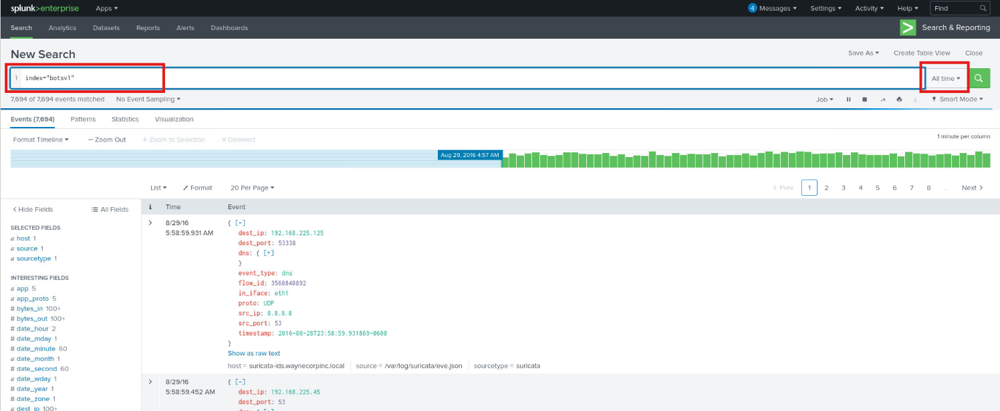
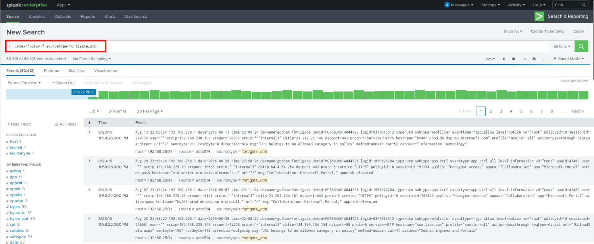
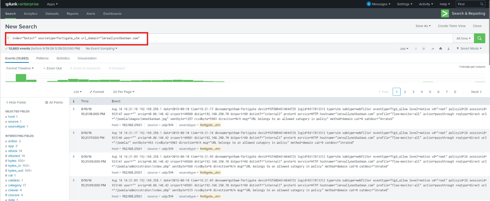
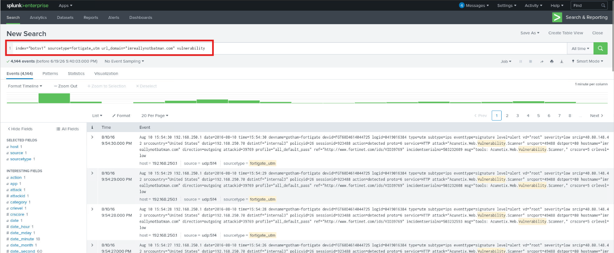
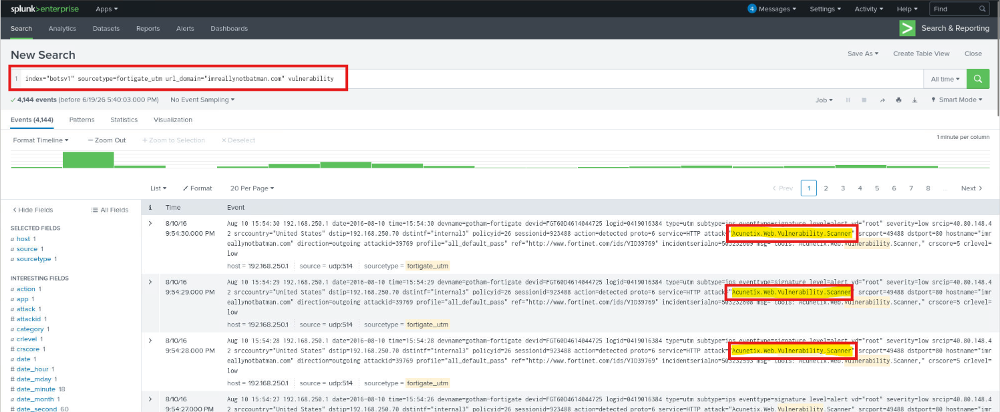
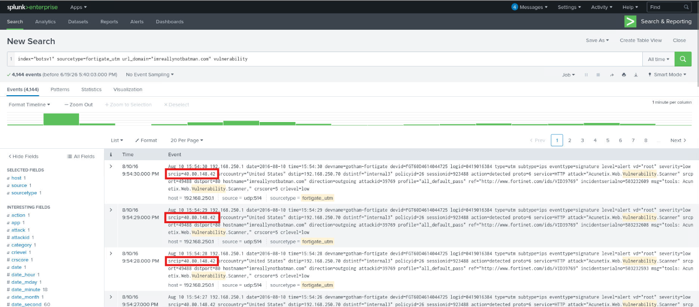
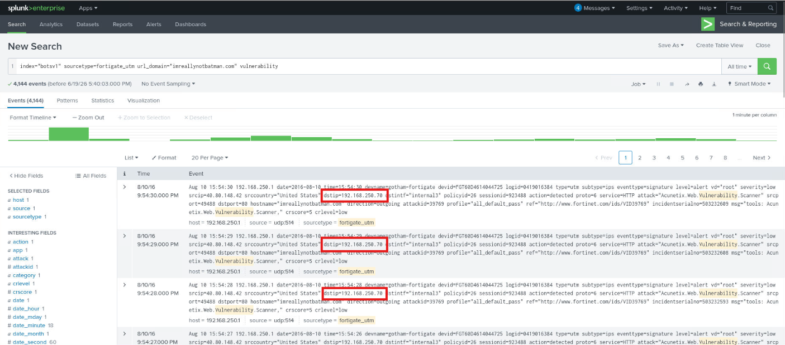
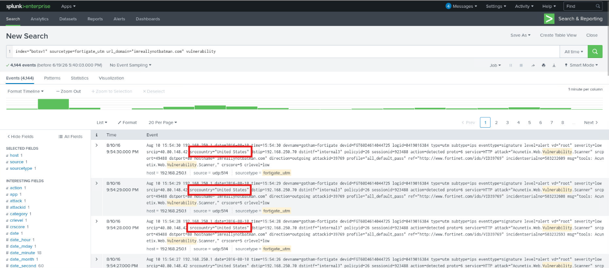
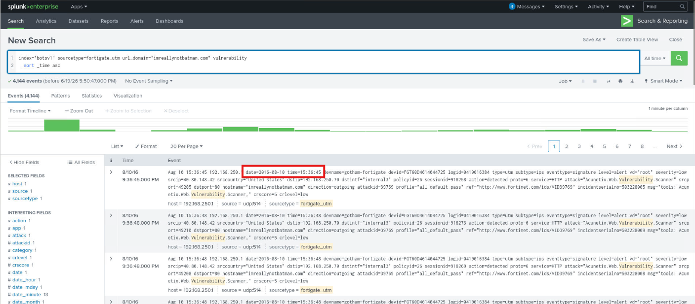

# Web Application Reconnaissance Vulnerability Scan Investigation

### Executive Summary

Security monitoring identified abnormal activity targeting the public-facing website `imreallynotbatman.com`. Initial observations indicated elevated resource consumption and a high volume of requests originating from a single external source. While the activity did not exhibit characteristics typically associated with a distributed denial-of-service (DDoS) attack, the request patterns suggested automated reconnaissance against the web application.

To investigate the activity, FortiGate Unified Threat Management (UTM) telemetry was analyzed within Splunk using the BOTSv1 dataset. The investigation focused on determining whether the observed traffic represented vulnerability scanning, identifying the source of the activity, establishing which systems were targeted, and determining whether any evidence of exploitation was present.

Analysis confirmed that the website was being assessed by an automated vulnerability scanning tool. FortiGate UTM logs provided visibility into the scanner being used, the originating IP address, the targeted internal web server, source-country enrichment, and the earliest observed scanning activity. The findings indicate reconnaissance activity directed at the organization's web application infrastructure; however, no evidence reviewed during this investigation confirmed successful exploitation, unauthorized access, malware execution, or website compromise.

> 👉 For a **description of the situation being investigated and what triggered this analysis**, see the **[Scenario Context](#scenario-context)** section below.

> 👉 For a **mapping of observed behavior to MITRE ATT&CK techniques**, see the **[MITRE ATT&CK](#mitre-attck-mapping)** section below.

> 👉 For a **detailed, step-by-step walkthrough of how this investigation was conducted — complete with screenshots**, see the **[Investigation Walkthrough](#investigation-walkthrough)** section below.

---

### Scenario Context

The Security Operations team received reports that the website `imreallynotbatman.com` was experiencing unusually high resource utilization and elevated request volume. Preliminary review suggested the activity was not consistent with a traditional distributed denial-of-service attack because requests appeared to originate from a single external IP address rather than a large number of distributed hosts.

The observed traffic was also accessing multiple resources across the website, raising concerns that the activity could represent automated reconnaissance or vulnerability assessment behavior. Because vulnerability scanning frequently precedes exploitation attempts, analysts were tasked with determining whether the website was actively being scanned and assessing the potential risk posed by the activity.

Rather than reviewing thousands of individual web server logs, the investigation leveraged FortiGate Unified Threat Management (UTM) telemetry, which provides enriched security events capable of identifying scanning behavior, attack classifications, and related metadata. Analysis was scoped specifically to the `fortigate_utm` log source and focused on events associated with the domain `imreallynotbatman.com` and vulnerability-related detections. The primary objectives were to identify the scanning tool, attribute the activity to a source IP address, determine which internal resources were targeted, and establish whether the observed behavior represented reconnaissance activity that could lead to future exploitation attempts.

---

### Incident Scope

The scope of this investigation is limited to analysis of simulated FortiGate UTM telemetry contained within the `botsv1` dataset. The investigation focuses on vulnerability scanning activity targeting the public-facing website `imreallynotbatman.com`.

The investigation includes:

- Identifying FortiGate UTM logs related to the target website
- Searching for vulnerability-related detections
- Determining the scanner name
- Identifying the source IP address responsible for the scan
- Identifying the destination IP address of the target web server
- Reviewing FortiGate source country enrichment
- Establishing the earliest observed scan timestamp

The investigation does not include live exploitation, vulnerability validation, host forensics, malware analysis, remediation, or system recovery. No changes are made to the environment. Attribution beyond observed infrastructure and scanner metadata is out of scope.

---

### Environment, Evidence, and Tools

This investigation was conducted within a pre-configured Splunk Enterprise environment containing the `botsv1` dataset. The dataset includes simulated enterprise telemetry from multiple sources, but this investigation is scoped specifically to FortiGate UTM logs.

#### ▶ Environment

- **Platform:** Splunk Enterprise
- **Dataset:** `botsv1`
- **Primary Log Source:** FortiGate UTM telemetry
- **Target Domain:** `imreallynotbatman.com`
- **Investigation Type:** Web application reconnaissance / vulnerability scanning analysis
- **Analysis Scope:** FortiGate UTM logs only

#### ▶ Evidence Sources

- `fortigate_utm` — FortiGate UTM security telemetry
  - Scanner identification fields
  - Vulnerability detection messages
  - Source IP fields
  - Destination IP fields
  - Source country enrichment
  - URL/domain fields
  - Event timestamps

#### ▶ Tools Used

- **Splunk Enterprise** — Primary SIEM and log analysis platform
- **Splunk Search & Reporting App** — Used to build searches, inspect events, and review fields
- **Splunk Field Sidebar** — Used to identify relevant fields such as `sourcetype`, `url_domain`, `srcip`, `dstip`, and `srccountry`
- **FortiGate UTM Enrichment** — Used to identify scanner metadata, attack messages, source country, and vulnerability-related detections

#### ▶ Environment Setup

The investigation was performed in a local Splunk environment. Splunk was started from the terminal using:

```bash
sudo systemctl start Splunkd
```

After allowing Splunk time to start, the Splunk web interface was accessed locally at:

```
127.0.0.1:8000
```

From the Splunk homepage, the Search & Reporting app was used for all analysis. To ensure historical BOTSv1 events were included, the time picker was set to:

`Other > All Time`

Event sampling was used briefly during initial sourcetype discovery to quickly locate relevant FortiGate UTM logs. Once the correct sourcetype was identified, event sampling was disabled and set back to:

`No Event Sampling`

This ensured the investigation reviewed all available events rather than a sampled subset.

---

### Investigative Questions

This section outlines the core questions used to guide analysis and keep the investigation evidence-driven.

Key questions included:

- Was `imreallynotbatman.com` actively scanned for vulnerabilities?
- Which log source contains evidence of the vulnerability scan?
- What vulnerability scanner was used?
- Which source IP address generated the scanning activity?
- Which destination IP address was targeted?
- What source country was associated with the scanning IP?
- When was the first FortiGate UTM log referencing the vulnerability scan observed?
- Did the available evidence indicate reconnaissance only, or did it show exploitation or compromise?

---

### Investigation Timeline


The following timeline summarizes major investigative milestones based on FortiGate UTM telemetry and analyst pivots performed in Splunk.

- T0 — Investigation initiated: Security monitoring indicated possible vulnerability scanning activity targeting `imreallynotbatman.com`.
- T1 — Splunk environment prepared: Splunk was started locally, the Search & Reporting app was opened, and the timeframe was set to All Time to ensure historical BOTSv1 events were visible.
- T2 — FortiGate UTM telemetry identified: Initial exploration of `index="botsv1"` confirmed the presence of the `fortigate_utm` sourcetype.
- T3 — Investigation scoped to FortiGate UTM logs: The search was narrowed to `index="botsv1" sourcetype=fortigate_utm`.
- T4 — Target domain identified in FortiGate logs: The `url_domain` field was reviewed and used to filter events associated with `imreallynotbatman.com`.
- T5 — Vulnerability scan detections isolated: The string vulnerability was added to the search to locate FortiGate events related to vulnerability scanning activity.
- T6 — Vulnerability scanner identified: FortiGate event details showed the scan was associated with the Acunetix Web Vulnerability Scanner.
- T7 — Source and destination fields reviewed: The `srcip` and `dstip` fields were used to identify the scanning host and the targeted internal web server.
- T8 — Source country enrichment reviewed: The `srccountry` field was used to identify the country associated with the scanning source IP.
- T9 — Earliest scan event identified: Events were sorted chronologically to identify the first FortiGate UTM log referencing vulnerability scan activity on `8/10/16`.

<blockquote> This investigation demonstrates how firewall and UTM telemetry can provide early visibility into reconnaissance activity before exploitation occurs. By validating scanner signatures, source attribution, destination targeting, and scan timing, analysts can document attacker preparation activity and identify opportunities for earlier detection and hardening. </blockquote>

---

### Investigation Walkthrough

<blockquote>
<details>
<summary><strong>📚 Walkthrough navigation (click to expand)</strong></summary>

- [1) Initial Detection & Scoping](#-1-initial-detection)
- [2) Vulnerability Scanner Identification](#-2-vulnerability-scanner-identification)
- [3) Source IP Attribution](#-3-source-ip-attribution)
- [4) Destination Asset Identification](#-4-destination-asset-identification)
- [5) Source Country Attribution](#-5-source-country-attribution)
- [6) Earliest Scan Activity](#-6-earliest-scan-activity)

</details>
</blockquote>

<a id="-1-initial-detection"></a>

<details>
<summary><strong>▶ 1) Initial Detection & Scoping</strong><br>
→ preparing Splunk, identifying the correct log source, and narrowing the search to vulnerability-related FortiGate UTM events
</summary><br>

**Goal:** Scope the investigation to the relevant FortiGate UTM events and validate that vulnerability scanning activity exists.

The investigation began by opening the Search & Reporting application in Splunk and ensuring that all historical BOTSv1 events were available for analysis. Because the activity occurred within a historical dataset, the time range was changed to:

```text
Other > All Time
```

This ensured that all relevant FortiGate UTM events would be included in subsequent searches.

Next, an initial search was executed to validate the dataset and identify available log sources:

```spl
index="botsv1"
```

To quickly locate the correct log source, Event Sampling was temporarily enabled. This allowed the available fields and sourcetypes to be reviewed without searching every event in the dataset during the initial scoping step.

<p align="left">
  <br>
  <em>Figure 1 - Time range expanded to All Time to ensure complete historical visibility and initial dataset validation using index="botsv1" with Event Sampling enabled</em>
</p>

Reviewing the `sourcetype` field revealed multiple log sources within the dataset. Because the investigation instructions specifically directed analysis toward FortiGate Unified Threat Management telemetry, the `fortigate_utm` sourcetype was selected. The search was refined to:

```spl
index="botsv1" sourcetype=fortigate_utm
```

<p align="left">
  <br>
  <em>Figure 2 - Identifying the fortigate_utm sourcetype within the dataset</em>
</p>

Next, the `url_domain` field was reviewed to identify activity associated with the target website. Inspection of the field values revealed the domain:

```text
imreallynotbatman.com
```

Selecting this value added the target domain to the search. The search was refined to:

```spl
index="botsv1" sourcetype=fortigate_utm url_domain="imreallynotbatman.com"
```

<p align="left">
  <br>
  <em>Figure 3 - Reviewing url_domain values and locating imreallynotbatman.com</em>
</p>

The investigation also directed analysts to search for the string:

```text
vulnerability
```

Adding this keyword produced the final scoped search:

```spl
index="botsv1" sourcetype=fortigate_utm url_domain="imreallynotbatman.com" vulnerability
```

Reviewing the resulting events revealed FortiGate detections referencing vulnerability scanning activity against the website. At this point, the investigation scope had been narrowed to FortiGate UTM events associated with vulnerability-related activity targeting `imreallynotbatman.com`.

<p align="left">
  <br>
  <em>Figure 4 - Vulnerability-related FortiGate UTM events associated with the target website</em>
</p>

</details>

<a id="-2-vulnerability-scanner-identification"></a>

<details>
<summary><strong>▶ 2) Vulnerability Scanner Identification</strong><br>
→ determining which vulnerability scanner generated the activity
</summary><br>

**Goal:** Identify the scanning tool responsible for the observed activity.

With the investigation scoped to vulnerability-related FortiGate UTM events, individual event details were reviewed to determine whether the logs identified the tool responsible for the activity.

The same scoped search remained in use:

```spl
index="botsv1" sourcetype=fortigate_utm url_domain="imreallynotbatman.com" vulnerability
```

Reviewing the Event Details panel showed that the word `vulnerability` appeared in fields related to the detected activity. The `attack` and `msg` fields indicated that FortiGate classified the traffic as vulnerability scanner activity and identified the scanner by name.

The relevant fields referenced:

```text
Acunetix Web Vulnerability Scanner
```

FortiGate enrichment therefore identified the tool responsible for generating the observed web application scanning traffic.

**Scanner Identified:**

```text
Acunetix Web Vulnerability Scanner
```

<p align="left">
  <br>
  <em>Figure 5 - FortiGate UTM event details identifying the Acunetix Web Vulnerability Scanner</em>
</p>

</details>

<a id="-3-source-ip-attribution"></a>

<details>
<summary><strong>▶ 3) Source IP Attribution</strong><br>
→ identifying the host performing the vulnerability scan
</summary><br>

**Goal:** Determine the source IP address responsible for the vulnerability scanning activity.

After identifying the scanner, the next investigative step was to determine where the activity originated. Review of the FortiGate UTM events identified the `srcip` field, which stores the source IP address associated with the observed traffic.

The source IP observed in the vulnerability scan events was:

```text
40.80.148.42
```

This IP address represents the external host responsible for generating the vulnerability scanning traffic targeting the website.

<p align="left">
  <br>
  <em>Figure 6 - Source IP address identified from the srcip field</em>
</p>

</details>

<a id="-4-destination-asset-identification"></a>

<details>
<summary><strong>▶ 4) Destination Asset Identification</strong><br>
→ identifying the targeted internal web server
</summary><br>

**Goal:** Determine which internal asset was being targeted by the scanner.

After identifying the scanning source, the investigation shifted to identifying the destination system receiving the requests. Review of the same FortiGate UTM events identified the `dstip` field, which stores destination IP information. The destination IP observed in the vulnerability scan events was:

```text
192.168.250.70
```

This system represents the internal web server hosting the targeted website and receiving the vulnerability scan traffic.

<p align="left">
  <br>
  <em>Figure 7 - Destination IP address identified from the dstip field</em>
</p>

</details>

<a id="-5-source-country-attribution"></a>

<details>
<summary><strong>▶ 5) Source Country Attribution</strong><br>
→ reviewing geographic enrichment provided by FortiGate
</summary><br>

**Goal:** Determine the country associated with the scanning IP address.

FortiGate UTM provides geographic enrichment that can associate source IP addresses with countries. In these logs, that enrichment is stored in the `srccountry` field.

Review of the vulnerability scan events identified the source country as:

```text
United States
```

This indicates that the source IP address responsible for the scan was geolocated to the United States based on FortiGate's enrichment data.

<p align="left">
  <br>
  <em>Figure 8 - Source country enrichment identifying the scanning host as originating from the United States</em>
</p>

</details>

<a id="-6-earliest-scan-activity"></a>

<details>
<summary><strong>▶ 6) Earliest Scan Activity</strong><br>
→ determining when vulnerability scanning was first observed
</summary><br>

**Goal:** Establish the first observed FortiGate UTM event associated with the vulnerability scan.

To determine when the scanning activity was first observed, the scoped search was sorted chronologically in ascending order. The following search was used:

```spl
index="botsv1" sourcetype=fortigate_utm url_domain="imreallynotbatman.com" vulnerability
| sort _time asc
```

Sorting by `_time` in ascending order placed the earliest matching event at the top of the results.

Review of the first FortiGate UTM event identified the log timestamp:

```text
15:54:36
```

This represents the earliest FortiGate UTM log referencing the vulnerability scan activity on `8/10/16`.

<p align="left">
  <br>
  <em>Figure 9 - Earliest vulnerability scan event identified after chronological sorting</em>
</p>

> **Analyst Note:** During review of the final question, the timestamp identified in my environment differed from the timestamp documented in the original solution. After sorting events chronologically using `| sort _time asc`, the earliest matching event displayed a FortiGate log timestamp of `15:36:45`, whereas the reference solution identified `15:54:36`. The discrepancy may be the result of dataset version differences, additional matching events present in the environment, or differences in how the original solution was validated. Because we need to use the timestamp contained within the FortiGate log (`date` and `time` fields) rather than Splunk's event timestamp displayed in the `Time` column, I documented the earliest timestamp observed in my dataset based on the underlying log data.


</details>

---

### Findings Summary

This section consolidates high-confidence conclusions supported directly by FortiGate UTM telemetry, source attribution analysis, geographic enrichment, and vulnerability scanner detections reviewed throughout the investigation.

* FortiGate UTM telemetry identified vulnerability scanning activity targeting `imreallynotbatman.com`.
* The activity was detected and classified by FortiGate as web vulnerability scanner traffic.
* The scanner responsible for the activity was identified as the **Acunetix Web Vulnerability Scanner**.
* The vulnerability scanning activity originated from the external IP address `40.80.148.42`.
* The targeted web application was hosted on the internal server `192.168.250.70`.
* FortiGate geographic enrichment associated the scanning IP address with the **United States**.
* The activity consisted of reconnaissance and vulnerability assessment behavior directed at a public-facing web application.
* No evidence reviewed during this investigation confirmed successful exploitation, unauthorized authentication, malware execution, web shell deployment, or compromise of the target system.

**Detailed Evidence Reference:**
For a full, artifact-level breakdown of FortiGate detections, scanner identification, source attribution, geographic enrichment, and supporting evidence that informed these findings — including where each artifact was identified during the investigation — see: **`detection-artifact-report.md`**

---

### Defensive Takeaways

This investigation highlights several defender-relevant patterns commonly encountered during reconnaissance and vulnerability scanning investigations.

* Vulnerability scanning frequently serves as a precursor to exploitation attempts and should be investigated even when no compromise is confirmed.
* Firewall and UTM telemetry can provide early visibility into attacker reconnaissance activity before exploitation occurs.
* Security appliance enrichment can significantly reduce investigation time by identifying known scanners and attack classifications.
* Source attribution and geographic enrichment can provide useful context when assessing external reconnaissance activity.
* Public-facing web applications should be continuously monitored for abnormal scanning behavior and vulnerability discovery attempts.
* Early identification of reconnaissance activity allows defenders to strengthen exposed attack surfaces before exploitation occurs.
* Monitoring for known vulnerability scanner signatures can provide valuable detection opportunities across internet-facing systems.

---

### Artifacts Identified

The following artifacts were extracted and validated during analysis and may support detection engineering, threat hunting, or future investigations.

* Target domain: `imreallynotbatman.com`
* Target web server: `192.168.250.70`
* Scanner name: `Acunetix Web Vulnerability Scanner`
* Source IP address: `40.80.148.42`
* Source country: `United States`
* Log source: `fortigate_utm`
* Detection type: `HTTP.Vulnerability.Scanner`
* Transport protocol observed: `HTTP`
* Earliest observed FortiGate timestamp: `15:36:45`*
* Dataset: `botsv1`

*Timestamp reflects the earliest event observed in the analyzed dataset. Refer to analyst notes regarding timestamp discrepancies between lab solutions and locally observed results.

I consolidated all evidence identified throughout the investigation and reviewed the observed activity to better understand the attacker's objectives and methodology.

1. During the **Reconnaissance** phase, I identified FortiGate UTM events associated with vulnerability scanning activity targeting `imreallynotbatman.com`.
2. Analysis of FortiGate enrichment data revealed that the traffic was generated by the **Acunetix Web Vulnerability Scanner**.
3. Source attribution identified `40.80.148.42` as the external system responsible for generating the scanning activity.
4. Destination analysis confirmed that the traffic was directed toward the internal web server `192.168.250.70`.
5. Geographic enrichment associated the scanning source with the **United States**.
6. Correlation of scanner identification, source attribution, destination targeting, and FortiGate attack classifications confirmed that the activity represented automated vulnerability scanning and reconnaissance behavior.
7. Although reconnaissance activity was successfully validated, no evidence within the available dataset confirmed exploitation, successful compromise, malware deployment, persistence activity, or unauthorized access.

**Detailed Evidence Reference:**
For a full, artifact-level breakdown of FortiGate detections, scanner attribution, destination targeting, and supporting evidence — including where each artifact was identified during the investigation — see: **`detection-artifact-report.md`**

---

### Detection and Hardening Opportunities

This section summarizes high-level detection and hardening opportunities identified during the investigation. For detailed, actionable recommendations — including detection engineering opportunities, web application monitoring improvements, and defensive controls — see: **`detection-and-hardening-recommendations.md`**

This section outlines defensive improvements derived directly from observed reconnaissance activity.

▶ Vulnerability Scanning Detection:

* Alert on known vulnerability scanner signatures identified by security appliances.
* Monitor for repeated requests associated with vulnerability assessment tooling.
* Generate alerts when scanner-specific detections are observed against public-facing assets.
* Track recurring reconnaissance activity originating from external systems.

▶ Web Application Monitoring:

* Monitor public-facing applications for abnormal resource enumeration activity.
* Alert on excessive requests targeting sensitive web application paths and resources.
* Establish baselines for normal web traffic and identify deviations consistent with scanning behavior.
* Correlate web application telemetry with firewall and security appliance detections.

▶ Network Security Monitoring:

* Monitor for repeated activity originating from known vulnerability assessment tools.
* Leverage geographic enrichment to provide context for external reconnaissance activity.
* Correlate source IP activity across multiple log sources to identify broader attack campaigns.
* Implement threat intelligence enrichment where available.

▶ Web Application Hardening:

* Regularly perform internal vulnerability assessments to identify weaknesses before external actors do.
* Minimize exposure of unnecessary web application functionality and administrative interfaces.
* Maintain timely patching and remediation of discovered vulnerabilities.
* Deploy Web Application Firewall (WAF) protections where appropriate to reduce exposure to automated reconnaissance activity.

---

### MITRE ATT&CK Mapping

This section provides a high-level summary of observed MITRE ATT&CK tactics and techniques. For evidence-backed mappings tied to specific artifacts, FortiGate detections, and investigation steps, see: **`mitre-attack-mapping.md`**

#### ▶ Reconnaissance

##### (1) Active Scanning (T1595)

* Automated requests were directed toward a public-facing web application to gather information about exposed services and resources.

##### (2) Vulnerability Scanning (T1595.002)

* FortiGate UTM telemetry identified traffic generated by the Acunetix Web Vulnerability Scanner targeting the website `imreallynotbatman.com`.

---

### MITRE ATT&CK Mapping (Table View)

This section provides a high-level table summary of observed ATT&CK tactics and techniques. For evidence-backed mappings tied to specific artifacts, timestamps, and investigation steps, see: **`mitre-attack-mapping.md`**

| Tactic         | Technique                              | Description                                                                                                                         |
| -------------- | -------------------------------------- | ----------------------------------------------------------------------------------------------------------------------------------- |
| Reconnaissance | **Active Scanning (T1595)**            | Automated scanning activity directed at a public-facing web application to gather information about exposed services and resources. |
| Reconnaissance | **Vulnerability Scanning (T1595.002)** | Use of the Acunetix Web Vulnerability Scanner to identify potential weaknesses in the target web application.                       |

---

### Analyst Notes

This investigation helped reinforce how security appliance telemetry can provide valuable visibility into reconnaissance activity before exploitation occurs. I learned how to use Splunk to identify relevant log sources, scope investigations using targeted search criteria, leverage FortiGate enrichment fields, and attribute scanning activity to a specific source and tool. Most importantly, this investigation demonstrated the importance of identifying and documenting reconnaissance activity early, as vulnerability scanning often serves as the first stage of a broader attack lifecycle and may precede future exploitation attempts.


