# Web Application Authentication Compromise Investigation (Brute-Force Attempts and Account Compromise Detection)

### Executive Summary

This investigation analyzes abnormal authentication activity against a web application that resulted in credential abuse and successful account compromise. Application-layer authentication logs revealed a high volume of failed login attempts originating from a single external IP address, followed by successful authentication events and subsequent credential reuse from a secondary source.

Analysis confirmed that the activity involved automated authentication abuse, account enumeration, password spraying, and exploitation of insecure credential handling within application logs. The investigation reconstructed the attack sequence using authentication telemetry and identified concrete artifacts and behaviors relevant for detection, response, and remediation.

> 👉 For a **description of the situation being investigated and what triggered this analysis**, see the **[Scenario Context](#scenario-context)** section below.

> 👉 For a **mapping of observed behavior to MITRE ATT&CK techniques**, see the **[MITRE ATT&CK](#mitre-attck-mapping)** section below

> 👉 For a **detailed, step-by-step walkthrough of how this investigation was conducted — complete with screenshots**, see the **[Investigation Walkthrough](#investigation-walkthrough)** section below.

---

### Scenario Context

A suspected web application account compromise was identified after authentication telemetry showed an unusually high volume of failed login attempts occurring in rapid succession. The failures originated from a single external IP address and reused the same User-Agent string across attempts, indicating automated credential abuse rather than normal user behavior. The activity targeted multiple usernames, including both non-existent accounts (suggesting account enumeration) and real accounts, before transitioning into a confirmed successful login.

The investigation was triggered by this elevated failure pattern and focused on reconstructing the full attack sequence using only application-layer authentication logs and HTTP request metadata. The goal was to determine whether credentials were successfully obtained and reused from a secondary source, identify the authentication endpoint being abused, and validate whether insecure credential handling in the logs (reversible “hashed_password” values) contributed to the compromise and enabled follow-on access.

---

### Incident Scope

The scope of this investigation is limited to post-incident analysis of web application authentication telemetry. The analysis focused exclusively on application-layer authentication logs captured in JSON format and associated HTTP request metadata.

The investigation examined failed and successful authentication attempts, source IP behavior, User-Agent consistency, targeted usernames, authentication endpoints, and credential handling practices. Activities outside this scope—including exploit development, infrastructure takedown, or live system interaction—were intentionally excluded.

The objective was to reconstruct attacker behavior, determine whether credentials were compromised, and identify observable indicators that can support detection engineering and SOC monitoring efforts.

---

### Environment, Evidence, and Tools

#### ▶ Environment
- **Platform:** Linux-based web application
- **Scope:** Single web application authentication workflow
- **Analysis Type:** Post-incident authentication telemetry review
- **Access Layer:** Application-level (no host or network forensics)

#### ▶ Evidence Sources
- Application authentication logs (JSON format)
- HTTP request metadata:
  - Source IP addresses
  - User-Agent strings
  - Target authentication endpoint
  - Supplied usernames
  - Authentication outcomes (success / failure)
- Credential-handling fields recorded by the application (encoded password values)

#### ▶ Tools Used
- **JSON Crack:** Interactive exploration and correlation of nested JSON authentication logs
- **Command-line utilities:** Base64 decoding to validate credential exposure
- **Manual timeline correlation:** Source IP, username targeting, User-Agent consistency, and outcome sequencing

#### ▶ Detection Context

- Analysis Tooling: JSON Crack (interactive JSON analysis)
- JSON Crack was used to analyze and navigate the application’s authentication logs stored in JSON format. The tool provides an interactive, structured view of nested JSON data, allowing rapid exploration of log fields without requiring custom parsing or scripting.
- By leveraging JSON Crack, authentication events could be quickly filtered and correlated based on source IP address, timestamps, usernames, User-Agent strings, and authentication outcomes. This enabled efficient identification of repeated failure patterns, attribution of activity to a single source, and correlation of authentication behavior across multiple log entries.
- **Alert Source:** Web application authentication logs
- **Trigger Condition:** Elevated volume of failed login attempts
- **Suspected Activity:** Credential brute-force or password spraying
- **Environment:** Linux-based web application

---

### Investigative Questions
The following questions guided the investigation and structured analysis of authentication telemetry:

- Which source IP address was responsible for the abnormal authentication activity?
- Did the authentication failures target valid accounts, non-existent accounts, or both?
- Was the observed activity consistent with brute-force or password spraying behavior?
- Were any authentication attempts ultimately successful?
- Were compromised credentials reused from additional sources?
- Which application endpoint was targeted during authentication abuse?
- How was credential material handled and logged by the application?
- What artifacts and behaviors can be operationalized for detection?

---

### Investigation Timeline
- **T0 — Elevated authentication failures detected:** High-volume failed login attempts observed within a short timeframe.
- **T1 — Attacking source identified:** Repeated failures attributed to a single external IP address.
- **T2 — Automated behavior confirmed:** Identical User-Agent strings indicated scripted authentication abuse.
- **T3 — Account enumeration observed:** Multiple non-existent usernames targeted.
- **T4 — Valid accounts targeted:** Authentication attempts shifted toward confirmed valid accounts.
- **T5 — Successful authentication achieved:** A valid account was successfully authenticated.
- **T6 — Credential reuse observed:** Same credentials reused from a secondary IP address.
- **T7 — Credential exposure identified:** Logged credential material decoded, revealing plaintext password exposure.


---

### Investigation Walkthrough

<blockquote>
<details>
<summary><strong>📚 Walkthrough navigation (click to expand)</strong></summary>

- [1) Source IP Responsible for Attack Activity](#-1-source-ip-responsible-for-attack-activity)
  - [1.1) Identifying The Origin Of Failed Login Attempted](#-11-identifying-the-origin-of-failed-login-attempted)
  - [1.2) MITRE ATT&CK Technique Reference — Finding 1](#-12-mitre-attck-technique-reference--finding-1)
- [2) User-Agent Analysis](#-2-user-agent-analysis)
  - [2.1) MITRE ATT&CK Technique Reference — Finding 2](#-21-mitre-attck-technique-reference--finding-2)
- [3) Non-Existent Account Targeting (Account Enumeration)](#-3-non-existent-account-targeting-account-enumeration)
  - [3.1) Determining Whether Authentication Attempts Targeted Valids Accounts](#-31-determining-whether-authentication-attempts-targeted-valids-accounts)
  - [3.2) MITRE ATT&CK Mapping — Finding 3](#-32-mitre-attck-mapping--finding-3)
- [4) Valid Accounts Targeted](#-4-valid-accounts-targeted)
  - [4.1) Determining Whether Application User Accounts Were Targeted](#-41-determining-whether-application-user-accounts-were-targeted)
  - [4.2) MITRE ATT&CK Mapping — Finding 4](#-42-mitre-attck-mapping--finding-4)
- [5) Successful Authentication Event](#-5-successful-authentication-event)
  - [5.1) Determinig Whether Any Attacker Login Attempts Were Successful](#-51-determinig-whether-any-attacker-login-attempts-were-successful)
- [6) Secondary Login Source](#-6-secondary-login-source)
  - [6.1) Investigating Any Second Login Source From Attacker](#-61-investigating-any-second-login-source-from-attacker)
  - [6.2) MITRE ATT&CK Mapping — Finding 6](#-62-mitre-attck-mapping--finding-6)
- [7) Authentication Endpoint Used](#-7-authentication-endpoint-used)
  - [7.1) Reviewing Authentication Request Events Across All Login Attempts](#-71-reviewing-authentication-request-events-across-all-login-attempts)
- [8) Credential Exposure](#-8-credential-exposure)
  - [8.1) Examining How Credentials Were Being Processed Within Application Logs](#-81-examining-how-credentials-were-being-processed-within-application-logs)
  - [8.2) MITRE ATT&CK Mapping — Finding 8](#-82-mitre-attck-mapping--finding-8)

</details>
</blockquote>

This section reconstructs the attacker’s actions step-by-step, correlating network, authentication, endpoint, file, and registry evidence across the intrusion lifecycle.

**Note:** Each section is collapsible. Click the ▶ arrow to expand and view the detailed steps.

<!--
NOTE TO SELF: If you want to change it back, follow these steps:
1. In the main "Walkthrough Naviation" collapsible toc below this, add "-" (hyphen) between hashtag and number for top level sections only
2. Remove <details>, <summary>, and <strong> tags (including closing tags)
3. Add "####" in front of section title
4. Remove hidden anchor. Example: <a id="1-reconnaissance-activity--service-enumeration-analysis"></a>
-->

<details>
<summary><strong>▶ 1) Source IP Responsible for Attack Activity</strong><br>
 → identifying which IP address generated the failed login attempts
</summary><br>

*Goal:* Identify the source IP responsible for the attack.

<a id="-1-source-ip-responsible-for-attack-activity"></a>

<!--
- [🔷 1.1) Identifying The Origin Of Failed Login Attempted](#-11-identifying-the-origin-of-failed-login-attempted)
- [🔷 1.2) MITRE ATT&CK Technique Reference — Finding 1](#-12-mitre-attck-technique-reference--finding-1)
-->

The investigation began by examining the application’s authentication telemetry contained within the `application-logs.json` file. This file captures application-layer login events, where each record represents an authentication attempt processed by the web application.

Each log entry includes key fields required for attribution and behavioral analysis, including:

- Event timestamp
- Source client IP address
- User-Agent string
- Supplied username
- Authentication result (success or failure)
- Failure reason (when applicable)
 Target authentication endpoint

##### 🔷 1.1) Identifying The Origin Of Failed Login Attempted

To identify the origin of the suspicious activity, the analysis focused on the `client.ip_address` field across all failed authentication events. Reviewing the log entries in chronological order revealed a single external IP address repeatedly submitting authentication requests within a narrow time window.

This IP was associated with numerous failed login attempts targeting multiple usernames, a pattern that is inconsistent with normal user behavior and indicative of automated authentication abuse.

Attacking IP Address: `198.51.100.100`

The concentration of failed authentication attempts originating from a single source, combined with the short interval between requests, strongly suggests the use of scripted or automated tooling rather than legitimate user error. This IP was therefore identified as the primary source responsible for the observed attack activity.

<p align="left">
  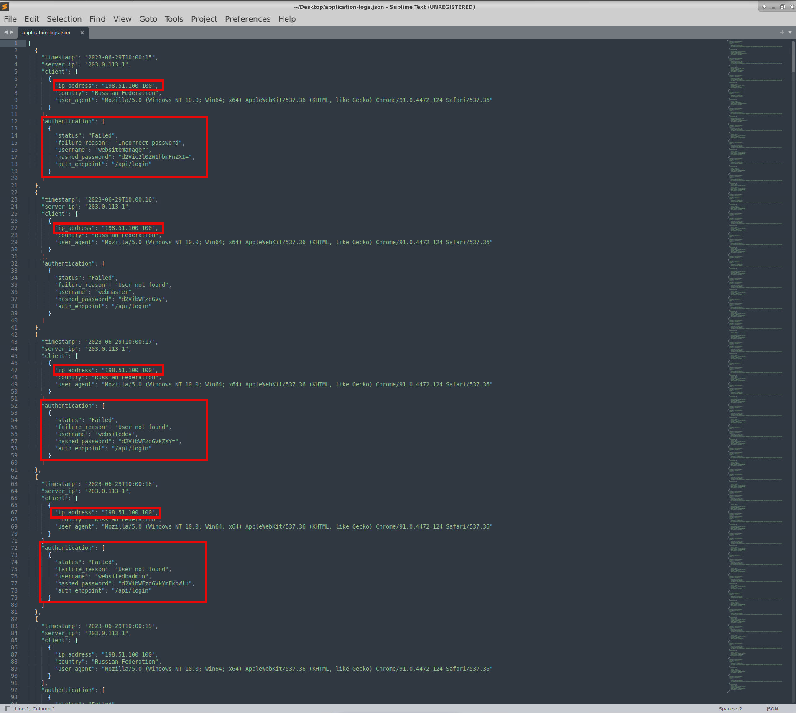<br>
  <em>Figure 1 - Failed authentication events attributed to a single external source IP</em>
</p>

##### 🔷 1.2) MITRE ATT&CK Technique Reference — Finding 1

The repeated failed authentication attempts originating from a single source IP align with MITRE ATT&CK technique T1110 (Brute Force). This technique describes adversary behavior involving systematic attempts to guess or validate credentials by submitting repeated authentication requests.

- Tactic: Credential Access
- Technique: T1110 – Brute Force

Evidence supporting this mapping includes:

- High frequency of authentication attempts within a short time window
- Multiple failed login attempts from a single external IP address
- Targeting of multiple usernames, including both valid and non-existent accounts
- Lack of behavioral indicators consistent with legitimate user error
- This activity demonstrates a clear attempt to obtain valid credentials through automated means, consistent with credential brute-force or password spraying techniques.

</details>

<details>
<summary><strong>▶ 2) User-Agent Analysis</strong><br>
 → checking whether the same User-Agent was used across attempts.
</summary><br>
<!--
- [🔷 2.1) MITRE ATT&CK Technique Reference — Finding 2](#-21-mitre-attck-technique-reference--finding-2)
-->

*Goal:* Determine if the activity came from automated tooling.

<a id="-2-user-agent-analysis"></a>

After identifying the source IP responsible for the repeated authentication failures, the next step was to analyze the User-Agent values associated with those requests. User-Agent strings provide insight into the client software initiating authentication attempts and can help differentiate between legitimate user behavior and automated tooling.

All authentication attempts originating from the identified attacking IP were reviewed, with particular attention paid to the `client.user_agent` field. Across all failed login attempts, the User-Agent string remained identical and did not vary between requests. All authentication attempts originating from the attacking IP were associated with the same User-Agent string:

- Observed User-Agent: `Mozilla/5.0 (...) Chrome/91.0.4472.124 Safari/537.36`

Although the string references multiple browser identifiers, this structure is normal and expected. Modern User-Agent strings are cumulative and include compatibility tokens rather than representing multiple browsers in use simultaneously. In this case:

- `Mozilla/5.0` is a legacy compatibility identifier included by most modern browsers
- `Chrome/91.0.4472.124` identifies the actual browser engine and version being presented
- `Safari/537.36` reflects the WebKit/Blink rendering engine version used by Chromium-based browsers, including Google Chrome

This indicates that the authentication requests were made using a Chromium-based client presenting itself as Google Chrome version 91.

Notably, the User-Agent string remained identical across all authentication attempts, regardless of the username being targeted or the authentication outcome. This lack of variation is inconsistent with normal user behavior, where differences in devices, browser versions, sessions, or operating systems typically introduce some degree of diversity in User-Agent values.

When correlated with the high volume of failed login attempts and the short interval between requests, the consistent User-Agent strongly suggests the use of automated or scripted tooling designed to mimic a legitimate browser rather than interactive human-driven authentication attempts.

<p align="left">
  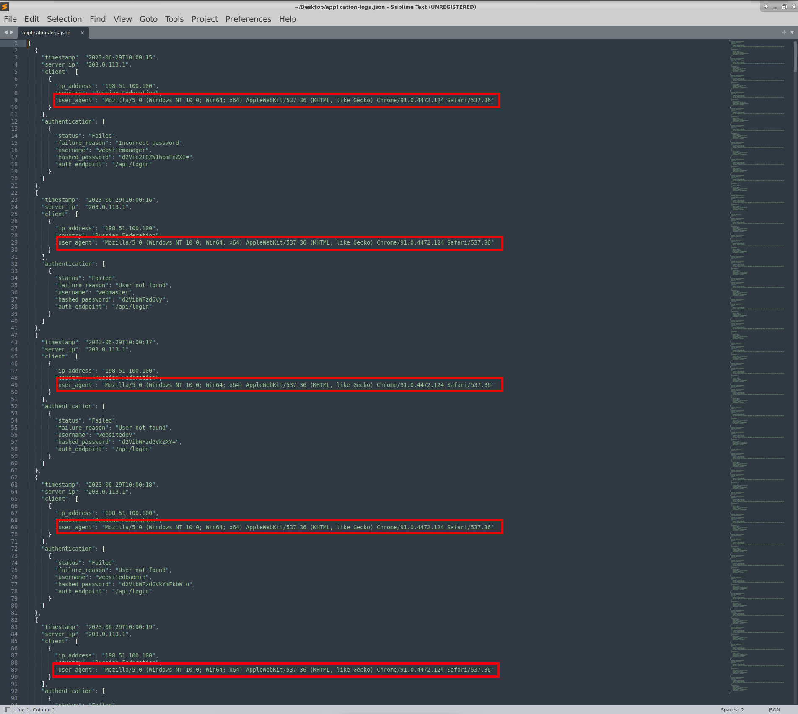<br>
  <em>Figure 2 - Identical "User-Agent" value observed across repeated login attempts</em>
</p>

##### 🔷 2.1) MITRE ATT&CK Technique Reference — Finding 2

- Tactic: Credential Access
- Technique: T1110 – Brute Force

The consistent User-Agent string observed across all authentication attempts supports the assessment that the activity aligns with MITRE ATT&CK technique T1110 (Brute Force).

Adversaries leveraging brute-force or password spraying techniques commonly rely on automated tooling that submits repeated authentication requests using a fixed or minimally varied client configuration. This often results in identical User-Agent values being observed across numerous login attempts.

Evidence supporting this mapping includes:
- Repeated authentication attempts originating from a single source IP
- An identical User-Agent string (`Chrome/91.0.4472.124 Safari/537.36`) across all attempts
- Lack of User-Agent variation typically associated with human-driven logins
- Correlation with high-volume authentication failures in a short time window

The uniform User-Agent behavior strengthens the conclusion that the authentication attempts were generated by automated tooling rather than legitimate interactive sessions, reinforcing the broader brute-force assessment established in Finding 1.

</details>


<details>
<summary><strong>▶ 3) Non-Existent Account Targeting (Account Enumeration)</strong><br>
 → identifying login attempts against usernames that do not exist
</summary><br>
<!--
- [🔷 3.1) Determining Whether Authentication Attempts Targeted Valids Accounts](#-31-determining-whether-authentication-attempts-targeted-valids-accounts)
- [🔷 3.2) MITRE ATT&CK Mapping — Finding 3](#-32-mitre-attck-mapping--finding-3)
-->

<a id="-3-non-existent-account-targeting-account-enumeration"></a>

*Goal:* Confirm whether account enumeration occurred.

After identifying the attacking source IP and confirming the use of a consistent automated User-Agent, the next step was to determine whether the authentication attempts targeted valid user accounts, non-existent accounts, or both.

##### 🔷 3.1) Determining Whether Authentication Attempts Targeted Valids Accounts

To assess this, failed authentication events originating from the attacking IP were reviewed with a focus on the username field and the associated authentication failure reason. The application logs differentiate between failures caused by invalid credentials and those caused by user accounts that do not exist within the application.

Multiple authentication attempts were observed where the supplied usernames consistently resulted in failures indicating that the user account was not recognized by the application. These usernames were repeatedly targeted but never associated with a successful authentication event at any point in the log timeline.

Number of non-existent accounts targeted: `9`

This behavior is indicative of account enumeration, where an attacker submits authentication requests using a list of potential usernames to determine which accounts exist within the system. By observing differences in authentication responses, an attacker can refine their targeting to focus on valid users in subsequent attempts. The presence of repeated authentication attempts against non-existent accounts, when correlated with automated request patterns and consistent client metadata, strongly suggests intentional enumeration rather than accidental user error.

The following non-existent accounts were targeted:

- `webmaster`
- `websitedev`
- `websitedbadmin`
- `websitebackup`
- `adminpanel`
- `loginpage`
- `adminpage`
- `adminservice`
- `websupport`

These usernames closely resemble generic administrative, service, and functional account names commonly used in web application environments. Their inclusion strongly suggests that the attacker was attempting to enumerate valid accounts by testing predictable or commonly deployed usernames rather than targeting known individual users.

The repeated targeting of these non-existent accounts, combined with the automated request patterns and consistent client metadata, is indicative of account enumeration activity. By observing which usernames produce distinct authentication responses, an attacker can identify valid accounts and prioritize them for further credential attacks.

<div style="display: flex; flex-wrap: wrap; gap: 12px;">
  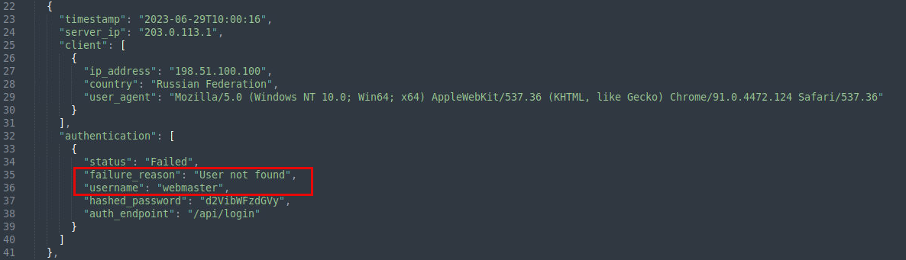
  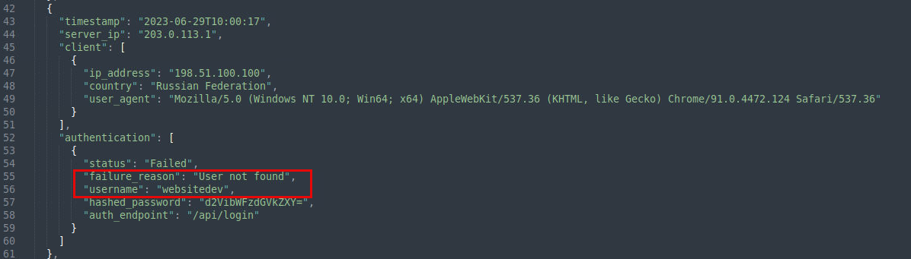
  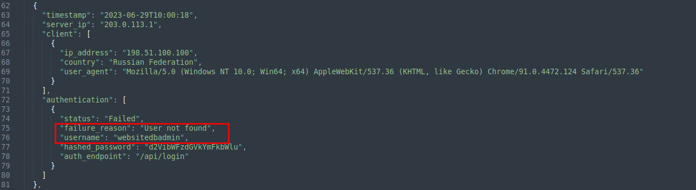
  
  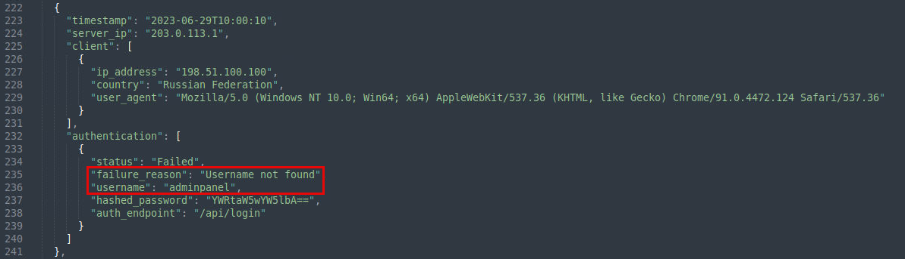
  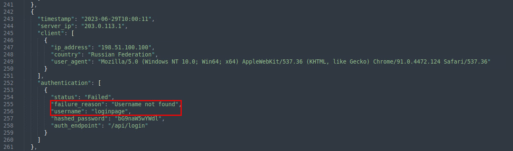
  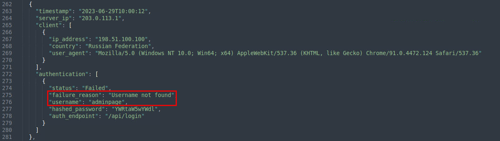
  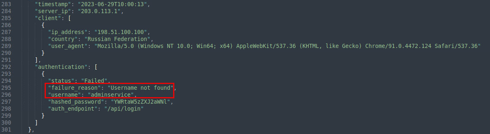
  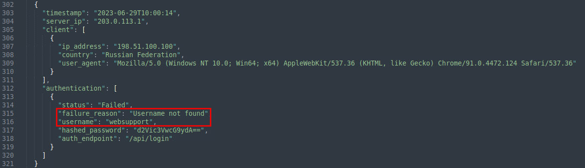
  <em>Figure 3 - Authentication failures targeting non existent usernames indicating enumeration
</em>
</div>

##### 🔷 3.2) MITRE ATT&CK Mapping — Finding 3

The observed targeting of multiple usernames, including non-existent accounts, aligns with MITRE ATT&CK sub-technique T1110.003 (Password Spraying). This technique involves attempting a small number of common or reused passwords across many accounts to identify valid users and potentially obtain access.

- Tactic: Credential Access
- Technique: T1110 – Brute Force
- Sub-technique: T1110.003 – Password Spraying

The differentiation in authentication failure responses enabled the attacker to identify which usernames were valid, facilitating more focused credential attacks against legitimate accounts later in the activity sequence.

</details>


<details>
<summary><strong>▶ 4) Valid Accounts Targeted</strong><br>
 → identifying which real user accounts were targeted by the attacker
</summary><br>
<!--
- [🔷 4.1) Determining Whether Application User Accounts Were Targeted](#-41-determining-whether-application-user-accounts-were-targeted)
- [🔷 4.2) MITRE ATT&CK Mapping — Finding 4](#-42-mitre-attck-mapping--finding-4)
-->

<a id="-4-valid-accounts-targeted"></a>

*Goal:* List the valid accounts involved in the attack.

After identifying authentication attempts against non-existent accounts, the analysis shifted to determining whether the attacker also targeted valid application user accounts.

##### 🔷 4.1) Determining Whether Application User Accounts Were Targeted

Review of authentication events originating from the attacking IP revealed repeated login attempts against several usernames that were later confirmed to be valid accounts based on successful authentication activity observed elsewhere in the logs.

The following valid accounts were targeted during the attack:
- `websitemanager`
- `webadmin`
- `ftp`

These accounts represent high-value targets commonly associated with administrative access, site management, or service-level functionality within web application environments. Their inclusion indicates a deliberate shift from broad enumeration toward more focused credential targeting.

<div style="display: flex; flex-wrap: wrap; gap: 12px;">
  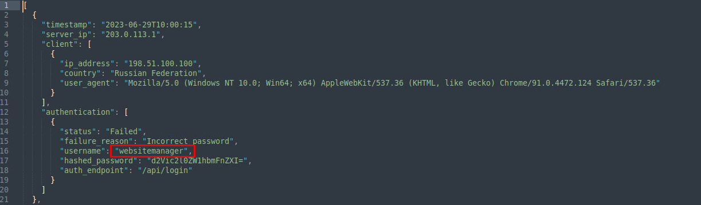
  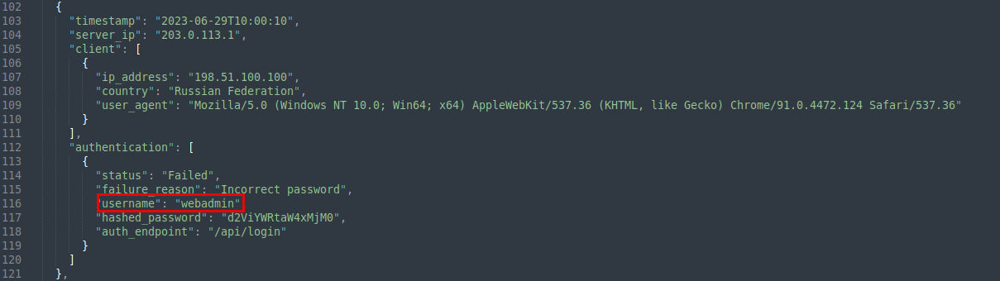
  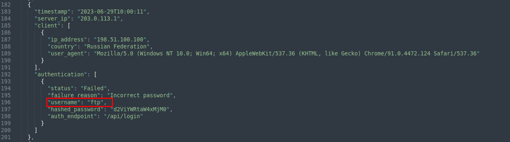
  <em>Figure 4 - Repeated authentication attempts against valid application user accounts</em>
</div>

Unlike the previously identified non-existent accounts, these usernames were associated with authentication failures that matched the application’s response behavior for existing users, and at least one of these accounts later exhibited successful authentication activity.

This transition from testing generic account names to targeting confirmed valid users is consistent with attacker behavior following successful account enumeration and suggests an increased likelihood of credential compromise.

##### 🔷 4.2) MITRE ATT&CK Mapping — Finding 4

- Tactic: Credential Access
- Technique: T1110 – Brute Force
- Sub-technique: T1110.003 – Password Spraying

The targeting of multiple valid accounts aligns with MITRE ATT&CK sub-technique T1110.003 (Password Spraying), where adversaries attempt commonly reused passwords across a set of known or likely valid users. The observed activity demonstrates a progression from reconnaissance and enumeration into targeted credential access attempts, increasing the risk of successful account compromise.

</details>

<details>
<summary><strong>▶ 5) Successful Authentication Event</strong><br>
 → identifying the point where unauthorized authentication succeeded
</summary><br>
  
<!--
- [🔷 5.1) Determinig Whether Any Attacker Login Attempts Were Successful](#-51-determinig-whether-any-attacker-login-attempts-were-successful)
-->

<a id="-5-successful-authentication-event"></a>

*Goal:* Confirm that an account was successfully compromised.

After identifying valid accounts targeted during the authentication abuse, the investigation focused on determining whether any of those attempts resulted in a successful login.

##### 🔷 5.1) Determinig Whether Any Attacker Login Attempts Were Successful

A successful authentication was identified following multiple failed login attempts. Review of authentication events for the valid account `webadmin` revealed multiple failed login attempts followed by a successful authentication within seconds. 

These events originated from the same source IP, used the same User-Agent, targeted the same authentication endpoint, and submitted the same credential material.

- **Compromised Username:** `webadmin`
- **Timestamp of First Successful Login:** `2023-06-29T10:00:12`

Key observations include:
1. Initial authentication attempts against `webadmin` failed with the reason “Incorrect password”
2. Subsequent attempts continued using the same hashed password value
3. A successful authentication occurred immediately after the failed attempts

All events occurred within a narrow time window and shared identical client metadata. This strongly indicates that valid credentials were obtained or guessed during the attack window.

<p align="left">
  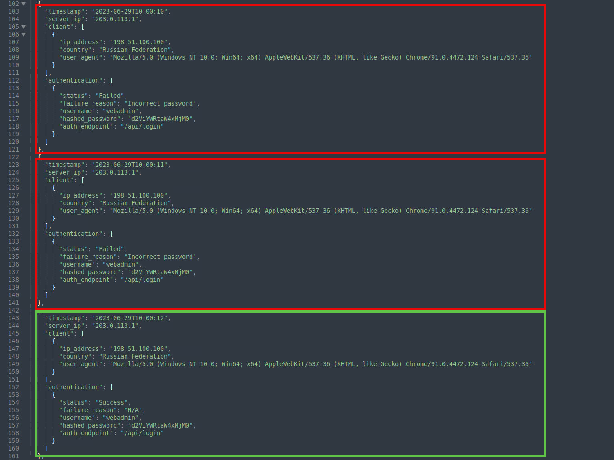<br>
  <em>Figure 5 - Successful authentication event following repeated failed login attempts</em>
</p>

</details>

<details>
<summary><strong>▶ 6) Secondary Login Source</strong><br>
 → identifying credential reuse from a second IP address
</summary><br>

<!--
- [🔷 6.1) Investigating Any Second Login Source From Attacker](#-61-investigating-any-second-login-source-from-attacker)
- [🔷 6.2) MITRE ATT&CK Mapping — Finding 6](#-62-mitre-attck-mapping--finding-6)
-->

<a id="-6-secondary-login-source"></a>

*Goal:* Determine whether stolen credentials were reused.

Following the initial successful authentication against the webadmin account, the investigation examined whether the compromised credentials were subsequently used from additional sources.

##### 🔷 6.1) Investigating Any Second Login Source From Attacker

Review of authentication logs revealed a second successful login to the same account originating from a different source IP address. This login occurred several minutes after the first successful authentication and retained identical application-level characteristics.

Key observations include:
- The account `webadmin` successfully authenticated again
- The source IP address differed from the original attacking IP
- The same User-Agent string and authentication endpoint were used
- The login occurred shortly after the initial compromise
- Secondary Login IP Address: `198.23.200.101`
- Timestamp of Secondary Successful Login: `2023-06-29T10:05:20`

The approximately five-minute gap between the first successful login and the subsequent login from a new IP suggests that the compromised credentials were reused rather than the result of continued brute-force activity. This behavior is consistent with an attacker validating access and then reusing the credentials from another system, infrastructure node, or staging environment.

The change in source IP following successful authentication represents a post-compromise indicator and significantly increases confidence that the account credentials were fully compromised and actively reused. This may also indicate credential reuse by an attacker or subsequent lateral access from another system.

<p align="left">
  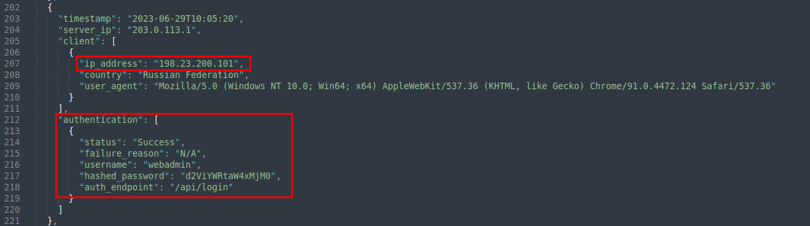<br>
  <em>Figure 6 - Credential reuse observed from a secondary source IP</em>
</p>

##### 🔷 6.2) MITRE ATT&CK Mapping — Finding 6

- Tactic: Credential Access
- Technique: T1078 – Valid Accounts

The reuse of compromised credentials from a secondary source aligns with MITRE ATT&CK technique T1078 (Valid Accounts). This technique describes adversary behavior where stolen or compromised credentials are leveraged to authenticate as a legitimate user.

Evidence supporting this mapping includes:

- Successful authentication using a valid account
- Credential reuse from a different source IP
- Continued access without triggering authentication failures
- Persistence of normal-looking client metadata

</details>

<details>
<summary><strong>▶ 7) Authentication Endpoint Used</strong><br>
 → identifying the login endpoint used during the attack.
</summary><br>
<!--
- [🔷 7.1) Reviewing Authentication Request Events Across All Login Attempts](#-71-reviewing-authentication-request-events-across-all-login-attempts)
-->

<a id="-7-authentication-endpoint-used"></a>

*Goal:* Confirm which application endpoint was targeted

After confirming credential compromise and subsequent reuse from a secondary source, the investigation shifted to reviewing if any authentication requests were being submitted to the application.

##### 🔷 7.1) Reviewing Authentication Request Events Across All Login Attempts

Review of authentication events across **all failed and successful login attempts** revealed that every authentication request targeted the same application endpoint. This was consistent across:

- Failed authentication attempts
- Successful authentication events
- Initial compromise activity
- Subsequent credential reuse from a different source IP
- Targeted Authentication Endpoint: `/api/login`

The consistent use of a single endpoint indicates that the attacker interacted directly with the application’s intended authentication mechanism rather than probing for alternate or undocumented paths. This behavior is typical of automated authentication abuse, where tooling is configured to repeatedly submit credentials to a known login endpoint.

The concentration of activity against `/api/login` also establishes this endpoint as a critical control surface. Any lack of rate limiting, account lockout enforcement, or anomaly detection at this endpoint directly enabled the observed brute-force, enumeration, and credential reuse activity.

<p align="left">
  <br>
  <em>Figure 7 - Consistent authentication activity targeting the "/api/login" endpoint</em>
</p>

</details>


<details>
<summary><strong>▶ 8) Credential Exposure</strong><br>
 → identifying insecure credential handling within application logs
</summary><br>
<!--
- [🔷 8.1) Examining How Credentials Were Being Processed Within Application Logs](#-81-examining-how-credentials-were-being-processed-within-application-logs)
- [🔷 8.2) MITRE ATT&CK Mapping — Finding 8](#-82-mitre-attck-mapping--finding-8)
-->

<a id="-8-credential-exposure"></a>

*Goal:* Determine whether credentials were logged in a reversible format.

Following confirmation of successful authentication and credential reuse, the next phase was to examine how credential material was being handled within the application logs.

##### 🔷 8.1) Examining How Credentials Were Being Processed Within Application Logs

During review of the authentication logs, a `hashed_password` field was observed in both failed and successful login attempts. The value associated with this field remained identical across multiple authentication events for the same username, indicating that the application was logging a deterministic transformation of the submitted password rather than a securely stored credential hash.

To validate the nature of this value, a Linux terminal session was opened on the Ubuntu-based analysis environment and the credential value was examined using standard command-line utilities. The following command was executed:

```bash
echo <encoded_value> | base64 --decode
```

This command takes the encoded string as input and pipes it into the Base64 decoding utility. The echo command outputs the string, while `base64 --decode` reverses Base64 encoding and returns the original plaintext data. The decoded output confirmed that the value recorded in the logs could be directly recovered to its original plaintext form.

Why this was possible: Base64 is not a hashing algorithm. It is an encoding scheme designed to represent binary data using printable ASCII characters for safe transport and storage. Encoding is fully reversible by design, whereas secure password hashing must be one-way and irreversible. Several characteristics of the logged value indicated that it was not a cryptographic password hash:

- The value was short compared to modern password hashes
- It contained only alphanumeric characters, consistent with Base64 encoding
- No salt was present to randomize the output
- It did not match common hexadecimal hash formats (e.g., SHA-1, SHA-256)
- It lacked identifying markers used by modern password hashing algorithms such as `$2b$` (bcrypt), `$argon2`, or `$pbkdf2`

Because the value was encoded rather than hashed, it could be decoded using standard tooling without brute force or cracking. This confirms that sensitive credential material was being logged in a reversible format at the application layer. The ability to recover plaintext credentials from application logs represents a critical security issue and explains how repeated authentication failures transitioned into successful logins and subsequent credential reuse.

<blockquote>
The credential value recorded in hashed_password was determined to be reversible encoding (not a one-way password hash), allowing recovery of the plaintext password during authorized analysis.
</blockquote>

The same `hashed_password` value appears in both failed and successful login attempts because the application logs a transformed version of the password before it checks whether the password is correct. Each time the same password is submitted, the application records the same value, regardless of whether authentication succeeds or fails. This indicates that the value being logged is not a secure, one-way password hash, but a predictable transformation of the user’s input. As a result, credential material is exposed in the logs for every login attempt, making it possible to reuse or recover credentials once a correct password is identified.

The presence of recoverable credential material within application logs represents a critical security weakness. Further analysis determined that the stored value was not a securely salted cryptographic hash, but rather an encoded representation that could be decoded to reveal the original plaintext password.

Hashed Password: `d2ViYWRtaW4xMjM0`
Recovered Password: `webadmin1234`

<p align="left">
  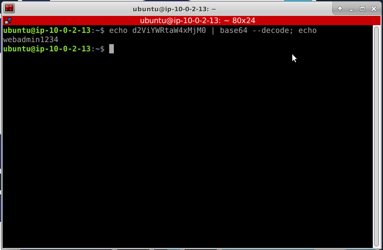<br>
  <em>Figure 8 - Reversible credential value decoded from "hashed_password" field</em>
</p>

This finding explains how repeated failed attempts transitioned into a successful authentication and why the compromised credentials could subsequently be reused from a secondary source IP. Logging recoverable credential material effectively eliminates the security guarantees provided by authentication controls.

##### 🔷 8.2) MITRE ATT&CK Mapping — Finding 8

- Tactic: Credential Access
- Technique: T1552 – Unsecured Credentials

The exposure of decodable credential material within application logs aligns with MITRE ATT&CK technique T1552 (Unsecured Credentials). This technique describes scenarios where sensitive authentication data is stored or transmitted in an insecure manner, allowing adversaries to obtain valid credentials without brute-force guessing.

Evidence supporting this mapping includes:

- Storage of credential-derived values in application logs
- Ability to decode the logged value to recover a plaintext password
- Successful authentication and credential reuse following exposure
- Absence of proper hashing and salting controls

---

### Findings Summary
This section consolidates high-confidence conclusions derived from application authentication telemetry and HTTP metadata.

- A single external IP generated a high volume of failed authentication attempts.
- Authentication attempts targeted both non-existent and valid accounts.
- Consistent User-Agent strings indicated scripted tooling.
- A valid account was successfully compromised.
- Compromised credentials were reused from a secondary source IP.
- Authentication requests consistently targeted a single login endpoint.
- Credential material was logged in a reversible encoded format.
- Decoding the credential value revealed the plaintext password.

Overall, the evidence reflects a full credential-based attack lifecycle: enumeration, password spraying, compromise, credential reuse, and insecure credential exposure.

**Detailed Evidence Reference:**  
For a full, artifact-level breakdown of logs, alerts, and forensic indicators that support these findings — including where each artifact was identified during the investigation — see: **`detection-artifact-report.md`**

</details>


---

### Defensive Takeaways

This section highlights defender-relevant patterns observed during the investigation, focusing on behaviors and telemetry that can be operationalized for detection and monitoring rather than exploit mechanics.

- High-frequency authentication failures from a single source indicate automated abuse.
- Consistent User-Agent strings often signal scripted attacks.
- Differing authentication failure responses enable account enumeration.
- Successful authentication following repeated failures is a strong compromise indicator.
- Credential reuse from a new source IP increases confidence in account compromise.
- Logging reversible credential material undermines authentication security.
- Application-layer logs are critical for detecting credential attacks.

---

### Artifacts Identified

This section lists concrete artifacts uncovered during the investigation that support the final determination and can be used for validation, hunting, detection development, or follow-up analysis.

- Primary attacking IP address  
- Secondary login source IP  
- Targeted authentication endpoint  
- Consistent User-Agent string  
- List of non-existent and valid usernames targeted  
- Compromised account username  
- Timestamp of first successful login  
- Encoded credential value logged by application  
- Recovered plaintext password

**Detailed Evidence Reference:**  
For a full, artifact-level breakdown of logs, alerts, and forensic indicators that support these findings — including where each artifact was identified during the investigation — see: **`detection-artifact-report.md`**


---

### Detection and Hardening Opportunities

This section outlines actionable opportunities to improve detection coverage and reduce the effectiveness of similar techniques. Recommendations are based directly on behaviors and artifacts observed during the investigation.

### ▶ Containment Actions (Recommended)
These actions focus on limiting immediate impact and preventing further unauthorized access following detection of credential abuse.

- Immediately reset credentials for all affected and potentially exposed user accounts, prioritizing administrative and service accounts.
- Invalidate all active sessions associated with compromised credentials to prevent continued access using existing authentication tokens.
- Temporarily block or aggressively rate-limit authentication attempts originating from the identified attacking IP addresses.
- Review authentication and access logs for additional successful logins or suspicious activity involving the compromised accounts during the affected timeframe.
- Notify application and security stakeholders of the confirmed credential compromise to coordinate response and remediation.

### ▶ Eradication & Hardening Recommendations
These recommendations address systemic weaknesses that enabled the attack and reduce the likelihood of recurrence.

- Enforce account lockout thresholds or progressive authentication backoff after repeated failed login attempts.
- Implement multi-factor authentication (MFA) for all privileged, administrative, and externally accessible user accounts.
- Remove credential-derived values from application logs and ensure that no reversible credential material is recorded.
- Validate that passwords are securely handled using industry-standard hashing and salting mechanisms (for example, bcrypt, scrypt, or Argon2).
- Standardize authentication failure responses to prevent attackers from distinguishing between valid and invalid usernames.
- Review and harden authentication endpoints to ensure they are protected against automated abuse.

### ▶ Detection & Monitoring Recommendations

This section summarizes high-level detection and hardening opportunities observed during the investigation. For detailed, actionable recommendations — including specific logging gaps, detection logic ideas, and configuration improvements — see: **`detection-and-hardening-recommendations.md`**

These recommendations focus on improving visibility and early detection of similar authentication abuse patterns.

- Alert on excessive failed authentication attempts from a single source IP within a defined time window.
- Alert on authentication attempts targeting non-existent or invalid user accounts.
- Alert on successful authentication events occurring immediately after a sequence of failed login attempts.
- Monitor for consistent or identical User-Agent strings across high-volume authentication attempts, indicating scripted tooling.
- Track authentication anomalies by endpoint, particularly for sensitive paths such as `/api/login`.
- Correlate authentication events with source IP reputation and geolocation data to identify anomalous access patterns.

### ▶ Response Validation & Follow-Up (Optional)
- Review authentication logs after containment to confirm that failed and successful login rates return to expected baselines.
- Validate that compromised credentials are no longer accepted and that session invalidation is effective.
- Monitor for renewed authentication abuse from the same or related IP addresses.
- Confirm that newly implemented alerts for excessive failures, enumeration attempts, and credential reuse would have triggered.
- Conduct short-term monitoring of authentication endpoints to detect repeat automated abuse patterns.

---

### MITRE ATT&CK Mapping

This section provides a high-level summary of observed ATT&CK tactics and techniques. For evidence-backed mappings tied to specific artifacts, timestamps, and investigation steps, see: **`mitre-attack-mapping.md`**

The following mappings connect observed behaviors to MITRE ATT&CK techniques and cite the specific evidence identified during application authentication log analysis. Mappings are based on directly observed activity and artifacts within scope.

### ▶ Credential Access

(1) Brute Force (T1110)
- High-volume authentication failures from a single source IP were observed targeting multiple accounts.

### ▶ Credential Access

(1) Password Spraying (T1110.003)
- Repeated authentication attempts across many usernames using consistent client metadata indicated password spraying behavior.

### ▶ Credential Access

(1) Valid Accounts (T1078)
- Successful authentication occurred using compromised credentials, followed by reuse from a secondary source IP.

### ▶ Credential Access

(1) Unsecured Credentials (T1552)  
- Reversible credential material was exposed in application logs, allowing recovery of plaintext passwords.

---

### MITRE ATT&CK Mapping (Table View)

This section provides a high-level table summary of observed ATT&CK tactics and techniques. For evidence-backed mappings tied to specific artifacts, timestamps, and investigation steps, see: **`mitre-attack-mapping.md`**

| Tactic | Technique | Description |
|------|-----------|-------------|
| Credential Access | **Brute Force (T1110)** | Repeated authentication failures from a single source IP. |
| Credential Access | **Password Spraying (T1110.003)** | Authentication attempts across many usernames using common credentials. |
| Credential Access | **Valid Accounts (T1078)** | Successful login using compromised credentials and reuse from another IP. |
| Credential Access | **Unsecured Credentials (T1552)** | Plaintext credentials recovered from application logs. |

---


