# Web Exploitation Attempt Investigation

### Executive Summary

Security monitoring identified multiple web application security alerts associated with a public-facing web server within the environment. Initial detections originated from Suricata Intrusion Detection System (IDS) telemetry and FortiGate Unified Threat Management (UTM) logs, indicating possible reconnaissance, information disclosure attempts, vulnerability scanning activity, and exploitation attempts targeting web application resources.

The investigation focused on determining the nature of the activity, identifying targeted systems, validating the significance of associated security alerts, identifying any vulnerabilities referenced by the observed detections, and assessing whether evidence of successful exploitation existed within the available telemetry.

Analysis of Suricata IDS alerts, FortiGate UTM detections, Sysmon endpoint telemetry, and external vulnerability intelligence confirmed that the targeted web server was subjected to multiple forms of attack activity, including information disclosure attempts, vulnerability scanning, web application reconnaissance, remote code execution targeting, and reverse shell-related detections. Investigation of associated URLs, HTTP response codes, alert signatures, and vulnerability references provided additional context regarding attacker objectives and techniques.

The findings indicate sustained web application attack activity directed toward the target server. While multiple exploitation attempts and vulnerability probes were observed, available evidence did not conclusively demonstrate successful compromise, malware execution, persistence, privilege escalation, or unauthorized access to the targeted host.

> 👉 For a **description of the situation being investigated and what triggered this analysis**, see the **[Scenario Context](#scenario-context)** section below.

> 👉 For a **mapping of observed behavior to MITRE ATT&CK techniques**, see the **[MITRE ATT&CK](#mitre-attck-mapping)** section below.

> 👉 For a **detailed, step-by-step walkthrough of how this investigation was conducted — complete with screenshots**, see the **[Investigation Walkthrough](#investigation-walkthrough)** section below.

---

### Scenario Context

Security monitoring identified elevated web application security activity targeting a public-facing server within the environment. Multiple Suricata IDS alerts and FortiGate UTM detections were generated over the same investigation period, indicating possible reconnaissance, vulnerability scanning, information disclosure attempts, and exploitation activity directed toward web application resources.

Initial review revealed detections referencing web vulnerability scanners, attempted access to potentially sensitive application resources, remote code execution signatures, and reverse shell-related activity. Because these alert categories are commonly associated with pre-compromise reconnaissance and exploitation attempts, analysts were tasked with determining the scope and significance of the observed activity.

The investigation leveraged Suricata intrusion detection telemetry, FortiGate UTM security alerts, Sysmon endpoint logs, and external vulnerability intelligence sources to identify affected assets, validate attack signatures, determine whether vulnerabilities were being targeted, and assess whether the activity resulted in successful compromise.

Particular focus was placed on identifying targeted systems, understanding attacker behavior, validating referenced vulnerabilities, and determining whether available telemetry supported reconnaissance activity alone or evidence of successful exploitation.

---

### Incident Scope

The scope of this investigation is limited to analysis of simulated intrusion detection, firewall, and endpoint telemetry contained within the `botsv1` dataset. The investigation focuses on web application attack activity, vulnerability-related detections, exploitation attempts, and associated security alerts.

The investigation includes:

* Review of Suricata IDS alerts
* Review of FortiGate UTM detections
* Analysis of information disclosure attempts
* Analysis of vulnerability scanning activity
* Analysis of web application exploitation attempts
* Identification of targeted URLs and web resources
* Review of HTTP response codes
* Validation of referenced CVEs and vulnerabilities
* Identification of targeted hosts
* Correlation of network and endpoint telemetry
* Analysis of reverse shell-related detections
* Review of alert severity distributions

The investigation does not include live exploitation, host forensics, malware reverse engineering, vulnerability remediation, web server recovery, or attribution beyond observed infrastructure, attack signatures, and available telemetry.

---

### Environment, Evidence, and Tools

This investigation was conducted within a pre-configured Splunk Enterprise environment containing the `botsv1` dataset. Multiple telemetry sources were reviewed to correlate intrusion detection alerts, firewall detections, endpoint evidence, and vulnerability intelligence.

#### ▶ Environment

* **Platform:** Splunk Enterprise
* **Dataset:** `botsv1`
* **Primary Investigation Type:** Web application exploitation attempt analysis
* **Primary Security Controls:** Suricata IDS and FortiGate UTM
* **Primary Target Server:** `192.168.250.70`

#### ▶ Evidence Sources

* `suricata`

  * Intrusion detection alerts
  * Alert categories
  * Alert signatures
  * HTTP metadata
  * Source and destination network information
  * Severity classifications

* `fortigate_utm`

  * Security alert classifications
  * Vulnerability detections
  * Threat signatures
  * Attack categorization
  * Reference identifiers

* `xmlwineventlog`

  * Sysmon endpoint telemetry
  * Host attribution
  * System identification

* External vulnerability intelligence

  * National Vulnerability Database (NVD)
  * Vendor vulnerability references
  * CVE documentation

#### ▶ Tools Used

* **Splunk Enterprise** — Primary SIEM and log analysis platform
* **Splunk Search & Reporting App** — Event review and correlation
* **Suricata IDS Telemetry** — Intrusion detection alerts and signature analysis
* **FortiGate UTM Telemetry** — Threat classification and vulnerability detection enrichment
* **Sysmon Telemetry** — Endpoint attribution and host identification
* **National Vulnerability Database (NVD)** — CVE validation and vulnerability scoring
* **OSINT Research** — Vulnerability and exploitation technique validation

#### ▶ Environment Setup

The investigation was performed in a local Splunk environment. Splunk was started from the terminal using:

```bash
sudo systemctl start Splunkd
```

After allowing Splunk time to start, the Splunk web interface was accessed locally at:

```text
127.0.0.1:8000
```

From the Splunk homepage, the Search & Reporting application was used throughout the investigation.

To ensure historical BOTSv1 events were available, the time range was configured as:

```text
Other > All Time
```

This ensured all relevant Suricata, FortiGate UTM, and Sysmon telemetry would be available during analysis.

---

### Investigative Questions

This section outlines the core questions used to guide analysis and maintain an evidence-driven investigation.

Key questions included:

* What security alerts were generated against the web application?
* Which systems were targeted by the observed activity?
* What types of attack behavior were detected?
* Were information disclosure attempts observed?
* Which URLs and web resources were targeted?
* Were any vulnerability scanners identified?
* Which vulnerabilities or CVEs were referenced within detections?
* What severity levels were associated with the observed alerts?
* Were remote code execution attempts detected?
* Were reverse shell-related alerts generated?
* Which internal host was associated with the observed activity?
* Did the available telemetry indicate successful exploitation or compromise?
* What attacker techniques and objectives were observable?

---

### Investigation Timeline

The following timeline summarizes major investigative milestones based on intrusion detection alerts, firewall telemetry, endpoint attribution, and vulnerability intelligence analysis.

* T0 — Multiple web application security alerts identified.
* T1 — Suricata alert categories reviewed and scoped.
* T2 — Information disclosure attempts identified and analyzed.
* T3 — Targeted URLs and web resources reviewed.
* T4 — HTTP response codes analyzed to determine attack outcomes.
* T5 — Vulnerability scanning activity identified.
* T6 — Alert signatures reviewed and categorized.
* T7 — CVE-referenced detections identified.
* T8 — Vulnerability intelligence enrichment performed.
* T9 — Remote code execution-related detections reviewed.
* T10 — Reverse shell-related activity identified.
* T11 — Internal host attribution performed using endpoint telemetry.
* T12 — Alert severity distributions analyzed across security controls.
* T13 — Evidence reviewed to determine exploitation impact and attack scope.

<blockquote>

This investigation demonstrates how intrusion detection telemetry, firewall detections, endpoint evidence, and vulnerability intelligence can be correlated to analyze web application attack activity. By validating attack signatures, reviewing targeted resources, enriching vulnerability references, and correlating evidence across multiple security controls, analysts can distinguish reconnaissance and exploitation attempts from confirmed compromise and build a comprehensive understanding of attacker behavior.

</blockquote>

---

### Investigation Walkthrough

<blockquote>
<details>
<summary><strong>📚 Walkthrough navigation (click to expand)</strong></summary>

* [1) Initial Alert Review & Dashboard Analysis](#-1-initial-alert-review--dashboard-analysis)
* [2) Information Disclosure Alert Investigation](#-2-information-disclosure-alert-investigation)
* [3) Targeted URL Analysis](#-3-targeted-url-analysis)
* [4) HTTP Response Validation](#-4-http-response-validation)
* [5) Vulnerability Signature Analysis](#-5-vulnerability-signature-analysis)
* [6) CVE Identification and Vulnerability Enrichment](#-6-cve-identification-and-vulnerability-enrichment)
* [7) Reverse Shell Detection Investigation](#-7-reverse-shell-detection-investigation)
* [8) Host Attribution and Endpoint Correlation](#-8-host-attribution-and-endpoint-correlation)
* [9) Scanner Identification and Tool Attribution](#-9-scanner-identification-and-tool-attribution)
* [10) Alert Severity Analysis and Security Control Comparison](#-10-alert-severity-analysis-and-security-control-comparison)

</details>
</blockquote>

<a id="-1-initial-alert-review--dashboard-analysis"></a>

<details>
<summary><strong>▶ 1) Initial Alert Review & Dashboard Analysis</strong><br>
→ reviewing security alert volumes and identifying investigation scope
</summary><br>

**Goal:** Establish the overall scope of security activity and identify the primary alert sources involved in the investigation.

The investigation began by opening the Search & Reporting application within Splunk and navigating to the security dashboard used to summarize web application attack activity. The dashboard contained alert data generated by both Suricata Intrusion Detection System (IDS) telemetry and FortiGate Unified Threat Management (UTM) detections.

Reviewing the dashboard counters provided an immediate overview of the volume of activity observed by each security control.

Because both security technologies were reporting web-related detections during the same investigation period, the dashboard provided an effective starting point for determining the scale of the observed activity and identifying areas requiring deeper analysis.

<p align="left">
  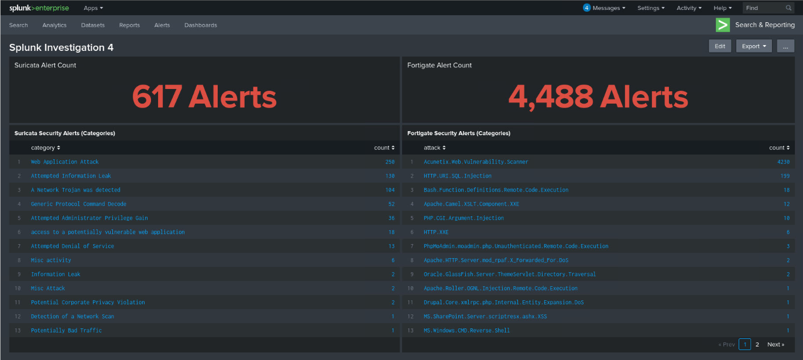<br>
  <em>Figure 1 - Initial dashboard review showing Suricata IDS and FortiGate UTM alert activity</em>
</p>

Review of the dashboard also revealed several alert categories associated with web application attacks, reconnaissance activity, vulnerability scanning, information disclosure attempts, and exploitation behavior. These categories would become the primary focus of the investigation.

Before investigating individual alerts, the dashboard configuration itself was reviewed to better understand how the alert counts were being generated.

Using the dashboard editing interface, the **Edit Dashboard** option was selected. The magnifying glass icon associated with each panel was then used to review the underlying search powering the visualization.

The FortiGate alert counter was found to use the following search:

```spl
index=* sourcetype=fortigate_utm level=alert
| stats count by attack
```

This search retrieves FortiGate UTM events classified as alerts and aggregates the results by attack category, allowing the dashboard to display alert volumes associated with each detected attack type.

<p align="left">
  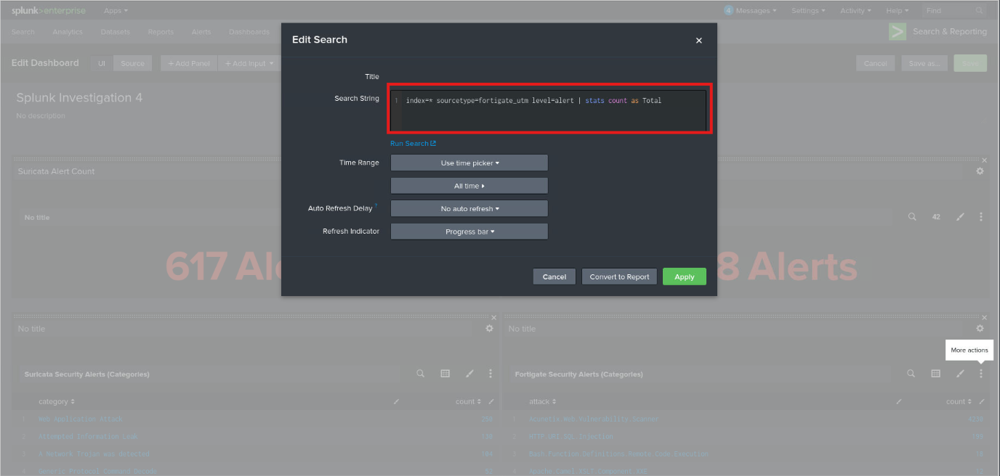<br>
  <em>Figure 2 - Initial dashboard review showing FortiGate UTM alert count search query</em>
</p>

The same process was repeated for the Suricata alert counter. Reviewing the panel search revealed:

```spl
index=* sourcetype=suricata event_type=alert alert.category!=""
| stats count as Total
```

This search retrieves Suricata alert events containing a populated alert category and calculates the total number of IDS detections observed within the dataset.

<p align="left">
  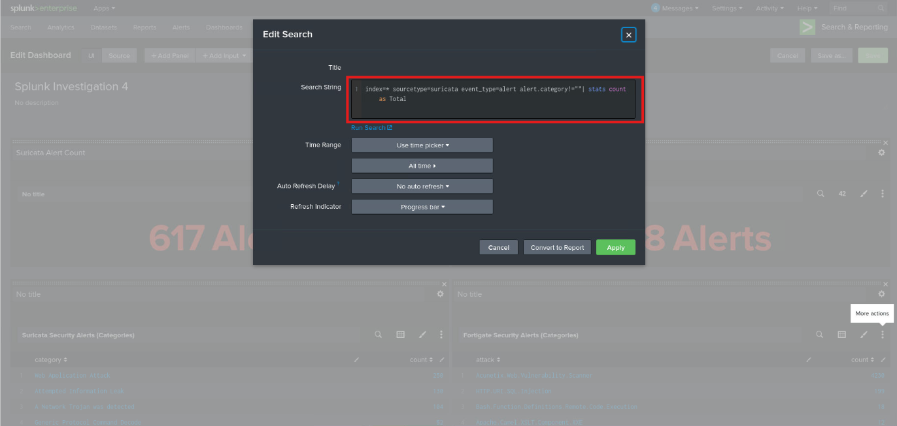<br>
  <em>Figure 3 - Initial dashboard review showing Suricata IDS alert count search query</em>
</p>

Reviewing the underlying searches provided useful context regarding how the dashboard panels were populated and confirmed that both security controls were reporting alert activity relevant to the investigation.

</details>

<a id="-2-information-disclosure-alert-investigation"></a>

<details>
<summary><strong>▶ 2) Information Disclosure Alert Investigation</strong><br>
→ investigating Suricata alerts associated with sensitive resource discovery
</summary><br>

**Goal:** Determine what activity triggered the Information Leak alert category and identify the systems involved.

Among the Suricata alert categories observed on the dashboard was an alert type classified as:

```text
Information Leak
```

Information disclosure alerts are commonly generated when external systems attempt to access resources capable of revealing sensitive configuration information, application details, debugging information, or internal system metadata.

<p align="left">
  <br>
  <em>Figure 4 - Initial dashboard review showing Suricata IDS Information Leak category</em>
</p>

Selecting the alert category loaded the underlying Suricata events associated with the activity, under the SPL query:

```spl
index=* sourcetype=suricata event_type=alert category!="" category="Information Leak"
```

Review of the event details identified the source and destination systems involved in the communication.

> **Analyst Note:** In many production environments, an IDS alert category may contain hundreds or thousands of related events generated across multiple source and destination systems. In those situations, analysts often need to aggregate results using SPL commands such as `stats`, `top`, or `rare` to identify the most relevant IP addresses, hosts, or attack patterns before continuing the investigation. In this dataset, the search returned only two matching events, both associated with the same source IP and destination IP. Because of the limited number of results, the relevant network information was immediately visible within the event details and did not require additional aggregation or filtering to identify the systems involved.


The source IP address observed in the alerts was:

```text
40.80.148.42
```

The destination system was:

```text
192.168.250.70
```

<p align="left">
  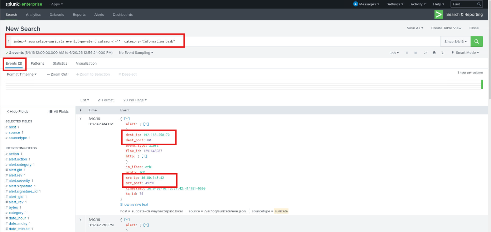<br>
  <em>Figure 5 - Reviewing Suricata Information Leak alerts and identifying source and destination systems</em>
</p>

At this stage, the activity appeared consistent with an external system attempting to access potentially sensitive web application resources hosted on the internal server.

To determine how Suricata responded to the observed activity, the event details were expanded and reviewed in raw format. Inspection of the available fields revealed the `action` field, which records the action taken by Suricata when the traffic matched a detection rule. Both events showed an action value of `allowed`, indicating that Suricata detected and logged the activity but did not actively block the associated network traffic.

<p align="left">
  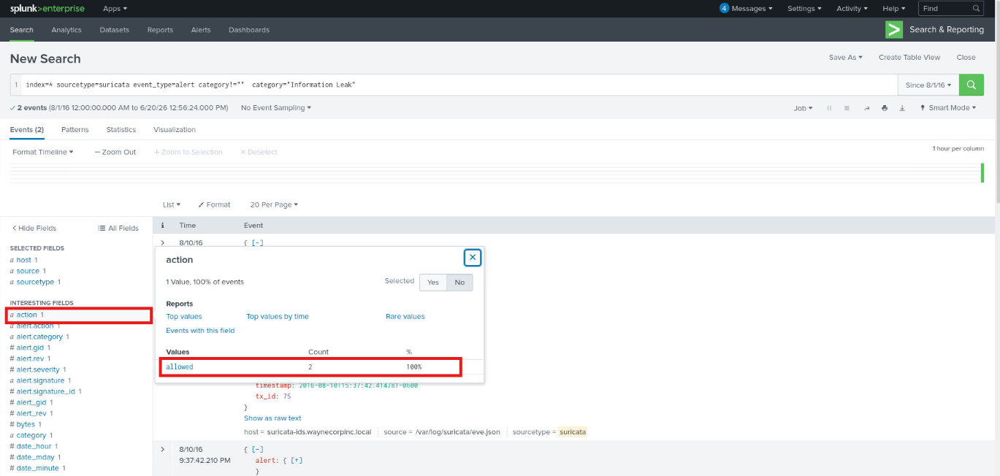<br>
  <em>Figure 6 - Reviewing the Suricata "action" field and confirming that the detected traffic was allowed rather than blocked</em>
</p>

Although the alert category provided a general description of the activity as an information disclosure event, additional context was needed to understand exactly what triggered the detection. To obtain more detailed information, the investigation reviewed the `alert.signature` field rather than the `alert.signature_id` field. The `alert.signature` field contains a human-readable description of the detection rule that fired, whereas the `alert.signature_id` field contains only a numeric identifier that is generally less useful without separately researching the corresponding rule definition.

Review of the `alert.signature` field revealed the signature:

```text
ET WEB_SERVER WEB-PHP phpinfo access
```

This signature indicates that a system attempted to access a `phpinfo()` page hosted on a web server. PHP is a widely used server-side scripting language commonly used to build dynamic websites and web applications. The `phpinfo()` function generates a diagnostic page containing detailed information about the server's PHP configuration, installed modules, software versions, environment variables, and other system details. Because this information can help attackers identify technologies, configurations, and potential vulnerabilities, access to exposed `phpinfo()` pages is frequently monitored by intrusion detection systems and is commonly associated with web application reconnaissance activity.

<p align="left">
  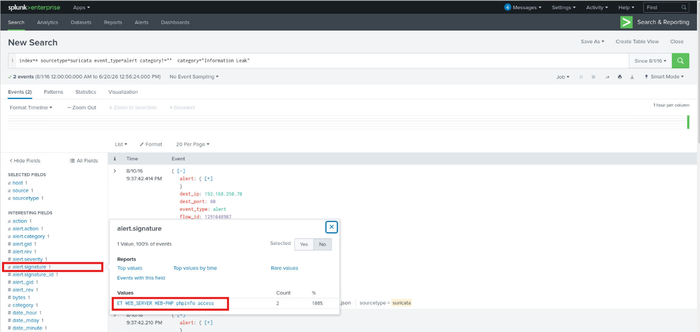<br>
  <em>Figure 7 - Reviewing the Suricata alert.signature field and identifying a detection associated with attempted access to a PHP diagnostic page</em>
</p>


</details>

<a id="-3-targeted-url-analysis"></a>

<details>
<summary><strong>▶ 3) Targeted URL Analysis</strong><br>
→ determining which web resources were being accessed
</summary><br>

**Goal:** Identify the specific web application resources targeted by the observed activity.

After identifying the source and destination systems involved in the activity, the next objective was determining exactly what web resource the attacker was attempting to access. Because the connection was targeting destination port `80` (HTTP), reviewing HTTP-related fields within the Suricata event provided additional application-layer context beyond the network connection itself.

The `http.hostname` field was reviewed first to identify the website being targeted. This field revealed the domain:

```text
imreallynotbatman.com
```

<p align="left">
  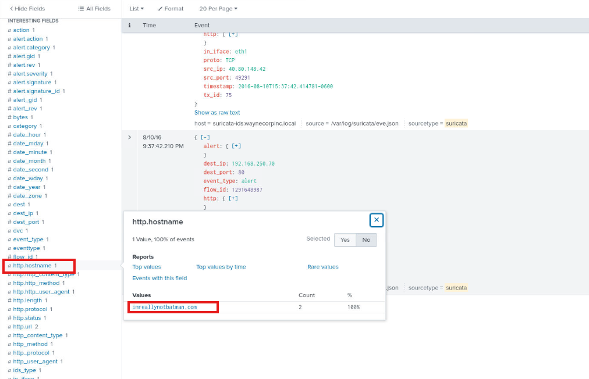<br>
  <em>Figure 8 - Reviewing the <code>http.hostname</code> field to identify the targeted website</em>
</p>

While the hostname identifies the web server receiving the request, it does not reveal the specific content being requested. To determine this, the investigation reviewed the `url` field, which contains the resource path requested by the client.

Review of the field revealed requests for:

```text
phpinfo.php
```

and

```text
phpinfo.php5
```

<p align="left">
  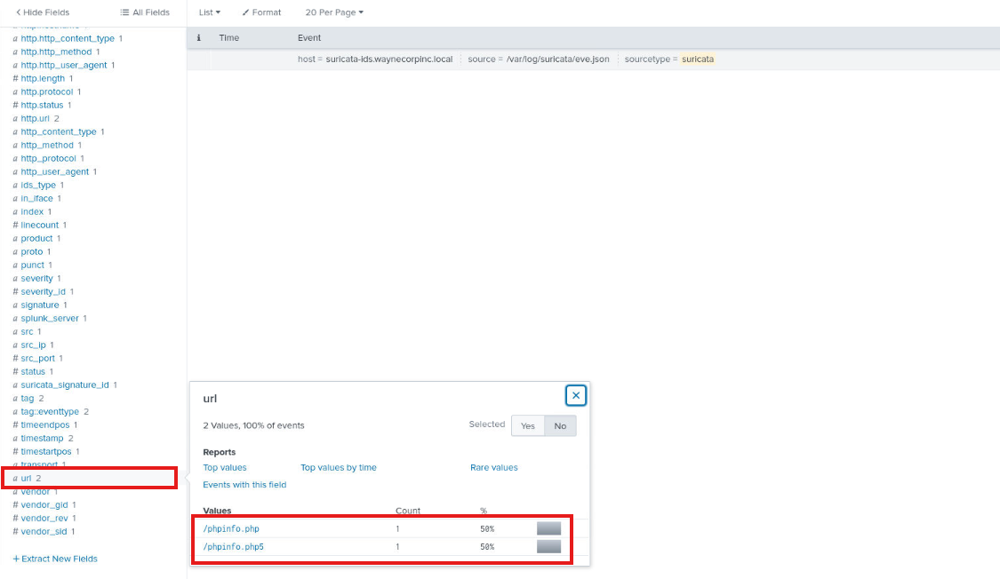<br>
  <em>Figure 9 - Reviewing the <code>url</code> field to identify the requested web resources</em>
</p>

Combining the `http.hostname` and `url` fields allowed the full target URLs to be reconstructed:

```text
imreallynotbatman.com/phpinfo.php
imreallynotbatman.com/phpinfo.php5
```

The requested resources are significant because `phpinfo()` pages are commonly used for troubleshooting and diagnostics on PHP-based web servers. When exposed externally, these pages can reveal detailed information about the application's configuration, installed modules, software versions, environment variables, and server settings. Attackers frequently search for these pages during reconnaissance because the information can assist in identifying potential vulnerabilities and planning subsequent exploitation attempts.

The targeted resources are notable because `phpinfo()` pages frequently expose configuration details about web servers, installed modules, PHP versions, environment variables, and other information useful to attackers performing reconnaissance.

Access to these pages can assist attackers in identifying vulnerabilities, tailoring exploitation attempts, and understanding application configurations.

> **Analyst Note:** Web application investigations frequently require analysts to combine multiple fields to reconstruct the complete request being made. While the URL field often contains only the requested path, combining it with the hostname field provides the full target address and helps establish exactly what resource an attacker attempted to access.

</details>

<a id="-4-http-response-validation"></a>

<details>
<summary><strong>▶ 4) HTTP Response Validation</strong><br>
→ determining whether the targeted resources were successfully accessed
</summary><br>

**Goal:** Determine whether the information disclosure attempt successfully reached the targeted resources.

Identifying the requested URLs established what the attacker was attempting to access, but did not reveal whether the requests were successful.

To determine the outcome of the activity, the HTTP response metadata associated with the Suricata events was reviewed.

Inspection of the event details revealed the field:

```text
http.status
```

Both events returned the value:

```text
404
```

<p align="left">
  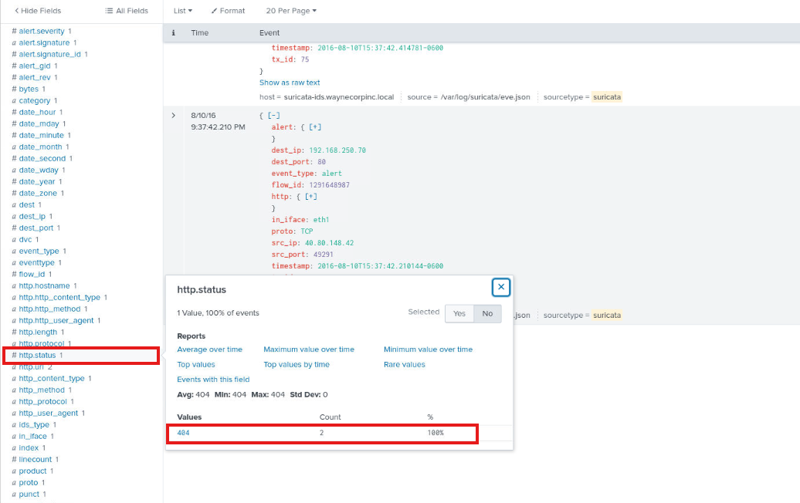<br>
  <em>Figure 10 - HTTP response validation showing unsuccessful access attempts</em>
</p>

HTTP status code 404 indicates that the requested resource could not be found on the web server.

Based on the available evidence, the attacker successfully attempted to access the resources, but the targeted pages did not exist on the server at the time of the request.

This finding reduced the likelihood that sensitive PHP configuration information was exposed through these specific requests.

</details>

<a id="-5-vulnerability-signature-analysis"></a>

<details>
<summary><strong>▶ 5) Vulnerability Signature Analysis</strong><br>
→ identifying the specific attack signatures observed within Suricata alerts
</summary><br>

**Goal:** Determine the specific attack signatures responsible for generating the observed alerts.

Although alert categories provide useful high-level descriptions of activity, they are often too broad to fully explain attacker behavior.

To obtain more detailed context, the investigation shifted from reviewing alert categories to reviewing alert signatures.

The investigation focused on the Suricata category:

```text
A Network Trojan was detected
```

<p align="left">
  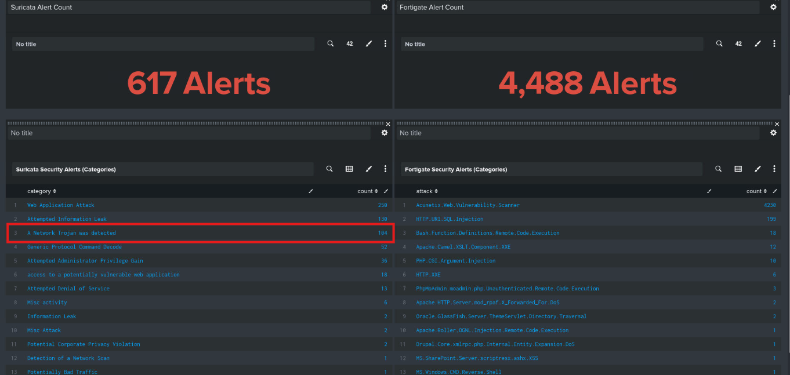<br>
  <em>Figure 11 - Switching Suricata Alerts Category search</em>
</p>

Rather than reviewing individual events manually, the following search was used to summarize the observed signatures:

```spl
index="botsv1" sourcetype=suricata event_type=alert
| stats count by signature
```

<p align="left">
  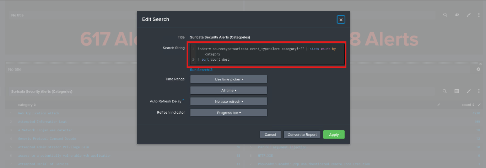<br>
  <em>Figure 12 - Aggregating Suricata alert signatures to identify unique attack patterns</em>
</p>

The results identified multiple distinct signatures associated with the alert category (`alert.signature` field).

In total, the search revealed:

```text
12 unique signatures
```

<p align="left">
  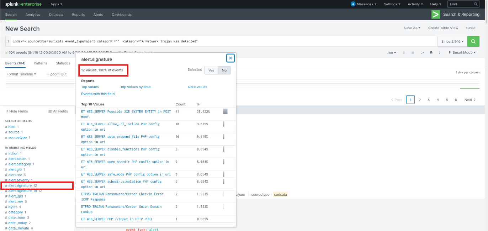<br>
  <em>Figure 13 - Exposing how many unique signatures were associated with this category</em>
</p>

Reviewing individual signatures provided significantly more detail than the generic category name and helped identify vulnerability references, exploitation attempts, and attacker techniques that would be examined in later stages of the investigation.

> **Analyst Note:** Alert categories are often designed to provide broad classifications that simplify dashboard reporting. Alert signatures typically provide far greater investigative value because they describe the specific detection logic that triggered the alert and frequently reference attack techniques, malware families, vulnerabilities, or exploitation behavior directly.

</details>


<a id="-6-cve-identification-and-vulnerability-enrichment"></a>

<details>
<summary><strong>▶ 6) CVE Identification and Vulnerability Enrichment</strong><br>
→ identifying referenced vulnerabilities and validating their severity
</summary><br>

**Goal:** Determine whether any observed attack signatures reference known vulnerabilities and assess their severity.

Earlier analysis focused on information disclosure activity that resulted in unsuccessful HTTP requests. To identify potentially higher-risk behavior, the investigation next reviewed Suricata detections associated with successful responses from the target web server.

The investigation began by selecting the Suricata alert category:

```
A Network Trojan was detected
```

Selecting the category automatically generated the following search:

```spl
index=* sourcetype=suricata event_type=alert category!="" category="A Network Trojan was detected"
```

To focus on requests that were successfully processed by the target web server, the search was refined to include only HTTP status code 200 responses:

```spl
index=* sourcetype=suricata event_type=alert category!="" category="A Network Trojan was detected" http.status=200
```

This returned only one event. 

<p align="left">
  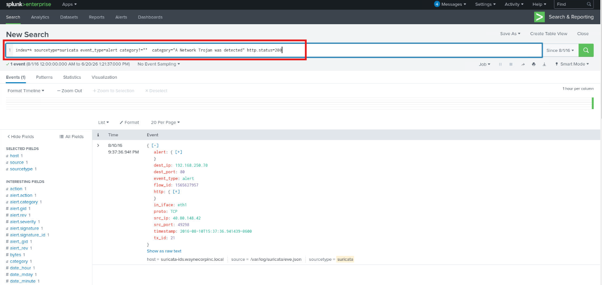<br>
  <em>Figure 14 - Filtering on suricata events with http.status of 200</em>
</p>

Although the event confirmed that at least one request within the **A Network Trojan was detected** category was successfully processed by the target server, reviewing the event did not reveal any vulnerability references or CVE identifiers. Because the objective was to identify known vulnerabilities associated with successful web requests, the investigation scope was expanded beyond a single Suricata alert category.

The category filter was removed and the investigation shifted to reviewing all Suricata alert events where the target server returned an HTTP status code of `200`.

```spl
index=* sourcetype=suricata event_type=alert http.status=200
```

<p align="left">
  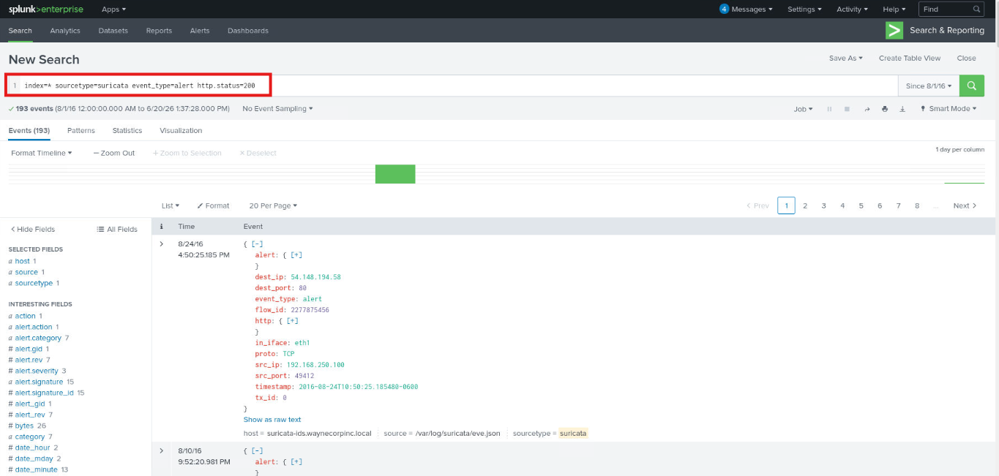<br>
  <em>Figure 15 - Filtering for all Suricata alert events with HTTP status code of 200</em>
</p>

This broader search returned a significantly larger number of events. Because manually reviewing nearly two hundred events would be inefficient, the results were aggregated by alert signature to identify the unique detection rules present within the dataset.

```spl
index=* sourcetype=suricata event_type=alert http.status=200
| stats count by alert.signature
```

<p align="left">
  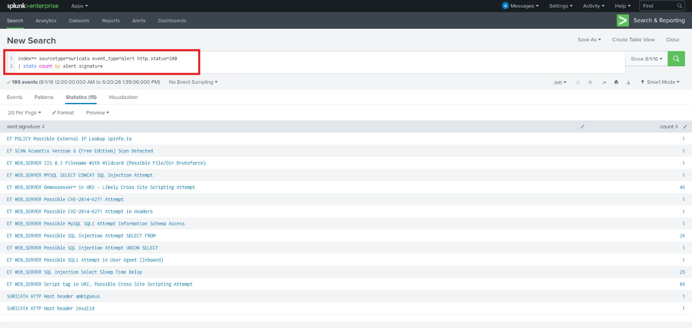<br>
  <em>Figure 16 - Aggregating successful Suricata alert events by signature to identify unique attack detections</em>
</p>

Reviewing the resulting signature list revealed multiple attack types, including vulnerability scanning, SQL injection attempts, cross-site scripting attempts, host header anomalies, and vulnerability-related detections.

Two signatures were particularly notable because they referenced a publicly disclosed vulnerability:

```text
ET WEB_SERVER Possible CVE-2014-6271 Attempt
```

```text
ET WEB_SERVER Possible CVE-2014-6271 Attempt in Headers
```

Because both signatures referenced the same CVE identifier, the vulnerability was researched using the National Vulnerability Database (NVD) to better understand its severity and potential impact.

<p align="left">
  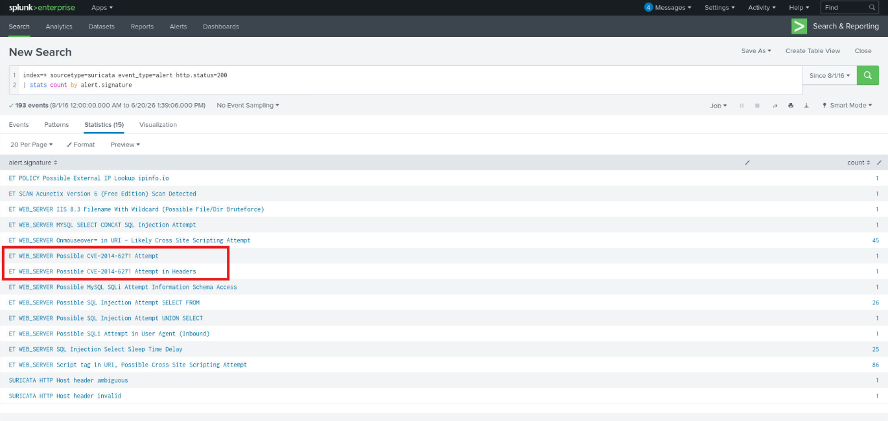<br>
  <em>Figure 17 - Identifying CVE-referenced signatures associated with successful HTTP requests</em>
</p>

Research revealed that **CVE-2014-6271** corresponds to **Shellshock**, a critical remote code execution vulnerability affecting Bash. Review of the NVD entry showed a **CVSS Version 3 score of 9.8 (Critical)**.

<p align="left">
  <br>
  <em>Figure 17 - Validating CVE-2014-6271 severity using National Vulnerability Database intelligence</em>
</p>

The presence of Shellshock-related signatures indicates that the observed activity extended beyond general reconnaissance and included attempts to identify or exploit a known critical vulnerability. While the available telemetry does not confirm successful exploitation, the severity of the referenced CVE significantly increases the risk associated with the observed attack activity.

Review of the results identified signatures containing references to known CVEs. One of the referenced vulnerabilities was:

```text
CVE-2014-6271
```

The CVE identifier was subsequently researched using the National Vulnerability Database (NVD) to validate the nature and severity of the vulnerability.

External vulnerability intelligence identified the vulnerability as a critical remote code execution issue affecting Bash, commonly known as:

```text
Shellshock
```

Review of the NVD entry revealed a CVSS Version 3 severity score of:

```text
9.8 Critical
```

<p align="left">
  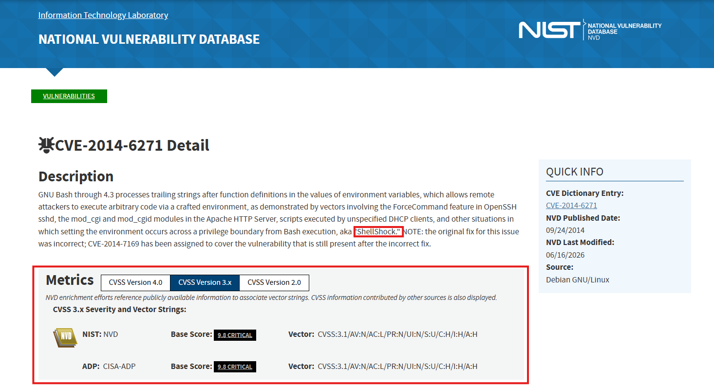<br>
  <em>Figure 18 - External vulnerability intelligence validation of CVE severity information</em>
</p>

The presence of vulnerability-specific signatures indicates that attackers were not simply probing the application but were attempting to identify or exploit known vulnerabilities associated with publicly documented attack techniques.

> **Analyst Note:** CVE references within IDS signatures frequently provide valuable investigative context. While a signature alone does not prove successful exploitation, it can reveal exactly which vulnerability an attacker attempted to leverage and help analysts prioritize activity based on known severity ratings and exploitability.

</details>

<a id="-7-reverse-shell-detection-investigation"></a>

<details>
<summary><strong>▶ 7) Reverse Shell Detection Investigation</strong><br>
→ investigating potential command execution activity identified by FortiGate UTM detections
</summary><br>

**Goal:** Determine whether security controls identified activity associated with remote command execution on an internal system.

Earlier phases focused primarily on Suricata IDS telemetry and web application attack activity. To continue the investigation, attention shifted back to the Splunk dashboard to review additional detections generated by FortiGate UTM.

Returning to the dashboard, one alert category immediately stood out:

```text
MS.Windows.CMD.Reverse.Shell
```

The category was selected to load the underlying FortiGate event associated with the detection.

<p align="left">
  <br>
  <em>Figure 19 - Returning to the dashboard and investigating the MS.Windows.CMD.Reverse.Shell alert category</em>
</p>

This alert category warranted additional investigation because reverse shells are commonly associated with post-exploitation activity. A reverse shell is a technique in which a compromised system initiates a connection back to an attacker-controlled system and provides command-line access to the attacker. Rather than the attacker directly connecting into the victim system, the victim system reaches out to the attacker and establishes the session.

Once established, a reverse shell can allow an attacker to execute commands, browse files, run programs, download malware, or perform additional actions on the affected host. Because reverse shells are frequently used after a successful exploitation attempt, detections referencing reverse shell activity are often treated as higher-priority alerts during investigations.

Clicking this category automatically created and searched:

```spl
index=* sourcetype=fortigate_utm level=alert   attack="MS.Windows.CMD.Reverse.Shell"
```

<p align="left">
  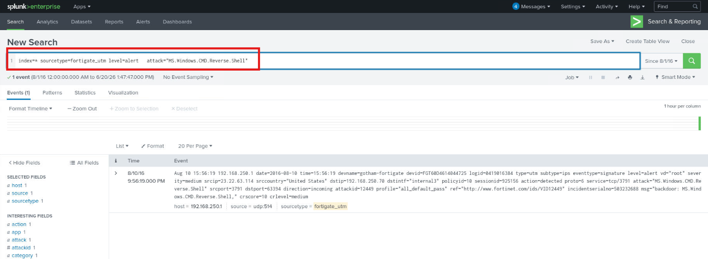<br>
  <em>Figure 20 - Reviewing FortiGate event details associated with the reverse shell detection</em>
</p>

The `dest_ip` field was of particular interest because it identifies the destination system receiving the traffic that triggered the detection. In this case, the source of the activity was external to the environment, while the destination IP represented an internal asset being targeted by the suspected reverse shell-related communication. Identifying the destination system is an important investigative step because it helps determine which host may have been affected, compromised, or otherwise involved in the observed activity. Before analysts can assess the impact of an alert, they must first identify which asset the activity was directed toward.

Review of the FortiGate event revealed the following internal destination IP address:

```text
192.168.250.70
```

<p align="left">
  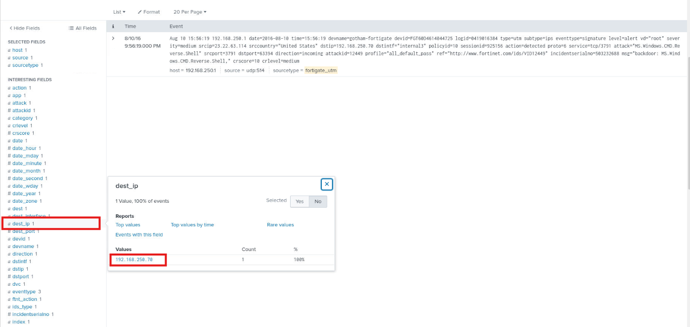<br>
  <em>Figure 21 - Reviewing FortiGate event details associated with the reverse shell detection</em>
</p>

At this stage, the investigation identified the internal IP address involved in the activity, but the hostname associated with the system remained unknown. Because firewall telemetry generally focuses on network communications rather than endpoint identification, additional log sources would be required to determine which host was associated with the observed activity.

Further review of the FortiGate event identified an external source IP address of:

```text
23.22.63.114
```

This IP address differed from the source IP previously observed during the Suricata Information Leak investigation (`40.80.148.42`). This does not necessarily indicate conflicting evidence. Throughout an investigation, different alerts may involve different external systems, attack stages, or detection sources. While the source IP changed between the Suricata and FortiGate events, both alerts referenced the same internal destination system (`192.168.250.70`), suggesting that multiple forms of suspicious activity were being directed toward the same host.

<p align="left">
  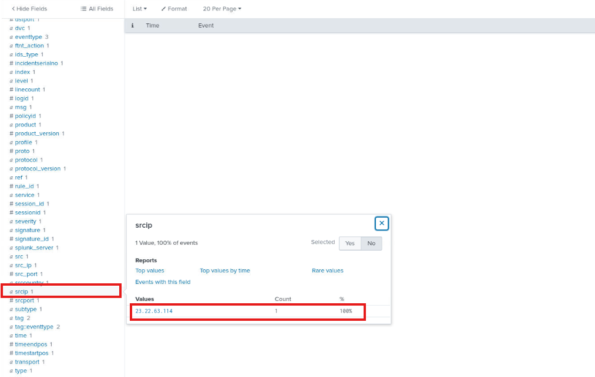<br>
  <em>Figure 22 - Reviewing FortiGate event details and identifying the external source IP associated with the reverse shell detection</em>
</p>

Because both the source IP (`23.22.63.114`) and destination IP (`192.168.250.70`) were now known, these values could be used together during endpoint correlation to identify the hostname associated with the affected system and validate whether the observed activity was linked to the reverse shell-related detection.

Unlike endpoint telemetry, FortiGate logs generally do not provide direct hostname information. As a result, additional data sources were required to determine which system was associated with the internal IP address.

At this stage, the investigation pivoted from network telemetry to endpoint telemetry in order to perform host attribution.

</details>

<a id="-8-host-attribution-and-endpoint-correlation"></a>

<details>
<summary><strong>▶ 8) Host Attribution and Endpoint Correlation</strong><br>
→ identifying the internal system associated with the reverse shell detection
</summary><br>

**Goal:** Determine which host was associated with the reverse shell-related activity identified by FortiGate.

The previous phase identified the internal destination IP address:

```text
192.168.250.70
```

While this allowed the investigation to identify the targeted asset, an IP address alone provides limited context. To properly scope the alert and understand which system may have been involved in the activity, the hostname associated with the IP address needed to be identified.

Because FortiGate logs primarily provide network-level visibility, the investigation pivoted to Windows endpoint telemetry using the `xmlwineventlog` sourcetype. Endpoint logs often contain additional contextual information, including hostnames, users, processes, and network connections that are not visible within firewall telemetry.

An initial search was performed using the destination IP address:

```spl
index=* sourcetype=xmlwineventlog 192.168.250.70
```

<p align="left">
  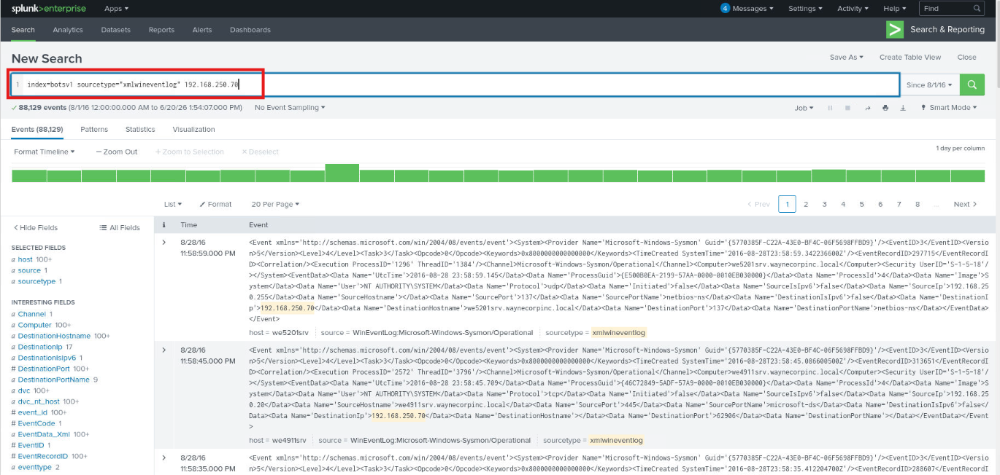<br>
  <em>Figure 23 - Reviewing Sysmon event details associated with 192.168.250.70</em>
</p>

Reviewing the results revealed multiple systems referencing the IP address. This is common in enterprise environments, as many systems may communicate with, log events about, or otherwise reference the same host.

To improve attribution accuracy, the search was refined to include both the destination IP address and the external IP address associated with the reverse shell-related activity:

```spl
index=* sourcetype=xmlwineventlog 23.22.63.114 192.168.250.70
| stats count by host
| sort - count
```

The search looked for Windows events containing both IP addresses and then grouped the results by hostname using:

```spl
| stats count by host
```

This aggregation made it easier to identify which systems were most frequently associated with the observed activity. The results were then sorted in descending order using:

```spl
| sort - count
```

placing the most relevant hostnames at the top of the results.

<p align="left">
  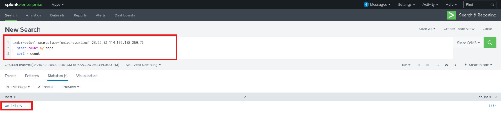<br>
  <em>Figure 24 - Correlating endpoint telemetry to identify the hostname associated with the destination IP address</em>
</p>

```
we1149srv.waynecorpinc.local
```

> **Analyst Note:** The query groups results using the `SourceHostname` field rather than Splunk's default `host` field. These fields are not always equivalent. The `host` field typically identifies the system that generated or forwarded the event to Splunk, whereas `SourceHostname` is a field extracted from the event data itself. During investigations, analysts should avoid assuming that similarly named fields represent the same asset and should review the underlying event data to understand exactly what each field represents before drawing conclusions.

> **Analyst Note:** One aspect of this investigation that can initially be confusing is that the source IP address changes between different phases of the analysis. During the Suricata Information Leak investigation, the activity involved communication between the external IP address `40.80.148.42` and the internal system `192.168.250.70`. Later, when investigating the FortiGate `MS.Windows.CMD.Reverse.Shell` alert, the activity involved a different external IP address, `23.22.63.114`, communicating with the same internal system, `192.168.250.70`. These are not conflicting findings. They represent different security events, observed by different security controls, that happen to involve the same internal host. The Information Leak alert was associated with attempted access to web application resources such as `phpinfo.php`, while the reverse shell alert was associated with separate activity that FortiGate classified as potentially related to command execution or post-exploitation behavior.

> When the investigation pivoted to Sysmon telemetry, the objective was no longer to investigate the Information Leak activity. Instead, the goal was to identify the hostname associated with the system involved in the reverse shell detection. For this reason, the search used the two IP addresses observed in the FortiGate event (`23.22.63.114` and `192.168.250.70`) rather than the IP addresses from the earlier Suricata alert. Searching for both IP addresses together helped narrow the results to Windows events specifically related to the reverse shell activity being investigated. The common thread throughout both investigations was not the external attacker IP, but rather the internal destination system `192.168.250.70`, which repeatedly appeared across multiple security alerts and became the primary asset of interest throughout the investigation.

> It is also important to remember that the objective of this phase was not to investigate every external IP observed throughout the investigation, but rather to identify the hostname associated with the internal system involved in the specific alert being analyzed. The external IP addresses (`40.80.148.42` in the Information Leak alert and `23.22.63.114` in the reverse shell alert) simply served as investigative pivots tied to different security events. When investigating the reverse shell detection, it made sense to use the source and destination IPs associated with that alert because they provided the most relevant context for narrowing endpoint telemetry. The ultimate goal was to attribute the recurring internal IP address (`192.168.250.70`) to a specific host. The fact that this same internal system appeared across multiple Suricata and FortiGate detections made it the primary asset of interest and justified using endpoint telemetry to identify the system behind the IP address.


By correlating network-based detections from FortiGate with endpoint telemetry from Sysmon, the investigation was able to move beyond an IP address and identify the system associated with the observed activity. This attribution step provided additional context for the investigation and helped establish which host was involved in the reverse shell-related detection.


</details>

<a id="-9-scanner-identification-and-tool-attribution"></a>

<details>
<summary><strong>▶ 9) Scanner Identification and Tool Attribution</strong><br>
→ identifying reconnaissance tooling used during the attack activity
</summary><br>

**Goal:** Determine whether automated vulnerability scanning tools were involved in the observed activity.

After investigating individual attack signatures and exploitation-related detections, attention shifted back to the FortiGate dashboard to identify broader patterns within the observed activity.

Earlier phases identified multiple indicators of potentially malicious activity, including information disclosure attempts, vulnerability-related detections, and a FortiGate alert associated with possible reverse shell behavior. Collectively, these findings suggested that the observed activity may have extended beyond simple reconnaissance and warranted further review of additional high-confidence detections within the dashboard.

One alert category that stood out was `Apache.Roller.OGNL.Injection.Remote.Code.Execution`. This detection was selected for investigation because remote code execution vulnerabilities are commonly associated with attempts to gain control of a target system and can sometimes precede or facilitate post-exploitation activity such as reverse shells. While the alert alone does not confirm successful exploitation, understanding the targeted product and associated vulnerability helps determine whether the activity observed throughout the investigation may be part of a broader exploitation attempt.

Review of the dashboard revealed that the highest-volume alert category was:

```text
Apache.Roller.OGNL.Injection.Remote.Code.Execution
```

<p align="left">
  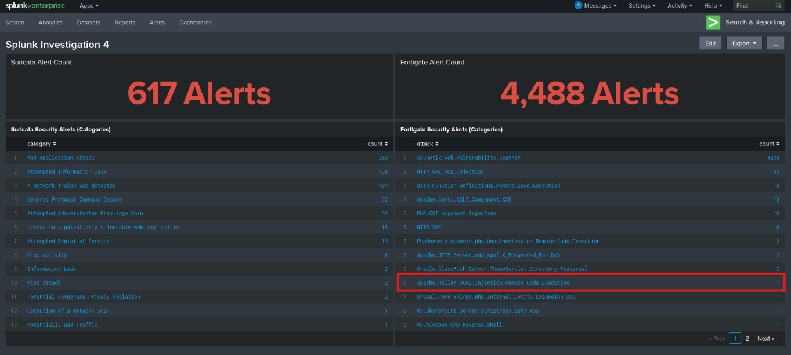<br>
  <em>Figure 25 - Review of the Apache.Roller.OGNL.Injection.Remote.Code.Execution category from the FortiGate dashboard</em>
</p>

Selecting the category automatically generated the following search:

```spl
index=* sourcetype=fortigate_utm level=alert attack="Apache.Roller.OGNL.Injection.Remote.Code.Execution"
```

<p align="left">
  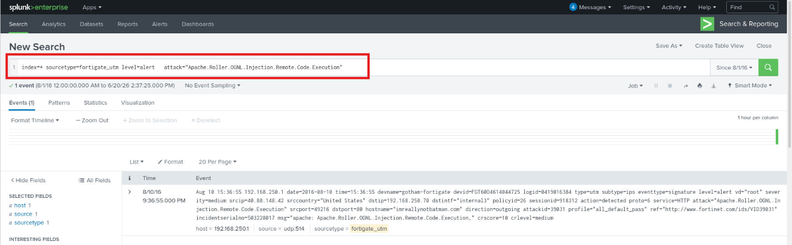<br>
  <em>Figure 26 - SPL for the Apache.Roller.OGNL.Injection.Remote.Code.Execution category from the FortiGate dashboard</em>
</p>

The resulting FortiGate event was reviewed to better understand why the detection was generated and what additional context was available.

Reference fields are commonly included within intrusion prevention system alerts and typically provide links to external vulnerability intelligence, vendor advisories, detection signatures, or technical documentation related to the alert. In this case, the `ref` field contained the following FortiGuard vulnerability reference:

```
http://www.fortinet.com/ids/VID40355
```

<p align="left">
  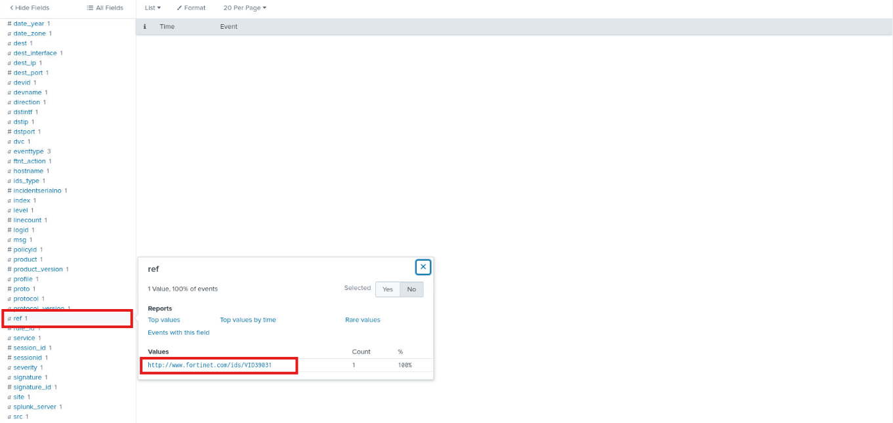<br>
  <em>Figure 27 - SPL for the Apache.Roller.OGNL.Injection.Remote.Code.Execution category from the FortiGate dashboard</em>
</p>

Opening the reference redirected to FortiGuard's vulnerability database. Because the direct URL no longer resolved to the specific entry, the vulnerability identifier (VID) was searched manually using the FortiGuard ID Lookup functionality.

The affected product was identified as:

```
Apache Software Foundation Apache Roller prior to 5.0.2
```

The associated CVE was identified as:

```
CVE-2013-4212
```

<p align="left">
  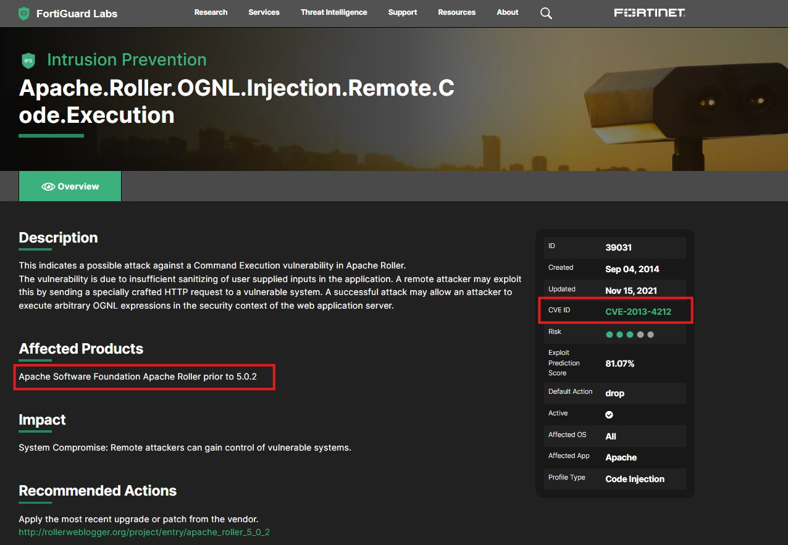<br>
  <em>Figure 28 - FortiGuard's vulnerability database</em>
</p>

</details>


<a id="-10-scanner-identification-and-tool-attribution"></a>

<details>
<summary><strong>▶ 10) Scanner Identification and Tool Attribution</strong><br>
→ identifying automated scanning activity and determining scanner version information
</summary><br>

**Goal:** Determine whether the observed activity was associated with an automated vulnerability scanning tool and identify the scanner version if available.

The previous phase focused on a specific FortiGate detection associated with a known remote code execution vulnerability. While that analysis helped identify the targeted product and associated CVE, it did not explain whether the activity was part of a broader automated scanning campaign.

To better understand the attacker's methodology, the investigation shifted from individual vulnerability detections back to broader FortiGate alert patterns. If a web application is being systematically assessed for weaknesses, security controls may generate alerts associated with known vulnerability scanning tools.

Review of the FortiGate dashboard showed that the highest-volume alert category was:

```text
Acunetix.Web.Vulnerability.Scanner
```

<p align="left">
  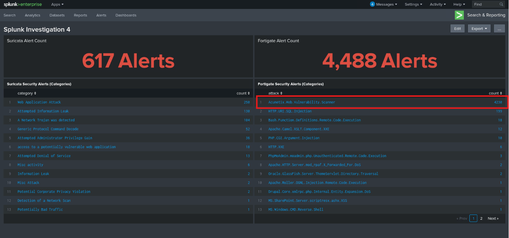<br>
  <em>Figure 29 - Identifying Acunetix.Web.Vulnerability.Scanner as the highest-volume FortiGate alert category</em>
</p>

Acunetix is a web application vulnerability scanner used to identify exposed resources, application weaknesses, misconfigurations, and known vulnerabilities. Because the dashboard showed a high volume of Acunetix-related alerts, this suggested that the observed activity included automated vulnerability assessment behavior rather than isolated manual requests.

Selecting the category generated the following search:

```spl
index=* sourcetype=fortigate_utm level=alert attack="Acunetix.Web.Vulnerability.Scanner"
```

<p align="left">
  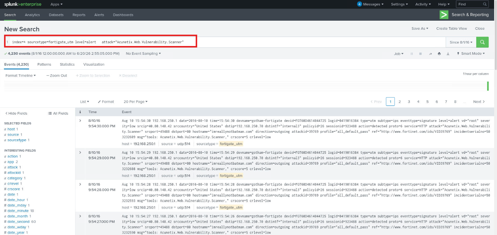<br>
  <em>Figure 30 - Reviewing FortiGate events associated with Acunetix vulnerability scanner activity</em>
</p>

The FortiGate event details were reviewed to determine whether the scanner version was visible. The `attack` and `msg` fields confirmed that FortiGate classified the activity as Acunetix scanner traffic.

The `msg` field contains the human-readable alert description generated by FortiGate. In this case, it confirmed the scanner name, but did not provide the scanner version.

This search filters FortiGate intrusion prevention alerts to only events classified as Acunetix vulnerability scanner activity. Rather than reviewing all FortiGate alerts within the dataset, the search isolates traffic that FortiGate identified as originating from the Acunetix web vulnerability scanner.

Although the search returned more than 4,200 matching events, review of the `src_ip` field revealed that every event originated from the same source IP address:

```
40.80.148.42
```

<p align="left">
  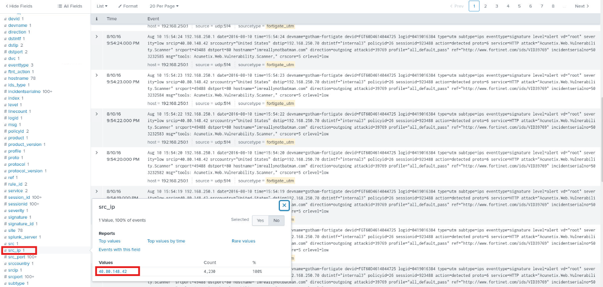<br>
  <em>Figure 31 - Identifying source ip of FortiGate events associated with Acunetix vulnerability scanner activity</em>
</p>

The field statistics showed that this source IP was present in 100% of matching events.

The `src_ip` field identifies the system that initiated the observed network activity. In this case, the results indicated that all Acunetix-related detections were associated with a single external host (`40.80.148.42`) rather than multiple scanning systems. This finding suggested that a single scanner was responsible for generating the large volume of vulnerability scanning activity observed throughout the dataset and provided an additional point of correlation with earlier FortiGate and Suricata detections involving the same external address.

Because FortiGate telemetry did not expose version information, the investigation pivoted to Suricata telemetry. Suricata may provide additional application-layer details from HTTP traffic, including user-agent strings or scanner-identifying metadata.

> **Analyst Note:** The investigation pivoted from FortiGate to Suricata because the two security controls provide different levels of visibility into network activity. FortiGate successfully identified the traffic as originating from an Acunetix vulnerability scanner, but the firewall telemetry did not reveal the scanner version. Suricata operates as a network intrusion detection system and often captures additional application-layer details from HTTP traffic, such as request headers, URLs, and user-agent strings. By pivoting into Suricata using the same source IP address identified in the FortiGate alerts (`40.80.148.42`), the investigation attempted to leverage the richer HTTP telemetry available within Suricata logs to identify scanner-specific information that was not visible within the firewall events.

The following search was executed:

```spl
index=* sourcetype=suricata src_ip=40.80.148.42
| stats count by alert.signature
```

<p align="left">
  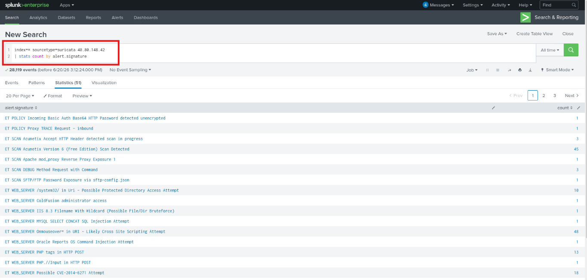<br>
  <em>Figure 32 - Pivoting to Suricata telemetry using the previously identified source ip</em>
</p>

Rather than manually reviewing thousands of Suricata events, the stats count by `alert.signature` command was used to display all alert signatures generated by Suricata for the source IP. This provides a quick way to identify unique detections associated with the activity and can reveal additional application-layer details extracted from HTTP traffic, such as request headers, URLs, and user-agent strings. In this case, all that was required was reviewing the resulting signatures to identify the vulnerability scanner responsible for the activity.

Review of the resulting signatures revealed the following detection:

```text
ET SCAN Acuentix Version 6 (Free Edition) Scan Detected
```

<p align="left">
  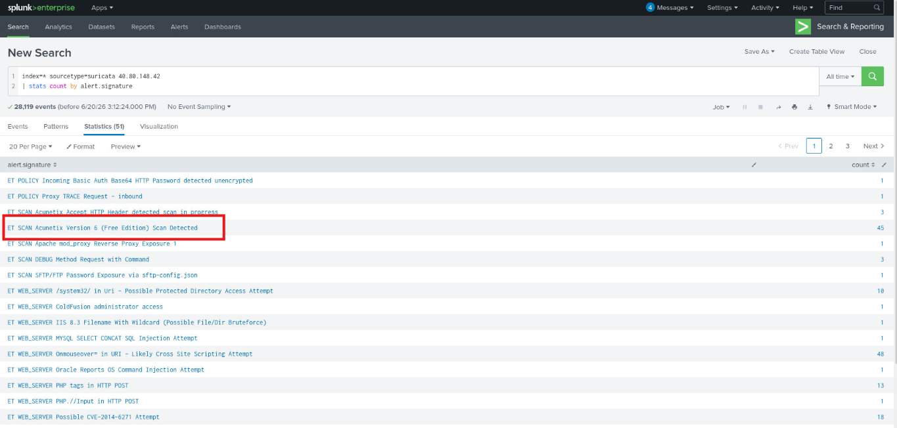<br>
  <em>Figure 33 - Identifying the Acunetix scanner version from Suricata event details</em>
</p>

Based on the Suricata detection, the scanner version was identified as:

```text
Acuentix Version 6 (Free Edition)
```

Unlike the FortiGate telemetry, which only identified the scanner family, the Suricata detection signature provided additional context and explicitly identified the scanner version. This demonstrated the value of correlating findings across multiple security controls, as different telemetry sources often expose different levels of detail regarding the same activity.

This finding confirmed that the observed activity was not simply generic web traffic, but rather a large-scale automated vulnerability scanning campaign originating from a single external host. Correlating FortiGate and Suricata telemetry allowed the investigation to attribute the activity to a specific vulnerability scanning platform and identify the exact scanner version responsible for generating the observed alerts.


</details>

<a id="-11-suricata-alert-severity-dashboard-panel"></a>

<details>
<summary><strong>▶ 11) Suricata Alert Severity Dashboard Panel</strong><br>
→ visualizing IDS alert severity distribution using Splunk dashboards
</summary><br>

**Goal:** Create a dashboard panel that summarizes Suricata alert severity and determine the percentage of high-severity alerts.

After identifying multiple Suricata detections throughout the investigation, the next step was to summarize the overall severity distribution of Suricata alert activity. Reviewing severity distribution helps analysts understand how many alerts were classified as low, medium, or high priority and supports investigation prioritization.

The Suricata dataset contains multiple event types, including network flows, HTTP transactions, DNS activity, and IDS alerts. Because the objective was to analyze security detections rather than general network traffic, the search was refined to only include events where event_type=alert. This limited the results to Suricata-generated intrusion detection alerts and excluded routine telemetry such as flow and protocol metadata.

The investigation began by searching for Suricata alert events:

```spl
index="botsv1" sourcetype=suricata event_type=alert
```

<p align="left">
  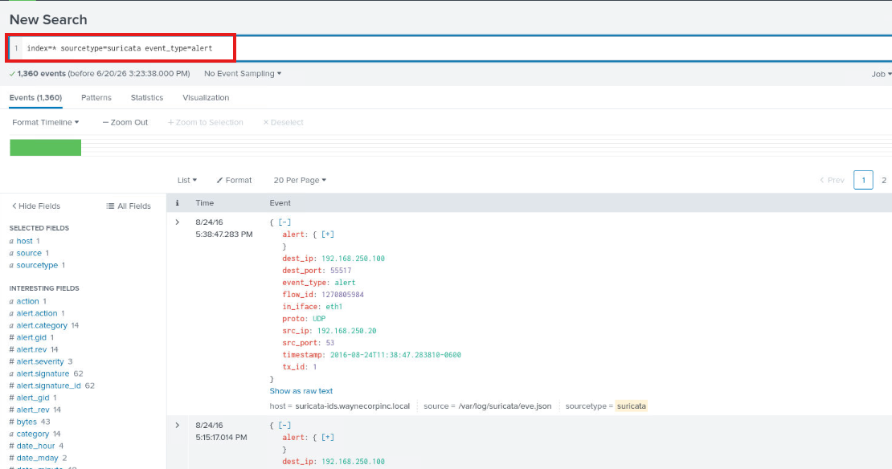<br>
  <em>Figure 34 - Searching Suricata alert events for severity analysis</em>
</p>

Review of the event fields showed that Suricata included severity information in two different formats. The `severity_id` field stored the severity as a numeric value, while the `severity` field provided a human-readable classification such as `high`, `medium`, or `low`. Although both fields represented the same underlying alert severity, the `severity` field was easier to interpret and more suitable for dashboard reporting and visualization. Using descriptive severity labels also makes dashboard results more accessible to analysts than relying solely on numeric severity identifiers.

<p align="left">
  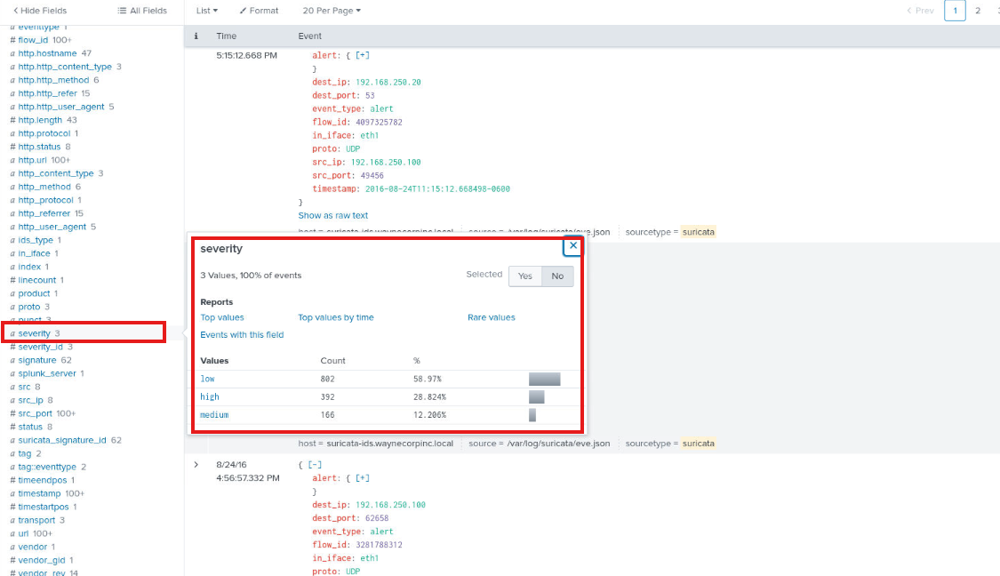<br>
  <em>Figure 35 - Searching Suricata alert events for severity</em>
</p>

To summarize alert counts by severity, the following search was used:

```spl
index="botsv1" sourcetype=suricata event_type=alert
| stats count by severity
```

<p align="left">
  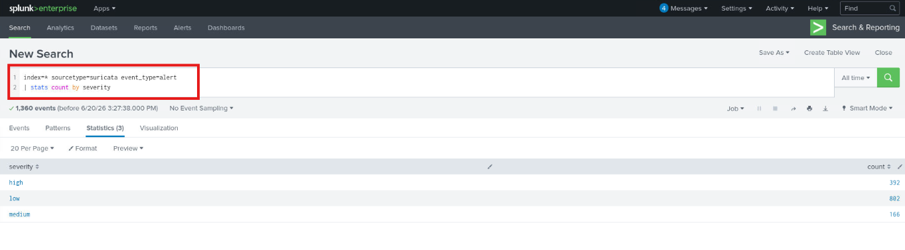<br>
  <em>Figure 36 - Aggregating Suricata alerts by severity</em>
</p>

The `stats count by severity` command was used to aggregate individual alert events into a summarized count for each severity level. For example, instead of reviewing thousands of individual Suricata alerts, the command transforms the results into a simplified table such as `high = 150`, `medium = 300`, and `low = 550`. This summarized dataset is much more suitable for dashboard visualizations such as pie charts because it shows the overall distribution of alert severity rather than individual events. A `sort` command was not required because the objective was to calculate severity distribution rather than rank severity categories by event count.


Once the search returned the expected results, it was saved to the existing investigation dashboard using:

```text
Save As > Existing Dashboard
```

The existing dashboard selected was:

```text
Splunk Investigation 4
```

<p align="left">
  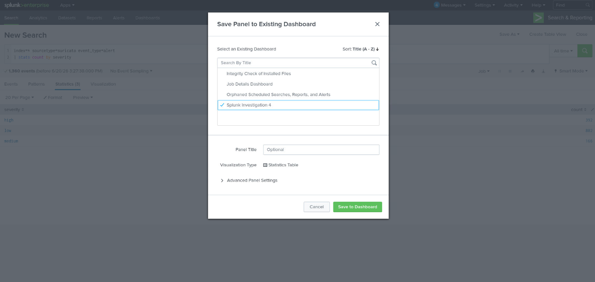<br>
  <em>Figure 37 - Saving the Suricata severity search to the existing investigation dashboard</em>
</p>

After the panel was added to the dashboard, the dashboard was edited and the new panel visualization was changed from a table to a pie chart using the **Select Visualization** option.

<p align="left">
  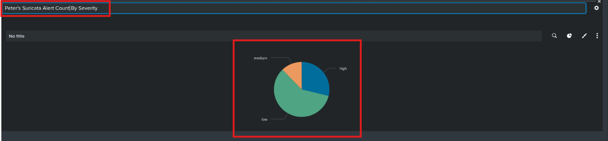<br>
  <em>Figure 38 - Changing the Suricata severity panel visualization to a pie chart</em>
</p>

The pie chart provided a visual breakdown of Suricata alert severity. Hovering over the `High` section of the chart displayed the percentage of high-severity alerts. I named the title of this section of the dashboard, "Peter's Suricata Alert Count By Severity"

The observed `High` severity percentage was:

```text
28.824%
```

This visualization provided a quick way to understand how Suricata classified the alert activity and helped summarize the severity profile of IDS detections observed throughout the investigation.

</details>

<a id="-12-fortigate-alert-severity-dashboard-panel"></a>

<details>
<summary><strong>▶ 12) FortiGate Alert Severity Dashboard Panel</strong><br>
→ visualizing firewall alert severity distribution using Splunk dashboards
</summary><br>

**Goal:** Create a dashboard panel that summarizes FortiGate alert severity and determine the percentage of critical alerts.

After summarizing Suricata alert severity, the same process was repeated for FortiGate UTM telemetry. This allowed severity distributions from both IDS and firewall detections to be compared within the same investigation dashboard.

> **Analyst Note:** Although FortiGate events contain an `eventtype` field, it serves a different purpose than Suricata's `event_type` field. In this dataset, FortiGate `eventtype` values such as `ftnt_fortigate`, `ftnt_fortigate_ips`, and `ftnt_fortigate_utm` identify the Fortinet log source or logging component that generated the event rather than the type of network activity being recorded. As a result, filtering on `eventtype` would not isolate alert events in the same way that `event_type=alert` does for Suricata. Instead, FortiGate alert activity is more effectively isolated using `level=alert`, which specifically identifies security events classified as alerts.


The investigation began by searching for FortiGate UTM alert events:

```spl
index="botsv1" sourcetype=fortigate_utm level=alert
```

<p align="left">
  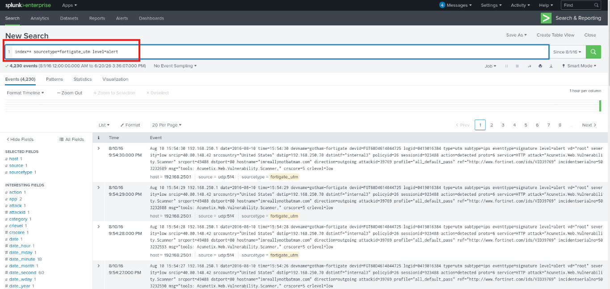<br>
  <em>Figure 39 - Searching FortiGate UTM alert events for severity analysis</em>
</p>

Review of the event fields showed that FortiGate also included a `severity` field. This field was used to summarize alerts by severity rating.

The following search was executed:

```spl
index="botsv1" sourcetype=fortigate_utm level=alert
| stats count by severity
```

<p align="left">
  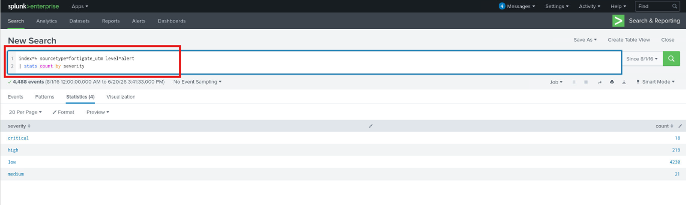<br>
  <em>Figure 40 - Aggregating FortiGate UTM alerts by severity</em>
</p>

Once the search returned the expected results, it was saved to the existing dashboard using:

```text
Save As > Existing Dashboard
```

The existing dashboard selected was:

```text
Splunk Investigation 4
```

<p align="left">
  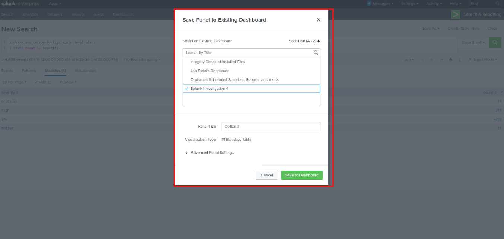<br>
  <em>Figure 41 - Saving the FortiGate severity search to the existing investigation dashboard</em>
</p>

After the panel was added, the dashboard was edited and the visualization was changed from a table to a pie chart using the **Select Visualization** option.

To keep the dashboard organized, the FortiGate severity panel was positioned next to the Suricata severity panel. I  named the title of this section of the dashboard, "Peter's Fortigate Alert Count By Severity"

<p align="left">
  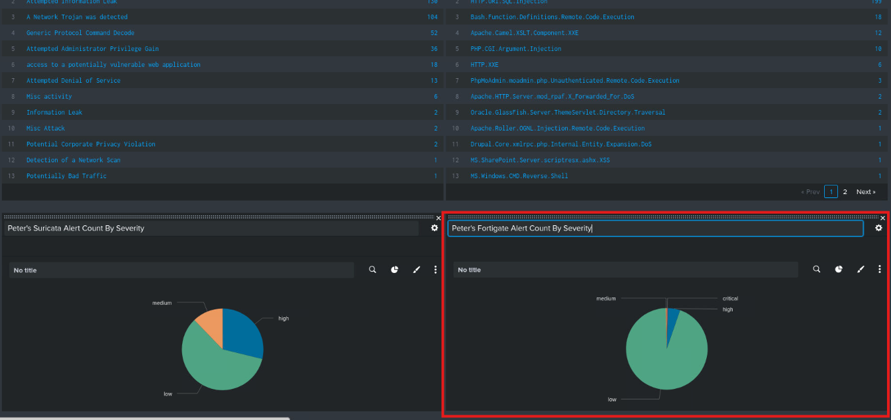<br>
  <em>Figure 42 - Changing the FortiGate severity panel visualization to a pie chart and positioning it next to the Suricata panel</em>
</p>

The pie chart provided a visual breakdown of FortiGate alert severity. Hovering over the `critical` section of the chart displayed the percentage of critical alerts.

The observed `critical` severity percentage was:

```text
.401%
```

This final dashboard update allowed Suricata and FortiGate severity distributions to be reviewed side by side. Comparing both panels helped summarize how different security controls classified the observed web application attack activity and provided a visual conclusion to the investigation.

</details>


---

### Findings Summary

This section consolidates high-confidence conclusions supported directly by Suricata IDS alerts, FortiGate UTM detections, Sysmon endpoint telemetry, and external vulnerability intelligence reviewed throughout the investigation.

* Multiple Suricata IDS and FortiGate UTM detections identified web application attack activity targeting an internal web server.
* Information disclosure alerts revealed attempts to access potentially sensitive PHP resources.
* The targeted URLs included:

  * `imreallynotbatman.com/phpinfo.php`
  * `imreallynotbatman.com/phpinfo.php5`
* Both requests returned HTTP status code `404`, indicating the requested resources were not present on the target server.
* Analysis identified multiple unique Suricata signatures associated with vulnerability scanning and exploitation-related activity.
* Vulnerability-referenced signatures contained CVE identifiers associated with known public vulnerabilities.
* External vulnerability intelligence enrichment identified critical vulnerabilities, including CVE-2014-6271 (Shellshock).
* FortiGate detections identified activity associated with remote code execution and reverse shell-related attack patterns.
* Internal host attribution linked observed attack activity to the server `192.168.250.70`.
* FortiGate telemetry identified activity associated with the Acunetix Web Vulnerability Scanner.
* The observed activity consisted of reconnaissance, vulnerability scanning, information disclosure attempts, and exploitation attempts directed at the target web application.
* Available telemetry did not provide conclusive evidence of successful exploitation, malware execution, persistence, privilege escalation, or full system compromise.

**Detailed Evidence Reference:**
For a full, artifact-level breakdown of IDS detections, firewall alerts, vulnerability references, targeted resources, host attribution, and supporting evidence that informed these findings — including where each artifact was identified during the investigation — see: **`detection-artifact-report.md`**

---

### Defensive Takeaways

This investigation highlights several defender-relevant patterns commonly encountered during web application attack investigations.

* Vulnerability scanning activity often precedes exploitation attempts and should be investigated even when compromise is not confirmed.
* Information disclosure requests frequently provide attackers with environmental details useful for later exploitation stages.
* HTTP response codes can provide valuable context when determining whether attacker objectives were successful.
* IDS signatures often provide significantly more investigative value than broad alert categories.
* Vulnerability intelligence enrichment can rapidly identify the severity and impact of referenced CVEs.
* Correlating IDS, firewall, and endpoint telemetry improves investigative confidence and asset attribution.
* Reverse shell detections should be treated as high-priority events because they may indicate post-exploitation activity.
* Security dashboards can accelerate investigations by providing immediate visibility into attack trends and alert distributions.

---

### Artifacts Identified

The following artifacts were extracted and validated during analysis and may support detection engineering, threat hunting, or future investigations.

* Target web server: `192.168.250.70`
* Information disclosure URLs:

  * `imreallynotbatman.com/phpinfo.php`
  * `imreallynotbatman.com/phpinfo.php5`
* HTTP response code observed: `404`
* Scanner identified: `Acunetix Web Vulnerability Scanner`
* Alert category: `Information Leak`
* Alert category: `A Network Trojan was detected`
* Alert category: `MS.Windows.CMD.Reverse.Shell`
* Vulnerability referenced: `CVE-2014-6271`
* Vulnerability name: `Shellshock`
* CVSS v3 Score: `9.8 Critical`
* Primary IDS source: `suricata`
* Primary firewall source: `fortigate_utm`
* Dataset: `botsv1`

I consolidated all evidence identified throughout the investigation and reviewed the observed attack activity to better understand attacker objectives, targeted resources, and exploitation behavior.

1. Initial dashboard review identified elevated web application attack activity observed across multiple security controls.
2. Suricata alerts revealed attempts to access potentially sensitive PHP resources commonly associated with information disclosure.
3. Analysis of targeted URLs identified attacker interest in PHP configuration and diagnostic resources.
4. HTTP response validation confirmed that the targeted resources were not successfully accessed.
5. Signature analysis revealed multiple unique detections associated with vulnerability scanning and exploitation activity.
6. Vulnerability enrichment identified references to publicly disclosed vulnerabilities, including critical remote code execution issues.
7. FortiGate detections identified reverse shell-related activity and exploitation-focused attack signatures.
8. Endpoint correlation enabled attribution of the observed activity to the targeted internal host.
9. Scanner identification confirmed the presence of automated vulnerability assessment activity.
10. Severity analysis demonstrated that multiple security controls independently identified and classified the activity as potentially malicious.
11. Correlation of IDS, firewall, endpoint, and vulnerability intelligence evidence confirmed sustained web application attack activity directed toward the target server.

**Detailed Evidence Reference:**
For a full, artifact-level breakdown of IDS alerts, firewall detections, vulnerability references, host attribution, and supporting evidence — including where each artifact was identified during the investigation — see: **`detection-artifact-report.md`**

---

### Detection and Hardening Opportunities

This section summarizes high-level detection and hardening opportunities identified during the investigation. For detailed, actionable recommendations — including web application monitoring improvements, IDS tuning opportunities, and defensive controls — see: **`detection-and-hardening-recommendations.md`**

This section outlines defensive improvements derived directly from observed attacker behavior.

▶ Web Application Monitoring:

* Monitor for repeated requests targeting diagnostic, administrative, and configuration-related resources.
* Alert on access attempts involving common reconnaissance targets such as `phpinfo.php`.
* Identify abnormal resource enumeration behavior targeting public-facing applications.
* Establish baselines for normal web application traffic and investigate deviations.

▶ Vulnerability Detection:

* Monitor for IDS signatures referencing known CVEs and exploitation frameworks.
* Prioritize alerts associated with critical vulnerabilities and remote code execution attempts.
* Correlate vulnerability-related detections across multiple security controls.
* Integrate vulnerability intelligence enrichment into alert triage workflows.

▶ Security Monitoring:

* Correlate IDS, firewall, and endpoint telemetry during web application investigations.
* Investigate reverse shell-related detections as potentially high-risk events.
* Review recurring scanner activity associated with vulnerability assessment tools.
* Track exploitation attempts across multiple attack stages to identify emerging attack chains.

▶ Web Application Hardening:

* Remove unnecessary diagnostic resources from production systems.
* Restrict access to administrative and configuration-related functionality.
* Maintain timely patching of web application frameworks and underlying software components.
* Deploy Web Application Firewall (WAF) protections where appropriate.
* Conduct regular vulnerability assessments and remediation reviews.

---

### MITRE ATT&CK Mapping

This section provides a high-level summary of observed MITRE ATT&CK tactics and techniques. For evidence-backed mappings tied to specific telemetry, signatures, vulnerabilities, and investigation steps, see: **`MITRE-ATTACK-mapping.md`**

#### ▶ Reconnaissance

##### (1) Active Scanning (T1595)

* Automated activity was observed targeting publicly accessible web application resources.

##### (2) Vulnerability Scanning (T1595.002)

* Security telemetry identified activity associated with the Acunetix Web Vulnerability Scanner.

#### ▶ Resource Development

##### (3) Gather Victim Host Information (T1592)

* Requests targeting PHP diagnostic resources were consistent with attempts to collect environmental information useful for future exploitation.

#### ▶ Initial Access

##### (4) Exploit Public-Facing Application (T1190)

* Multiple detections referenced vulnerability exploitation attempts targeting a public-facing web application.

#### ▶ Command and Control

##### (5) Non-Application Layer Protocol (T1095)

* Reverse shell-related detections suggested attempted establishment of attacker-controlled communications following exploitation activity.

---

### MITRE ATT&CK Mapping (Table View)

This section provides a high-level table summary of observed ATT&CK tactics and techniques. For evidence-backed mappings tied to specific artifacts, timestamps, detections, and investigation steps, see: **`MITRE-ATTACK-mapping.md`**

| Tactic               | Technique                                     | Description                                                                               |
| -------------------- | --------------------------------------------- | ----------------------------------------------------------------------------------------- |
| Reconnaissance       | **Active Scanning (T1595)**                   | Automated activity targeted publicly accessible web application resources.                |
| Reconnaissance       | **Vulnerability Scanning (T1595.002)**        | Activity associated with automated vulnerability assessment tooling was observed.         |
| Resource Development | **Gather Victim Host Information (T1592)**    | Requests targeted resources capable of exposing application and system information.       |
| Initial Access       | **Exploit Public-Facing Application (T1190)** | Multiple detections referenced exploitation attempts against a public-facing application. |
| Command and Control  | **Non-Application Layer Protocol (T1095)**    | Reverse shell-related detections suggested attempted post-exploitation communications.    |

---

### Analyst Notes

This investigation reinforced how multiple security controls can be combined to analyze web application attack activity and distinguish reconnaissance behavior from exploitation attempts. I learned how to leverage Suricata IDS alerts, FortiGate UTM detections, endpoint telemetry, vulnerability intelligence enrichment, and dashboard-based analysis to build a comprehensive understanding of attacker activity. Most importantly, this investigation demonstrated the value of validating attack signatures, reviewing targeted resources, enriching vulnerability references, and correlating evidence across multiple telemetry sources to determine whether observed activity represents reconnaissance, exploitation attempts, or confirmed compromise.

